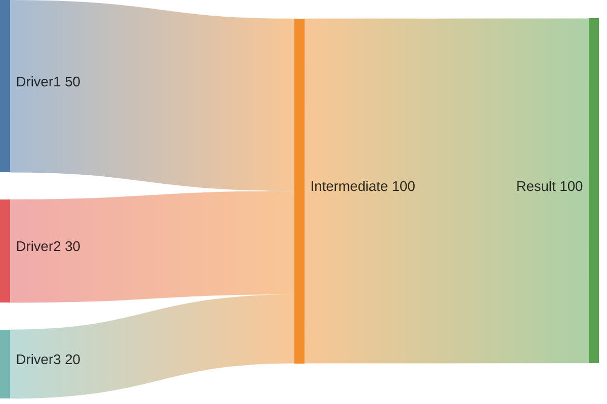
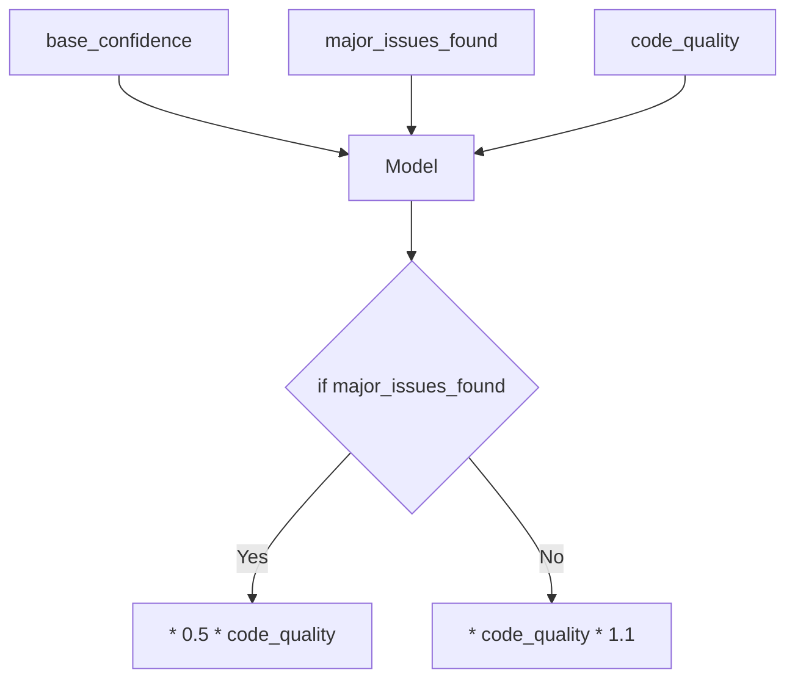
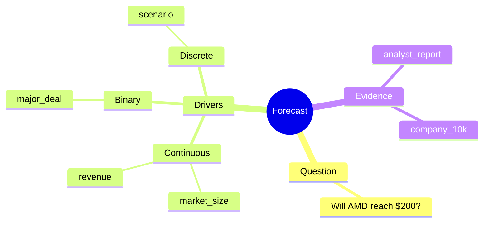
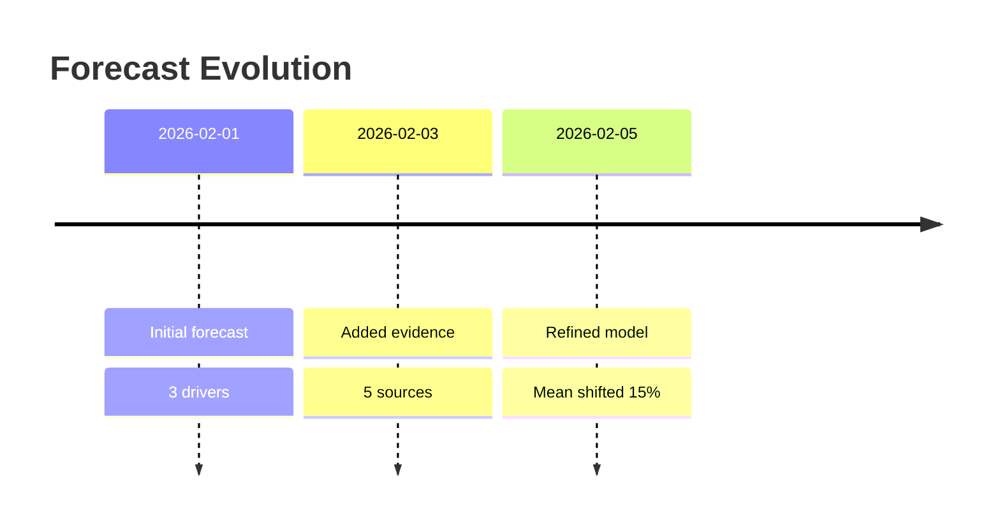
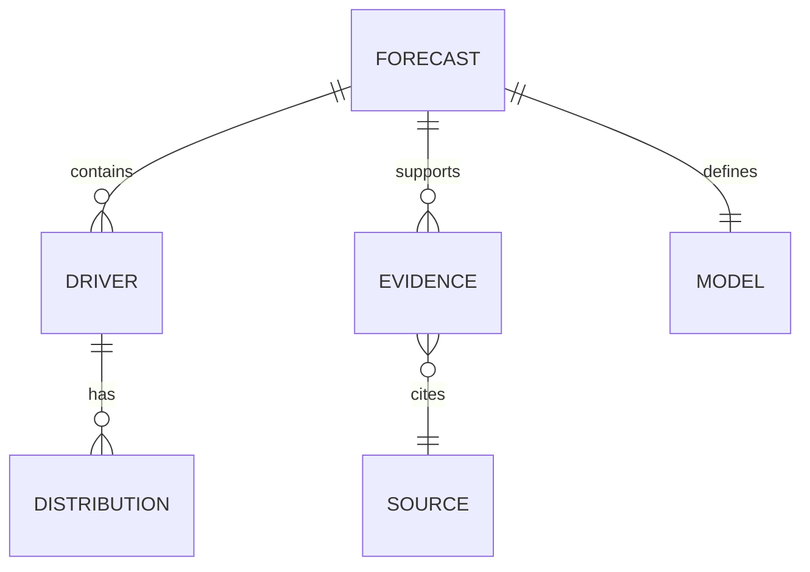
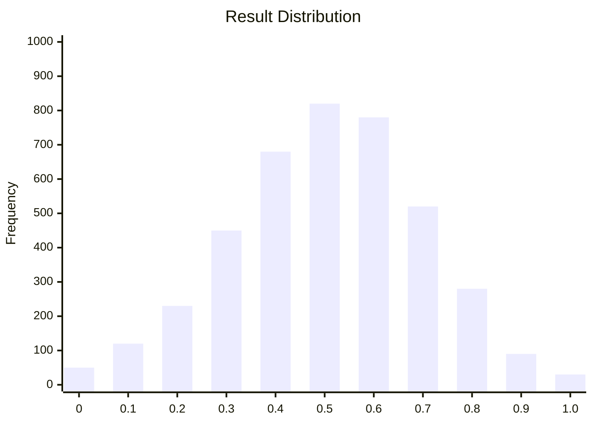
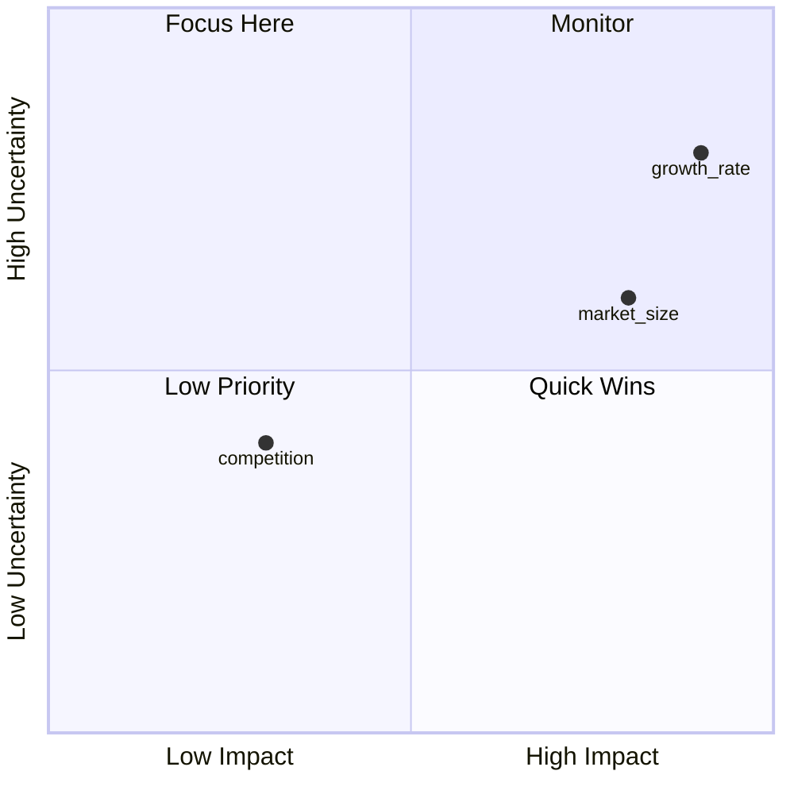
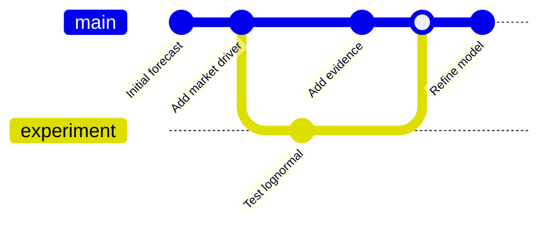

# Display Panel Design - Markdown + Mermaid Visualization

## Overview
Generate polished Markdown reports with Mermaid diagrams for forecast results, automatically committed to git for time travel capabilities.

## File Naming Convention (W3C Compliant)
Following [W3C File Naming Best Practices](https://www.w3.org/Provider/Style/URI):

```
results/{forecast-slug}/{timestamp}-{short-hash}.md
```

**Example:**
```
results/amd-stock-forecast/2026-02-05T05-30-00Z-a3f9c2d.md
```

**Structure:**
- Lowercase, hyphen-separated (kebab-case)
- ISO 8601 timestamp (UTC)
- Short git hash for traceability
- `.md` extension

## Visualization Strategy

### Priority 1: Stable, Production-Ready Charts

#### 1. **Sankey Diagram** ✅ Stable
**Purpose:** Show driver flow and impact magnitude on final result



**Use case:**
- Driver values → Model computation → Final result
- Show weight/magnitude of each driver's contribution
- Visualize if-then-else branching in model

#### 2. **Flowchart** ✅ Stable
**Purpose:** Model structure and computation flow



**Use case:**
- Visual representation of the `model:` expression
- Show dependencies between drivers
- Highlight conditional logic

#### 3. **Mindmap** ✅ Stable
**Purpose:** Forecast structure overview



**Use case:**
- High-level forecast organization
- Quick navigation of components
- Understand forecast complexity at a glance

#### 4. **Timeline** ✅ Stable
**Purpose:** Forecast evolution over time (time travel!)



**Use case:**
- Track how forecast changed over time
- Show when drivers were added/modified
- Highlight significant result changes

#### 5. **Entity Relationship Diagram** ✅ Stable
**Purpose:** Driver relationships and data model



**Use case:**
- Alternative view to mindmap
- Show cardinality (one-to-many relationships)
- Database-like view of forecast structure

### Priority 2: Experimental but Useful

#### 6. **XY Chart** 🔥 Experimental
**Purpose:** Histogram/distribution visualization



**Use case:**
- Visual histogram (better than ASCII art!)
- Show distribution shape
- Highlight percentiles with markers

#### 7. **Quadrant Chart** 🔥 Experimental
**Purpose:** Driver impact vs uncertainty analysis



**Use case:**
- Identify which drivers matter most
- Prioritize research efforts
- Risk assessment

#### 8. **GitGraph** ✅ Stable
**Purpose:** Time travel visualization



**Use case:**
- Show forecast branching (what-if scenarios)
- Track experimental changes
- Merge alternative scenarios

### Not Suitable (But Mentioned for Completeness)

- **Pie Chart**: Could show driver weight distribution, but Sankey is better
- **Gantt**: Not applicable to forecasts (no tasks/timelines)
- **Sequence Diagram**: Not applicable (no message passing)
- **Class Diagram**: Too software-engineering focused
- **State Diagram**: Not applicable (forecasts don't have states)

## Report Structure

```markdown
# Forecast Results: {Question}

**Generated:** {ISO timestamp}  
**Commit:** {git hash}  
**Mean:** {value} | **Median:** {value} | **90% CI:** [{low}, {high}]

---

## 📊 Distribution

{XY Chart - Histogram}

### Statistics
| Metric | Value |
|--------|-------|
| Mean | {value} |
| Median | {value} |
| Std Dev | {value} |
| P5 | {value} |
| P95 | {value} |
| Min | {value} |
| Max | {value} |

---

## 🔀 Driver Impact (Sankey)

{Sankey showing driver contributions}

---

## 🌪️ Sensitivity Analysis (Tornado Chart Alternative)

{Quadrant Chart showing impact vs uncertainty}

---

## 🧠 Forecast Structure (Mindmap)

{Mindmap of question, drivers, evidence}

---

## 🔄 Model Flow

{Flowchart of model computation}

---

## 📈 Evolution Timeline

{Timeline or GitGraph showing forecast history}

---

## 📋 Drivers

### Continuous Drivers
| Name | Display Name | Distribution | Mean | P50 |
|------|--------------|--------------|------|-----|
| ... | ... | ... | ... | ... |

### Binary Drivers
| Name | Display Name | Probability | Impact |
|------|--------------|-------------|--------|
| ... | ... | ... | ... |

### Discrete Drivers
| Name | Display Name | Values | Weights |
|------|--------------|--------|---------|
| ... | ... | ... | ... |

---

## 📚 Evidence

| Source | Summary | Relevance | Date |
|--------|---------|-----------|------|
| ... | ... | ... | ... |

---

## 🔗 Entity Relationships

{ER Diagram of forecast structure}

---

## 📖 Raw Forecast Code

```fpl
{original FPL code}
```

---

## 🕐 Version History

- **Previous Version:** [{timestamp}]({link-to-previous-md})
- **Changes:** {git diff summary}
- **Result Shift:** Mean changed by X%

```

## Implementation Plan

### Phase 1: Core Infrastructure
1. Create results directory structure
2. Implement W3C-compliant filename generation
3. Add markdown generation to executor
4. Git auto-commit after each run

### Phase 2: Stable Charts
1. Histogram (XY Chart - fallback to ASCII if experimental fails)
2. Sankey for driver impact
3. Flowchart for model structure
4. Mindmap for forecast overview

### Phase 3: Time Travel
1. Timeline showing forecast evolution
2. GitGraph for branching scenarios
3. Diff generation between versions
4. History navigation

### Phase 4: Advanced Analytics
1. Quadrant chart for sensitivity
2. ER diagram for relationships
3. Custom tornado chart (using quadrant or bar chart)
4. Interactive elements (if Mermaid supports)

### Phase 5: Polish
1. Responsive design considerations
2. Export to PDF/HTML
3. Comparison view (side-by-side versions)
4. Search/filter historical results

## Technical Considerations

### Git Integration
```bash
# After each simulation:
1. Generate markdown file
2. git add results/{forecast}/{timestamp}.md
3. git commit -m "Forecast run: {question} - Mean: {value}"
4. Tag with version if significant change
```

### Mermaid Fallbacks
- If experimental chart fails, fall back to stable alternative
- Always include ASCII histogram as backup
- Test Mermaid version compatibility

### Performance
- Limit history to last 100 runs (configurable)
- Compress old results
- Index for fast searching

### W3C Compliance Checklist
- ✅ Lowercase filenames
- ✅ Hyphen separators (no spaces, underscores)
- ✅ ISO 8601 timestamps
- ✅ No special characters
- ✅ Meaningful, hierarchical structure
- ✅ Consistent extension (.md)

## Open Questions

1. **Tornado Chart:** Mermaid doesn't have native tornado charts. Options:
   - Use rotated bar chart with XY Chart
   - Use quadrant chart as proxy
   - Generate custom SVG and embed
   - Fall back to table with visual indicators

2. **Live Updates:** Should we support live-updating the markdown file during long simulations?

3. **Comparison Mode:** How to best visualize differences between two forecast runs?

4. **Driver Contribution Calculation:** Need to implement sensitivity analysis to populate Sankey/Quadrant charts accurately.

## Success Metrics

- ✅ Generate readable, professional-looking reports
- ✅ All charts render correctly in Zed markdown preview
- ✅ Git history tracks forecast evolution
- ✅ Can "time travel" to any previous forecast version
- ✅ W3C-compliant naming enables easy indexing/searching
- ✅ Reports are shareable and version-controllable

## Next Steps

1. Create results directory structure
2. Implement basic markdown generation
3. Start with stable charts (flowchart, mindmap)
4. Add git auto-commit
5. Iterate on experimental charts
6. Build time travel navigation
