# Fermi Agent - Broca Brain Architecture
**The Forecasting Programming Language (FPL) Processing Engine**

---

## Overview

Fermi's "Broca brain" is the language processing center that parses, validates, and executes the Forecasting Programming Language (FPL). This is the core reasoning engine that transforms natural language and structured commands into executable forecasting models.

---

## Complete System Architecture

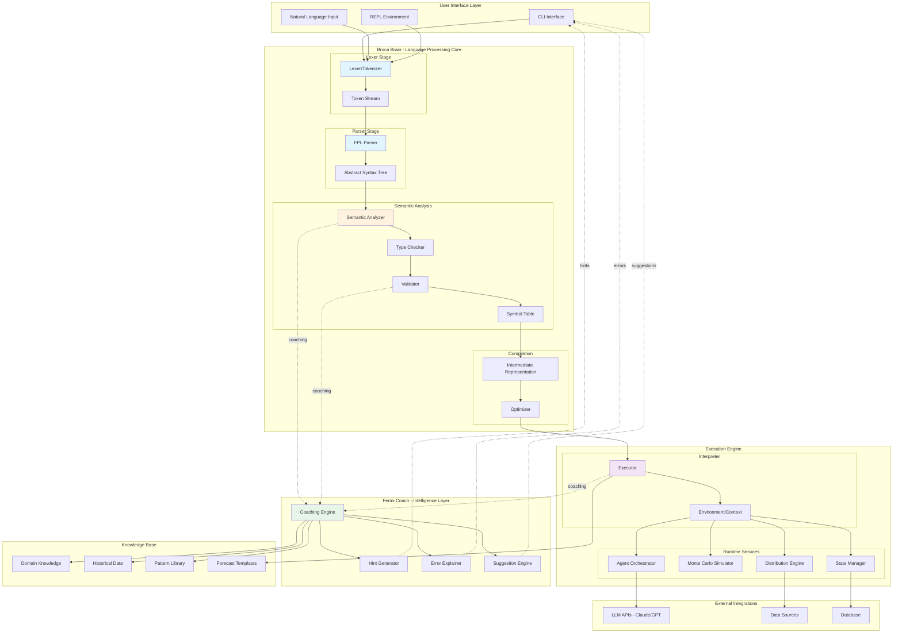

---

## Detailed Component Architecture

### 1. Lexer/Tokenizer

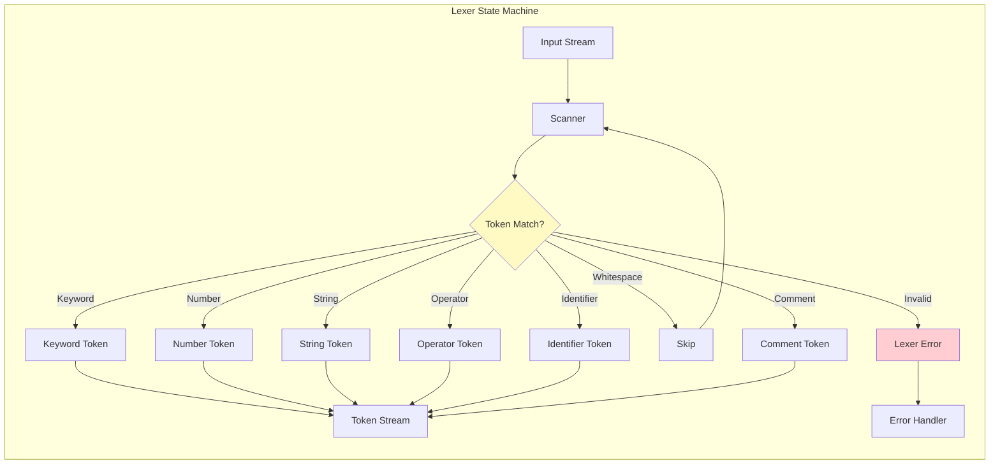

**Token Types:**
```
Keywords: question, driver, evidence, agent, model, simulate, 
          continuous, binary, triangular, normal, if, then

Literals: Number (42, 3.14), Probability (0.5p, 75%), 
          String ("..."), Date (2026-12-31)

Identifiers: variable_name, function_name

Operators: +, -, *, /, =, >, <, >=, <=

Delimiters: { } ( ) [ ] , : ;
```

---

### 2. Parser - AST Construction

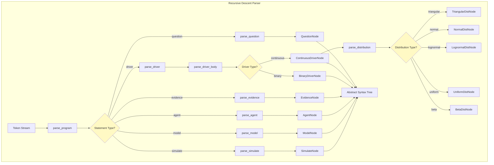

**AST Node Types:**
```rust
enum ASTNode {
    Program { statements: Vec<Statement> },
    
    Question {
        text: String,
        target_date: Date,
        resolution_criteria: Option<String>
    },
    
    Driver {
        name: String,
        driver_type: DriverType,
        distribution: Distribution,
        constraints: Vec<Constraint>,
        evidence_refs: Vec<String>
    },
    
    Evidence {
        id: String,
        source: String,
        summary: String,
        relevance: f64,
        date: Date
    },
    
    Agent {
        name: String,
        query: String,
        schedule: Option<Schedule>
    },
    
    Model {
        expression: Expression,
        drivers: Vec<String>
    },
    
    Simulate {
        iterations: u32,
        target: Expression
    }
}
```

---

### 3. Semantic Analyzer

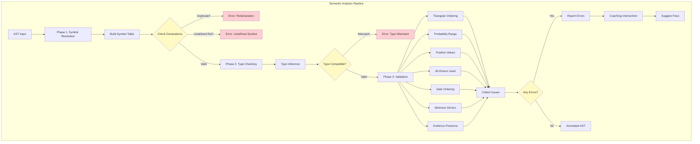

**Validation Rules:**
```rust
enum ValidationRule {
    // Distribution constraints
    TriangularOrdering,      // p5 < p50 < p95
    ProbabilityRange,        // 0 <= p <= 1
    PositiveValues,          // values > 0 where required
    
    // Semantic constraints
    AllDriversUsed,          // All declared drivers in model
    NoUndefinedReferences,   // All refs exist
    TypeConsistency,         // Types match across operations
    
    // Domain constraints
    DateOrdering,            // target_date > today
    ScheduleValidity,        // Valid cron expression
    
    // Forecast quality
    MinimumDrivers,          // >= 3 drivers recommended
    EvidencePresence,        // Each driver has evidence
    UncertaintyReasonable,   // Ranges not too narrow
}
```

---

### 4. Execution Engine

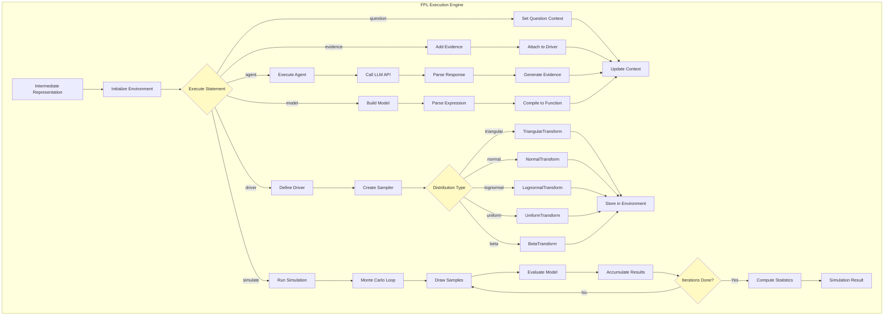

---

### 5. Fermi Coach - Intelligence Layer

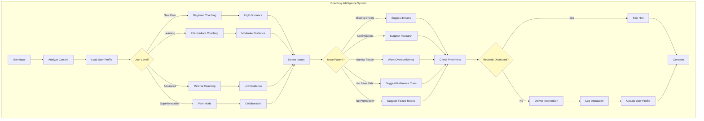

**Coaching Strategies:**
```rust
struct CoachingEngine {
    user_profile: UserProfile,
    hint_history: Vec<HintInteraction>,
    mistake_patterns: HashMap<String, u32>,
    
    // Adaptive coaching
    fn suggest_next_action(&self, context: &ForecastContext) -> Vec<Suggestion>,
    fn detect_mistakes(&self, forecast: &Forecast) -> Vec<Issue>,
    fn explain_error(&self, error: &FPLError) -> String,
    fn provide_example(&self, concept: &str) -> String,
    
    // Learning
    fn track_improvement(&mut self, outcome: &ForecastOutcome),
    fn adjust_guidance_level(&mut self),
}

struct Suggestion {
    priority: Priority,        // High, Medium, Low
    category: Category,        // Command, Concept, Warning
    message: String,
    action: Option<String>,    // Auto-executable command
    explanation: String,
    example: Option<String>,
}
```

---

### 6. Distribution Sampling Engine

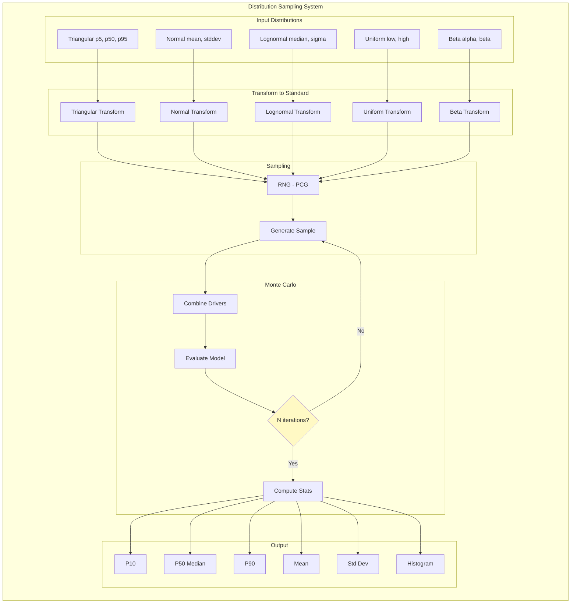

---

### 7. Agent Orchestration System

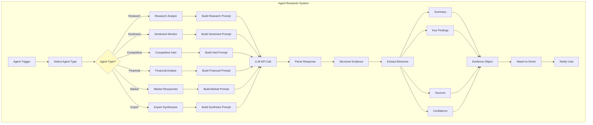

---

## Complete Data Flow Example

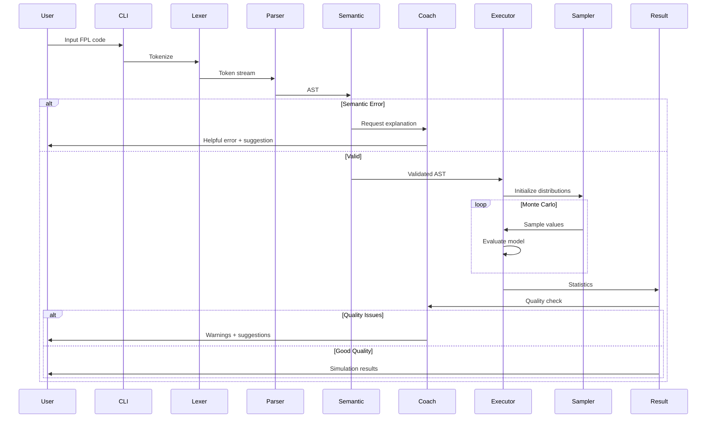

---

## FPL Language Processing Pipeline

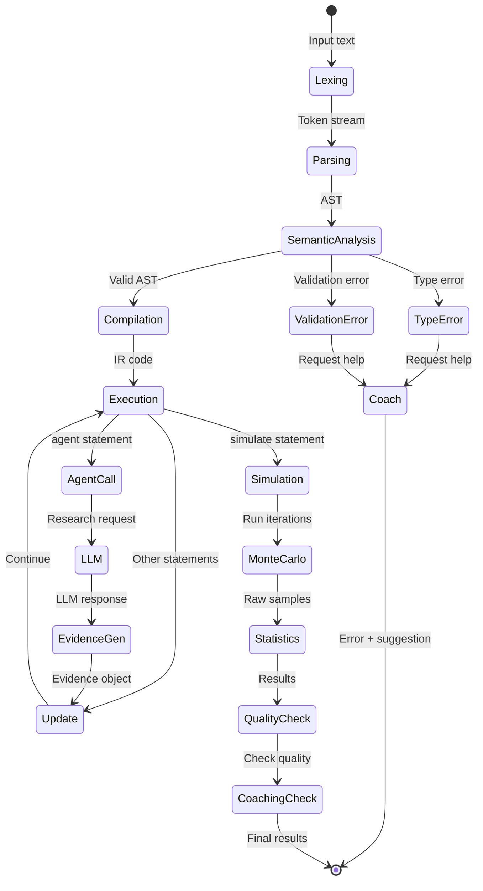

---

## Symbol Table Structure

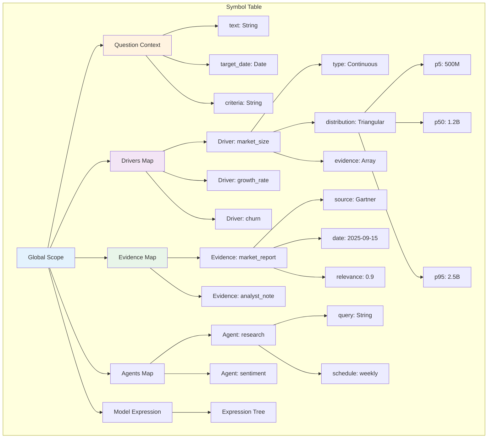

---

## Error Handling & Recovery

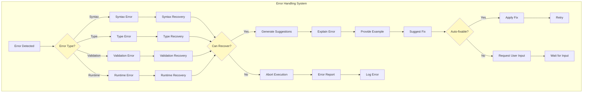

---

## Type System Lattice

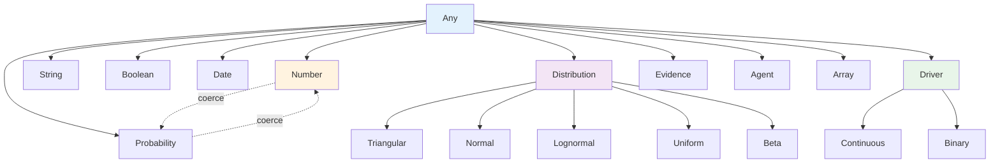

---

## Language Server Protocol Integration

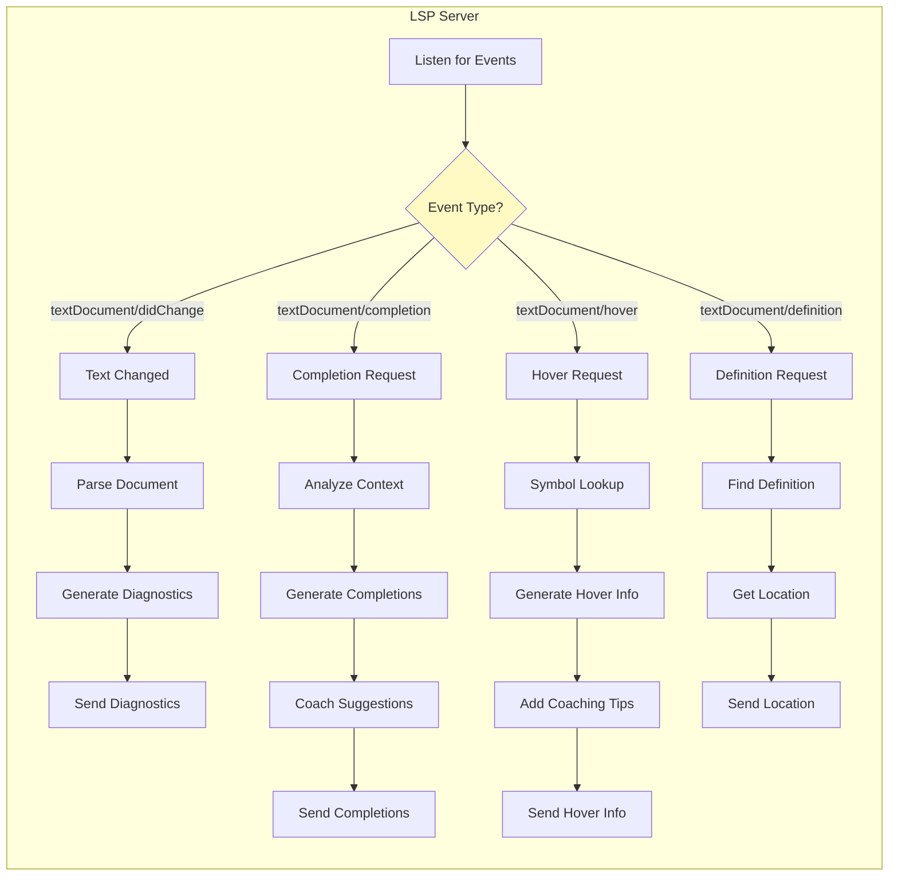

---

## Memory and State Management

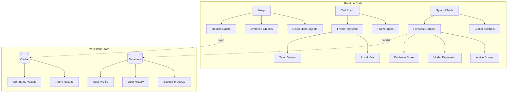

---

## Key Algorithms

### Triangular Distribution Sampling
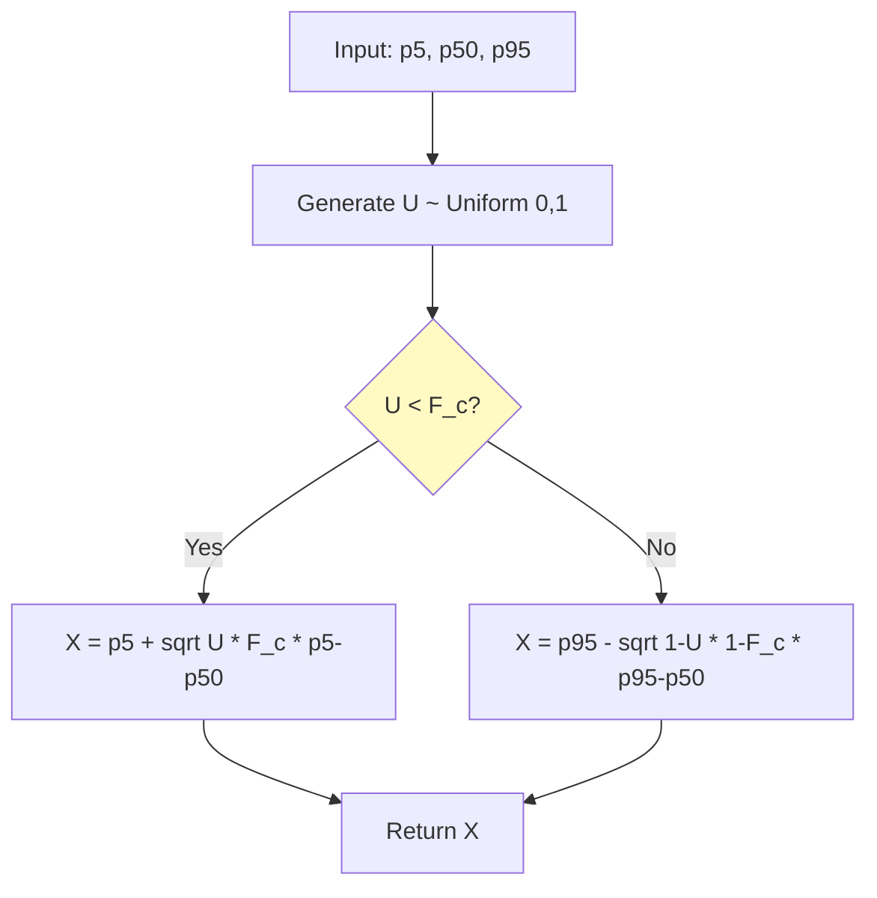

### Monte Carlo Loop
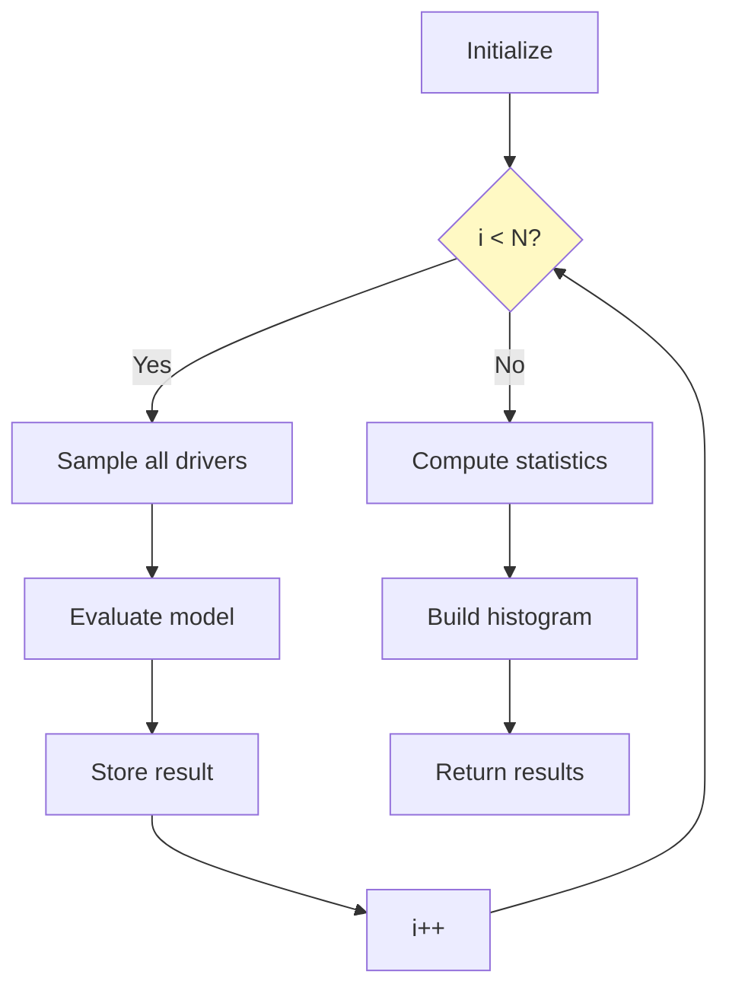

---

## Summary

This architecture represents Fermi's "Broca brain" - the language processing and reasoning center for FPL. The key components are:

1. **Lexer/Parser**: Transforms text → tokens → AST
2. **Semantic Analyzer**: Validates and type-checks AST
3. **Executor**: Runs the forecast model
4. **Distribution Engine**: Samples from probability distributions
5. **Agent System**: Orchestrates research through LLMs
6. **Coaching Engine**: Provides intelligent guidance
7. **LSP Server**: IDE integration for real-time feedback

The system is designed to be:
- **Declarative**: Users describe what they want, not how to compute it
- **Type-safe**: Strong type system catches errors early
- **Coached**: Intelligent guidance throughout
- **Extensible**: Easy to add new distributions, agents, validation rules

Next steps:
1. Implement lexer and parser
2. Build semantic analyzer with validation rules
3. Create execution engine with distribution sampling
4. Integrate coaching system
5. Build LSP server for IDE support
