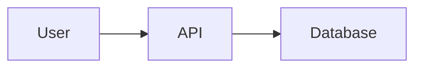
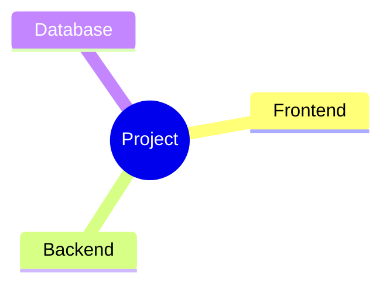

# Markdown Renderer with Mermaid Diagrams

A standalone tool to render any Markdown file with Mermaid diagrams to PNG images.

## Features

✨ **Universal Markdown Renderer**
- Works with any `.md` file (not just FPL reports)
- Extracts all Mermaid code blocks
- Generates PNG images using Mermaid CLI
- Automatically applies Ayu Mirage theme
- Preserves original Mermaid code in collapsible sections

## Requirements

```bash
# Install Mermaid CLI globally
npm install -g @mermaid-js/mermaid-cli
```

## Usage

### Basic Usage

```bash
cargo run --release --example render_markdown <input.md>
```

**Example:**
```bash
cargo run --release --example render_markdown my_document.md
```

**Output:**
- `rendered_output/my_document-rendered.md` - Rendered markdown with image references
- `rendered_output/charts/*.png` - Generated PNG images
- `rendered_output/charts/*.mmd` - Original Mermaid source files

### Custom Output Directory

```bash
cargo run --release --example render_markdown <input.md> <output_dir>
```

**Example:**
```bash
cargo run --release --example render_markdown docs/architecture.md ./rendered
```

**Output:**
- `./rendered/architecture-rendered.md`
- `./rendered/charts/*.png`

## Features in Detail

### Automatic Theming

All Mermaid diagrams are automatically themed with your Ayu Mirage color palette:
- Background: `#1F2430` (dark)
- Primary: `#5CCFE6` (cyan-blue)
- Secondary: `#BAE67E` (muted green)
- Accent: `#FFCC66` (gold)
- Text: `#CBCCC6` (light)

**Supported Diagram Types:**
- Flowcharts
- Mind maps
- Sequence diagrams
- Class diagrams
- State diagrams
- Gantt charts
- XY charts (histograms, bar charts)
- ER diagrams
- Git graphs
- And all other Mermaid diagram types!

### Source Preservation

Each rendered diagram includes a collapsible section with the original Mermaid code:

```markdown


<details>
<summary>📝 View Mermaid Source</summary>


</details>
```

This is perfect for:
- Debugging diagrams
- Copy-pasting code
- Sharing with AI agents
- Version control

## Example

**Input file (`example.md`):**
```markdown
# My Project

Here's the architecture:



And a mind map:


```

**Command:**
```bash
cargo run --release --example render_markdown example.md
```

**Output (`rendered_output/example-rendered.md`):**
```markdown
# My Project

Here's the architecture:


<details>
<summary>📝 View Mermaid Source</summary>


</details>

And a mind map:


<details>
<summary>📝 View Mermaid Source</summary>


</details>
```

**Files created:**
```
rendered_output/
├── example-rendered.md
└── charts/
    ├── diagram-0.png (25K)
    ├── diagram-0.mmd
    ├── diagram-1.png (20K)
    ├── diagram-1.mmd
    └── puppeteer-config.json
```

## Error Handling

### Mermaid CLI Not Found
```
⚠️  Warning: Mermaid CLI (mmdc) not found.
   Install with: npm install -g @mermaid-js/mermaid-cli
   Mermaid diagrams will remain as code blocks.
```

If mmdc is not installed, the tool will still generate output but Mermaid blocks remain as code.

### No Diagrams Found
```
ℹ️  No Mermaid diagrams found in the markdown file.
```

The tool will copy your markdown as-is if no Mermaid blocks are detected.

### Diagram Rendering Fails
```
✗ Failed to render diagram 2: Parse error on line 5
```

If a specific diagram fails to render, the tool will:
- Show an error message
- Keep the original code block in place
- Continue rendering other diagrams

## Use Cases

### 1. Documentation Rendering
Render your project documentation with visual diagrams:
```bash
cargo run --release --example render_markdown README.md docs/rendered
```

### 2. Report Generation
Generate reports from any markdown (not just FPL forecasts):
```bash
cargo run --release --example render_markdown reports/q4-analysis.md
```

### 3. Batch Processing
Render multiple files:
```bash
for file in docs/*.md; do
    cargo run --release --example render_markdown "$file" rendered_docs/
done
```

### 4. Pre-commit Hook
Automatically render diagrams before committing:
```bash
#!/bin/bash
# .git/hooks/pre-commit
for file in $(git diff --cached --name-only --diff-filter=ACM | grep '\.md$'); do
    cargo run --release --example render_markdown "$file"
done
```

### 5. CI/CD Integration
Add to your GitHub Actions workflow:
```yaml
- name: Render Mermaid Diagrams
  run: |
    npm install -g @mermaid-js/mermaid-cli
    cargo run --release --example render_markdown docs/architecture.md
    
- name: Upload Rendered Docs
  uses: actions/upload-artifact@v3
  with:
    name: rendered-docs
    path: rendered_output/
```

## Tips

1. **Viewing Rendered Markdown**
   - Open in Zed for best experience
   - Works in any markdown viewer
   - GitHub will render images correctly

2. **Theme Customization**
   - Diagrams auto-detect your Ayu Mirage theme
   - Already-themed diagrams are not re-themed
   - Edit `src/report/theme.rs` to customize colors

3. **Performance**
   - Rendering is fast (~1-2 seconds per diagram)
   - Run in release mode for best performance
   - Multiple diagrams render sequentially

4. **File Management**
   - Original files are never modified
   - Rendered files have `-rendered.md` suffix
   - Charts are saved in `charts/` subdirectory

## Troubleshooting

**Problem:** Images don't display in markdown viewer
- **Solution:** Ensure relative paths are correct. The markdown file expects `charts/` to be at the same level.

**Problem:** Diagrams render with wrong theme
- **Solution:** Clear output directory and re-render. Old theme configs may be cached.

**Problem:** Mermaid syntax error
- **Solution:** Check syntax at https://mermaid.live/. The tool will show error messages for invalid diagrams.

## Integration with FPL Reports

This tool is used internally by FPL report generation but can also work standalone:

```bash
# Generate FPL report (includes execution)
cargo run --release --example generate_report forecast.fpl

# Re-render an existing FPL report
cargo run --release --example render_markdown results/prototype/my-forecast.md
```

## Future Enhancements

- [ ] Watch mode (auto-regenerate on file changes)
- [ ] PDF export
- [ ] Custom theme selection
- [ ] Parallel diagram rendering
- [ ] Progress bar for multiple diagrams
- [ ] Diagram optimization (compress PNGs)
- [ ] SVG output option
- [ ] Dark/light mode toggle

---

**Questions?** Check the source code: `examples/render_markdown.rs`
