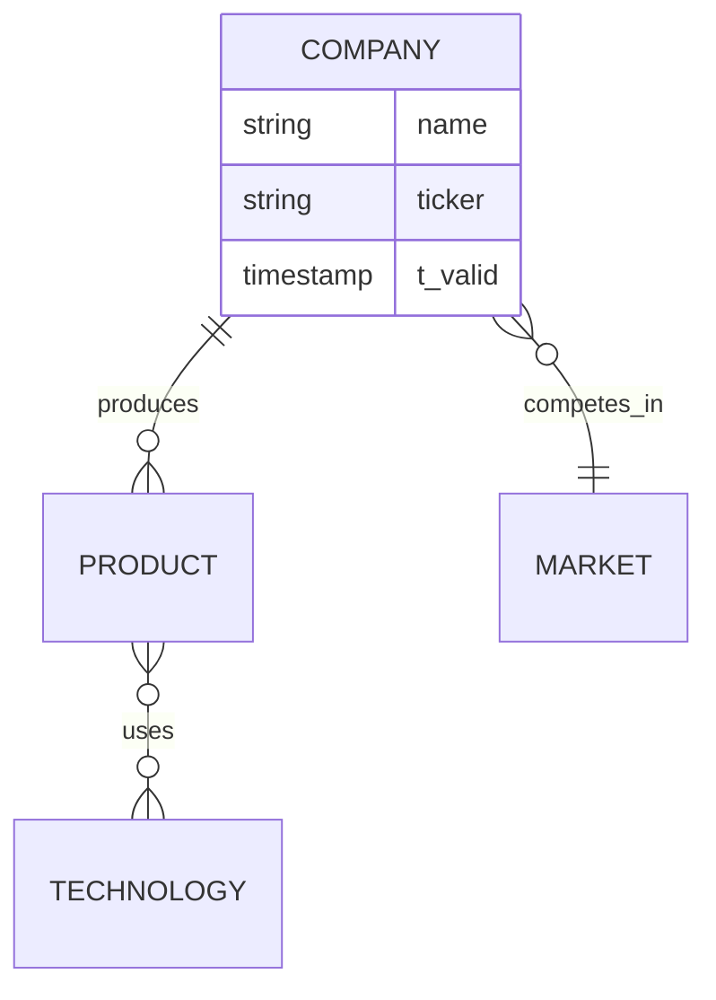

# Fermi: Probabilistic Forecasting with Active Dreaming Memory

A domain-specific language for probabilistic forecasting with Monte Carlo simulation, agent-based research, and biologically-inspired memory consolidation.

## Project Status: v0.5.0

**Core FPL Engine:** ✅ Complete  
**Active Dreaming Memory:** 🚧 Phase 1 In Progress  
**Agent Bestiary:** ✅ MCP Integration Complete  
**Zed IDE Integration:** ✅ Complete  
**Backend API:** 🚧 In Progress

---

## What's New: Active Dreaming Memory (ADM)

Fermi now features a biologically-inspired memory system where agents:
- 🧠 **Learn from experience** - Episodes consolidated into semantic rules
- 🌙 **Sleep-phase consolidation** - Daily processing of accumulated experiences
- 🔗 **Knowledge graphs** - Mermaid ER diagrams of agent worldviews
- 🔍 **Vector search** - pgvector-powered similarity matching
- ⏱️ **Bi-temporal tracking** - Full history of what agents knew when
- 🔐 **Race-safe consolidation** - Distributed locking prevents conflicts

**Status:** Phase 0 complete, Phase 1 in progress  
**Documentation:** See [README_ADM.md](README_ADM.md) and [docs/ARCHITECTURE_ADM.md](docs/ARCHITECTURE_ADM.md)

---

## Features

### FPL Language
- **Probabilistic Distributions:** Triangular, Normal, Lognormal, Uniform, Beta
- **Monte Carlo Simulation:** 10K-10M iterations
- **Expression Evaluation:** Full arithmetic, functions, conditionals
- **Type System:** Static type checking with semantic analysis
- **CLI:** Interactive 4-stage execution flow

### Agent Bestiary
- **Multi-agent research** coordination
- **MCP Integration** - Available in Zed via Model Context Protocol
- **LLM Executors** - Claude-powered research agents
- **Active Dreaming Memory** - Episodic → Semantic consolidation
- **Current Agents:** market_research, sentiment_analyzer

### Memory System (NEW)
- **Episodic Memory** - Raw agent execution traces
- **Semantic Memory** - Verified, consolidated rules
- **Knowledge Graphs** - Entities, facts, relationships
- **Ontology Snapshots** - Version-controlled worldviews (Mermaid ER)
- **Vector Search** - Similarity-based retrieval
- **PostgreSQL + pgvector** - Production-ready storage

---

## Quick Start

### Run FPL Forecasts
```bash
# Build the project
cargo build --release

# Run an example forecast
cargo run --release examples/amd_forecast.fpl

# Run tests
cargo test
```

### Use Agents in Zed
```
# In Zed assistant:
"List available agents"
"Execute market_research with query: What's the AI chip market outlook?"
"Show me the sentiment_analyzer agent"
```

### Test ADM Memory System
```bash
# Run memory system tests
cargo test --package fermi-memory

# Check database
export DATABASE_URL="postgresql://..."
psql $DATABASE_URL -c "\dt"
```

---

## Architecture

### Core Components

**FPL Engine** (Complete)
- Lexer → Parser → AST → Semantic Analyzer → Executor
- Monte Carlo simulation with 10K-10M iterations
- Distribution modeling and expression evaluation

**Agent Bestiary** (Active Development)
- Multi-agent research coordination
- LLM-powered executors (Claude Haiku/Sonnet)
- MCP server for Zed integration
- Active Dreaming Memory consolidation

**Memory System** (Phase 1)
```
┌──────────────────────────────────────┐
│   Active Dreaming Memory (ADM)      │
├──────────────────────────────────────┤
│                                      │
│  Wake:   Agent executes              │
│          ↓                           │
│          Episodes (PostgreSQL)       │
│                                      │
│  Sleep:  Consolidation (daily)       │
│          ↓                           │
│          Rules + Knowledge Graph     │
│                                      │
│  Query:  Vector + Graph + Text       │
│          ↓                           │
│          Relevant context retrieved  │
│                                      │
└──────────────────────────────────────┘
```

**Backend API** (Vercel)
- Serverless Rust functions
- Health checks and execution endpoints
- Agent coordination (planned)

---

## Project Structure

```
fermi/
├── src/                      # FPL core (lexer, parser, executor)
├── fermi-memory/            # ADM memory system (NEW)
├── fermi-lsp/               # Language Server Protocol
├── extensions/fermi/        # Zed IDE extension
├── agents/curated/          # Agent definitions
├── api/                     # Vercel serverless functions
├── docs/                    # Documentation
│   ├── ARCHITECTURE_ADM.md  # Memory system design
│   ├── ROADMAP_ADM_IMPLEMENTATION.md
│   └── MEMORY_SCHEMA.sql
├── README_ADM.md            # ADM quick reference
└── examples/                # FPL examples
```

---

## Technology Stack

**Core:**
- **Language:** Rust 2021
- **Editor:** Zed IDE
- **MCP:** Model Context Protocol integration

**Memory System:**
- **Database:** PostgreSQL (Neon via Vercel)
- **Vector Search:** pgvector extension
- **Embeddings:** Anthropic/OpenAI (configurable)
- **Ontology Format:** Mermaid ER diagrams
- **Version Control:** Git-based evolution tracking

**Backend:**
- **Platform:** Vercel serverless
- **Runtime:** Rust + vercel_runtime
- **API:** REST (GraphQL planned)

---

## Documentation

### Getting Started
- [Quick Start Guide](docs/QUICK_START.md) - ADM setup
- [README_ADM.md](README_ADM.md) - Memory system overview
- [Project Rules](docs/PROJECT_RULES.md) - Development workflow

### Architecture
- [ADM Architecture](docs/ARCHITECTURE_ADM.md) - Complete design
- [ADM Roadmap](docs/ROADMAP_ADM_IMPLEMENTATION.md) - 8-week plan
- [Database Schema](docs/MEMORY_SCHEMA.sql) - PostgreSQL tables
- [Module Architecture](docs/roadmap/MODULE_ARCHITECTURE.md) - System design

### Implementation Guides
- [Lexer](LEXER_README.md) - Tokenization
- [Parser](PARSER_README.md) - AST construction
- [Semantic Analyzer](SEMANTIC_ANALYZER_README.md) - Type checking
- [Executor](EXECUTOR_README.md) - Monte Carlo simulation
- [Agent Bestiary Design](docs/AGENT_BESTIARY_DESIGN.md) - Agent system

---

## Example: FPL with Agent Research

```fpl
forecast "AMD Q4 2024 Revenue" {
    # Define probabilistic drivers
    driver gpu_market triangular(20000, 32000, 50000)
    driver market_share normal(0.15, 0.05)
    driver avg_price triangular(800, 1200, 2000)
    
    # Agent-assisted research (MCP integration)
    agent market_research {
        type: "research"
        query: "AMD datacenter GPU market share trends"
        executor: "llm"
        schedule: every 1 week
        driver_refs: ["market_share"]
    }
    
    # Final estimate
    estimate gpu_market * market_share * avg_price
}
```

---

## Active Dreaming Memory (ADM)

### What It Does

Agents build **personal knowledge graphs** through experience:

1. **Wake Phase** - Agent executes, writes episodes to PostgreSQL
2. **Sleep Phase** - Daily consolidation (2am by default)
   - Cluster similar failures (DBSCAN)
   - Extract semantic rules (LLM verification)
   - Build knowledge graph (entities + facts)
   - Generate Mermaid ER diagrams
   - Commit to git with detailed messages
3. **Retrieval** - Multi-modal search (vector + text + graph)

### Example Ontology



### Current Status

**Phase 0:** ✅ Complete (Database + fermi-memory crate)  
**Phase 1:** 🚧 In Progress (Vector search + clustering)  
**Phase 2-8:** 📋 Planned (See [ADM Roadmap](docs/ROADMAP_ADM_IMPLEMENTATION.md))

---

## Roadmap

### ADM Implementation (8 Weeks)
- **Week 1:** Vector search + clustering (Phase 1) 🚧
- **Week 2:** Episodic memory operations (Phase 2)
- **Week 3:** Semantic memory + knowledge graph (Phase 3)
- **Week 4:** Mermaid generation + git integration (Phase 4)
- **Week 5:** Consolidation worker (Phase 5)
- **Week 6:** LLM verification (Phase 6)
- **Week 7:** Agent migration (Phase 7)
- **Week 8:** Vercel deployment (Phase 8)

### Future Phases
- **Phase 9+:** AKP (Agent Knowledge Protocol) - Inter-agent learning
- **Tournaments:** Forecasting competitions
- **Visualization:** Tufte-style charts
- **Collaboration:** Real-time multi-user forecasting

See [docs/ROADMAP.md](docs/ROADMAP.md) and [docs/ROADMAP_ADM_IMPLEMENTATION.md](docs/ROADMAP_ADM_IMPLEMENTATION.md)

---

## Environment Setup

### Prerequisites
- Rust 2021+ (`rustc --version`)
- PostgreSQL client (`psql --version`)
- Zed IDE (optional, for MCP integration)

### Configuration

1. Copy `.env.example` to `.env`
2. Add your credentials:
```bash
DATABASE_URL=postgresql://...
ANTHROPIC_API_KEY=sk-ant-...
REPO_PATH=/path/to/fermi
```

3. Initialize database:
```bash
psql $DATABASE_URL < docs/MEMORY_SCHEMA.sql
```

4. Test:
```bash
cargo test --package fermi-memory
```

---

## Contributing

See [docs/PROJECT_RULES.md](docs/PROJECT_RULES.md) for:
- Git workflow and commit conventions
- ADR (Architecture Decision Record) process
- Documentation standards
- Testing requirements

### Current Focus Areas
- ✅ ADM Phase 1 implementation
- 🔜 Vector embeddings generation
- 🔜 DBSCAN clustering
- 🔜 Distributed locking

---

## Testing

```bash
# Run all tests
cargo test --workspace

# Test FPL core
cargo test --package fermi

# Test memory system
cargo test --package fermi-memory

# Test specific module
cargo test semantic_analysis
```

**Status:** 61 tests passing ✅

---

## Performance

- **Monte Carlo:** 1M iterations in ~50ms
- **Episode Storage:** <10ms per episode
- **Vector Search:** <100ms for 10K episodes
- **Consolidation:** ~5 minutes for 1000 episodes

---

## License

[License TBD]

---

## Links

- **Repository:** https://github.com/Replicant-Partners/fermi
- **Documentation:** [docs/](docs/)
- **ADM Documentation:** [README_ADM.md](README_ADM.md)
- **Issues:** https://github.com/Replicant-Partners/fermi/issues

---

**Built by Replicant Partners**  
**Status:** Active Development  
**Version:** 0.5.0  
**Latest:** Active Dreaming Memory Phase 1 🧠
