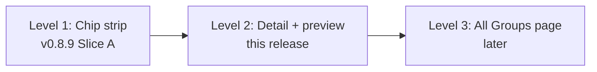

# Fermi Console v0.8.10 — Cascade composition Slice B (detail panel + dry-run preview)

Completes the interactive authoring surface for cascade groups.
Slice A (v0.8.9) shipped the **chip strip + picker** — enough to
compose a cascade end-to-end. Slice B adds the **group detail panel
with a dry-run preview** — turning cascades from a write-only tool
into an interactive planning surface.

Where Slice A answered *"how do I wire this forecast into a
cascade?"*, Slice B answers *"what would happen if I resolved this
member?"* — without committing anything.

## What's new

### Group detail panel

Clicking a cascade chip's **label** (not the ×) opens an inline detail
panel below the chip strip. Same slot as the picker — the two are
mutually exclusive so the header never stacks two overlays.

```
⊗ wc_2026_winner   kind: Mutually exclusive — 48 members — Σp = 1.003 ●  × close

Members:
  MEMBER                      CURRENT   STATUS    PREVIEW
  Spain                        55.9%    active    preview NO ▶
  France                       25.8%    active    preview NO ▶
  Argentina                    39.6%    resolved  preview NO ▶
  Curaçao                       1.0%    active    preview NO ▶
  …
```

- **Header** shows the kind glyph (`⊗` / `≤n` / `⇒`), the human kind
  label, member count, and a **kind-aware invariant health strip**:
  `Σp = 1.003 ●` (green if drift < 0.05, gold ≤ 0.20, red beyond;
  `n/a` for `implies` since it has no additive invariant).
- **Description** rendered below the header when the group has one.
- **Members table** shows each forecast's shortened question, current
  probability, and status (color-coded — green for resolved, dim for
  archived).
- **× close** dismisses the panel; clicking the same chip again also
  closes (label doubles as a toggle).

Chip border turns **gold** when the detail panel is open for that
chip, so the operator can tell at a glance which group they're
inspecting.

### Dry-run preview per member

Each member row has a **`preview NO ▶`** button that fires
`POST /api/relationship-groups/:id/propagate` with `dry_run=true`.
Server responds with the full delta table for the redistribution;
console renders it in a strip below the members table:

```
If Curaçao resolved NO, the cascade would shift:                          clear

  ◆ Curaçao        -0.90    1.0% → 0.1%    ← trigger, gold anchor
  ▲ Spain          +0.53   55.9% → 56.4%
  ▲ France         +0.24   25.8% → 26.0%
  ▲ England        +0.13   16.3% → 16.4%
  …
```

- **Sorted by |Δpp| desc** so the trigger anchors the top and the
  biggest movers surface next.
- **Trigger row highlighted** with the `◆` glyph and gold color;
  survivors use `▲` (positive) / `▼` (negative) in green/red.
- **Delta bar** to the right of each `±X.XX` number, capped at 60px
  so single large deltas don't blow out the layout.
- **`clear`** button in the strip dismisses just the preview, leaving
  the detail panel open.
- Preview button on the currently-active row shows **`showing NO ↓`**
  in gold so the operator knows which member the preview is for.

The write path stays gated by the pending_cascades operator queue
(via `apply_pending_cascade_handler`); the preview is a pure read
that returns without side effects.

### Backend: `POST /api/relationship-groups/:group_id/propagate`

New endpoint in `src/handlers/relationships/groups.rs`. Wraps the
existing `dispatch_propagation_group` engine that has been used
internally by `queue_pending_cascade` / `apply_pending_cascade` since
migration 155; this release just exposes it via HTTP for
console-driven previews.

Request:
```json
{
  "trigger_forecast_id": "…",
  "trigger_kind": "resolved",
  "outcome": false,
  "dry_run": true
}
```

- `dry_run` defaults to `true` — previews are the common case.
- `dry_run=false` executes the propagation directly and returns the
  applied deltas, bypassing the pending_cascades operator gate.
  Preserved for CLI tooling and admin one-shots; the normal apply
  flow still routes through `/api/pending-cascades/:id/apply`.
- Auth: caller must own the group (or be admin), same as the CRUD
  handlers. A preview leaks the group's kind + parameters + member
  probabilities, so it must be owner-gated.

Response: `PropagateResult` (`n_updated`, `deltas[]`, `note`) —
the same shape already returned by the legacy relationship-based
propagate route and by `pending_cascades.proposed_snapshot`.

### Wire-format tests

New `tests/cascade_group_propagate_shapes.rs` with 6 assertions:

- top-level fields (`n_updated`, `deltas`, `note`) present
- `n_updated == deltas.len()` in the dry-run contract
- every delta row has the five fields the UI reads
- per-row `(new_p - prev_p) * 100 == delta_pp`
- **mutex dry-run is mass-conserving**: Σ new_p ≈ Σ prev_p within
  0.005 (covers f32→f64 round-tripping + FLOOR/CEIL clamping in
  `propagate_mutex`)
- trigger row dominates delta magnitude (fixture-driven anchor for
  the preview's visual sort order)

Existing test suites still pass (8 provenance + 6 mutex-math).

## The composition mental model, one release later



Slice A + Slice B together give operators the full compose-and-plan
workflow:

1. Open a forecast.
2. See cascade memberships as chips in the header.
3. Click **+ add** → pick an existing group or create a new one inline.
4. Click a chip label → see who else is in the group, current
   probabilities, and the invariant health.
5. Click **preview NO** on a member → see how a hypothetical
   resolution would ripple through the group. Adjust plans without
   touching production data.
6. Click **× close** or click the chip label again to dismiss.

No CLI, no modal, no context switch.

## Migration

None. Pure HTTP addition + client wiring. Endpoints registered:

- `POST /api/relationship-groups/:group_id/propagate` — new.

Everything else was already live.

## Known follow-ups

- **Apply-from-preview.** The preview strip currently shows deltas
  but doesn't offer a "commit this now" button — that path still
  goes through the pending_cascades queue. Wiring an inline apply
  is trivial once we decide it's ergonomic to bypass the queue for
  operator-initiated previews.
- **Search + pagination on the members table.** Fine at O(50)
  members (WC 2026 fits); needs a scroll container and search box
  at O(500).
- **Multi-trigger preview.** Currently one trigger at a time. The
  server engine supports chained triggers but there's no shape for
  "what if I resolve these three sequentially?"
- **Level 3 — All Groups Dashboard section.** Still deferred until
  operators start managing >10 groups per account.
- **`CascadeRule` trait refactor** to unlock `bracket` / `k_of_n` /
  `budget` / `correlation` / `rollup` / `bayesian` kinds. The
  detail panel's kind-aware invariant strip is already coded to
  degrade gracefully (`Σp n/a`) for unknown kinds; adding new
  kinds only requires teaching `cascade_kind_glyph` /
  `cascade_kind_label` / `cascade_invariant_health` about them.

## Also in this release (Teams v2 pass, folded in)

A parallel Teams-panel thread that was sitting in the working tree
when this release cut. Folded into v0.8.10 at operator request so
nothing lingers unpushed. Cleanly separable in the diff (only
`main.rs`, `agent_card.json`, and one line in `forecasts.rs`), and
unrelated to the cascade primitive — documented here so the tag
history doesn't imply otherwise.

### Teams panel: sub-tab layout (Roster / Shared / Activity)

New `TeamTab` enum + tab bar on the Teams panel's right-pane detail
view. Splits the surface into three concerns:

- **Roster** — the existing member list + invites + delete. Default.
- **Shared** — forecasts + portfolios owned by *or* shared with the
  team. Two sections, compact tile per row.
- **Activity** — team-scoped recent revisions / publications /
  resolutions. Team-level counterpart to the Dashboard's Recent
  Activity ticker.

Rationale: each concern was previously either siloed on another panel
or missing entirely. Stacking them in a single pane stretched it past
the fold; sub-tabs keep everything findable without vertical bloat.

### Portfolio team-shares cache

Mirror of v0.8.7's `forecast_team_shares` for portfolios:

- `portfolio_team_shares: HashMap<portfolio_id, Vec<team_id>>` on
  `FermiConsole`
- `portfolio_shares_in_flight` in-flight dedup
- `refresh_portfolio_shares_cache` fan-out, same O(10)-per-operator
  shape as the forecast counterpart
- `portfolios_for_team()` / `forecasts_for_team()` helpers that
  filter both owned and shared-with items in memory (no extra API
  round-trips per team switch).

### `team_id` on portfolio list response

One-line addition to `list_portfolios_handler` in
`src/handlers/forecasts.rs`:

- Selects `p.team_id` from `fermi_portfolios` (Spec 24 §3.5.4).
- Serializes as `team_id: string | null` on each row.
- Nullable — personally-owned portfolios have `team_id NULL`.

Needed so the Teams panel can filter portfolios owned by a specific
team without a per-portfolio round trip.

### Fermi agent card: tier moved to `system`

`agents/curated/fermi/agent_card.json`:

- `agent_type: system → meta`
- `tier: curated → system`
- `hireable: false` added
- JSON whitespace normalized on the tool schema block

Reason: Fermi is the platform's always-on navigator, not a hireable
marketplace agent. The Dashboard's Fresh tier and marketplace fleet
filters now correctly exclude it (via the tier check that was
already looking for `!= System`).

## Files touched (Cascade Slice B — core release)

- `src/handlers/relationships/groups.rs` — new
  `preview_group_propagation_handler` + `PreviewPropagateRequest`.
- `src/api_server.rs` — route for
  `POST /api/relationship-groups/:group_id/propagate`.
- `tests/cascade_group_propagate_shapes.rs` — new (6 shape tests).
- `crates/fermi-console/src/api/client.rs` — new
  `ApiClient::preview_cascade_propagation` method.
- `crates/fermi-console/src/cockpit.rs` — five new state fields
  (`cascade_detail_group_id`, `cascade_detail_data`,
  `cascade_preview_data`, `cascade_preview_trigger`,
  `cascade_preview_loading`); four new methods
  (`open_cascade_detail`, `close_cascade_detail`,
  `load_cascade_detail`, `preview_cascade_resolution`,
  `clear_cascade_preview`); three new render functions
  (`render_cascade_detail_panel`, `render_cascade_detail_body`,
  `render_cascade_preview_strip`); helper
  (`cascade_invariant_health`). Chip labels now open detail on
  click; picker mutually exclusive with detail. Wired into
  `render_question_section`.
- `crates/fermi-console/Cargo.toml` — version bump.

## Files touched (Teams v2 — folded in)

- `crates/fermi-console/src/main.rs` — `TeamTab` enum,
  `portfolio_team_shares` + `portfolio_shares_in_flight` fields,
  `refresh_portfolio_shares_cache`, `forecasts_for_team`,
  `portfolios_for_team`, `render_team_tab_bar`,
  `render_team_roster_body`, `render_team_shared_body`,
  `render_team_portfolio_row`, `render_team_activity_body`,
  marketplace/fleet exclusion of `tier=System` agents.
- `agents/curated/fermi/agent_card.json` — tier/type/hireable
  refactor described above.
- `src/handlers/forecasts.rs` — `team_id` on portfolio list rows.
