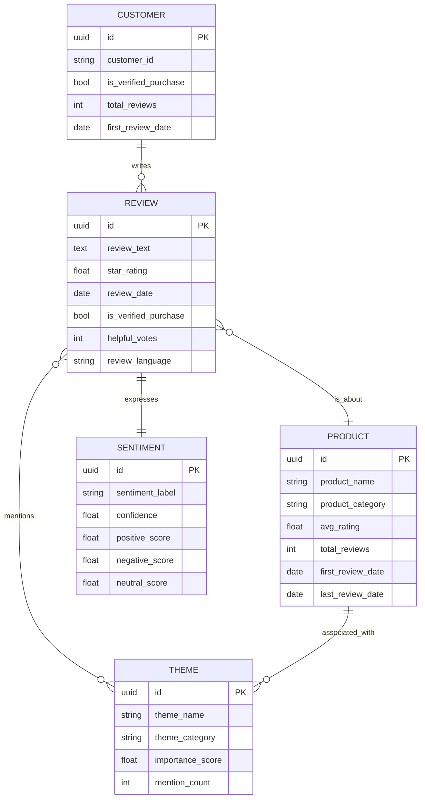

# Getting Started: Your First Fermi Agent

This guide walks you through creating your first Fermi forecasting agent in about 30 minutes. We'll build a simple **Product Review Analyzer** that classifies product review sentiment.

## Prerequisites

- Basic understanding of JSON
- Familiarity with entity-relationship diagrams (helpful but not required)
- Text editor

## What We're Building

**Agent Name:** `product_review_analyzer`  
**Purpose:** Analyze product reviews and extract sentiment, key themes, and actionable insights  
**Executor:** LLM (Claude Haiku)  
**Complexity:** ⭐ Beginner-friendly

## Step 1: Define Your Agent's Purpose (5 minutes)

Before writing any code, answer these questions:

### What Problem Does It Solve?

> "E-commerce teams need to quickly understand customer sentiment from hundreds of product reviews without reading each one manually."

### What Questions Will It Answer?

1. "What's the overall sentiment of reviews for Product X?"
2. "What are the top complaints?"
3. "What do customers love most?"
4. "Are there quality issues mentioned?"

### What Evidence Will It Produce?

- Sentiment scores (positive/negative/neutral with confidence)
- Key themes (quality, price, shipping, features)
- Representative quotes
- Trend analysis over time

**✅ Checkpoint:** You should have a clear one-sentence description and 3-5 example questions.

## Step 2: Choose Your Execution Strategy (5 minutes)

For sentiment analysis, we'll use:

- **Executor:** LLM (no external APIs needed)
- **Model:** Claude Haiku (fast, cheap, good for classification)
- **Temperature:** 0.1 (low = more consistent classifications)

### Why LLM-only?

- ✅ No API keys required
- ✅ Works offline (once runtime is ready)
- ✅ Fast iteration during development
- ✅ Low cost per execution

### When to Use MCP Instead?

Use MCP when you need:
- Real-time data from APIs
- Database queries
- Web scraping
- Integration with external tools

**✅ Checkpoint:** You've chosen LLM executor with Haiku model.

## Step 3: Design Your Ontology (10 minutes)

Your agent needs to remember what it learns. Let's design the entities and relationships.

### Identify Core Entities

What "nouns" will your agent track?

1. **PRODUCT** - Items being reviewed
2. **REVIEW** - Individual customer reviews
3. **CUSTOMER** - People writing reviews
4. **THEME** - Topics mentioned (quality, price, shipping)
5. **SENTIMENT** - Emotional tone classifications

### Define Relationships

How do entities connect?

```
CUSTOMER writes REVIEW
REVIEW is_about PRODUCT
REVIEW expresses SENTIMENT
REVIEW mentions THEME
PRODUCT has_average SENTIMENT
THEME relates_to PRODUCT
```

### Create Mermaid ER Diagram

Create `ontology.mermaid`:



**✅ Checkpoint:** You have an ER diagram with 5 entities and 6 relationships.

## Step 4: Create Agent Card (10 minutes)

Copy the template `agent_card.json` and fill it in:

### 4.1 Basic Metadata

```json
{
  "agent_id": "generate-uuid-here",
  "agent_name": "product_review_analyzer",
  "agent_type": "sentiment_analysis",
  "version": "1.0.0",
  "tier": "specialist",
  "description": "Analyzes product reviews to extract sentiment, themes, and actionable insights for e-commerce teams."
}
```

**Generate UUID:** Use https://www.uuidgenerator.net/ or command line:
```bash
python3 -c "import uuid; print(uuid.uuid4())"
```

### 4.2 Executor Configuration

```json
{
  "executor": {
    "type": "llm",
    "primary_action": "analyze_review_sentiment",
    "fallback_strategy": "return_low_confidence_classification"
  }
}
```

### 4.3 LLM Configuration

```json
{
  "llm_config": {
    "model": "claude-haiku-4",
    "temperature": 0.1,
    "max_tokens": 2048,
    "system_prompt": "You are a product review sentiment analyzer. Classify reviews as positive, negative, or neutral. Extract key themes (quality, price, shipping, features). Provide confidence scores and representative quotes. Be objective and evidence-based."
  }
}
```

### 4.4 MCP Servers

```json
{
  "mcp_servers": []
}
```

Leave empty for LLM-only agents.

### 4.5 Performance Metrics (Initial Estimates)

```json
{
  "performance": {
    "accuracy_rate": 0.0,
    "avg_confidence": 0.0,
    "execution_count": 0,
    "avg_execution_time_ms": 1500,
    "last_calibration": null
  }
}
```

Start with zeros - these will be updated after real executions.

### 4.6 Capabilities

```json
{
  "capabilities": {
    "handles_uncertainty": true,
    "confidence_threshold": 0.7,
    "supports_streaming": false,
    "max_retries": 2
  }
}
```

### 4.7 Ontology Reference

```json
{
  "ontology": {
    "version": "1.0.0",
    "last_updated": "2026-02-07T00:00:00Z",
    "entity_count": 0,
    "relationship_count": 0,
    "commit_hash": null
  }
}
```

Initial values - will be updated as ontology grows.

### 4.8 Metadata

```json
{
  "tags": ["sentiment", "reviews", "e-commerce", "nlp", "customer_feedback"],
  "dependencies": [],
  "author": "Your Name",
  "created_at": "2026-02-07T00:00:00Z",
  "updated_at": "2026-02-07T00:00:00Z"
}
```

**✅ Checkpoint:** You have a complete `agent_card.json` file.

## Step 5: Write Example Queries (5 minutes)

Document what your agent should handle:

### Query 1: Single Review Analysis
```
Input: "This laptop is amazing! Fast performance, great battery life. Only complaint is the price, but worth it."

Expected Output:
{
  "sentiment": "positive",
  "confidence": 0.92,
  "positive_score": 0.85,
  "negative_score": 0.10,
  "neutral_score": 0.05,
  "themes": [
    {"name": "performance", "sentiment": "positive", "confidence": 0.95},
    {"name": "battery_life", "sentiment": "positive", "confidence": 0.90},
    {"name": "price", "sentiment": "negative", "confidence": 0.80}
  ],
  "key_quote": "Fast performance, great battery life"
}
```

### Query 2: Bulk Analysis
```
Input: Array of 50 reviews for "Laptop X"

Expected Output:
{
  "overall_sentiment": "positive",
  "confidence": 0.88,
  "sentiment_distribution": {
    "positive": 0.68,
    "negative": 0.18,
    "neutral": 0.14
  },
  "top_themes": [
    {"name": "performance", "mentions": 42, "avg_sentiment": 0.85},
    {"name": "price", "mentions": 38, "avg_sentiment": -0.35},
    {"name": "battery", "mentions": 31, "avg_sentiment": 0.72}
  ],
  "summary": "Customers love the performance and battery but find it expensive."
}
```

### Query 3: Trend Analysis
```
Input: "How has sentiment changed for Product X over the last 6 months?"

Expected Output:
{
  "trend": "improving",
  "confidence": 0.81,
  "monthly_sentiment": [
    {"month": "2025-08", "sentiment": 0.62},
    {"month": "2025-09", "sentiment": 0.65},
    {"month": "2025-10", "sentiment": 0.71},
    {"month": "2025-11", "sentiment": 0.74},
    {"month": "2025-12", "sentiment": 0.78},
    {"month": "2026-01", "sentiment": 0.82}
  ],
  "analysis": "Sentiment improved 32% after price reduction in October."
}
```

**✅ Checkpoint:** You have 3 documented example queries with expected outputs.

## Step 6: Create Documentation (5 minutes)

Create a `README.md` for your agent:

```markdown
# Product Review Analyzer Agent

**Type:** Sentiment Analysis  
**Executor:** LLM (Claude Haiku)  
**Tier:** Specialist

## Overview

Analyzes product reviews to extract sentiment, themes, and actionable insights for e-commerce teams.

## Capabilities

- Sentiment classification (positive/negative/neutral)
- Theme extraction (quality, price, shipping, features)
- Confidence scoring
- Trend analysis over time
- Bulk review processing

## Usage Examples

[Paste your 3 example queries from Step 5]

## Ontology

Tracks 5 core entities:
- PRODUCT: Items being reviewed
- REVIEW: Customer feedback
- CUSTOMER: Review authors
- SENTIMENT: Emotional classifications
- THEME: Topics mentioned

See `ontology.mermaid` for full ER diagram.

## Performance

- **Target Accuracy:** >85%
- **Avg Confidence:** >0.8
- **Response Time:** <2 seconds
- **Cost per Review:** ~$0.001

## Limitations

- English language only (for now)
- Requires at least 10 words per review
- May struggle with heavy sarcasm
- Cannot verify factual claims

## Coming Soon

- Multi-language support
- Sarcasm detection
- Comparative analysis (Product A vs Product B)
- Integration with e-commerce platforms
```

**✅ Checkpoint:** You have complete documentation for your agent.

## Step 7: Validation Checklist (5 minutes)

Go through this checklist to ensure your agent is ready:

### Design Quality

- [ ] **Clear purpose:** One-sentence description is specific and actionable
- [ ] **Well-scoped:** Agent does ONE thing well, not many things poorly
- [ ] **Example queries:** At least 3 diverse queries documented
- [ ] **Expected outputs:** Output structure clearly defined with examples

### Agent Card Completeness

- [ ] **All required fields:** agent_id, agent_name, agent_type, version, executor, llm_config
- [ ] **Valid JSON:** No syntax errors (check with https://jsonlint.com/)
- [ ] **Unique UUID:** Generated, not placeholder
- [ ] **Realistic estimates:** Performance metrics are reasonable
- [ ] **Appropriate model:** Haiku for simple, Sonnet for complex, Opus rarely
- [ ] **Temperature tuned:** 0.0-0.3 for facts, 0.4-0.7 for analysis

### Ontology Design

- [ ] **5-15 entities:** Not too simple, not over-engineered
- [ ] **Clear relationships:** Each relationship makes sense and has cardinality
- [ ] **Valid Mermaid:** Syntax is correct (test at https://mermaid.live/)
- [ ] **Normalized:** No redundant relationships
- [ ] **Scalable:** Can grow as agent learns

### Documentation

- [ ] **README.md exists:** Explains what agent does
- [ ] **Usage examples:** At least 3 with inputs and expected outputs
- [ ] **Limitations listed:** Honest about what agent can't do
- [ ] **Performance targets:** Clear success criteria

**✅ Checkpoint:** All items checked - your agent is ready!

## Step 8: Organize Your Files

Create this directory structure:

```
agents/custom/product_review_analyzer/
├── agent_card.json          # Your agent configuration
├── ontology.mermaid         # ER diagram
└── README.md                # Documentation
```

## What Happens Next?

### Current Status: ⏳ Waiting for Runtime

You've designed your agent, but the execution runtime isn't ready yet. Here's what's happening:

**You've completed:**
- ✅ Agent card with full configuration
- ✅ Ontology design (entities + relationships)
- ✅ Documentation with examples
- ✅ Test queries and expected outputs

**Coming soon (Fermi team is building):**
- ⏳ Agent executor (runs your agent)
- ⏳ Memory system (stores episodic + semantic memory)
- ⏳ Ontology versioning (tracks how your agent learns)
- ⏳ Performance monitoring (accuracy, confidence, cost)

**You'll be notified when:**
- Runtime is available for testing
- You can execute your agent with real queries
- Ontology starts building from executions
- Performance metrics become available

### Meanwhile, You Can:

1. **Review other examples:** Study `market_research` and `risk_monitor` agents
2. **Refine your design:** Iterate on ontology and queries based on feedback
3. **Design more agents:** Get ahead by planning your next agents
4. **Share with team:** Get feedback on your agent card and documentation

## Common Questions

### Q: Why can't I run my agent yet?

**A:** The Fermi backend (executor, memory system, ontology versioning) is still under development. You're creating the "blueprint" now, and it will be executable soon.

### Q: How will I know when it's ready?

**A:** The Fermi team will notify you when the runtime is available. You'll receive:
- API endpoint or CLI tool
- Authentication credentials
- Deployment instructions
- Testing guide

### Q: Can I change my agent card later?

**A:** Yes! Agent cards are versioned. You can update your agent at any time. The ontology will continue to evolve as your agent learns.

### Q: What if my agent performs poorly?

**A:** That's expected! Initial performance metrics are estimates. After real executions, you'll:
- See actual accuracy and confidence scores
- Identify failure patterns
- Tune temperature, prompts, and thresholds
- Iterate until performance meets targets

### Q: Do I need to know Rust?

**A:** No! Agent development is JSON + Mermaid + documentation. The Fermi backend (written in Rust) handles execution, memory, and ontology management automatically.

### Q: Can agents work together?

**A:** Yes! In future phases, agents will compose to provide comprehensive forecasts. For example:
- `market_research` + `sentiment_analyzer` = "What's AMD's market position and customer sentiment?"
- Multiple agents can provide evidence for the same forecast question

### Q: What about costs?

**A:** LLM costs vary by model:
- Haiku: ~$0.001/query (cheap)
- Sonnet: ~$0.01/query (moderate)
- Opus: ~$0.10/query (expensive)

API costs (MCP servers) depend on provider. Track costs via performance metrics.

### Q: How accurate do agents need to be?

**A:** Target >85% accuracy for production use. During development:
- <70%: Needs significant improvement
- 70-85%: Good, needs tuning
- >85%: Production-ready
- >95%: Excellent (rare without tuning)

### Q: What if I get stuck?

**A:**
1. Check [DESIGN_CHECKLIST.md](./DESIGN_CHECKLIST.md)
2. Study example agents in [examples/](./examples/)
3. Read [Agent Card Specification](../../docs/guides/AGENT_CARD_SPECIFICATION.md)
4. Ask the Fermi team or file an issue

## Next Steps

### Immediate

1. ✅ Save your agent files in `agents/custom/<your_agent_name>/`
2. ✅ Share with team for feedback
3. ✅ Refine based on feedback

### When Runtime Available

1. Deploy agent to Fermi platform
2. Run test queries
3. Monitor performance metrics
4. Tune configuration (temperature, prompts, thresholds)
5. Iterate until accuracy targets met

### Long Term

1. Monitor ontology evolution
2. Add new capabilities based on usage
3. Compose with other agents
4. Contribute improvements to templates

## Congratulations! 🎉

You've designed your first Fermi agent! You're now ready to:

- Create more specialized agents
- Explore advanced features (MCP, multi-agent composition)
- Contribute to the Fermi agent bestiary

**Remember:**
- Start simple, iterate based on real usage
- Evidence-based always (cite sources, provide confidence)
- Document everything (future you will thank present you)
- Test thoroughly before production use

## Additional Resources

- [Agent Card Specification](../../docs/guides/AGENT_CARD_SPECIFICATION.md) - Complete JSON schema
- [DESIGN_CHECKLIST.md](./DESIGN_CHECKLIST.md) - Planning guide
- [Example Agents](./examples/) - Complete working examples
- [ADM Architecture](../../docs/ARCHITECTURE_ADM.md) - How memory works
- [Mermaid ER Diagrams](https://mermaid.js.org/syntax/entityRelationshipDiagram.html) - Syntax reference

---

**Questions?** Contact the Fermi team or check the documentation.

**Ready for more?** Try building a more complex agent with MCP integration!

**Last Updated:** 2026-02-07
