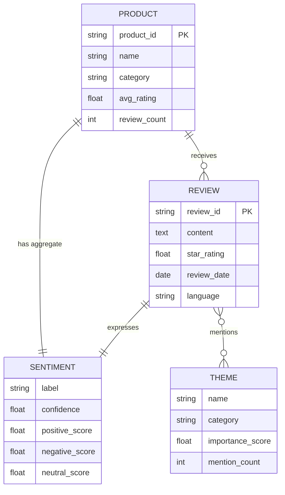

# Getting Started: Your First Agent

This guide builds a working **Sentiment Analyzer** agent from scratch in about
30 minutes. Every step maps directly to a field in `agent_card.json` and a
section in `docs/AGENT_MODEL.md`.

> **Prerequisites:** Familiarity with JSON. No Rust knowledge required.  
> **Runtime status:** The agent executor, eval pipeline, and observability stack
> are live. Completing this guide produces a card that loads on server startup
> and can be executed immediately via `POST /api/agents/:id/execute`.

---

## Step 1 — Define the identity contract (5 min)

Before writing any JSON, answer these four questions. They map to the fields
that every other system surface reads to understand your agent.

**What does it accept?**  
> Free-text strings: product review text, news snippets, social media posts.  
> `accepts: ["review-text", "query-text"]`

**What does it produce?**  
> A structured sentiment classification with confidence and evidence.  
> `produces: ["sentiment-score", "evidence-summary"]`

**What is its one-sentence description?**  
> "Classifies text sentiment as positive, negative, or neutral with confidence scores and theme extraction."

**What are 3 canonical example queries?**  
> 1. "What is the overall sentiment of these 20 customer reviews for Product X?"  
> 2. "Is the current social media coverage of this news event positive or negative?"  
> 3. "Extract the top 3 themes from this batch of support tickets."

Write these down — they become `metadata.sample_queries` and the default eval
test cases the observability stack uses.

---

## Step 2 — Design the persona and valence (5 min)

The system prompt is the agent's voice and decision policy. It is also the
target of the recursive improvement loop — everything the observability stack
measures is measured against what this prompt declares.

```
You are sentiment_analyzer, a specialized sentiment classification agent
on the Agent Bestiary platform.

Your role: classify text as positive, negative, or neutral. Extract key
themes. Produce calibrated confidence scores.

For every request, respond in JSON with this structure:
{
  "sentiment": "positive" | "negative" | "neutral",
  "confidence": 0.0-1.0,
  "themes": [{ "name": "...", "sentiment": "...", "confidence": 0.0-1.0 }],
  "evidence": "one-sentence justification citing specific text",
  "limitations": "honest note on what this analysis cannot determine"
}

Confidence guidelines:
- 0.9+: unambiguous signal, multiple corroborating cues
- 0.7-0.9: clear signal, minor ambiguity
- 0.5-0.7: mixed or weak signal — state this in evidence
- <0.5: return null for sentiment and explain in limitations

Never fabricate confidence. If the text is sarcastic or ambiguous, lower
confidence and say so.
```

Now set **valence** — the affective signature that shapes how this agent
collaborates in compositions:

```json
"valence": {
  "primary_affect": "analytical",
  "arousal": 0.3,
  "valence": 0.65,
  "personality_traits": ["precise", "evidence-driven", "calibrated"]
}
```

- `arousal: 0.3` — calm and deliberate; not reactive to individual data points
- `valence: 0.65` — slightly positive; constructive but not sycophantic
- `personality_traits` — shape how xamanEK and other agents read this agent

---

## Step 3 — Configure the cognition economy (5 min)

Set a **model ladder** so the agent serves all tiers with the right model:

```json
"model_ladder": [
  {
    "tier": "free",
    "provider": "anthropic",
    "model": "claude-3-haiku-20240307",
    "note": "Fast, cheap — adequate for single-review classification"
  },
  {
    "tier": "standard",
    "provider": "anthropic",
    "model": "claude-sonnet-4-5",
    "note": "Better theme extraction and calibration for batch analysis"
  }
],
"min_tier": "free"
```

Set **sampling parameters** explicitly:

```json
"model_params": {
  "max_tokens": 1024,
  "temperature": 0.1,
  "random_seed": 42
}
```

`temperature: 0.1` — low, because classification should be deterministic.  
`random_seed: 42` — set for reproducible eval runs.

No `capability_gates` needed — all capabilities available at all tiers.

---

## Step 4 — Design the ontology (10 min)

Agents accumulate knowledge through ADM dreaming. The ontology defines
what they learn. For a sentiment analyzer:

**Core entities:** `PRODUCT`, `REVIEW`, `SENTIMENT`, `THEME`

**Relationships:**
- A REVIEW expresses a SENTIMENT (one-to-one)
- A REVIEW mentions THEMEs (many-to-many)
- A PRODUCT aggregates REVIEWs (one-to-many)
- A PRODUCT has an aggregate SENTIMENT (many-to-one)

Create `ontology.mermaid`:



Validate at https://mermaid.live/ before proceeding.

---

## Step 5 — Assemble the agent card (5 min)

Create `agents/community/sentiment_analyzer/agent_card.json`:

```json
{
  "agent_id": "sentiment_analyzer",
  "agent_type": "research",
  "version": "1.0.0",
  "tier": "community",

  "capabilities": {
    "executor": "llm",
    "provider": "anthropic",
    "model": "claude-3-haiku-20240307",
    "temperature": 0.1,
    "min_tier": "free",
    "model_ladder": [
      { "tier": "free",     "provider": "anthropic", "model": "claude-3-haiku-20240307" },
      { "tier": "standard", "provider": "anthropic", "model": "claude-sonnet-4-5" }
    ],
    "capability_gates": {},
    "model_params": { "max_tokens": 1024, "temperature": 0.1, "random_seed": 42 },
    "mcp_tools": [],
    "skills": [],
    "fermi_contract": null
  },

  "accepts": ["review-text", "query-text"],
  "produces": ["sentiment-score", "evidence-summary"],
  "dependencies": { "required": [], "optional": [] },

  "system_prompt": "You are sentiment_analyzer, a specialized sentiment classification agent on the Agent Bestiary platform.\n\nYour role: classify text as positive, negative, or neutral. Extract key themes. Produce calibrated confidence scores.\n\nFor every request respond in JSON:\n{\n  \"sentiment\": \"positive\"|\"negative\"|\"neutral\",\n  \"confidence\": 0.0-1.0,\n  \"themes\": [{ \"name\": \"...\", \"sentiment\": \"...\", \"confidence\": 0.0-1.0 }],\n  \"evidence\": \"one-sentence justification citing specific text\",\n  \"limitations\": \"honest note on what this analysis cannot determine\"\n}\n\nNever fabricate confidence. If text is sarcastic or ambiguous, lower confidence and explain.",
  "prompt_template": null,
  "requires_secrets": [],
  "workflow_template": null,

  "metadata": {
    "created": "2026-05-13",
    "author": "YOUR_NAME",
    "description": "Classifies text sentiment with confidence scores and theme extraction.",
    "tags": ["sentiment", "nlp", "classification", "research"],
    "sample_queries": [
      "What is the overall sentiment of these 20 customer reviews for Product X?",
      "Is the current social media coverage of this news event positive or negative?",
      "Extract the top 3 themes from this batch of support tickets."
    ],
    "valence": {
      "primary_affect": "analytical",
      "arousal": 0.3,
      "valence": 0.65,
      "personality_traits": ["precise", "evidence-driven", "calibrated"]
    }
  },

  "performance": { "forecasts_contributed": 0, "avg_brier_impact": 0.0, "avg_confidence": 0.0, "accuracy_rate": 0.0, "total_queries": 0 },
  "usage": { "total_executions": 0, "successful_executions": 0, "failed_executions": 0, "total_tokens_used": 0, "total_cost_usd": 0.0, "avg_execution_time_ms": 0, "last_30_days": { "executions": 0, "tokens": 0, "cost_usd": 0.0 } },
  "ontology_stats": { "entities": 0, "relationships": 0, "last_updated": "1970-01-01T00:00:00Z", "evolution_commits": 0 }
}
```

---

## Step 6 — Write the README (5 min)

Create `agents/community/sentiment_analyzer/README.md` with at minimum:

- One-paragraph description
- The three sample queries with example inputs and expected outputs
- Known limitations (language support, sarcasm handling, minimum text length)
- Performance targets (accuracy >, confidence >, response time <)

---

## Step 7 — Validate and deploy

**Validate JSON:**
```bash
python3 -m json.tool agents/community/sentiment_analyzer/agent_card.json
```

**Check the card loads:**
```bash
cargo check --workspace
```

The agent registry seeds from `agents/curated/` and `agents/community/` at
startup — your card will be live on the next server restart.

**Execute your agent:**
```bash
curl -X POST https://your-instance/api/agents/sentiment_analyzer/execute \
  -H "Authorization: Bearer YOUR_API_KEY" \
  -H "Content-Type: application/json" \
  -d '{"query": "This product is fantastic but the shipping was slow."}'
```

**Trigger an eval run** (runs the full evaluator registry and starts the
observability timeline):
```bash
curl -X POST https://your-instance/api/agents/sentiment_analyzer/eval \
  -H "Authorization: Bearer YOUR_API_KEY"
```

---

## Step 8 — Check the observatory

After the first eval run, open `/observatory?agent=sentiment_analyzer` to see:

- **Timeline** — per-episode dimension scores
- **Trend** — how scores are moving over time
- **Dyad state** — rapport/trust/reciprocity with users who interact repeatedly
- **Anomalies** — any drift, conflict, rupture, or safety events

The HITL review queue at `/observatory/hitl` shows any anomaly events that
need your attention.

---

## What's next?

| Direction | Guide |
|---|---|
| Add live API data | Add `mcp_tools` and switch executor to `mcp` — see `examples/market_research/` |
| Build a compound agent | See `docs/COMPOSITION_AS_FIRST_CLASS.md` and `examples/` |
| Tune after eval data accumulates | Use the observatory trend charts; HITL interventions for targeted corrections |
| Add more sophisticated sampling | `extended_thinking`, per-tier `params` on model_ladder rungs |
