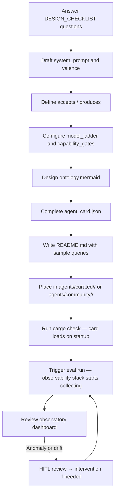

# Agent Development Templates

> **Ground truth:** `src/agent_backend/agent_card.rs`  
> **Design rationale:** `docs/AGENT_MODEL.md`  
> **Last reconciled:** 2026-05-13

---

## Quick start

1. Read [DESIGN_CHECKLIST.md](./DESIGN_CHECKLIST.md) — answer all questions before touching JSON
2. Copy and fill [agent_card.json](./agent_card.json)
3. Study a worked [example](./examples/) close to your domain
4. Read [GETTING_STARTED.md](./GETTING_STARTED.md) for a step-by-step walkthrough

---

## What is an ABW agent?

An **ABW agent** is the atomic unit of the Agent Bestiary. Concretely: a row in
the `agents` table plus an `agent_card.json` that travels with it. Every agent has:

| Component | What it encodes |
|---|---|
| **Identity** (`agent_id`, `agent_type`, `version`, `tier`) | Who this agent is |
| **Capabilities** (`executor`, `model_ladder`, `capability_gates`, `model_params`) | What it can do and at what cognitive bandwidth |
| **Persona** (`system_prompt`, `valence`) | How it thinks and collaborates |
| **Identity contract** (`accepts`, `produces`, `dependencies`) | What it takes and returns — machine-readable |
| **Ontology** (external `ontology.mermaid`) | What it learns and accumulates over time |
| **Performance** (system-managed) | How it has performed — auto-updated at runtime |

---

## File layout

```
agents/templates/
├── README.md                    — you are here
├── GETTING_STARTED.md           — step-by-step tutorial (beginner)
├── DESIGN_CHECKLIST.md          — planning checklist (all levels)
├── PROMPT_ENGINEERING_GUIDE.md  — AI prompts to generate agent designs
├── agent_card.json              — fully documented template
└── examples/
    ├── sentiment_analyzer/      — LLM-only, simple (beginner)
    ├── market_research/         — LLM + MCP, market data (intermediate)
    └── risk_monitor/            — MCP-heavy, multiple APIs (advanced)
```

Each example includes a complete `agent_card.json`, `ontology.mermaid`, and `README.md`.

---

## Agent types

### By executor

| Executor | When to use | Runtime behaviour |
|---|---|---|
| `llm` | Analysis, reasoning, generation — no live data needed | Routes to `MultiModelExecutor` |
| `mcp` | Live APIs, databases, web tools | Routes to `ToolExecutor` via MCP servers |
| `manual` | Human-in-the-loop for rare high-stakes events | Queues for human response |
| `skill` | Multi-step orchestration workflows | Runs staged `WorkflowTemplate` |

### By tier

| Tier | Who creates it | Trust level |
|---|---|---|
| `curated` | Fermi team, formally reviewed | Maximum — used in platform defaults |
| `community` | Any authenticated user | Standard — user-owned |
| `system` | Infrastructure, internal only | Infrastructure — no `owner_id` |

---

## The cognition economy (ADR-011)

Agents serve users at three tiers: `free`, `standard`, `premium`. The
**model ladder** (`capabilities.model_ladder`) maps each tier to a specific
`(provider, model)` pair. When a request arrives with a cognition tier, the
runtime picks the highest rung whose tier ≤ the request's tier and uses that
model — same prompt, same persona, different cognitive bandwidth.

**Capability gates** (`capabilities.capability_gates`) layer on top: a gate like
`{ "deep_reasoning": "premium" }` means free-tier users can invoke the agent but
the `deep_reasoning` capability returns a graceful "not available at your tier"
message instead of silently degrading or failing.

```json
"model_ladder": [
  { "tier": "free",     "provider": "anthropic", "model": "claude-haiku-4-5-20251001" },
  { "tier": "standard", "provider": "anthropic", "model": "claude-sonnet-4-5" },
  { "tier": "premium",  "provider": "anthropic", "model": "claude-opus-4" }
],
"capability_gates": {
  "deep_reasoning": "premium"
}
```

---

## Valence — the affective signature

`metadata.valence` is a first-class field, not a system-prompt decoration. It
encodes the agent's emotional register and personality:

```json
"valence": {
  "primary_affect": "analytical",
  "arousal": 0.4,
  "valence": 0.7,
  "personality_traits": ["precise", "evidence-driven", "collaborative"]
}
```

| Field | Range | Meaning |
|---|---|---|
| `primary_affect` | enum | `alignment` · `curious` · `vigilant` · `analytical` · `diplomatic` · `integrative` |
| `arousal` | 0.0–1.0 | 0.0 calm/deliberate → 1.0 urgent/reactive |
| `valence` | 0.0–1.0 | 0.0 critical/challenging → 1.0 constructive/affirming |
| `personality_traits` | string[] | Adjectives shaping collaboration style |

In multi-agent compositions, **valence diversity matters as much as skill
diversity**. An echo chamber of analytical agents won't surface the same
things as a mix of analytical, diplomatic, and integrative ones.

---

## The identity contract

`accepts`, `produces`, and `dependencies` are the machine-readable projection of
what the system prompt declares. Every other surface (composition planner, eval
framework, xamanEK discovery, marketplace) reasons about this agent using these
fields — not by parsing the prompt.

```json
"accepts": ["evidence-set", "forecast-question"],
"produces": ["multiplier-suggestion", "forecast-adjustment"],
"dependencies": {
  "required": ["base_rate_agent"],
  "optional": ["news_monitor"]
}
```

Write these fields with the precision of an API contract. If the system prompt
changes, update these fields to match.

---

## Agent development workflow



---

## Observability and the improvement loop

From the first eval run, the observability stack collects signals on every
execution. Understanding this at design time makes agents more maintainable:

- **Persona drift** is measured by comparing embedding means across
  `persona_version` boundaries. Each time you edit the system prompt (or an
  agent-wide HITL intervention is approved), `persona_version` increments and
  a new drift baseline begins.

- **Dyad state** (rapport, trust, reciprocity) accumulates per
  `(agent_id, user_id)` pair. Agents with consistent, specific personas produce
  more meaningful dyad signals.

- **Anomaly events** fire on drift, repeated evaluator conflicts, social
  ruptures, and safety flags. These appear in the HITL review queue
  (`/observatory/hitl`).

- **Capability gate for drift threshold**: agents expected to evolve rapidly
  (e.g. fresh community agents under active development) should set a looser
  threshold in `capability_gates`:
  ```json
  "capability_gates": { "drift_threshold": 0.35 }
  ```
  The platform default is `0.20`.

---

## Common pitfalls

| Pitfall | Wrong | Right |
|---|---|---|
| Scope too broad | "Analyzes everything about tech" | "Tracks AMD datacenter GPU market share" |
| Generic persona | "You are a helpful assistant" | Named agent, specific domain, explicit output contract |
| Valence omitted | `"valence": null` | Filled deliberately to shape collaboration |
| No model ladder | Only `model` field set | At minimum one `free` rung |
| `accepts`/`produces` left empty | `[]` | Specific typed I/O contract |
| sample_queries too vague | "What is market share?" | "What is AMD's Q1 2026 datacenter GPU market share, and how has it trended over the last four quarters?" |

---

## Resources

| Document | What it covers |
|---|---|
| `docs/AGENT_MODEL.md` | Authoritative conceptual model — every field explained |
| `docs/COMPOSITION_AS_FIRST_CLASS.md` | Compound agents, strategists, dual RSI loops |
| `docs/architecture/OBSERVABILITY_ARCHITECTURE_SPEC.md` | Full observability stack reference |
| `docs/architecture/OBSERVABILITY_LOGICAL_ARCHITECTURE.md` | Logical diagrams of the observability system |
| `agents/templates/DESIGN_CHECKLIST.md` | Step-by-step planning guide |
| `agents/templates/GETTING_STARTED.md` | 30-minute tutorial |
| `agents/templates/examples/` | Three complete worked examples |
