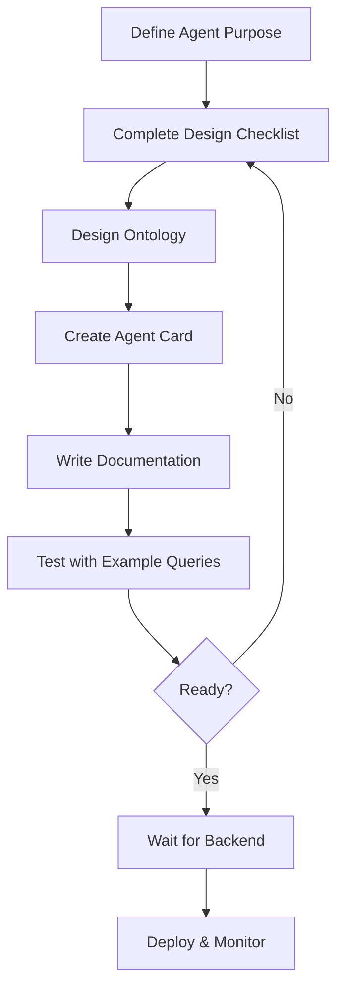

# Fermi Agent Development Templates

Welcome to the Fermi Agent Bestiary! This directory contains everything you need to design and develop your own forecasting agents optimized for the Fermi Active Dreaming Memory (ADM) platform.

## 🚀 Quick Start

**New to agent development?** Start here:

1. Read [GETTING_STARTED.md](./GETTING_STARTED.md) for step-by-step instructions
2. Review [DESIGN_CHECKLIST.md](./DESIGN_CHECKLIST.md) to plan your agent
3. Study [example agents](./examples/) to see complete implementations
4. Copy [agent_card.json](./agent_card.json) template to start building

## 📁 What's Inside

```
agents/templates/
├── README.md                    # You are here
├── GETTING_STARTED.md           # Step-by-step tutorial for first agent
├── DESIGN_CHECKLIST.md          # 10-step planning guide
├── PROMPT_ENGINEERING_GUIDE.md  # AI prompts to generate agent designs
├── agent_card.json              # Fully documented template
└── examples/
    ├── market_research/         # Example: LLM + MCP, market data analysis
    ├── sentiment_analyzer/      # Example: LLM-only, simple sentiment classification
    └── risk_monitor/            # Example: MCP-heavy, security risk assessment
```

## 🎯 What is a Fermi Agent?

A **Fermi agent** is an AI-powered research specialist that:

1. **Gathers evidence** from APIs, databases, web sources, or LLM analysis
2. **Builds ontologies** encoding its evolving worldview as versioned ER diagrams
3. **Provides forecasts** with confidence scores and justifications
4. **Learns over time** through episodic → semantic memory consolidation

### Key Characteristics

- **Specialized:** Each agent focuses on one domain (markets, sentiment, risks, etc.)
- **Evidence-based:** All claims backed by sources and confidence scores
- **Self-aware:** Tracks its own performance and uncertainty
- **Compositional:** Agents combine to form comprehensive forecasting systems

## 📚 Documentation

### Core Guides

- **[GETTING_STARTED.md](./GETTING_STARTED.md)** - Your first agent in 30 minutes
- **[DESIGN_CHECKLIST.md](./DESIGN_CHECKLIST.md)** - 10 questions to answer before building
- **[PROMPT_ENGINEERING_GUIDE.md](./PROMPT_ENGINEERING_GUIDE.md)** - AI prompts for agent generation (NEW!)
- **[Agent Card Specification](../../docs/guides/AGENT_CARD_SPECIFICATION.md)** - Complete JSON schema reference
- **[ADM Architecture](../../docs/ARCHITECTURE_ADM.md)** - How memory consolidation works
- **[Agent Bestiary Design](../../docs/AGENT_BESTIARY_DESIGN.md)** - System overview and philosophy

### Example Agents

Each example includes:
- ✅ Complete `agent_card.json`
- ✅ Ontology ER diagram (`ontology.mermaid`)
- ✅ Full documentation (`README.md`)
- ✅ Usage examples and performance metrics

#### 1. [Market Research Agent](./examples/market_research/)
- **Type:** Market Analysis
- **Executor:** LLM + MCP (Yahoo Finance, SEC API)
- **Use Case:** Track AMD's datacenter GPU market share
- **Complexity:** ⭐⭐⭐ (Medium - requires API integration)

#### 2. [Sentiment Analyzer Agent](./examples/sentiment_analyzer/)
- **Type:** Sentiment Classification
- **Executor:** LLM-only (Claude Haiku)
- **Use Case:** Analyze text sentiment (product reviews, social media)
- **Complexity:** ⭐ (Simple - great for beginners)

#### 3. [Risk Monitor Agent](./examples/risk_monitor/)
- **Type:** Security Risk Assessment
- **Executor:** MCP-heavy (NVD, MITRE ATT&CK, GitHub)
- **Use Case:** CVE vulnerability tracking and threat intelligence
- **Complexity:** ⭐⭐⭐⭐ (Advanced - multiple APIs, complex ontology)

## 🛠️ Development Workflow



### Current Status: ⏳ Pre-Runtime

**You can do NOW:**
- ✅ Design agent cards
- ✅ Plan ontologies
- ✅ Write documentation
- ✅ Define test queries

**Coming soon:**
- ⏳ Agent execution runtime
- ⏳ Ontology versioning system
- ⏳ Memory consolidation pipeline
- ⏳ Performance monitoring dashboard

## 🎨 Agent Types

### By Executor

| Type | Description | When to Use | Example |
|------|-------------|-------------|---------|
| **LLM** | AI model analyzes/generates | Analysis, reasoning, text generation | Sentiment Analyzer |
| **MCP** | Calls external APIs/tools | Structured data, real-time info | Market Research |
| **Manual** | Human-in-the-loop | Rare events, expert judgment | Geopolitical Analyst |
| **Skill** | Complex workflows | Multi-step processes | Research Pipeline |

### By Domain

| Domain | Focus Area | Typical Questions |
|--------|-----------|-------------------|
| **Market Analysis** | Revenue, competitors, trends | "What's AMD's market share?" |
| **Sentiment** | Opinions, emotions, attitudes | "How do customers feel about X?" |
| **Risk Assessment** | Threats, vulnerabilities, impact | "What CVEs affect our stack?" |
| **Technical** | Specs, performance, capabilities | "Does AMD's MI300 support FP64?" |
| **Financial** | Revenue, costs, margins | "What's NVIDIA's datacenter revenue?" |

## 🏗️ Agent Architecture

### Agent Card Structure

```json
{
  "agent_id": "unique-uuid",
  "agent_name": "my_agent",
  "agent_type": "market_analysis",
  "version": "1.0.0",
  "tier": "specialist",
  "executor": {
    "type": "llm",           // or "mcp", "manual", "skill"
    "primary_action": "...",
    "fallback_strategy": "..."
  },
  "mcp_servers": [...],      // External APIs/tools
  "llm_config": {...},       // Model, temperature, prompt
  "ontology": {...},         // Entity-relationship schema
  "performance": {...}       // Accuracy, confidence, speed
}
```

### Ontology Evolution

Agents learn through **Active Dreaming Memory (ADM)**:

1. **Episodic Memory:** Raw observations stored with timestamps
2. **Consolidation:** LLM extracts semantic rules from episodes
3. **Semantic Memory:** Persistent knowledge graph (ER diagram)
4. **Versioning:** Git-like versioning tracks ontology evolution

Example: Market Research Agent

```
Episode: "AMD announced MI300X with 192GB HBM3"
         ↓ (consolidation)
Rule: "AMD's MI300X uses HBM3 memory technology"
         ↓ (integration)
Ontology: PRODUCT(MI300X) --uses--> TECHNOLOGY(HBM3)
```

## 🧪 Testing Your Agent

### Before Runtime Available

**Design validation:**
1. Write 5-10 example queries your agent should answer
2. Document expected outputs with confidence scores
3. Identify potential failure modes
4. Plan fallback strategies

**Peer review:**
- Share agent card with team
- Get feedback on ontology design
- Validate data source availability
- Confirm API access and rate limits

### After Runtime Available

**Execution testing:**
1. Run agent with test queries
2. Validate output structure and confidence
3. Monitor execution time and cost
4. Review generated ontology
5. Test error handling and fallbacks

## 🚨 Common Pitfalls

### 1. Overly Broad Scope
❌ "Agent that analyzes everything about tech companies"  
✅ "Agent that tracks AMD's datacenter GPU market share"

### 2. Undefined Success Criteria
❌ "Agent provides insights"  
✅ "Agent achieves >85% accuracy, <5s response time, <$0.10/query"

### 3. Missing Error Handling
❌ Agent crashes when API is down  
✅ Agent degrades gracefully, flags low confidence, queues retry

### 4. No Confidence Scoring
❌ "AMD has 25% market share"  
✅ "AMD has 25% market share (confidence: 0.82, source: Mercury Research Q3 2024)"

### 5. Ontology Over-Engineering
❌ 500 entity types for simple sentiment analysis  
✅ 5-10 core entities that cover 80% of use cases

## 🎓 Learning Resources

### Recommended Reading Order

1. **Start:** [GETTING_STARTED.md](./GETTING_STARTED.md)
2. **Plan:** [DESIGN_CHECKLIST.md](./DESIGN_CHECKLIST.md)
3. **Study:** Example agents in [examples/](./examples/)
4. **Deep Dive:** [Agent Card Specification](../../docs/guides/AGENT_CARD_SPECIFICATION.md)
5. **Theory:** [ADM Architecture](../../docs/ARCHITECTURE_ADM.md)

### External Resources

- **Mermaid ER Diagrams:** https://mermaid.js.org/syntax/entityRelationshipDiagram.html
- **MCP Specification:** https://modelcontextprotocol.io/
- **JSON Schema:** https://json-schema.org/
- **Claude API:** https://docs.anthropic.com/

## 🤝 Contributing

### Adding Your Agent

Once the runtime is available:

1. Complete agent card, ontology, and README
2. Test with at least 10 diverse queries
3. Document performance metrics
4. Submit PR with agent in `agents/bestiary/<your_agent>/`

### Improving Templates

Found an issue or have a suggestion?

- File an issue in the repository
- Submit a PR with improvements
- Share feedback with the Fermi team

## 💡 Best Practices

### Agent Design

- **Single Responsibility:** One agent, one domain
- **Evidence-Based:** Always cite sources and provide confidence
- **Graceful Degradation:** Handle errors elegantly
- **Semantic Clarity:** Clear naming, well-documented fields
- **Version Everything:** Track ontology and agent card changes

### Ontology Design

- **Start Simple:** 5-10 entities, add more as needed
- **Normalize Relationships:** Avoid redundant connections
- **Use Standard Types:** Company, Person, Product, Technology, etc.
- **Document Cardinality:** One-to-one, one-to-many, many-to-many
- **Plan for Growth:** Ontologies evolve, design for extensibility

### Performance Optimization

- **Choose Right Model:**
  - Haiku: Fast, cheap, simple tasks
  - Sonnet: Balanced, most use cases
  - Opus: Complex reasoning, expensive
- **Temperature Tuning:**
  - 0.0-0.3: Facts, structured data
  - 0.4-0.7: Analysis, reasoning
  - 0.7-1.0: Creative tasks (rarely needed)
- **Caching:** Cache API responses, reuse semantic memory
- **Rate Limits:** Respect API limits, implement backoff

## 📞 Getting Help

### Questions?

- **Documentation:** Check [docs/](../../docs/) first
- **Examples:** Study the three example agents
- **Community:** Ask in project discussions
- **Team:** Contact Fermi development team

### Issues?

- **Template bugs:** File issue with "template" label
- **Documentation unclear:** File issue with "docs" label
- **Feature request:** File issue with "enhancement" label

## 🗺️ Roadmap

### Phase 1: Templates (Current - Complete! ✅)
- ✅ Agent card template
- ✅ Design checklist
- ✅ Example agents
- ✅ Documentation

### Phase 2: Runtime (In Progress)
- ⏳ Agent executor implementation
- ⏳ MCP server integration
- ⏳ LLM provider abstraction
- ⏳ Error handling framework

### Phase 3: Memory System
- ⏳ Episodic memory storage (PostgreSQL + pgvector)
- ⏳ Semantic memory consolidation
- ⏳ Ontology versioning (Git-like)
- ⏳ Vector similarity search

### Phase 4: Observability
- ⏳ Performance monitoring
- ⏳ Confidence calibration
- ⏳ Execution logging
- ⏳ Cost tracking

### Phase 5: Collaboration
- ⏳ Agent composition
- ⏳ Evidence aggregation
- ⏳ Confidence propagation
- ⏳ Multi-agent forecasting

## 🎉 You're Ready!

You now have everything you need to design world-class Fermi agents. Start with [GETTING_STARTED.md](./GETTING_STARTED.md) and build your first agent!

**Remember:**
- Start simple, iterate
- Evidence-based always
- Document everything
- Test thoroughly
- Have fun! 🚀

---

**Questions?** Contact the Fermi team or check the [documentation](../../docs/).

**Ready to build?** See [GETTING_STARTED.md](./GETTING_STARTED.md)!

**Last Updated:** 2026-02-07
