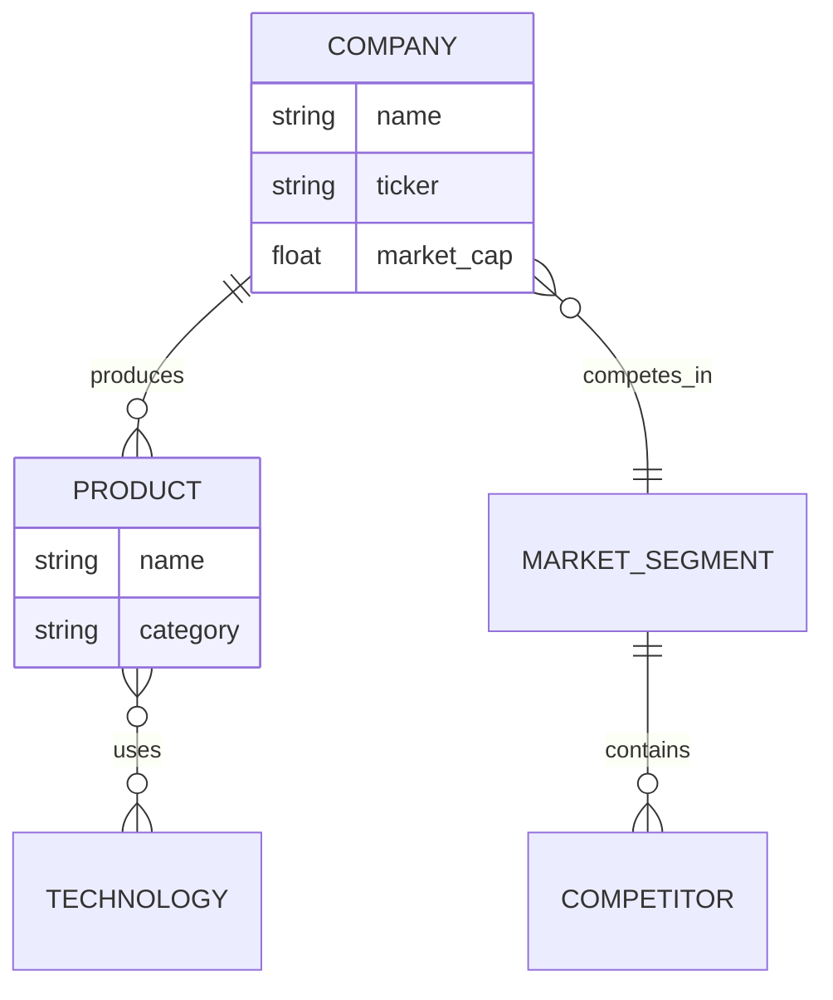
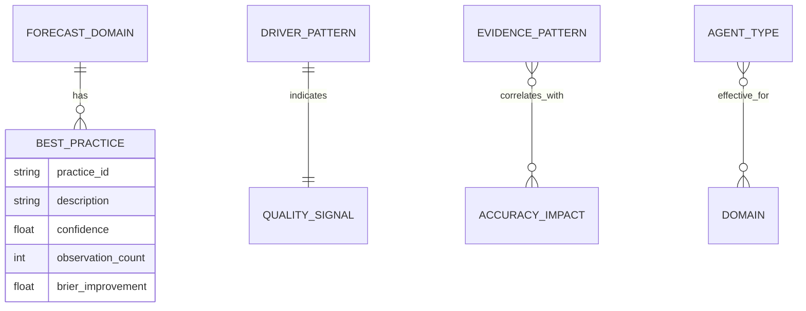
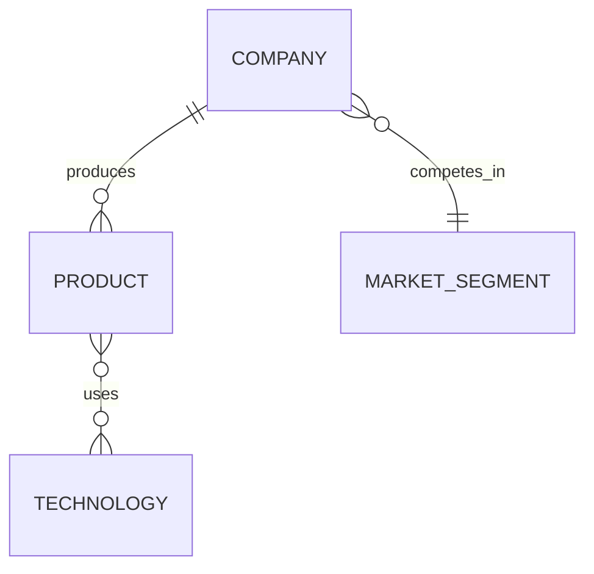

# Agent Bestiary Design Document

**Status:** Approved Design  
**Date:** 2026-02-05  
**Version:** 1.0  

This document captures the complete design for the Fermi Agent Bestiary system, integrating concepts from Agent-OM research and the ElizaOS worldview plugin into a production-ready Rust implementation.

---

## Executive Summary

The Agent Bestiary transforms Fermi from a static forecasting tool into a living ecosystem where:
- **Agents** autonomously research, analyze, and generate evidence
- **Ontologies** capture each agent's unique perspective (not global truth)
- **Humans and agents collaborate** on forecasts through bidirectional evidence flow
- **Agents learn** what makes forecasts better (Fermi's meta-learning)
- **Everything is version-controlled** (git-based time travel for ontology evolution)

---

## Core Philosophy

### 1. **Lightweight Over Formalism**
- ✅ Mermaid ER diagrams (human-readable, git-diffable)
- ❌ Heavy ontology formats (OWL, RDF) unless needed
- Philosophy: REST/RSS pragmatism over SOAP/XML complexity

### 2. **Ontologies as Perspectives, Not Truth**
- Each agent has its own ontology (explicit codified perspective)
- Agents construct shared meanings through probabilistic vectors
- No global "truth" imposed - trust emergence

### 3. **Human-Agent Collaboration**
- **Bidirectional flow:**
  - Human adds evidence → Agent interprets → Agent suggests forecast updates
  - Agent identifies gap → Requests from human → Human provides
  - Agent identifies gap → Requests from other agent → Other agent provides (future AKP)

### 4. **Git-Based Time Travel (Spacetime Worms)**
- Every ontology change = git commit
- Every forecast update = git commit (NO OPT-OUT)
- **Forecasts are spacetime worms:** They evolve over time, we MUST track this
- Full history of agent learning AND forecast evolution
- Revert bad learning, analyze patterns
- Track correlation: ontology evolution → Brier score improvements
- Track correlation: agent updates → forecast accuracy changes

### 5. **Modular Architecture**
- Don't drown in complexity
- Clean boundaries, incremental delivery
- Each component can evolve independently

---

## System Architecture

### **High-Level Components**

```
┌─────────────────────────────────────────────────────────┐
│                    FERMI ECOSYSTEM                      │
├─────────────────────────────────────────────────────────┤
│                                                         │
│  ┌──────────────────────────────────────────────────┐  │
│  │  1. FERMI CORE (Existing - Rust)                │  │
│  │     - Lexer, Parser, AST                        │  │
│  │     - Semantic Analyzer                         │  │
│  │     - Executor (Monte Carlo)                    │  │
│  │     - CLI                                       │  │
│  └──────────────────────────────────────────────────┘  │
│                        ↑                                │
│  ┌──────────────────────────────────────────────────┐  │
│  │  2. FERMI MCP SERVER (New - Rust)               │  │
│  │     - MCP protocol handler                      │  │
│  │     - Tool implementations                      │  │
│  │     - Zed integration                           │  │
│  └──────────────────────────────────────────────────┘  │
│                        ↕ REST/gRPC                      │
│  ┌──────────────────────────────────────────────────┐  │
│  │  3. AGENT BACKEND (New - Rust)                  │  │
│  │     - Agent Registry & Cards                    │  │
│  │     - Ontology Manager                          │  │
│  │     - Executor Engine                           │  │
│  │     - Scheduler (FPL + Agent-internal)          │  │
│  │     - Vector Store (foundation for AKP)         │  │
│  └──────────────────────────────────────────────────┘  │
│                                                         │
│  ┌──────────────────────────────────────────────────┐  │
│  │  4. ZED EXTENSION (Existing)                    │  │
│  │     - Syntax highlighting                       │  │
│  │     - LSP integration                           │  │
│  │     - Calls Fermi MCP Server                    │  │
│  └──────────────────────────────────────────────────┘  │
│                                                         │
└─────────────────────────────────────────────────────────┘
```

### **Technology Stack**

| Component | Technology | Rationale |
|-----------|-----------|-----------|
| Fermi Core | Rust | Performance, type safety, existing codebase |
| Fermi MCP Server | Rust | Reuse parser, type safety, performance |
| Agent Backend | Rust | Consistent stack, mature LLM ecosystem |
| Communication | REST → gRPC | Start simple, upgrade for streaming |
| Vector DB | Qdrant | Excellent Rust client, performance |
| Ontology Storage | Mermaid + Git | Human-readable, version-controlled |

---

## FPL Agent Declaration

### **Syntax**

```fpl
agent market_research {
    type: "research"                    # Agent type (research|sentiment|competitive|etc)
    query: "AMD market share trends"    # What agent researches
    executor: "llm"                     # llm | mcp | manual | skill
    schedule: every 1 week              # When to run
    driver_refs: ["market_share"]       # Which drivers this supports
    depends_on: ["sentiment_analyzer"]  # Agent dependencies
    confidence_threshold: 0.75          # Minimum confidence to accept evidence
}
```

### **Agent Types (Generalizable)**

```rust
pub enum AgentType {
    Research,        // General research/data gathering
    Sentiment,       // Sentiment analysis (social, news, reviews)
    Competitive,     // Competitive analysis (compare entities)
    Market,          // Market/trend monitoring
    Technical,       // Technical indicator analysis
    Risk,            // Risk assessment and monitoring
    Scenario,        // Scenario planning
    Validator,       // Cross-check other forecasts
    Synthesizer,     // Combine multiple sources
    Custom(String),  // User-defined types
}
```

### **Executor Types**

```rust
pub enum ExecutorType {
    LLM,     // Priority 1: Call LLM with query
    Manual,  // Priority 2: Human-in-the-loop
    MCP,     // Priority 3: Call MCP tools
    Skill,   // Priority 4: Invoke Anthropic skills
}
```

**Implementation Priority:**
1. **LLM** - Foundational, high value
2. **Manual** - Human-agent collaboration
3. **MCP** - Tool integration (despite noise, practical value)
4. **Skill** - More meaningful but needs more design

### **Key Design Decisions**

**FPL declares INTENT, not implementation:**
- ❌ FPL does NOT specify which MCP tools, credentials, model versions
- ✅ FPL declares: "I need a research agent with LLM executor"
- ✅ Agent Backend handles: Which LLM, which tools, how to execute

**Loose Coupling:**
- Agent capabilities live in backend (agent cards)
- FPL references agents by name/type
- Backend routes to appropriate executor

---

## Agent Backend Architecture

### **Component Breakdown**

```
fermi-agent-backend/
├── registry/           # Agent cards, capability discovery
├── ontology/           # Mermaid ER storage, evolution, git integration
├── executors/          # Pluggable execution (LLM, MCP, Manual, Skill)
├── scheduler/          # FPL-triggered + Agent-internal scheduling
├── vectors/            # Embeddings, similarity search (AKP foundation)
└── api/                # REST (now) + gRPC (future)
```

### **3a. Agent Registry**

**Agent Card Structure:**

```json
{
  "agent_id": "market_research",
  "agent_type": "research",
  "version": "1.2.0",
  "tier": "curated",
  "capabilities": {
    "executor": "llm",
    "mcp_tools": ["yahoo_finance", "sec_api"],
    "skills": ["data_analysis"],
    "model": "claude-sonnet-4",
    "temperature": 0.3
  },
  "performance": {
    "forecasts_contributed": 47,
    "avg_brier_impact": 0.04,
    "avg_confidence": 0.82,
    "accuracy_rate": 0.89
  },
  "ontology_stats": {
    "entities": 23,
    "relationships": 18,
    "last_updated": "2026-02-05T12:00:00Z",
    "evolution_commits": 15
  },
  "metadata": {
    "created": "2025-12-01",
    "author": "Fermi Team",
    "description": "Researches market trends and competitive dynamics",
    "tags": ["market", "research", "competitive-analysis"]
  }
}
```

**Two-Tier System:**
1. **Curated agents** (by Fermi team) - Higher trust, quality-assured
2. **Community agents** (user-contributed) - Registry with reputation system (future)

### **3b. Ontology Manager**

**Per-Agent Ontology Storage:**

```
agents/
  curated/
    market_research/
      agent_card.json
      ontology.mermaid        # Agent's perspective
      performance.json
    sentiment_analyzer/
      agent_card.json
      ontology.mermaid        # Different perspective
    fermi/
      agent_card.json
      meta_ontology.mermaid   # Fermi's meta-learning
```

**Ontology Structure (Mermaid ER):**



**Semantic Cardinality (from worldview plugin):**

| Cardinality | Symbol | Meaning | Example |
|-------------|--------|---------|---------|
| OneToOne | `\|\|--\|\|` | Equivalence, identity | USER \|\|--\|\| PROFILE |
| OneToMany | `\|\|--o{` | Composition, ownership | COMPANY \|\|--o{ PRODUCT |
| ManyToOne | `}o--\|\|` | Attribution, categorization | PRODUCT }o--\|\| CATEGORY |
| ManyToMany | `}o--o{` | Association | PRODUCT }o--o{ TECHNOLOGY |

**Git-Based Evolution:**

Every ontology update = automatic git commit:

```bash
git commit -m "agent(market_research): learned AMD competes with NVIDIA

- Entity: NVIDIA (type: COMPETITOR)
- Relationship: AMD }o--|| GPU_MARKET : competes_in
- Confidence: 0.85
- Evidence: market_scan_2026_02_05
- Brier impact: +0.03"
```

**Benefits:**
- Full history of what agent learned and when
- Revert bad learning
- Analyze learning patterns
- Track correlation: ontology changes → Brier score improvements

### **3c. Executor Engine**

**Trait-Based Design:**

```rust
pub trait AgentExecutor: Send + Sync {
    fn execute(
        &self,
        agent: &AgentStmt,
        context: &ExecutionContext,
    ) -> Result<AgentOutput, ExecutionError>;
    
    fn supports_type(&self, agent_type: &AgentType) -> bool;
    fn name(&self) -> &str;
}

pub struct ExecutionContext {
    pub program: Program,
    pub current_evidence: Vec<EvidenceStmt>,
    pub current_drivers: Vec<DriverStmt>,
    pub previous_runs: Vec<AgentOutput>,
    pub agent_card: AgentCard,
}
```

**Executor Implementations:**

1. **LLMExecutor** (Priority 1)
   - Calls LLM API (Anthropic Claude)
   - Structured prompt with forecast context
   - Parses response into evidence

2. **ManualExecutor** (Priority 2)
   - Creates request for human
   - Queues in UI/CLI
   - Human provides evidence
   - Agent interprets and suggests impact

3. **MCPExecutor** (Priority 3)
   - Routes to appropriate MCP tools
   - Calls external services (APIs, databases, scrapers)
   - Structures results as evidence

4. **SkillExecutor** (Priority 4)
   - Invokes Anthropic skills
   - Higher-level composed workflows
   - (Design TBD - learn from MCP patterns)

**Agent Output Structure:**

```rust
pub struct AgentOutput {
    pub agent_name: String,
    pub agent_type: AgentType,
    pub timestamp: DateTime<Utc>,
    pub status: AgentStatus,
    pub evidence: Vec<EvidenceStmt>,
    pub ontology_updates: Vec<OntologyUpdate>,  // Agent can update its worldview
    pub confidence: f64,
    pub sources_consulted: Vec<String>,
    pub execution_time_ms: u64,
    pub cost_estimate: Option<f64>,
    pub metadata: AgentMetadata,
}

pub struct OntologyUpdate {
    pub entity_id: Option<String>,
    pub update_type: UpdateType,  // AddEntity, UpdateEntity, AddRelationship
    pub attributes: HashMap<String, String>,
    pub confidence: f64,
    pub reasoning: String,
}
```

### **3d. Scheduler**

**Two Types of Scheduling:**

**1. FPL-Triggered Scheduling** (for forecasting tasks)
```rust
pub struct FPLSchedule {
    pub agent_name: String,
    pub forecast_file: String,
    pub schedule: Schedule,  // every 1 week
    pub next_run: DateTime<Utc>,
}
```

**2. Agent-Internal Scheduling** (for learning/maintenance)
```rust
pub struct AgentSchedule {
    pub agent_name: String,
    pub tasks: Vec<ScheduledTask>,
}

pub struct ScheduledTask {
    pub task_type: TaskType,  // ProcessMemories, UpdateVectors, EvolveOntology
    pub schedule: String,     // "daily 2am", "weekly sunday"
    pub last_run: Option<DateTime<Utc>>,
}
```

**Why Two Types:**
- FPL schedule: "Run agent weekly FOR THIS FORECAST"
- Agent schedule: "Agent processes its experiences daily, updates embeddings"
- Different concerns, both needed

**Dependency Resolution:**
- Topological sort based on `depends_on` field
- Agent A runs before Agent B if B depends on A
- Circular dependency detection in semantic analysis

### **3e. Vector Store**

**Foundation for Future AKP (Agent Knowledge Protocol):**

```rust
pub struct VectorStore {
    // Per-agent embeddings
    pub fn add_embedding(&self, agent_id: &str, entity_id: &str, embedding: Vec<f64>);
    pub fn search_similar(&self, agent_id: &str, query: Vec<f64>, top_k: usize) -> Vec<Match>;
    
    // Cross-agent similarity (for AKP alignment)
    pub fn find_equivalent_entities(&self, source_agent: &str, target_agent: &str) 
        -> Vec<(String, String, f64)>;
}
```

**Deferred to Phase 4+ (AKP):**
- Cross-agent ontology alignment
- Shared meaning construction
- Agent-to-agent knowledge transfer
- "Agent University" (agents teaching each other)

---

## Fermi's Special Role

### **Fermi as an Agent**

**Key Insight:** Fermi itself is an agent with a worldview!

**Fermi's Ontology ≠ FPL Grammar:**
- ❌ Grammar (BNF) defines syntax (Driver, Model, Question - static)
- ✅ Ontology defines **meta-knowledge about forecasting excellence**

**What Fermi Learns:**



**Examples of What Fermi Learns:**
- "Tech forecasts benefit from sentiment analysis" (practice)
- "High base_rate divergence → require more evidence" (quality signal)
- "Sentiment agents improve Brier scores by 0.04 in tech forecasts" (pattern)
- "Market research agents effective for financial forecasts" (domain matching)

**Fermi's Meta-Learning Loop:**
```
Forecast executed → Track which practices used → Measure Brier score →
Update meta-ontology → Recommend practices for similar forecasts
```

**Storage:**
```
agents/fermi/
  meta_ontology.mermaid    # Fermi's learned best practices
  performance.json         # Aggregate Brier scores by practice
```

---

## Git Strategy

### **Repository Structure: Monorepo**

**Decision:** Single repository for all components + agent data

```
fermi/                              # Single monorepo
├── .git/
├── Cargo.toml                      # Workspace
├── fermi-core/                     # Crate 1
├── fermi-mcp/                      # Crate 2
├── fermi-agent-backend/            # Crate 3
├── extensions/fermi/               # Zed extension
├── agents/                         # Version-controlled agent data
│   ├── curated/                    # Curated agents (protected branch)
│   │   ├── market_research/
│   │   │   ├── agent_card.json
│   │   │   ├── ontology.mermaid
│   │   │   └── performance.json
│   │   └── fermi/
│   │       ├── agent_card.json
│   │       └── meta_ontology.mermaid
│   └── community/                  # User-contributed (future)
├── forecasts/                      # Example forecasts (version controlled)
│   └── examples/
│       └── amd_forecast.fpl
├── examples/
└── docs/
```

**Rationale:**
- ✅ Single git history = see ontology evolution alongside code changes
- ✅ Atomic commits across components
- ✅ Easy to track "what changed when"
- ✅ Agent ontologies naturally version controlled

### **Git-Based Version Control**

**1. Ontology Evolution (Automated Commits)**

```rust
impl OntologyManager {
    pub fn commit_changes(&self, agent_name: &str, update: &OntologyUpdate) -> Result<()> {
        // Write updated ontology.mermaid
        self.write_ontology(agent_name, &update.ontology)?;
        
        // Git add
        Command::new("git")
            .args(&["add", &format!("agents/curated/{}/ontology.mermaid", agent_name)])
            .output()?;
        
        // Detailed commit message
        let message = format!(
            "agent({}): {}\n\n- Confidence: {}\n- Source: {}\n- Brier impact: {:+.2}",
            agent_name,
            update.description,
            update.confidence,
            update.source,
            update.brier_impact
        );
        
        Command::new("git")
            .args(&["commit", "-m", &message])
            .output()?;
        
        Ok(())
    }
}
```

**Time Travel:**
```bash
# View ontology at any point
git log --follow agents/curated/market_research/ontology.mermaid

# Restore previous version
git checkout <commit> agents/curated/market_research/ontology.mermaid

# Diff ontologies
git diff HEAD~5 agents/curated/market_research/ontology.mermaid

# See what agent learned this week
git log --since="1 week ago" --grep="agent(market_research)"
```

**2. Forecast Storage (Git - MANDATORY)**

**Decision:** ALL forecasts MUST be version-controlled (NO OPT-OUT)

**Why:** Forecasts are **spacetime worms** - they evolve over time as agents add evidence, update drivers, and refine estimates. We MUST track this evolution.

```
forecasts/
  production/
    amd_forecast.fpl              # Current state (includes evidence inline)
  history/                        # Optional: Automatic snapshots
    amd_forecast_2026_02_01.fpl
    amd_forecast_2026_02_05.fpl
```

**Benefits:**
- ✅ Full audit trail of forecast evolution
- ✅ Every agent action traceable
- ✅ See exactly when evidence was added
- ✅ Track which agents contributed what
- ✅ Correlate agent updates with Brier score changes
- ✅ Revert bad agent suggestions
- ✅ Analyze: "What made this forecast better?"
- ✅ Human-readable diffs
- ✅ Collaboration-ready (teams can share forecast repos)

**Automated Forecast Commits:**

Every time an agent updates a forecast, the system automatically commits:

```rust
impl ForecastManager {
    pub fn update_forecast(
        &self,
        forecast_path: &Path,
        agent_output: &AgentOutput,
    ) -> Result<()> {
        // 1. Parse current forecast
        let mut forecast = self.parse_forecast(forecast_path)?;
        
        // 2. Apply agent updates
        self.apply_agent_output(&mut forecast, agent_output)?;
        
        // 3. Write updated forecast
        self.write_forecast(forecast_path, &forecast)?;
        
        // 4. Git commit (AUTOMATIC, NO OPT-OUT)
        self.commit_forecast_update(forecast_path, agent_output)?;
        
        Ok(())
    }
    
    fn commit_forecast_update(
        &self,
        forecast_path: &Path,
        agent_output: &AgentOutput,
    ) -> Result<()> {
        // Git add
        Command::new("git")
            .args(&["add", forecast_path.to_str().unwrap()])
            .output()?;
        
        // Detailed commit message
        let message = format!(
            "agent({}): updated {}\n\n\
             Evidence added:\n- {} (confidence: {:.2})\n\n\
             Driver updates:\n- {}: {:.2} → {:.2}\n\n\
             Brier impact: {:+.3}\n\n\
             Timestamp: {}",
            agent_output.agent_name,
            forecast_path.file_stem().unwrap().to_str().unwrap(),
            agent_output.evidence[0].id,
            agent_output.confidence,
            // ... (build full message)
        );
        
        Command::new("git")
            .args(&["commit", "-m", &message])
            .output()?;
        
        Ok(())
    }
}
```

**Example commit:**
```bash
git commit -m "agent(market_research): updated amd_forecast

Evidence added:
- market_scan_2026_02_05 (confidence: 0.85)

Driver updates:
- market_share: 0.18 → 0.22 (+0.04)
  Reasoning: AMD Q4 earnings showed 22% datacenter GPU share

Brier score change: +0.03 (improvement)

Agent: market_research
Executor: llm  
Timestamp: 2026-02-05T14:30:00Z"
```

**User Operations:**

Users don't opt out, but they can:

```bash
# View forecast evolution
git log forecasts/production/amd_forecast.fpl

# Diff versions
git diff HEAD~5 forecasts/production/amd_forecast.fpl

# Revert bad update
git revert HEAD

# Restore to 1 week ago
git checkout HEAD~7 forecasts/production/amd_forecast.fpl

# Branch for experiments
git checkout -b scenario/optimistic
```

**3. Agent Card Updates**

```bash
git commit -m "agent: market_research gained yahoo_finance MCP tool

- Added MCP tool: yahoo_finance
- Can now fetch real-time stock data
- Performance: +0.02 Brier improvement expected"
```

### **Branch Strategy**

```
main                    # Stable, deployable
├── develop             # Integration branch
│   ├── feature/agent-executor-types
│   ├── feature/mcp-server
│   └── feature/ontology-manager
└── agents-production   # Protected: Curated agent data only
```

**Agent Data Protection:**
- `agents/curated/` on protected branch
- Requires review before merging agent ontology changes
- Ensures quality of curated agents

---

## AST/Parser Modification Protocol

### **The Problem**

Every time we touch AST/Parser:
- ❌ Hover breaks
- ❌ Highlighting breaks
- ❌ Autocomplete breaks

**Root causes:**
1. Zed extension caching
2. File synchronization (grammar, LSP, parser out of sync)
3. Missing validation steps

### **The Discipline**

**Before ANY AST/Parser change:**

**1. Read Current State**
```bash
# Read ALL related files
cat src/ast.rs
cat src/parser.rs
cat src/lexer.rs
cat fermi-lsp/src/hover/keywords.rs
cat fermi-lsp/src/hover/properties.rs
cat fermi-lsp/src/completions/keywords.rs
cat fermi-lsp/src/completions/mod.rs
```

**2. Plan Synchronization**

Create checklist of EVERY file needing updates:
- [ ] `src/ast.rs` - Add/modify types
- [ ] `src/parser.rs` - Parse new fields
- [ ] `src/lexer.rs` - Add keywords (if needed)
- [ ] `src/semantic.rs` - Validate new fields
- [ ] `fermi-lsp/src/hover/keywords.rs` - Document keywords
- [ ] `fermi-lsp/src/hover/properties.rs` - Document properties
- [ ] `fermi-lsp/src/completions/keywords.rs` - Update snippets
- [ ] `fermi-lsp/src/completions/mod.rs` - Update context detection
- [ ] `extensions/fermi/grammars/fpl/grammar.js` - Update grammar (if syntax changes)
- [ ] `extensions/fermi/grammars/fpl/queries/highlights.scm` - Update highlighting

**3. Atomic Commits**

ONE logical change = ONE commit with ALL files updated

Example: "Add ExecutorType enum"
- AST: Add enum
- Parser: Parse executor field
- LSP hover: Document executor values
- LSP completions: Suggest executor values
- Test file: Add example with executor

All in ONE commit → never out of sync

**4. Validation Protocol**

After EVERY change:
```bash
# Validate synchronization
./scripts/validate-components.sh

# Rebuild extension
bash scripts/install-extension.sh

# Clear Zed cache
rm -rf ~/.cache/zed/*

# Restart Zed COMPLETELY (not just reload)
# Test:
# - Hover works on new keywords
# - Autocomplete suggests new fields
# - Syntax highlighting correct
# - No parser errors
```

**5. Test Files FIRST**

Before committing:
```bash
# Write example using new syntax
echo 'agent test { executor: "llm" }' > test_agent.fpl

# Try to parse
./target/release/fermi test_agent.fpl

# Verify error messages are clear
```

**6. NEVER proceed to next change until current change is 100% verified**

### **Phase 1 AST Changes - Detailed Plan**

**Changes needed:**
```rust
// NEW: Executor type enum
pub enum ExecutorType {
    LLM,
    MCP,
    Manual,
    Skill,
}

// MODIFY: AgentStmt
pub struct AgentStmt {
    pub name: String,
    pub agent_type: AgentType,              // EXISTS
    pub query: String,                      // EXISTS
    pub executor: ExecutorType,             // NEW
    pub schedule: Option<Schedule>,         // EXISTS
    pub driver_refs: Vec<String>,           // EXISTS but NOT PARSED yet
    pub depends_on: Vec<String>,            // NEW
    pub confidence_threshold: Option<f64>,  // NEW
}
```

**Implementation Order (Sequential, NOT parallel):**

**Change 1: Add ExecutorType enum**
- Day 1: Read all files, create detailed plan
- Day 2: Implement enum + parsing + LSP
- Day 3: Test, validate, commit (only if 100% working)

**Change 2: Parse driver_refs (already in AST)**
- Day 4: Implement parsing + validation
- Day 5: Test, validate, commit

**Change 3: Add depends_on field**
- Day 6: Implement field + parsing + validation + circular dependency detection
- Day 7: Test, validate, commit

**Change 4: Add confidence_threshold**
- Day 8: Implement field + parsing + validation
- Day 9: Test, validate, commit

**Total:** ~2 weeks for Phase 1 (being EXTREMELY careful)

---

## Beautiful Agent Cards (Future UI Feature)

### **Vision**

Agent cards in bestiary panel, leveraging Markdown report generation:

```markdown
# 🤖 Market Research Agent

**Type:** Research | **Executor:** LLM  
**Status:** ✅ Active | **Version:** 1.2.0

---

## 📊 Performance

| Metric | Value | Trend |
|--------|-------|-------|
| Forecasts Contributed | 47 | ↗️ +5 this week |
| Avg Brier Impact | +0.04 | ↗️ Improving |
| Confidence | 0.82 | → Stable |
| Accuracy | 89% | ↗️ +2% |

---

## 🧠 Knowledge Base

**Ontology Stats:**
- **23 entities** | **18 relationships**
- **Last updated:** 2 hours ago
- **Evolution commits:** 15

**Top Entities:**
- COMPANY (AMD, NVIDIA, Intel)
- MARKET_SEGMENT (Datacenter GPUs, Consumer Graphics)
- TECHNOLOGY (RDNA, CDNA, Hopper)

---

## 🎯 Capabilities

**Can Execute:**
- LLM queries (Claude Sonnet 4)
- MCP tools: `yahoo_finance`, `sec_api`
- Skills: `data_analysis`

**Best Used For:**
- Market trend analysis
- Competitive dynamics
- Revenue forecasting
- Tech sector forecasts

---

## 📈 Ontology Evolution



---

## 🔗 Recent Activity

- **2 hours ago:** Learned AMD competes with NVIDIA in datacenter
- **1 day ago:** Updated market share estimates (+0.03 confidence)
- **3 days ago:** Added entity: MI300X (AMD accelerator)

---

## 💡 Recommendations

This agent is excellent for:
- ✅ Tech company forecasts
- ✅ Market sizing questions
- ✅ Competitive positioning analysis

Pairs well with: `sentiment_analyzer`, `risk_monitor`
```

**Rendering in Zed:**
- Agent cards rendered from Markdown
- Interactive (click entity → see relationships)
- Real-time updates (agent learns → card updates)
- Beautiful, information-dense, human-friendly

---

## Future Features (Roadmap)

### **Authentication & Privacy (Not Yet Addressed)**

**Features needed:**
- User accounts (OAuth integration)
- Private forecasts (per-user, encrypted)
- Public forecasts (shared, community)
- Agent access control (which agents can user access)
- Collaboration (share forecast with team)

**Storage implications:**
```
forecasts/
  private/
    user_123/
      sensitive_forecast.fpl.enc    # Encrypted
  public/
    community/
      shared_forecast.fpl           # Public
```

**Phase:** TBD (likely Phase 6-7)

### **Agent University (AKP - Phase 9+)**

**Concept:** Agents teach each other through ontology alignment

**Like Manifold/Metaculus but for LEARNING:**
- Agents share perspectives
- Construct shared meanings
- Transfer knowledge
- Evolve collectively

**Features:**
- Cross-agent ontology alignment (Agent-OM paper)
- Agent-to-agent communication protocol
- Knowledge transfer (bootstrap new agent from experienced agent)
- Consistency checking (detect conflicting worldviews)
- Reputation system (track which agents produce better forecasts)

**Deferred until foundations are solid.**

### **Community Agents (Phase 8+)**

**Features:**
- User uploads agent card + ontology
- Registry API (browse, search, install)
- Reputation system (star rating, Brier score tracking)
- Sandboxing (run untrusted agents safely)
- Curation (promote high-quality agents to "curated" tier)

**Storage:**
```
agents/
  community/
    user_contributed/
      finance_expert_bot/
        agent_card.json
        ontology.mermaid
      sentiment_guru/
        agent_card.json
        ontology.mermaid
```

### **Advanced Scheduling (Phase 8+)**

**Features:**
- Cron expressions (AST already has variant)
- Conditional execution ("only if market volatility > 10%")
- Manual override triggers ("run agent NOW")
- Priority queue (urgent vs background tasks)

---

## Success Metrics

### **Phase 1-3 (Foundation)**
- ✅ All agent types parse correctly
- ✅ Hover/autocomplete/highlighting working
- ✅ LLM executor generates valid evidence
- ✅ Manual executor enables human-agent flow
- ✅ CLI: `fermi run-agent forecast.fpl agent_name` works

### **Phase 4-6 (Integration)**
- ✅ MCP server exposes Fermi to Zed
- ✅ Ontologies stored per-agent in git
- ✅ Fermi learns forecasting best practices
- ✅ Beautiful agent cards rendered in UI

### **Phase 7-8 (Production-Ready)**
- ✅ Scheduler automates agent execution
- ✅ MCP executor calls external tools
- ✅ Performance tracking (Brier scores)
- ✅ Git history shows ontology evolution

### **Phase 9+ (AKP)**
- ✅ Agents communicate (A2A protocol)
- ✅ Ontology alignment working
- ✅ Agent University features
- ✅ Community agent registry

---

## Technical Debt & Risks

### **Risks**

**1. Complexity**
- *Mitigation:* Modular architecture, incremental delivery, clear boundaries

**2. AST/Parser brittleness**
- *Mitigation:* Extreme discipline, validation scripts, atomic commits

**3. LLM costs**
- *Mitigation:* Caching, smaller models for validation, cost tracking

**4. Git performance (large repos)**
- *Mitigation:* Git LFS for binaries, periodic cleanup, shallow clones

**5. Zed extension caching**
- *Mitigation:* Documented cache-clearing procedure, automated tests

### **Technical Debt to Avoid**

❌ **Don't:**
- Hardcode agent capabilities in FPL
- Mix FPL syntax with execution details
- Skip validation steps to "move faster"
- Overengineer for AKP before foundations work
- Let files get out of sync (AST, parser, LSP)

✅ **Do:**
- Keep FPL declarative, backend imperative
- Build hooks for future features (AKP)
- Validate every AST change thoroughly
- Commit frequently with detailed messages
- Document design decisions (like this file!)

---

## Implementation Timeline

### **Weeks 1-2: Phase 1 (Foundation)**
- AST extension (ExecutorType, depends_on, confidence_threshold)
- Parser updates (parse new fields)
- Semantic validation (circular dependencies)
- LSP enhancements (hover, completions)
- Test examples

**Deliverable:** FPL parses agents perfectly, hover/autocomplete working

### **Weeks 2-3: Phase 2 (Agent Backend Scaffold)**
- Agent registry (in-memory)
- Agent card storage
- Mock executor (dummy evidence)
- REST API

**Deliverable:** Backend responds to agent execution requests

### **Weeks 3-4: Phase 3 (LLM Executor)**
- LLMExecutor implementation
- Evidence generation
- Confidence scoring
- CLI integration

**Deliverable:** `fermi run-agent forecast.fpl agent_name` works with real LLM

### **Weeks 4-5: Phase 4 (MCP Server)**
- Fermi MCP server (Rust)
- MCP tools (run_agent, list_agents, etc.)
- Zed integration

**Deliverable:** Invoke agents from Zed

### **Weeks 5-6: Phase 5 (Ontology Manager)**
- Mermaid ER parser
- Per-agent ontology storage
- Git integration (auto-commits)
- Query interface

**Deliverable:** Agents have perspectives, evolution tracked in git

### **Weeks 6-7: Phase 6 (Fermi Meta-Learning)**
- Fermi's meta-ontology
- Pattern tracking (practice → Brier score)
- Recommendations

**Deliverable:** Fermi learns what makes forecasts better

### **Weeks 7-8: Phase 7 (Manual & MCP Executors)**
- ManualExecutor (human-in-loop)
- MCPExecutor (tool integration)

**Deliverable:** Full executor suite working

### **Weeks 8-9: Phase 8 (Scheduler)**
- FPL-triggered scheduler
- Agent-internal scheduler
- Dependency resolution

**Deliverable:** Automated agent execution

### **Weeks 9+: Phase 9 (AKP)**
- Agent-to-agent communication
- Ontology alignment
- Agent University features

**Deliverable:** Agents teach each other

**Total:** ~9 weeks to production-ready, then AKP when ready

---

## Conclusion

The Agent Bestiary transforms Fermi into a living ecosystem where humans and agents collaborate on forecasts through:

✅ **Declarative FPL** (intent, not implementation)  
✅ **Pluggable executors** (LLM, MCP, Manual, Skill)  
✅ **Per-agent ontologies** (perspectives, not truth)  
✅ **Git-based evolution** (time travel, audit trail)  
✅ **Meta-learning** (Fermi learns forecasting excellence)  
✅ **Modular architecture** (incremental delivery, clean boundaries)  

This design:
- Builds on solid research (Agent-OM, Tetlock, worldview plugin patterns)
- Uses pragmatic tech (Rust, Mermaid, git, REST)
- Enables future vision (AKP, Agent University)
- Maintains discipline (AST changes, validation, testing)

**We're ready to build.** 🚀

---

**Document Version:** 1.0  
**Last Updated:** 2026-02-05  
**Status:** Approved - Ready for Implementation
