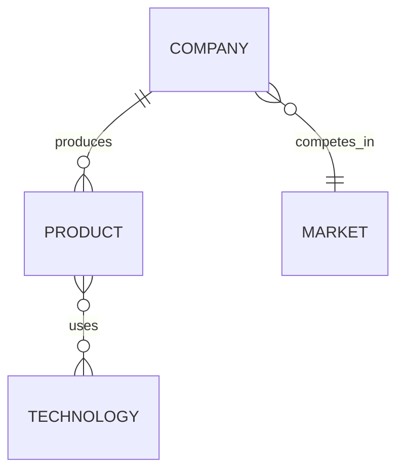

# Agent Bestiary - Features & Capabilities

**A universal Active Dreaming Memory (ADM) backend for AI agents**

Version: 0.1.0  
Date: 2026-02-07

---

## Overview

Agent Bestiary is a standalone service that provides memory consolidation, knowledge graph evolution, and ontology versioning for AI agents. While originally developed for Fermi forecasting agents, it's designed as a **universal ADM backend** that any agent framework can use.

---

## Core Features

### 1. Active Dreaming Memory (ADM)

**Episodic → Semantic Memory Consolidation**

- 🧠 **Episodic Memory**: Raw agent experiences stored as episodes
- 💡 **Semantic Memory**: Consolidated rules extracted from patterns
- 📊 **Knowledge Graph**: Entities, facts, and relationships
- 🔄 **Automatic Consolidation**: LLM-powered pattern detection

**How it works:**
1. Agent executes tasks, experiences stored as episodes
2. Consolidation worker clusters similar episodes (DBSCAN)
3. LLM extracts semantic rules from clusters
4. Rules verified via contradiction/historical/counterfactual testing
5. Knowledge graph built from entities and relationships
6. Ontology snapshot committed to git

### 2. Automatic Ontology Generation

**Mermaid ER Diagrams**

- 📈 **Visual Representation**: Auto-generated Mermaid ER diagrams
- 🎨 **GitHub Rendering**: Viewable directly on GitHub
- 📝 **Entity-Relationship Modeling**: Captures agent worldview
- 🔗 **Cardinality Support**: One-to-one, one-to-many, many-to-many

**Example:**


### 3. Per-Agent Git Repositories

**Isolated Version Control**

- 📁 **Discrete Repos**: Each agent gets its own git repository
- 🔒 **Private by Default**: Agent learning data stays private
- 📜 **Full History**: Every consolidation creates a commit
- 🏷️ **Versioned Snapshots**: Track ontology evolution over time

**Structure:**
```
agents/
├── market-research/
│   ├── .git/
│   ├── ontology.mermaid
│   └── README.md
└── sentiment-analyzer/
    ├── .git/
    ├── ontology.mermaid
    └── README.md
```

### 4. GitHub Integration

**Push to Remote Repositories**

- ☁️ **Automatic Push**: Commits pushed to GitHub on consolidation
- 🔐 **Token Authentication**: Personal access token support
- 🌐 **Public URLs**: Each agent has a GitHub repository URL
- 📊 **Web Viewing**: Browse ontologies on GitHub

**GitHub URLs:**
```
github.com/{your-org}/market-research
github.com/{your-org}/sentiment-analyzer
```

### 5. Multi-Provider Embeddings

**Bring Your Own Embeddings**

- 🤖 **Anthropic** (Voyage AI) - Default, optimized for retrieval
- 🧪 **OpenAI** - Flexible dimensionality, widely tested
- 🇪🇺 **Mistral** - European data residency, open architecture
- 🌏 **Qwen** - Strong multilingual support, cost-effective

**Configurable per deployment:**
```bash
--embedding-provider anthropic|openai|mistral|qwen
--embedding-model voyage-2
--embedding-dimensions 1024
```

### 6. GDPR Compliance by Design

**Privacy-First Architecture**

#### Right to Access ✅
- Grant user read access to their agent's repository
- User can clone and inspect all their agent's data
- Full transparency of what's learned

#### Right to Erasure (Right to be Forgotten) ✅
- **Per-agent deletion**: Simply delete the agent's git repository
- **Database cleanup**: Remove agent records from database
- **Complete removal**: All episodic and semantic memory deleted
- **Audit trail**: Deletion logged in main database

```bash
# GDPR deletion example
gh repo delete YourOrg-Agents/customer-agent-123 --yes
psql $DATABASE_URL -c "DELETE FROM agents WHERE agent_id = '...'"
```

#### Right to Data Portability ✅
- User can clone their agent's git repository
- Standard git format, no vendor lock-in
- Complete history included
- Mermaid format is human-readable

```bash
# User exports their data
git clone github.com/YourOrg-Agents/my-agent
cd my-agent
# Full history available
git log
# Ontology in readable format
cat ontology.mermaid
```

#### Right to Rectification ✅
- User can submit corrections via pull requests
- Manual edits to ontology preserved in git
- Audit trail of all changes
- Can roll back to previous versions

#### Data Minimization ✅
- **Per-agent isolation**: No cross-agent data contamination
- **Clear boundaries**: Each agent stores only its own learning
- **Easy auditing**: Can inspect exactly what's stored per agent
- **Selective retention**: Can delete old episodes while keeping rules

#### Consent Management ✅
- Agent creation requires explicit opt-in
- Can pause consolidation (stop learning)
- Can resume consolidation (opt back in)
- Agent deletion = complete consent withdrawal

**Why this matters:**
With per-agent git repositories, GDPR compliance is **architectural**, not bolted-on. Each agent is a discrete unit that can be:
- Accessed (clone the repo)
- Exported (git archive)
- Corrected (git commit)
- Deleted (delete the repo)

### 7. PostgreSQL + pgvector

**Scalable Vector Search**

- 🐘 **PostgreSQL**: Reliable, ACID-compliant database
- 🔍 **pgvector Extension**: Native vector similarity search
- ⚡ **Fast Queries**: Optimized indexes for lookups
- 📊 **Bi-temporal Tracking**: Valid time and transaction time

### 8. Distributed Consolidation

**Race Condition Prevention**

- 🔒 **PostgreSQL Locks**: Distributed locking mechanism
- ⏱️ **Timeout Handling**: Automatic lock expiry cleanup
- 🔄 **Worker Support**: Multiple consolidation workers supported
- 🚫 **No Conflicts**: Prevents concurrent consolidation per agent

### 9. LLM Provider Flexibility

**Multiple LLM Backends**

- 🤖 **Anthropic** (Claude) - Default, high quality
- 🧪 **OpenAI** (GPT-4) - Alternative provider
- 🌐 **OpenRouter** - Multi-provider routing
- 🇪🇺 **Mistral** - European option
- 🌏 **Qwen** - Chinese market

### 10. REST API (Coming in Phase 8)

**Vercel Serverless Deployment**

- 🌐 **RESTful API**: Standard HTTP interface
- ⚡ **Serverless**: Deployed on Vercel Edge
- 📝 **Agent Management**: Create, read, update agents
- 🔍 **Query Interface**: Search knowledge graphs
- 📊 **Statistics**: Agent performance metrics

---

## Use Cases

### 1. Forecasting Platforms
- **Fermi**: Forecasting agent memory
- **Metaculus**: Question analysis agents
- **Prediction markets**: Market analysis bots

### 2. Agent Frameworks
- **LangChain**: Persistent agent memory
- **AutoGPT**: Goal tracking and learning
- **CrewAI**: Team memory coordination

### 3. AI Assistants
- **Custom ChatGPT**: User-specific learning
- **Claude Projects**: Project memory
- **Personal assistants**: Preference learning

### 4. Research & Development
- **AI labs**: Agent behavior tracking
- **Academic research**: Agent evolution studies
- **Benchmarking**: Agent comparison

### 5. Enterprise Applications
- **Customer service bots**: Learn from interactions
- **Sales agents**: Track customer preferences
- **Support agents**: Build knowledge base

---

## Technical Specifications

### Architecture

- **Language**: Rust (2021 edition)
- **Database**: PostgreSQL 14+ with pgvector 0.4+
- **Git**: libgit2 via git2 crate (vendored)
- **Runtime**: Tokio async runtime
- **API**: Vercel Rust runtime (Phase 8)

### Performance

- **Consolidation Speed**: 1000 episodes in ~2-5 minutes
- **Vector Search**: Sub-100ms for similarity queries
- **Database**: Handles millions of episodes
- **Git Operations**: <1 second per commit

### Scalability

- **Agents**: Unlimited (each in own repo)
- **Episodes**: Millions per agent
- **Rules**: Thousands per agent
- **Workers**: Multiple concurrent workers supported

### Security

- **Authentication**: GitHub PAT, database credentials
- **Encryption**: TLS for all connections
- **Access Control**: Per-repo GitHub permissions
- **Audit Logging**: All operations logged

---

## Deployment Options

### Cloud Providers

- ✅ **Vercel**: API + Postgres (recommended)
- ✅ **AWS**: RDS + Lambda
- ✅ **Google Cloud**: Cloud SQL + Cloud Run
- ✅ **Azure**: Database + Functions

### Self-Hosted

- ✅ **Docker Compose**: Single-node deployment
- ✅ **Kubernetes**: Multi-node cluster
- ✅ **Bare Metal**: Traditional server deployment

---

## Pricing Model (Future)

### Open Source Core
- ✅ **Free**: Core ADM engine (MIT/Apache 2.0)
- ✅ **Self-hosted**: Run on your own infrastructure
- ✅ **No limits**: Unlimited agents on your hardware

### Managed Service (Potential)
- 💰 **Per-agent pricing**: $X/agent/month
- 💰 **Episode storage**: $Y/1000 episodes
- 💰 **API calls**: $Z/1000 requests
- 💰 **Enterprise**: Custom pricing, SLA

---

## Roadmap

### ✅ Phase 0-7: Core ADM (Completed)
- Episodic memory storage
- Semantic consolidation
- Knowledge graph extraction
- Git versioning
- Per-agent repositories
- Multi-provider embeddings

### 🚧 Phase 8: Vercel API (In Progress)
- REST API deployment
- Agent management endpoints
- Knowledge graph queries
- Statistics and metrics

### 🔮 Phase 9+: Future Features
- **AKP (Agent Knowledge Protocol)**: Cross-agent learning
- **Agent marketplace**: Publish/subscribe agents
- **Fine-tuning**: Custom LLM fine-tuning
- **Analytics dashboard**: Visual ontology explorer
- **Webhooks**: Real-time consolidation notifications
- **Multi-tenancy**: Organization management

---

## Comparison to Alternatives

### vs. LangChain Memory

| Feature | Agent Bestiary | LangChain |
|---------|---------------|-----------|
| Episodic Memory | ✅ Full history | ⚠️ Limited |
| Semantic Rules | ✅ Automatic | ❌ Manual |
| Knowledge Graph | ✅ Auto-generated | ⚠️ Manual |
| Version Control | ✅ Git-based | ❌ None |
| GDPR Compliance | ✅ Built-in | ⚠️ DIY |
| Scalability | ✅ Millions of episodes | ⚠️ Limited |

### vs. Vector Databases (Pinecone, Weaviate)

| Feature | Agent Bestiary | Vector DBs |
|---------|---------------|------------|
| Vector Search | ✅ Yes | ✅ Yes |
| Consolidation | ✅ Automatic | ❌ None |
| Rule Extraction | ✅ LLM-powered | ❌ None |
| Git Versioning | ✅ Built-in | ❌ None |
| Per-agent Isolation | ✅ Yes | ⚠️ Namespaces |
| GDPR Deletion | ✅ Easy | ⚠️ Manual |

### vs. Custom Solutions

| Feature | Agent Bestiary | Custom |
|---------|---------------|--------|
| Time to Deploy | ✅ Hours | ⏰ Months |
| Maintenance | ✅ Minimal | 😰 Ongoing |
| GDPR Compliance | ✅ Built-in | 😰 Complex |
| Proven Architecture | ✅ Yes | ❓ Untested |
| Cost | ✅ Low | 💰 High (dev time) |

---

## Getting Started

### Prerequisites

```bash
# Rust toolchain
curl --proto '=https' --tlsv1.2 -sSf https://sh.rustup.rs | sh

# PostgreSQL with pgvector
docker run -d -p 5432:5432 \
  -e POSTGRES_PASSWORD=password \
  ankane/pgvector

# GitHub organization (for agent repos)
# Create at: https://github.com/organizations/plan
```

### Installation

```bash
# Clone repository
git clone https://github.com/Agent-Bestiary/agent-bestiary
cd agent-bestiary

# Set up database
psql $DATABASE_URL < docs/MEMORY_SCHEMA.sql

# Configure environment
cp .env.example .env
# Edit .env with your credentials

# Run consolidation worker
cargo run --bin fermi-consolidate -- \
  --database-url $DATABASE_URL \
  --anthropic-api-key $ANTHROPIC_API_KEY \
  --github-org YourOrg-Agents \
  --github-token $GITHUB_TOKEN \
  --auto-push-github
```

### Quick Start Example

```bash
# Coming in Phase 8 - REST API
curl https://agent-bestiary.vercel.app/api/agents \
  -H "Authorization: Bearer $API_KEY"

# Create an agent
curl -X POST https://agent-bestiary.vercel.app/api/agents \
  -H "Authorization: Bearer $API_KEY" \
  -d '{"name": "my-agent", "type": "forecaster"}'

# Store episode
curl -X POST https://agent-bestiary.vercel.app/api/agents/my-agent/episodes \
  -H "Authorization: Bearer $API_KEY" \
  -d '{"query": "What is...", "result": "..."}'
```

---

## Community & Support

### Documentation
- 📚 **Architecture**: [docs/ARCHITECTURE_ADM.md](../ARCHITECTURE_ADM.md)
- 🗃️ **Database Schema**: [docs/MEMORY_SCHEMA.sql](../MEMORY_SCHEMA.sql)
- 🗺️ **Roadmap**: [docs/ROADMAP_ADM_IMPLEMENTATION.md](../ROADMAP_ADM_IMPLEMENTATION.md)

### Contributing
- 🐛 **Bug Reports**: GitHub Issues
- 💡 **Feature Requests**: GitHub Discussions
- 🔀 **Pull Requests**: Welcome!

### License
- 📄 **Open Source**: MIT or Apache 2.0 (TBD)
- 🆓 **Free to Use**: Self-hosted deployment
- 💰 **Managed Service**: Future commercial offering

---

## Why "Agent Bestiary"?

A **bestiary** is a compendium of beasts - a medieval book describing various animals, real and mythical, often with moral lessons.

**Agent Bestiary** is a compendium of AI agents - tracking their learning, evolution, and the knowledge they accumulate. Each agent is unique, with its own worldview (ontology) that grows over time.

Like a medieval bestiary documented creatures, Agent Bestiary documents the "cognitive creatures" we create - preserving their memories, tracking their growth, and maintaining their histories.

---

**Agent Bestiary: Where AI Agents Learn and Remember** 🦊🧠📚
