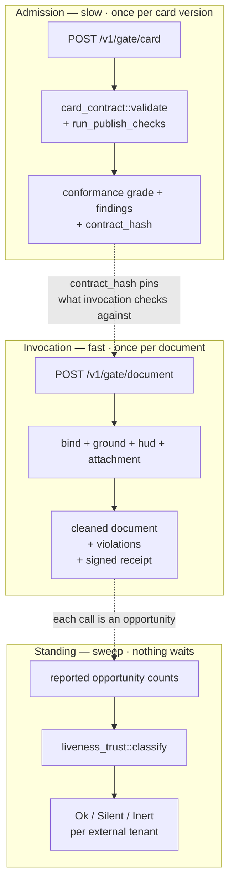

# Design — the control gate system as a service for external agents

**Status:** design. Nothing here is built. **Assumes** the hardening in
`docs/AUDIT_loops_and_gates.md` §8 lands as designed — in particular step 2, the
gate decision ledger, which this document treats as a hard prerequisite rather
than a nice-to-have.

**Convention.** Every claim about the current system is marked:

* **[E]** — exists today, verified against the code in this pass, with file:line.
* **[B]** — must be built.

---

## 0. The question, restated

Two questions, and they have different answers:

1. *What would it look like to sell the gates to agents we do not run?*
2. *What is the minimum an external agent must do to get value from them?*

The second is the harder one and the more interesting, because the honest floor
is **higher than it looks** for grounding and **lower than it looks** for
everything else.

---

## 1. What is actually exposable

The seven declared gates (`src/gate_trust.rs:98`) do not form a product. Split
them by what they need from the world, and three groups fall out. **[E]**

| Gate | Entry point | Needs | Externalisable? |
|---|---|---|---|
| Grounding | `src/grounding_trust.rs:2644` `enforce(agent_id, &mut doc)` | a contract + a document | **yes, today** — pure |
| Admission | `src/card_contract.rs:96` `validate(oc, produces, tools)` | a card | **yes, today** — pure |
| Attachment | `src/attachments.rs:298` `ensure_deliverable` | attachments + provider + model | **yes, today** — pure |
| InputBinding | `src/port_trust.rs:127` `bind_input(accepts)` | declared ports | **yes, today** — pure |
| Coherence | `agent-bestiary/coherence-gate/src/gate.rs:199` `check_against` | a **world model** | yes, but the value is in the argument |
| Credit | `fermi-auth/src/credits.rs:228` | our wallet table | no — it is *our* gate on *our* resource |
| RateLimit | `src/api_server.rs:123` | per-process `DashMap` | no — and per `gate_trust.rs:210`, barely ours |

Plus one that is pure, complete, and has **zero production callers**:
`src/hud_contract.rs:495` `enforce` — a ~1,000-line display gate reachable only
from `examples/hud_preview.rs:68` (audit finding #6). It is the single largest
piece of already-written, already-tested, already-dead capability in the tree.
Exposing it externally is the cheapest way to give it a caller, and *that is a
reason to be suspicious of doing so*, not a reason to do it: a gate whose first
user is a paying stranger has not been operated.

**The product is the four pure ones plus coherence.** Credit and rate limit are
the platform's own admission control on the service, not part of it.

### 1.1 The purity is real and the manifests are not portable

`grounding_trust::enforce` is pure — no pool, no globals. But it reads a
**compiled-in const**, `FIELD_CONTRACTS` at `src/grounding_trust.rs:789`, ~1,500
lines of hand-written per-agent entries. An external agent is not in that table
and never will be.

The consequence is already documented in the gate's own declaration
(`src/gate_trust.rs:160-164`): `enforce` returns an empty `Report` for an agent
with no contract, **which is indistinguishable from a clean pass at the call
site.** Internally that is a coverage gap. Exposed as a service it is something
worse — a false attestation, handed to a third party, with our name on it.

`src/card_contract.rs` exists precisely to fix this, and says so at `:5-7`:
*"a third party publishing through `POST /api/agents` has no way to add a line to
a compiled const. So the map moves into the card, and Rust keeps only the
checker."* **[E]**

> **Design rule 1 — bring your own contract.** The external service runs
> `card_contract`'s card-declared path only. `FIELD_CONTRACTS` is not consulted
> for external callers, and the absence of a contract is `Undetermined`, never
> `Approved`. This is §5.3 of the paper ("silence is not a verdict") applied at
> the API boundary, and it is the difference between a service and a liability.

---

## 2. Three surfaces, because there are three clocks

The paper's §4.1 already partitions this, and the partition is a product
partition, not just a scheduling one. Each clock has a different caller, a
different latency budget, and a different billing shape.



**Admission** is stateless, idempotent, and should be **free**. Charging for it
discourages the exact behaviour the whole system wants — authored, typed,
grounded cards. It returns a `contract_hash` that pins the card version every
later verdict was measured against.

**Invocation** is the actual service. Stateless per call *if* the contract comes
in with the request or is resolved by `contract_hash`.

**Standing** cannot be stateless, and is the only surface that requires us to
hold data about someone else's agent over time. It is also the one nobody will
ask for and the one that catches the most, per the paper's §4.1 argument about
why the cheapest rung went missing longest.

---

## 3. The hard part: a gate you cannot enforce is a metric

The paper's central operational claim (§4):

> The check that runs after the write is a metric; the check that runs before it
> is a control.

Across a network boundary to a runtime we do not own, **we cannot make it a
control by API design alone.** The audit already found this failing *inside* our
own process: `enforce` at `src/handlers/execution.rs:330` mutates a local `doc`
dropped two lines later, so the persisted `response_text` is un-stripped —
documented as intentional at `src/api_server.rs:6232-6234` (finding #5). If the
verdict gets discarded in the same function that computed it, an HTTP response
sent to a stranger has no chance.

Three escalating shapes. Only two of them are honest.

| Shape | Mechanism | Is it a control? |
|---|---|---|
| **A. Advisory** | POST document → verdict | **No.** Caller may ignore it. A metric with extra steps. |
| **B. Transforming + receipt** | POST document → *cleaned* document + signed receipt | **Not for the caller — for the caller's consumers.** See below. |
| **C. Interposed** | consumer calls *us*, we call the agent, we return the cleaned result | **Yes.** We are in the write path. |

Shape C is a real gate and almost nobody will adopt it, because it means an
agent's users point at our URL instead of theirs.

Shape B is the design that matters, and the trick is that **enforcement moves to
the consumer**.

### 3.1 The receipt

The receipt is the unit of the product. Not the verdict — the verdict is a
number, and a number can be retyped by anybody.

```json
{
  "receipt_id": "grcpt_01J...",
  "issued_at": "2026-08-23T11:04:22Z",
  "subject": {
    "agent_id": "ext:acme/phylo-bot",
    "contract_hash": "sha256:9f2c...",
    "document_hash": "sha256:41ab..."
  },
  "gates": [
    { "gate": "input_binding", "verdict": "declared",     "detail": "query" },
    { "gate": "grounding",     "verdict": "refused",      "violations": 2 },
    { "gate": "attachment",    "verdict": "not_applicable" }
  ],
  "verdict": "refused",
  "violations": [
    { "path": "genome.accession", "kind": "ungrounded_field",
      "why": "declared unavailable in contract; no tool could supply it" },
    { "path": "summary", "kind": "narrative_leak",
      "why": "prose restates the nulled accession" }
  ],
  "document_hash_after": "sha256:7c30...",
  "sig": "ed25519:..."
}
```

The load-bearing field is **`document_hash_after`**. A downstream agent that
receives a document and a receipt hashes what it actually got and compares. If
the upstream agent took our cleaned document and put the fabricated field back,
the hashes disagree and the tamper is detectable by a third party who trusts
neither of them.

That is the whole federated argument: **we do not stop the agent lying. We make
the lie checkable by anyone downstream, without them having to run the gate
themselves.** It converts a per-runtime control into an inter-agent trust
primitive, which is the only form that survives crossing an ownership boundary.

It also produces something the platform does not currently have at all.

### 3.2 The receipt store is the audit's step 2, arriving from the other side

`Retention::Recorded` is declared for `Coherence` and `Admission`
(`src/gate_trust.rs:140`, `:181`) and documented at `:51-54` as "one row per
decision in `gate_decisions`". **There is no `gate_decisions` table.** No
migration declares it; the only two mentions in the repository are the doc
comments in `gate_trust.rs` itself. **[E]**

So the position is precise, and worth stating without softening:

> **You cannot sell a gate whose decisions you do not record.** A receipt is a
> durable, addressable, re-servable record of a gate decision. The internal
> remedy for audit finding #2 and the external product's central artifact are
> the same table. Build it once.

Two constraints on that table that only appear once it is external:

1. **It must be per-tenant.** `gate_trust`'s counters are process-global
   `static AtomicU64` arrays with no caller dimension (`src/gate_trust.rs:266-268`),
   cleared on restart. That is defensible for an internal health reading
   (`write_accounting.rs:46-61` argues it, correctly). It is not defensible when
   the reading is a thing you report *to* a customer, or bill on.
2. **The §5.1 readings must be computed per tenant.** `refuses_everything`
   (`:333`) and `admits_everything` (`:344`) are the two signatures the whole
   accounting layer exists to surface. Per tenant they acquire a second meaning:
   a tenant whose refusal rate goes to zero has either fixed their agent or
   **learned to shape documents that pass**, and those need different responses.

---

## 4. Minimum requirements on the external agent

This is the question with the most misleading intuitive answer. The bar is not
"be an LLM agent". It is **"emit a structured document you have pre-declared a
provenance disposition for"**, and most agents cannot do that today.

### 4.1 Conformance profiles

| Level | The agent must | Gates it unlocks | Verdict quality |
|---|---|---|---|
| **L0 — Anonymous** | POST any JSON document | narrative-leak scan only | advisory, `Undetermined` on everything typed |
| **L1 — Declared** | + publish a card with a valid `output_contract` | admission, binding, grounding, HUD | real verdicts, receipts issued |
| **L2 — Attested** | + return *our* cleaned document, propagate `receipt_id` | as L1, but consumer-verifiable | a control, enforced downstream |
| **L3 — Accounted** | + report opportunity counts, not just successes | + liveness (standing clock) | `Silent` becomes distinguishable from `Inert` |
| **L4 — Remembered** | + ship or host a world model | + coherence | corrections gated against beliefs |

L1 is the real product boundary. Everything below it is a demo.

### 4.2 L1 in full — the actual bar

The agent publishes a card containing an `output_contract`
(`src/card_contract.rs:14-28`, verbatim the shape the checker already enforces):

```json
"output_contract": {
  "produces_schema": "acme/phylogenetic_profile",
  "schema": { "type": "object", "properties": { "taxonomy": {}, "genome": {}, "summary": {} } },
  "grounding": {
    "taxonomy": { "status": "sourced", "tool": "gbif_taxonomy_tree",
                  "response_field": "hierarchy",
                  "why": "read directly from the GBIF backbone response, unmodified" },
    "genome":   { "status": "unavailable",
                  "why": "no genome database is wired into this agent's tool set" },
    "summary":  { "status": "narrative",
                  "why": "prose framing of the fields above, asserts nothing new" }
  }
}
```

Four requirements, and each has teeth already implemented in `validate`
(`src/card_contract.rs:96`): **[E]**

1. **A real inline schema**, not just a name. `produces_schema` is a name, and
   *"a name is only a contract once something can resolve it"* (`:119`).
2. **Every top-level schema property appears in `grounding`.** No silent fields.
3. **`status` from the closed set** `sourced | inferred | narrative | unavailable`
   (`GROUNDING_STATUSES`, `:53`). Open vocabularies are how `"status": "estimated"`
   gets in, *"which is the fabrication reappearing as a metadata value"* (`:51-52`).
4. **Every `why` ≥ 40 characters** (`MIN_WHY`, `:48`), and every `sourced` entry
   names a tool the agent actually declares. That cross-reference is the check
   with teeth (`:31-34`) — it is what stops `"status": "sourced"` over a field
   nothing can source.

And at invocation, per document:

5. **Structured JSON output** matching the declared schema. An agent that emits
   only prose gets narrative-leak scanning and nothing else, because there are no
   fields to hold to a disposition.
6. **A tool-use trace**: which declared tool produced which field. Without it,
   `sourced` is the agent's claim about itself. The audit already caught the
   inward-facing version of this failure — `port_trust.rs:19-25`, where the
   server read `input_binding` out of a **caller-supplied** JSON object and filed
   the caller's claim as a finding. *"Verification belongs where the authority
   is"* (paper §4). Externally we have less authority, not more, so the trace has
   to carry the tool's response, not a label asserting one existed.

### 4.3 What an agent needs technically — the short list

Deliberately short, because it is shorter than people expect:

* An HTTP client. That is the entire runtime requirement.
* An API key (`ferm_` + 64 hex, `fermi-auth/src/api_keys.rs:14-66`). **[E]**
* The ability to emit JSON conforming to a schema its author wrote.
* One call inserted **before** it persists or renders. Not after.

No SDK, no framework, no language constraint, no agent-protocol adoption. The
gate is pure functions over JSON, and that is the property worth protecting: the
moment it needs their memory layer or their orchestration framework, the
addressable market becomes agents built like ours.

### 4.4 What L4 costs, and why it is a different product

Coherence is the one gate whose value is entirely in the argument the caller has
to construct. `CoherenceGate::check_against` (`gate.rs:199`) is pure, but
`WorldModel::is_sufficient()` (`gate.rs:111`) requires `target.is_some() &&
nodes.len() >= 2`, and below that it returns `Undetermined` — correctly, and by
explicit design (`gate.rs:156-164`).

We assemble that world model at `src/handlers/observatory.rs:305` from the last
40 episodes plus the last 40 active semantic rules, with `source_episode_cluster`
mapped into `derived_from` edges. An external agent supplying this must ship:

* ≥ 2 belief nodes as `{ id, text, grounded: bool, derived_from: [idx] }`
* the index of the node the correction overturns
* the `grounded` flag set honestly — observations `true`, distilled conclusions
  `false`, which is Thagard's Data Priority and the same extraction ceiling the
  provenance oracle enforces (`gate.rs:68-75`)

Almost no external agent has this, which points at the actual shape: **L4 is not
a gate we sell, it is a reason to host their memory.** Charge for the store, give
the gate away.

---

## 5. Wire shape

One representative call. Deliberately close to the existing `/execute` envelope
(`src/handlers/execution.rs:29-49`) so the two rails feel like one product. **[B]**

```
POST /v1/gate/document
Authorization: Bearer ferm_...
```
```json
{
  "agent": { "id": "ext:acme/phylo-bot", "contract_hash": "sha256:9f2c..." },
  "invocation": { "accepts": ["query"], "input_binding": "query" },
  "document": { "taxonomy": {...}, "genome": {"accession": "NC_012920"}, "summary": "..." },
  "tool_trace": [
    { "tool": "gbif_taxonomy_tree", "response_field": "hierarchy", "ok": true }
  ],
  "mode": "enforce"
}
```

`mode` is `enforce` (mutate and return the cleaned document) or `report` (verdict
only, document untouched). **`report` must be rate-limited more tightly than
`enforce`**, because unlimited `report` is a free oracle for probing exactly which
fabrications pass — the failure mode is an attacker fitting to the gate, and it
does not exist internally because internally there is no adversary at the API.

Response:

```json
{
  "verdict": "refused",
  "document": { "taxonomy": {...}, "genome": null, "summary": "..." },
  "provenance": { "taxonomy": "sourced", "genome": "unavailable", "summary": "narrative" },
  "violations": [ ... ],
  "receipt": { "receipt_id": "grcpt_01J...", "sig": "ed25519:...", "...": "..." }
}
```

Verdicts are `approved | refused | undetermined | not_applicable`. **There is no
`passed`.** `undetermined` must be a first-class response an integrator has to
handle, not an error code they can treat as success — the coherence gate already
models this correctly (`gate.rs:156-164`) and it should be the service-wide
vocabulary.

### 5.1 Delivery: two rails, written once

Per the API inventory: **MCP tools are declared separately from HTTP routes and
nothing derives one from the other** (`src/agent_backend/tools/mod.rs:49-53`;
`advertised_tools` at `src/handlers/mcp.rs:77-116` reads only the card, never the
router). **[E]**

So: put the logic in the `fermi` library crate, call it from an axum handler
*and* a `ToolRegistry` arm — the pattern `fermi::gas` and `fermi::grounding_trust`
already use. MCP is the higher-value rail here, since external LLM agents are
overwhelmingly MCP clients and `check_this_document_before_you_answer` is a tool
an agent can be told to call in a system prompt.

**Blocker on that rail.** `/mcp/agents/:id` currently sits on the *public* router
(`src/api_server.rs:2565-2569`) behind `optional_auth_middleware`, performs no
wallet check, calls no `charge_gas`, and writes no episode
(`src/handlers/mcp.rs:368-469`, compare `src/handlers/execution.rs:98-125`). It is
also outside `llm_rate_limit_middleware`, which is layered on `protected_routes`
only (`:4944`). Shipping a metered service on that rail without fixing it ships
the meter around the outside of an unmetered door. **[E]**

---

## 6. Metering — one real obstacle

`GasFees::execution_fee` (`src/gas.rs:135`) is `max(1, tokens/1000)` plus a 10%
surcharge — designed for LLM calls costing 2+ credits. **A gate call runs no
model.** It is microseconds of pure CPU over a JSON document.

And credits are **integers** (`fermi-auth/src/credits.rs:19-29`, no fractional
type anywhere). So the cheapest chargeable action costs 1 credit, and the gate is
worth perhaps a hundredth of that. Charging 1 credit per document overprices it
by ~100× and directly contradicts the paper's own §7 conclusion — that an ecology
must make verification *"cheap enough to run every time"*. A gate priced above
its protection is a gate people route around.

Three workable options, in preference order:

1. **Bundle with admission.** Gate calls are free; you pay to be in the catalogue.
   Verification becomes a reason to publish here rather than a line item.
2. **Batch billing.** Accumulate per-tenant call counts, charge 1 credit per N
   (N ≈ 1,000). Needs a counter with a tenant dimension — which §3.2 already
   requires for the receipt store, so it is not new work.
3. **Subscription for the standing clock only.** The sweep is the genuinely
   expensive surface (it holds data over time); the per-document call is not.

Option 1 is the one that matches what the system is for.

---

## 7. Prerequisites, in dependency order

Nothing here should start before these. Each is either an audit item already on
the list or a direct consequence of crossing the ownership boundary.

| # | Prerequisite | Why external makes it mandatory | Audit ref |
|---|---|---|---|
| 1 | `gate_decisions` table + writer | receipts *are* this table; `Retention::Recorded` is declared with no implementation | step 2, finding #2 |
| 2 | Tenant dimension on gate counters | `refuses_everything` / `admits_everything` must be per customer, and billable | new |
| 3 | Fail-closed for unknown contracts | `enforce` returning an empty `Report` becomes a false attestation with our signature on it | §1.1 above |
| 4 | Auth + metering on the MCP rail | the highest-value delivery path is currently anonymous and free | new **[E]** |
| 5 | `enforce` actually applied on the execute paths | we cannot sell as a control what we run as a metric on our own two general endpoints | finding #5 |
| 6 | Shared rate limiter | per-process `DashMap` is ineffective behind >1 replica, and it is the admission control for the whole service | `gate_trust.rs:210` |
| 7 | A production caller for `hud_contract::enforce` | do not let a paying stranger be the first operator of a 1,000-line gate | finding #6 |

Item 5 deserves the sharpest statement. Selling grounding-as-a-control while
running it as a metric on `/execute` and `/execute/stream` is not primarily a
credibility risk — it is that **we would have no operational experience of the
thing we are selling.** Every failure mode a customer hits would be discovered by
the customer.

---

## 8. What to tell a prospective integrator it cannot do

Per the paper's §6, stated before anyone asks.

* **It does not make the agent correct.** It makes one class of incorrectness
  visible and non-serving. A grounded, typed, correctly-bound answer can still be
  wrong.
* **It cannot see semantic error inside a sourced field.** If the tool returned
  data and the model paraphrased it wrongly, every contract here passes.
* **It only covers what the card declares.** Coverage is a metric, and the
  service must report it as one — a receipt that counted undeclared fields as
  clean would show an agent getting cleaner as its contract got thinner.
* **`undetermined` is not a pass**, and an integrator that maps it to success has
  reintroduced the defect the whole ladder exists to prevent.
* **Advisory mode is a metric.** Only a receipt checked by a downstream consumer,
  or interposition, is a control. We should say which one a given integration is,
  in the integration, in writing.
* **Liveness cannot tell broken from undeployed** — for their agents either. A
  silent write path may be a bug or may be code that has not shipped.

---

## 9. The smallest first cut

If this ships in one slice, it is this and nothing else:

* `POST /v1/gate/card` — free, stateless, wraps `card_contract::validate`. Returns
  findings and a `contract_hash`. **Zero new gate logic.**
* `POST /v1/gate/document` in `report` mode — wraps `grounding_trust::enforce` on
  the card-declared path only, fail-closed on unknown contracts.
* Both write to `gate_decisions`, per tenant.
* Same two functions exposed as MCP tools off the library crate.

That is one new table, two handlers, two tool arms, and no new checking. It also
closes audit finding #2 as a side effect, which is the argument for doing it now
rather than after the hardening: **the external product's central artifact and
the internal audit's top structural gap are the same object.**

The second slice is the receipt signature and the downstream verify endpoint,
because that is the slice where it stops being a linter and becomes a trust
primitive.
