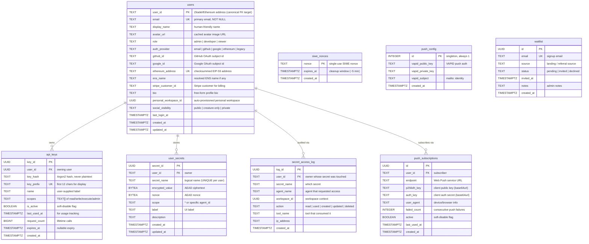
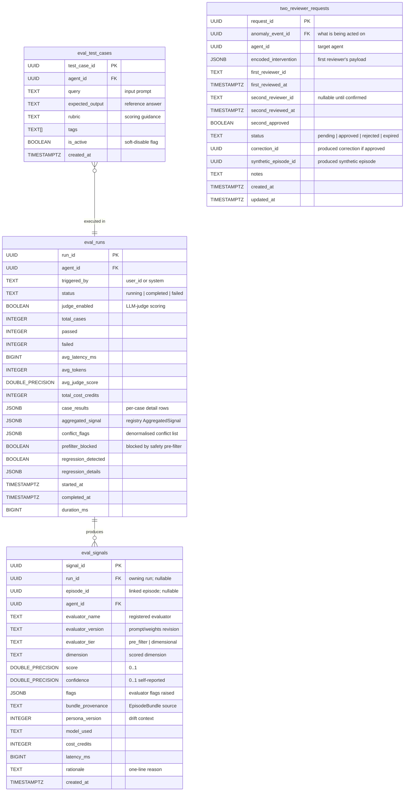
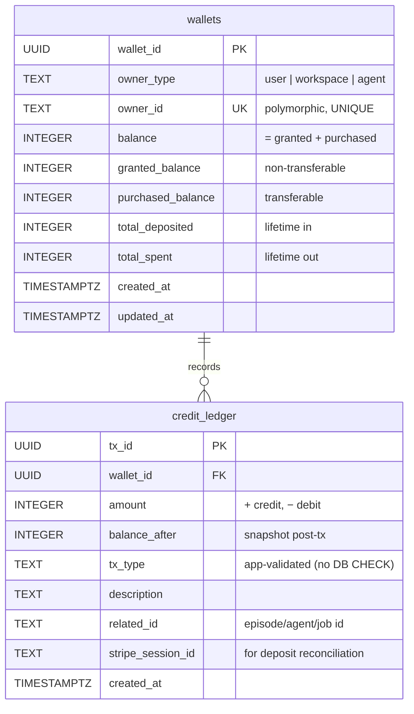
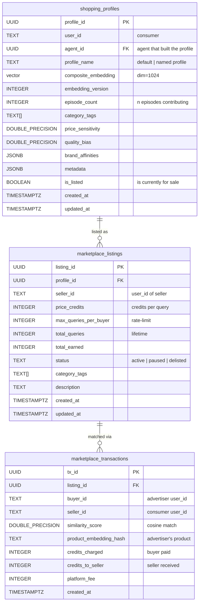
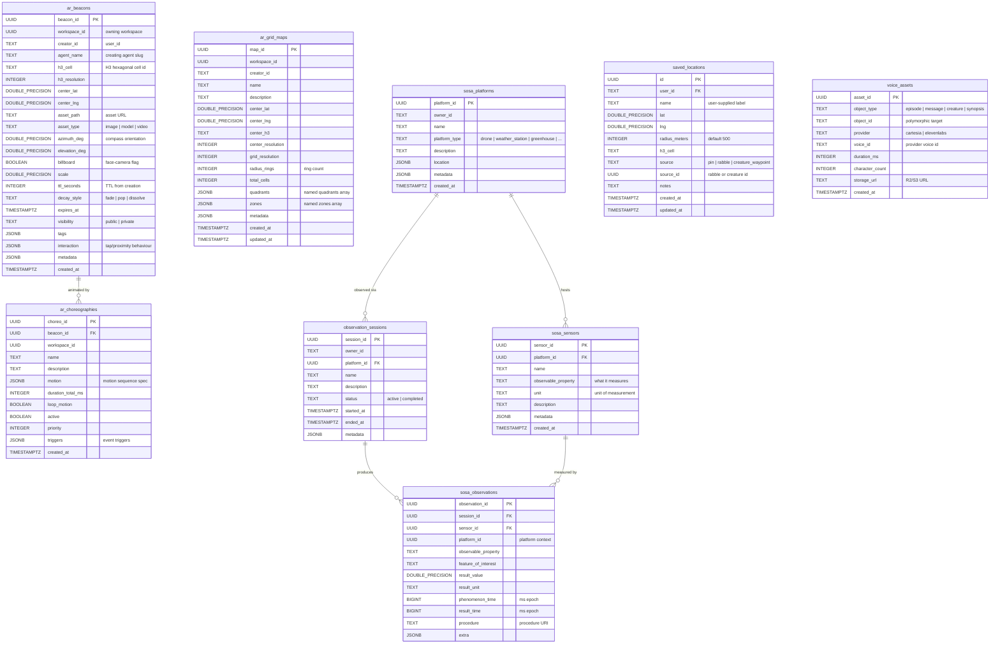
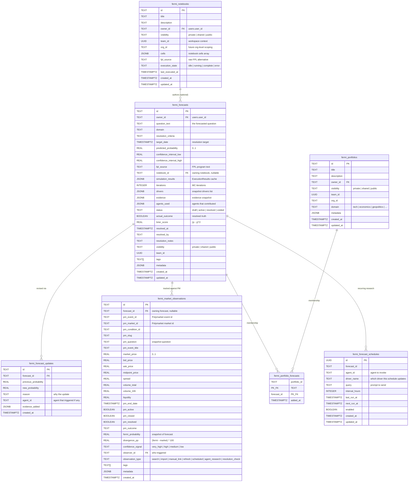
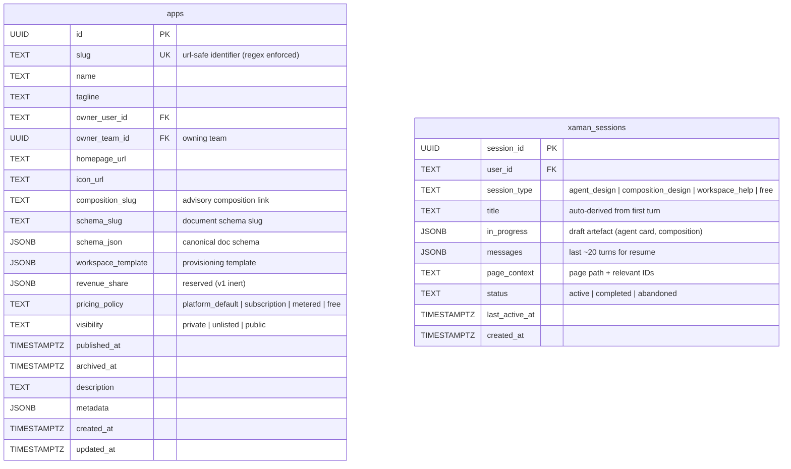

# Entity-Relationship Diagram — Agent Bestiary Workspace (ABW)

**Generated from:** migrations 004–121 (125 files)
**Total tables:** 96
**Companion doc:** docs/DATA_DICTIONARY.md for flat column-by-column reference
**Notation:** PK = primary key, UK = unique, FK = foreign key. Types use Postgres
spellings (TEXT, UUID, JSONB, TIMESTAMPTZ, BOOLEAN, INTEGER, BIGINT, DOUBLE
PRECISION / FLOAT, REAL, DECIMAL, BYTEA, vector). Where a table has more than
~15 columns, only the keys and the most important fields are shown — the
truncation is noted inline.

The diagram is split into 11 domain views so each Mermaid block stays
renderable. Cross-domain foreign keys are summarised at the bottom.

## Domain Index

| # | Domain | Tables | Count |
|---|--------|--------|-------|
| 1 | Users & Auth | users, api_keys, siwe_nonces, user_secrets, secret_access_log, push_subscriptions, push_config, waitlist | 8 |
| 2 | Agents, Memory & Coherence | agents, agent_versions, agent_avatars, agent_alignments, agent_interaction_policies, agent_observability_state, agent_timeline_entries, anomaly_events, hitl_actions, episodes, episode_corrections, consolidation_jobs, consolidation_locks, entities, facts, semantic_rules, communities, ontology_snapshots, dyad_state, pairwise_coherence, knowledge_transfers, agent_episode_payouts | 22 |
| 3 | Workspaces & Compositions | teams, team_members, workspace_messages, workspace_agents, object_shares, composition_versions, coherence_evaluations | 7 |
| 4 | Eval & Observability | eval_runs, eval_signals, eval_test_cases, two_reviewer_requests | 4 |
| 5 | Wallet & Billing | wallets, credit_ledger | 2 |
| 6 | Marketplace | marketplace_listings, marketplace_transactions, shopping_profiles | 3 |
| 7 | Rabble Core (Creatures & Swarms) | creatures, creature_collections, creature_versions, creature_state, creature_conditions, creature_flights, creature_images, creature_animation_layers, creature_devices, creature_tethers, creature_favourites, creature_blocks, swarm_events, swarm_participants, swarm_sessions, swarm_telemetry, swarm_sub_flocks, swarm_algorithms, swarm_activations, rabble_messages, rabble_co_presence, rabble_follows, rabble_ejections, flight_telemetry, telemetry_points | 25 |
| 8 | Spatial / AR / Sensors | ar_beacons, ar_choreographies, ar_grid_maps, sosa_platforms, sosa_sensors, sosa_observations, observation_sessions, saved_locations, voice_assets | 9 |
| 9 | Social Graph & Moderation | creature_friendships, creature_invites, activity_events, notifications, contacts, user_blocks, reports | 7 |
| 10 | Forecasting & Calibration | fermi_notebooks, fermi_portfolios, fermi_forecasts, fermi_forecast_updates, fermi_portfolio_forecasts, fermi_market_observations, fermi_forecast_schedules | 7 |
| 11 | Apps & Sessions | apps, xaman_sessions | 2 |

Total: **96 tables**.

---

## Domain 1: Users & Auth

Identity, credentials, and notifications. `users.user_id` (TEXT) is the
canonical foreign key target used across the rest of the schema — it accepts
Zitadel sub IDs, Ethereum addresses, or legacy UUIDs as text. The auth
provider columns capture which onboarding path the user came in via.
`siwe_nonces` exists purely for replay protection on Sign-In-With-Ethereum.
Web-push delivery lives here alongside the singleton VAPID config row.



**Key relationships**
- `api_keys.user_id` → `users.id` (note: legacy UUID FK, predates the TEXT `user_id` switch)
- `user_secrets` and `secret_access_log` reference `users.user_id` (TEXT) by convention; no enforced FK on the audit log so deleted users don't lose audit history
- `push_config` is a singleton (CHECK id = 1); the platform shares one VAPID keypair across all installs
- `waitlist` is detached from `users` — it tracks unverified emails before they become accounts

---

## Domain 2: Agents, Memory & Coherence

The agent registry plus the full Agent Dreaming Model (episodes → semantic
rules / entities / facts / communities → ontology snapshots), the Agent
Knowledge Protocol coherence tables (alignments, pairwise coherence,
knowledge transfers, interaction policies), and the Social Agent
Observability Platform (timeline entries, dyad state, anomaly events,
HITL actions, episode corrections, persona-version tracking). This is the
largest and most interconnected domain in the schema.

```mermaid
erDiagram
    agents {
        UUID agent_id PK
        TEXT agent_name UK "stable system identifier"
        TEXT display_alias "human-friendly UI name"
        TEXT agent_type "domain classifier"
        TEXT tier "curated | community | system"
        TEXT status "draft | published | archived"
        TEXT executor_type "claude | openai | custom"
        TEXT model "current default model id"
        FLOAT temperature "legacy single sampling knob"
        JSONB model_params "full SamplingParams override"
        JSONB model_ladder "tier-based fallback chain"
        TEXT min_tier "free | standard | premium"
        JSONB capability_gates "per-tier capability flags"
        TEXT llm_provider "anthropic | openai | ..."
        TEXT embedding_provider
        TEXT embedding_model
        INTEGER embedding_dimension
        TEXT system_prompt "base persona prompt"
        TEXT prompt_template "@mention auto-fill scaffold"
        TEXT[] tags "search tags"
        TEXT[] sample_queries "example invocations"
        TEXT[] accepts "valence: input types"
        TEXT[] produces "valence: output types"
        JSONB valence "primary_affect/arousal/personality"
        JSONB workflow_template "compound agent mermaid"
        JSONB requires_secrets "declared secret needs"
        JSONB fork_pricing "base_price for fork"
        UUID forked_from FK "parent agent if forked"
        INTEGER fork_count
        INTEGER auto_collect_pct "royalty auto-forward %"
        JSONB fermi_contract "CEP forecasting contract"
        JSONB output_contract "generalised domain contract"
        INTEGER persona_version "drift baseline counter"
        UUID current_ontology_snapshot_id "live ontology"
        TIMESTAMPTZ last_consolidated_at
        INTEGER dreaming_budget_credits
        INTEGER dreaming_credits_used
        INTEGER education_budget_credits
        INTEGER education_credits_used
        INTEGER total_executions
        INTEGER successful_executions
        INTEGER failed_executions
        DECIMAL total_cost_usd
        BIGINT avg_execution_time_ms
        TEXT user_id FK "owner; NULL = curated/system"
        TEXT visibility "private | unlisted | public"
        BOOLEAN is_public
        TEXT author
        TEXT description
        TIMESTAMPTZ created_at
    }

    agent_versions {
        UUID version_id PK
        UUID agent_id FK
        INTEGER version_number "monotonic per agent"
        TEXT description
        TEXT system_prompt "snapshot at this version"
        TEXT[] tags
        TEXT model
        DOUBLE_PRECISION temperature
        TEXT visibility
        TEXT display_alias
        TEXT changed_by "user_id who triggered version"
        TIMESTAMPTZ created_at
    }

    agent_avatars {
        TEXT agent_id PK "cached agent avatar"
        JSONB avatar_json "generative avatar params"
        TIMESTAMPTZ created_at
    }

    agent_alignments {
        UUID alignment_id PK
        UUID source_agent_id FK
        UUID target_agent_id FK
        FLOAT alignment_score "ontology similarity"
        INTEGER shared_entity_count
        INTEGER divergent_entity_count
        JSONB shared_entities
        JSONB divergent_entities
        TIMESTAMPTZ last_computed_at
    }

    agent_interaction_policies {
        UUID policy_id PK
        UUID agent_id FK
        TEXT policy_type "consent policy kind"
        UUID target_agent_id "nullable counterparty"
        BOOLEAN enabled
        TIMESTAMPTZ created_at
    }

    pairwise_coherence {
        UUID coherence_id PK
        UUID agent_a_id FK
        UUID agent_b_id FK
        UUID workspace_id "context for the score"
        FLOAT global_score "TEC coherence summary"
        JSONB principle_scores "per-principle breakdown"
        INTEGER episode_count
        TIMESTAMPTZ computed_at
    }

    knowledge_transfers {
        UUID transfer_id PK
        UUID source_agent_id FK
        UUID target_agent_id FK
        TEXT transfer_type "bootstrap | merge | diff"
        INTEGER item_count
        INTEGER accepted_count
        INTEGER rejected_count
        INTEGER conflict_count
        JSONB details
        TIMESTAMPTZ transferred_at
    }

    episodes {
        UUID episode_id PK
        UUID agent_id FK
        TEXT user_id "owner (denormalised from agent)"
        TIMESTAMPTZ timestamp_ref "logical time of episode"
        TEXT query "input prompt"
        JSONB context "execution context"
        TEXT execution_status "ok | error"
        TEXT error_details
        BIGINT execution_time_ms
        INTEGER tokens_used
        DECIMAL cost_usd
        vector embedding "dim=1024"
        TEXT[] tags "auto-generated execution tags"
        BOOLEAN consolidated "rolled into rules yet"
        UUID consolidation_job_id "owning dream job"
        UUID cluster_id "post-clustering id"
        TEXT provenance "auto_pass | human_* | synthetic"
        DOUBLE_PRECISION authority_weight "0..1, 1.0 = human"
        TEXT dyad_id "deterministic (agent,human) id"
        INTEGER persona_version_at_write "drift snapshot"
        TEXT audio_url "TTS render if any"
        TIMESTAMPTZ created_at
    }

    episode_corrections {
        UUID correction_id PK
        UUID episode_id FK "original episode (immutable)"
        UUID agent_id FK
        TEXT reviewer_id "human reviewer user_id"
        TEXT reviewer_action "approve | relabel | intervene"
        TEXT scope "episode | dyad | agent_wide"
        TEXT classification "belief | behaviour"
        TEXT dimension "which score dimension"
        TEXT correction_text
        JSONB score_overrides "dimension -> new score"
        JSONB coherence_check "Phase 5 gate output"
        JSONB minimum_update_set
        JSONB tensions_flagged
        UUID synthetic_episode_id FK "re-written corrected episode"
        DOUBLE_PRECISION authority_weight "1.0 default"
        INTEGER persona_version_bump
        TEXT justification
        TIMESTAMPTZ created_at
    }

    consolidation_jobs {
        UUID job_id PK
        UUID agent_id FK
        TIMESTAMPTZ started_at
        TIMESTAMPTZ completed_at
        BIGINT duration_ms
        TEXT status "running | completed | failed"
        TEXT error_message
        UUID episode_range_start
        UUID episode_range_end
        INTEGER episodes_processed
        INTEGER clusters_identified
        INTEGER rules_extracted
        INTEGER rules_verified
        INTEGER rules_rejected
        INTEGER entities_created
        INTEGER facts_created
        TEXT dream_synopsis "narrative of the dream"
        UUID ontology_snapshot_id FK "produced snapshot"
    }

    consolidation_locks {
        UUID agent_id PK_FK "one lock per agent"
        TIMESTAMPTZ locked_at
        TEXT locked_by "worker id"
        TIMESTAMPTZ expires_at
    }

    entities {
        UUID entity_id PK
        UUID agent_id FK
        TEXT user_id "denormalised owner"
        TEXT entity_name
        TEXT entity_type
        TEXT summary
        TIMESTAMPTZ t_valid "bitemporal validity start"
        TIMESTAMPTZ t_invalid
        TIMESTAMPTZ t_expired "tombstone time"
        UUID[] source_episodes
        FLOAT extraction_confidence
        vector embedding "dim=1024"
        INTEGER version
        UUID replaces_entity_id FK "supersession"
        JSONB properties "structured attrs (CEP base rates)"
    }

    facts {
        UUID fact_id PK
        UUID agent_id FK
        TEXT user_id "denormalised owner"
        UUID source_entity_id FK
        UUID target_entity_id FK
        TEXT relation_type
        TEXT relation_cardinality
        FLOAT confidence
        TEXT reasoning
        TIMESTAMPTZ t_valid
        TIMESTAMPTZ t_invalid
        TIMESTAMPTZ t_expired
        UUID[] source_episodes
        INTEGER version
        UUID replaces_fact_id FK
        JSONB data "free-form metadata (n, source, year)"
    }

    semantic_rules {
        UUID rule_id PK
        UUID agent_id FK
        TEXT user_id "denormalised owner"
        TEXT rule_content "natural-language rule"
        TEXT rule_description
        FLOAT confidence_score
        TEXT verification_status "pending | verified | rejected"
        TEXT verification_method
        JSONB verification_details
        UUID[] source_episode_cluster
        INTEGER episode_count
        vector embedding "dim=1024"
        BOOLEAN is_active
        INTEGER application_count
        TIMESTAMPTZ created_at
    }

    communities {
        UUID community_id PK
        UUID agent_id FK
        TEXT community_name
        TEXT summary
        UUID[] member_entity_ids
        INTEGER member_count
        TIMESTAMPTZ last_propagation_at
        vector embedding "dim=1024"
    }

    ontology_snapshots {
        UUID snapshot_id PK
        UUID agent_id FK
        TEXT git_commit_sha "snapshot git ref"
        TEXT git_repository
        TEXT git_path
        TEXT github_url
        BOOLEAN pushed_to_remote
        UUID consolidation_job_id FK
        INTEGER entity_count
        INTEGER fact_count
        INTEGER community_count
        INTEGER rule_count
        TEXT mermaid_content "rendered ER diagram"
        INTEGER version
        UUID previous_snapshot_id FK
        TEXT dream_synopsis
        JSONB consolidation_stats
        TEXT audio_url "TTS render of synopsis"
        TIMESTAMPTZ created_at
    }

    dyad_state {
        TEXT dyad_id PK "deterministic (agent,human) id"
        UUID agent_id FK
        TEXT human_id "user_id"
        DOUBLE_PRECISION rapport "0..1 running average"
        DOUBLE_PRECISION trust "0..1 running average"
        DOUBLE_PRECISION reciprocity "0..1 running average"
        INTEGER episode_count
        JSONB recent_rapport "rolling window for rupture"
        TIMESTAMPTZ last_updated_at
    }

    agent_observability_state {
        UUID agent_id PK_FK
        UUID last_scanned_entry_id "worker checkpoint"
        TIMESTAMPTZ last_scan_started_at
        TIMESTAMPTZ last_scan_completed_at
        BIGINT last_scan_duration_ms
        INTEGER timeline_entry_count
        INTEGER anomaly_event_count
        TIMESTAMPTZ updated_at
    }

    agent_timeline_entries {
        UUID entry_id PK
        UUID agent_id FK
        UUID episode_id FK
        UUID run_id "eval run if any"
        INTEGER persona_version
        TEXT dyad_id "context dyad"
        TEXT session_id
        TEXT provenance
        JSONB dim_scores "per-dimension means"
        DOUBLE_PRECISION drift_norm "vs prior baseline"
        DOUBLE_PRECISION within_version_cosine
        JSONB anomaly_flags
        TIMESTAMPTZ created_at
    }

    anomaly_events {
        UUID event_id PK
        UUID agent_id FK
        UUID episode_id "source episode if any"
        UUID run_id "eval run if any"
        TEXT dyad_id
        TEXT kind "drift | rolling_conflict | rupture | safety"
        TEXT severity "info | warning | critical"
        JSONB payload "kind-specific data"
        BOOLEAN requires_review "HITL queue flag"
        TIMESTAMPTZ resolved_at
        TEXT resolved_by
        TIMESTAMPTZ created_at
    }

    hitl_actions {
        UUID action_id PK
        UUID anomaly_event_id FK
        UUID agent_id FK
        TEXT reviewer_id "human reviewer"
        TEXT action "approve | relabel | intervene"
        TEXT notes
        JSONB score_overrides
        UUID correction_id FK "if intervene, linked correction"
        TIMESTAMPTZ created_at
    }

    agent_episode_payouts {
        UUID payout_id PK
        UUID episode_id "source episode"
        UUID agent_id "paid agent"
        UUID workspace_id "context"
        INTEGER amount "credits paid"
        TEXT contribution_tier "equal | weighted"
        TIMESTAMPTZ created_at
    }

    agents ||--o{ agent_versions : "versioned as"
    agents o|--o| agents : "forked from"
    agents ||--o{ agent_alignments : "source of"
    agents ||--o{ agent_alignments : "target of"
    agents ||--o{ agent_interaction_policies : "governed by"
    agents ||--o{ pairwise_coherence : "agent A"
    agents ||--o{ pairwise_coherence : "agent B"
    agents ||--o{ knowledge_transfers : "source"
    agents ||--o{ knowledge_transfers : "target"
    agents ||--o{ episodes : "generates"
    episodes ||--o{ episode_corrections : "corrected by"
    agents ||--o{ consolidation_jobs : "dreams via"
    agents ||--o| consolidation_locks : "locked by"
    agents ||--o{ entities : "discovers"
    agents ||--o{ facts : "extracts"
    agents ||--o{ semantic_rules : "learns"
    agents ||--o{ communities : "clusters into"
    agents ||--o{ ontology_snapshots : "snapshots"
    entities ||--o{ facts : "source of"
    entities ||--o{ facts : "target of"
    consolidation_jobs ||--o| ontology_snapshots : "produces"
    ontology_snapshots ||--o| ontology_snapshots : "supersedes"
    agents ||--o{ agent_timeline_entries : "timeline"
    agents ||--o| agent_observability_state : "worker state"
    agents ||--o{ anomaly_events : "anomalies"
    anomaly_events ||--o{ hitl_actions : "reviewed by"
    hitl_actions o|--o| episode_corrections : "produces"
    agents ||--o{ dyad_state : "in dyads"
    agents ||--o{ agent_episode_payouts : "earns"
```

**Key relationships**
- The dream pipeline is `episodes → consolidation_jobs → (semantic_rules, entities, facts, communities) → ontology_snapshots`
- `agents.persona_version` is bumped by a trigger on every `agent_versions` insert (migration 103)
- The HITL stack: `anomaly_events` → `hitl_actions` → optionally `episode_corrections` (immutable; enforced by trigger)
- `entities.replaces_entity_id` and `facts.replaces_fact_id` model bitemporal supersession; `t_valid`/`t_invalid`/`t_expired` capture validity windows
- `agent_avatars` is keyed by `agent_id TEXT` (not the UUID FK) because the cache also holds keys for synthetic / not-yet-persisted agents

---

## Domain 3: Workspaces & Compositions

A "workspace" is a `teams` row — there is no separate workspaces table.
Teams carry the workspace budget, git repo metadata, mission + strategist
identity, and origin tag (which vertical created the workspace).
Memberships are polymorphic (`user` or `agent`). `composition_versions`
captures every snapshot of a composition for the tune-the-team RSI loop.

```mermaid
erDiagram
    teams {
        UUID id PK "workspace id"
        TEXT name
        TEXT slug UK "URL-safe identifier"
        TEXT description
        TEXT owner_id FK "users.user_id"
        TEXT avatar_url
        INTEGER workspace_budget "credit pool size"
        INTEGER workspace_spent "credits consumed"
        TEXT git_repo_path "local git checkout"
        TEXT git_latest_commit
        INTEGER git_commit_count
        TEXT workflow_mermaid "mermaid sequence diagram"
        JSONB workflow_meta "workflow companion data"
        TEXT mission "composition mission statement"
        UUID coordination_strategist_id "strategist agent_id"
        TIMESTAMPTZ strategist_assigned_at
        TEXT origin "bestiary_workspace | rabble_swarm | apps.slug"
        TIMESTAMPTZ created_at
        TIMESTAMPTZ updated_at
    }

    team_members {
        UUID team_id PK_FK
        TEXT member_id PK "user_id or agent_id"
        TEXT member_type "user | agent"
        TEXT role "owner | admin | member | viewer"
        TEXT invited_by
        TIMESTAMPTZ joined_at
    }

    workspace_messages {
        UUID message_id PK
        UUID workspace_id FK "teams.id"
        TEXT sender_type "user | agent | system"
        TEXT sender_id
        TEXT sender_name
        TEXT content
        TEXT message_type "chat | execution_result | system_event | agent_invocation | fly | navigate | ..."
        TEXT audio_url "TTS render if any"
        JSONB metadata
        TIMESTAMPTZ created_at
    }

    workspace_agents {
        UUID workspace_id PK_FK
        UUID agent_id PK_FK
        TEXT added_by "user_id"
        TEXT relationship "hired | owned | created_here | system"
        TIMESTAMPTZ added_at
    }

    object_shares {
        UUID id PK
        TEXT object_type "agent | capability | forecast | index | repo | file | rabble | workspace"
        TEXT object_id "polymorphic target"
        TEXT share_type "team | user"
        TEXT share_target "team_id or user_id"
        TEXT permission "view | edit | admin"
        TEXT granted_by "user_id"
        TIMESTAMPTZ created_at
    }

    composition_versions {
        UUID composition_version_id PK
        UUID workspace_id FK "teams.id"
        INTEGER version_number "monotonic per workspace"
        TEXT mission "snapshot mission at this version"
        UUID coordination_strategist_id "snapshot strategist"
        UUID[] member_agent_ids
        JSONB member_weights
        TEXT diff_summary "human-readable diff"
        TEXT proposed_by "user_id or strategist agent_id"
        TEXT accepted_by "approving user_id"
        TEXT rejected_by "rejecting user_id (mig 120)"
        TEXT rejection_note
        TIMESTAMPTZ created_at
    }

    coherence_evaluations {
        UUID eval_id PK
        UUID workspace_id FK "teams.id"
        DOUBLE_PRECISION global_score "TEC summary"
        TEXT quality_label "categorical label"
        JSONB principle_scores "per-principle scores"
        JSONB health_indicators "wellbeing flags"
        INTEGER utterance_count "messages considered"
        JSONB message_window "windowed input"
        TIMESTAMPTZ created_at
    }

    teams ||--o{ team_members : "has members"
    teams ||--o{ workspace_messages : "contains"
    teams ||--o{ workspace_agents : "hires"
    teams ||--o{ composition_versions : "tuned via"
    teams ||--o{ coherence_evaluations : "evaluated as"
```

**Key relationships**
- `team_members.member_id` is polymorphic (`user_id` text or `agent_id::text`) — `member_type` disambiguates
- `workspace_agents` is the agent-side of the same membership concept; it carries the `relationship` provenance (was the agent hired in, owned by the workspace owner, or auto-spawned by Rabble)
- `object_shares` is the platform-wide polymorphic ACL — anything can be shared to a user or team with view/edit/admin
- `composition_versions` is the audit log of the tune-the-team RSI loop; only one version per workspace is "current" (latest non-rejected)

---

## Domain 4: Eval & Observability

The agent eval framework (test cases, runs, per-evaluator signals) plus
the Phase 5 two-reviewer queue for `agent_wide` interventions. The
broader Social Agent Observability tables (timeline / anomalies / HITL
actions / corrections / dyad state) live in Domain 2 because they are
keyed primarily on `agent_id`. This domain isolates the
run/test-case/signal subgraph that the eval pipeline reads and writes.



**Key relationships**
- `eval_signals` is the long-term store; `eval_runs.aggregated_signal` is the denormalised summary read by dashboards
- `two_reviewer_requests.anomaly_event_id` references `anomaly_events.event_id` (Domain 2); only one `pending` row per anomaly is allowed
- `eval_signals.episode_id` can be NULL because the registry can run outside the eval pipeline (Phase 3+)

---

## Domain 5: Wallet & Billing

A 2-table economy. `wallets` are per-(owner_type, owner_id) — owner can
be `user`, `workspace`, or `agent` (agent royalty wallets shipped in
migration 057). Balances are split between `granted_balance`
(non-transferable signup/admin grants) and `purchased_balance` (Stripe
top-ups + earnings). `credit_ledger` is append-only. The `tx_type`
CHECK constraint was permanently removed in migration 076 — `tx_type`
values are now validated at the application layer.



**Key relationships**
- `wallets.owner_id` is the only globally-unique handle; the `(owner_type, owner_id)` pair is the conceptual key but uniqueness is enforced on `owner_id` alone (assumes IDs don't collide across types, which they don't in practice — UUIDs vs text user_ids)
- `wallets.balance` is constrained by CHECK to equal `granted_balance + purchased_balance` (migration 066)
- Spend priority: granted credits drain first, then purchased (enforced in app layer)

---

## Domain 6: Marketplace

Three tables implement the embedding marketplace: consumer-side
`shopping_profiles` (composite embedding from a user's episodes for a
specific agent), `marketplace_listings` (consumer publishes their
profile for advertisers to query against), and
`marketplace_transactions` (per-match invoice including buyer/seller
splits and platform fee).



**Key relationships**
- `shopping_profiles` is UNIQUE on `(user_id, agent_id, profile_name)` — one profile per agent per name
- Every match in `marketplace_transactions` records both `credits_charged` (seller's gross) and `credits_to_seller` (after platform fee) for clean per-tx reconciliation

---

## Domain 7: Rabble Core (Creatures & Swarms)

The largest domain by table count. Models the Rabble.world creature
menagerie: minted creatures with species data, their versioned
state/conditions, image and animation-layer caches, owner-defined
device pairings and tethers, and the swarm/rabble events they
participate in (with funding, governance, anchoring, sub-flocks,
algorithm marketplace, real-time telemetry, and chat). Three
state systems coexist:

- `creature_state` — current pointer (mutable, one row per creature)
- `creature_conditions` — owner-controlled social attributes
- `creature_versions` — immutable transition log (append-only)
- `creature_flights` — legacy flight log (still dual-written)
- `flight_telemetry` — fine-grained position samples bound to a creature_version
- `telemetry_points` — generic GPS points from device-pair tethers

```mermaid
erDiagram
    creatures {
        UUID creature_id PK
        TEXT owner_id "users.user_id or 'system'"
        UUID workspace_id "associated workspace"
        BIGINT gbif_key "GBIF taxonomy ref"
        TEXT scientific_name
        TEXT common_name
        TEXT species_group "butterfly | dragonfly | ..."
        JSONB taxonomy "kingdom..genus"
        TEXT specimen_name "human label"
        TEXT asset_path "image url"
        TEXT flight_silhouette_path
        TEXT variation_notes
        JSONB generation_params
        INTEGER mint_number
        INTEGER total_flights
        BIGINT total_flight_time_seconds
        INTEGER unique_locations
        JSONB data_card
        INTEGER attraction_score "rabble draw score"
        TEXT animation_status "processing | ready | failed"
        TEXT status "active | retired | flagged"
        BOOLEAN flagged "admin-flagged"
        TEXT flag_reason
        TIMESTAMPTZ created_at
        TIMESTAMPTZ updated_at
    }

    creature_state {
        UUID creature_id PK_FK "one row per creature"
        TEXT state "perched | fly | in_rabble | hosting"
        DOUBLE_PRECISION location_lat
        DOUBLE_PRECISION location_lng
        TEXT h3_cell
        UUID rabble_id "swarm_events.swarm_id if in-rabble"
        UUID workspace_id
        UUID version_id FK "latest creature_versions row"
        TIMESTAMPTZ updated_at
    }

    creature_conditions {
        UUID creature_id PK_FK
        TEXT visibility "public | contacts | private"
        INTEGER walk_in_price "NULL=private; 0=free; N=fee"
        BOOLEAN sosa_opt_in "share SOSA telemetry"
        TEXT[] active_modules "enabled modules array"
        TEXT presence "active | sleeping | parked | tracking"
        TEXT cognition_tier "free | standard | premium (nullable)"
        JSONB genome_profile "cached LLM phylogenetic profile"
        TIMESTAMPTZ updated_at
    }

    creature_versions {
        UUID version_id PK
        UUID creature_id FK
        INTEGER version_number "monotonic per creature"
        TEXT state "snapshot state"
        TEXT previous_state
        DOUBLE_PRECISION location_lat
        DOUBLE_PRECISION location_lng
        TEXT h3_cell
        UUID rabble_id "context rabble if any"
        TEXT transition_type "perch | fly | land | join | leave | dream"
        TEXT triggered_by "user_id"
        UUID[] episode_ids "linked agent work"
        UUID workspace_id
        TIMESTAMPTZ valid_from "bitemporal validity"
        TIMESTAMPTZ recorded_at "wall-clock insert time"
        JSONB metadata
    }

    creature_collections {
        UUID collection_id PK
        TEXT owner_id "users.user_id"
        TEXT name
        TEXT description
        JSONB creature_ids "array of UUIDs"
        TIMESTAMPTZ created_at
        TIMESTAMPTZ updated_at
    }

    creature_flights {
        UUID flight_id PK
        UUID creature_id FK
        UUID beacon_id "anchor AR beacon if any"
        TEXT owner_id
        TEXT h3_cell
        INTEGER h3_resolution
        DOUBLE_PRECISION center_lat
        DOUBLE_PRECISION center_lng
        TEXT location_name
        TEXT country_code
        TEXT flight_pattern "wander | fly | perch"
        UUID choreo_id "linked AR choreography"
        UUID swarm_id "rabble flown in"
        UUID sub_flock_id "linked sub-flock"
        UUID attracted_by_creature_id "attractor"
        JSONB path_samples "GPS breadcrumbs"
        JSONB environment "planned weather/terrain"
        TEXT data_source "synthetic | device"
        TEXT visibility "public | contacts | private"
        JSONB metadata
        TIMESTAMPTZ started_at
        TIMESTAMPTZ ended_at
        INTEGER duration_seconds
    }

    creature_images {
        UUID creature_id PK_FK
        BYTEA image_bytes
        TEXT mime_type
        INTEGER file_size
        TIMESTAMPTZ updated_at
    }

    creature_animation_layers {
        UUID creature_id PK_FK
        TEXT layer_name PK "body | left_wing | right_wing"
        BYTEA image_bytes
        TEXT mime_type
        INTEGER file_size
        TIMESTAMPTZ updated_at
    }

    creature_devices {
        UUID device_id PK
        UUID creature_id FK
        TEXT owner_id
        TEXT device_type "gps_tracker | smart_tag | ble"
        TEXT device_identifier "unique per owner"
        TEXT device_name
        BOOLEAN is_active
        DOUBLE_PRECISION last_lat
        DOUBLE_PRECISION last_lng
        TIMESTAMPTZ last_seen_at
        JSONB metadata
        TIMESTAMPTZ created_at
    }

    creature_tethers {
        UUID tether_id PK
        UUID creature_id FK
        TEXT owner_id
        TEXT tether_type "phone_gps | meshtastic | gps_tracker | fixed_sensor"
        TEXT device_label
        JSONB config
        BOOLEAN active
        TIMESTAMPTZ deactivated_at
        TIMESTAMPTZ created_at
    }

    creature_favourites {
        TEXT user_id PK
        UUID creature_id PK_FK
        TIMESTAMPTZ created_at
    }

    creature_blocks {
        UUID id PK
        UUID blocker_creature_id FK
        UUID blocked_creature_id FK
        TEXT blocker_user_id "denormalised"
        TEXT blocked_user_id "denormalised"
        TIMESTAMPTZ created_at
    }

    swarm_events {
        UUID swarm_id PK "rabble id"
        TEXT creator_id "host user_id"
        UUID workspace_id
        TEXT h3_cell
        DOUBLE_PRECISION center_lat
        DOUBLE_PRECISION center_lng
        TEXT location_name
        UUID grid_map_id "linked AR grid map"
        TEXT name
        TEXT description
        TEXT species_filter
        INTEGER max_participants
        INTEGER radius_meters "operational radius"
        TIMESTAMPTZ starts_at
        TIMESTAMPTZ ends_at
        TEXT status "scheduled | active | completed | cancelled"
        TEXT visibility "public | shared | private"
        INTEGER participant_count
        INTEGER creature_count
        TEXT funding_mode "hosted | contribution"
        INTEGER invite_pool "credit budget for invitees"
        INTEGER invite_pool_remaining
        INTEGER suggested_contribution
        INTEGER total_contributions
        TEXT qr_token "join QR token"
        INTEGER walk_in_price "NULL=no door; 0=free; N=fee"
        INTEGER walk_in_budget
        INTEGER walk_in_budget_remaining
        UUID anchor_creature_id "anchor creature"
        TIMESTAMPTZ anchor_transferred_at
        JSONB metadata
        TIMESTAMPTZ created_at
    }

    swarm_participants {
        UUID participant_id PK
        UUID swarm_id FK
        TEXT user_id FK "users.user_id"
        UUID creature_id "creature brought"
        TIMESTAMPTZ joined_at
        TIMESTAMPTZ left_at
        TEXT status "active | left | kicked"
        TEXT role "host | cohost | member"
        TIMESTAMPTZ updated_at
    }

    swarm_sessions {
        UUID session_id PK "telemetry window"
        TEXT owner_id
        TEXT name
        TEXT description
        INTEGER agent_count
        TEXT formation_type
        TEXT mission_type
        JSONB environment
        TEXT status
        TIMESTAMPTZ started_at
        TIMESTAMPTZ ended_at
        JSONB metadata
    }

    swarm_telemetry {
        UUID telemetry_id PK
        UUID session_id FK
        TEXT agent_label "Onto4MAT label"
        TEXT agent_type "artificial | natural"
        BIGINT timestamp_ms
        DOUBLE_PRECISION x_location
        DOUBLE_PRECISION y_location
        DOUBLE_PRECISION z_location
        DOUBLE_PRECISION heading
        DOUBLE_PRECISION speed
        DOUBLE_PRECISION energy
        DOUBLE_PRECISION distance_to_goal
        DOUBLE_PRECISION team_alignment
        DOUBLE_PRECISION team_cohesion
        DOUBLE_PRECISION team_separation
        DOUBLE_PRECISION influence
        TEXT action
        TEXT temperament
        JSONB extra
    }

    swarm_sub_flocks {
        UUID sub_flock_id PK
        UUID swarm_id FK
        TEXT owner_id
        TEXT name
        TEXT species_filter
        UUID formation_algorithm_id FK
        TIMESTAMPTZ created_at
    }

    swarm_algorithms {
        UUID algorithm_id PK
        TEXT name UK "machine slug"
        TEXT display_name
        TEXT description
        TEXT category "formation | team_action"
        TEXT onto4mat_class "Onto4MAT class label"
        JSONB formation_spec "declarative spec for client"
        TEXT tier "free | premium"
        INTEGER cost_credits
        TEXT icon
        TIMESTAMPTZ created_at
    }

    swarm_activations {
        UUID activation_id PK
        UUID algorithm_id FK
        TEXT user_id "purchasing user"
        UUID swarm_id "applied to this rabble"
        TIMESTAMPTZ activated_at
    }

    rabble_messages {
        UUID message_id PK
        UUID swarm_id FK
        TEXT sender_id "user_id"
        UUID creature_id "creature persona used"
        TEXT creature_name "snapshot at send time"
        TEXT species_name
        TEXT species_group
        TEXT content
        TEXT message_type "chat | system"
        TIMESTAMPTZ created_at
    }

    rabble_co_presence {
        UUID id PK
        UUID rabble_id FK
        UUID creature_id FK
        TEXT owner_id
        TIMESTAMPTZ joined_at
        TIMESTAMPTZ left_at
        INTEGER overlap_seconds "co-presence duration"
    }

    rabble_follows {
        UUID id PK
        TEXT user_id FK
        UUID swarm_id FK
        BOOLEAN notify_on_join
        BOOLEAN notify_on_start
        BOOLEAN notify_on_end
        TIMESTAMPTZ created_at
    }

    rabble_ejections {
        UUID id PK
        UUID swarm_id FK
        UUID ejected_creature_id FK
        TEXT ejected_user_id
        TEXT ejected_by_user "host"
        TEXT reason "admin-visible only"
        BOOLEAN permanent
        TIMESTAMPTZ cooldown_until "24h default"
        TIMESTAMPTZ ejected_at
    }

    flight_telemetry {
        UUID telemetry_id PK
        UUID version_id FK "owning creature_version"
        UUID creature_id FK
        DOUBLE_PRECISION lat
        DOUBLE_PRECISION lng
        DOUBLE_PRECISION altitude_m
        DOUBLE_PRECISION heading
        TEXT data_source "app | device | tether"
        UUID device_id "device_id if device-sourced"
        TIMESTAMPTZ observed_at
        TIMESTAMPTZ recorded_at
    }

    telemetry_points {
        UUID point_id PK
        UUID tether_id FK
        UUID creature_id FK
        DOUBLE_PRECISION lat
        DOUBLE_PRECISION lng
        DOUBLE_PRECISION altitude
        DOUBLE_PRECISION accuracy
        DOUBLE_PRECISION speed
        DOUBLE_PRECISION heading
        JSONB metadata
        TIMESTAMPTZ recorded_at
    }

    creatures ||--o| creature_state : "current state"
    creatures ||--o| creature_conditions : "social attrs"
    creatures ||--o{ creature_versions : "history"
    creature_state ||--o| creature_versions : "current version"
    creatures ||--o| creature_images : "image cache"
    creatures ||--o{ creature_animation_layers : "wing/body layers"
    creatures ||--o{ creature_devices : "paired devices"
    creatures ||--o{ creature_tethers : "live tethers"
    creatures ||--o{ creature_favourites : "favourited by"
    creatures ||--o{ creature_blocks : "blocks/blocked"
    creatures ||--o{ creature_flights : "flights"
    creature_versions ||--o{ flight_telemetry : "samples"
    creature_tethers ||--o{ telemetry_points : "GPS stream"
    swarm_events ||--o{ swarm_participants : "users in"
    swarm_events ||--o{ swarm_sub_flocks : "sub-flocks"
    swarm_events ||--o{ rabble_messages : "chat"
    swarm_events ||--o{ rabble_co_presence : "co-presence"
    swarm_events ||--o{ rabble_follows : "followers"
    swarm_events ||--o{ rabble_ejections : "ejections"
    swarm_events ||--o{ creature_flights : "flights in"
    swarm_sessions ||--o{ swarm_telemetry : "samples"
    swarm_algorithms ||--o{ swarm_activations : "purchases"
    swarm_algorithms ||--o{ swarm_sub_flocks : "applied to"
```

**Key relationships**
- `swarm_events.anchor_creature_id` is the anchoring creature; if the anchor leaves, the host is warned and can transfer (no FK to allow background tasks to write state before the FK target is visible — migration 084 dropped the FK)
- `creature_versions` is append-only; `creature_state.version_id` always points to the latest row for that creature
- `flight_telemetry` (new) supersedes `creature_flights.path_samples` (legacy); both still get written during the migration window
- `swarm_telemetry` (high-frequency Onto4MAT data) and `flight_telemetry` (per-creature observations) are different abstractions — swarm_telemetry is anonymous-label, flight_telemetry is creature-keyed
- `creature_collections` stores creature IDs as a JSONB array, not a join table — a pragmatic choice when the list is small and ordering matters

---

## Domain 8: Spatial / AR / Sensors

AR beacons and choreographies (H3-cell anchored AR assets), named AR
grid maps with quadrants/zones, the W3C SOSA/SSN observation stack
(platform → sensor → observation_session → observation), user-saved
locations from the map, and the voice-asset cache (TTS audio for any
object).



**Key relationships**
- `ar_beacons` and `ar_grid_maps` are H3-cell anchored — the H3 index is the primary spatial query key
- `creature_flights.beacon_id` (Domain 7) optionally references `ar_beacons.beacon_id`, linking a flight to its anchor AR asset
- `swarm_events.grid_map_id` (Domain 7) optionally references `ar_grid_maps.map_id`
- `voice_assets` is polymorphic — `(object_type, object_id)` is the conceptual key but there's no FK; rows persist after the source is deleted
- `saved_locations.source_id` is polymorphic (rabble id or creature id) keyed off `source`

---

## Domain 9: Social Graph & Moderation

Creature-to-creature friendships (symmetric, canonical-ordered),
creature-to-creature invites ("come fly with me"), user contacts,
in-app notifications, the activity event stream that powers the SSE
feed, plus governance primitives (user blocks, reports). Creature
blocks live in Domain 7 because they're keyed on `creature_id`.

```mermaid
erDiagram
    creature_friendships {
        UUID id PK
        UUID creature_a FK "canonical < creature_b"
        UUID creature_b FK
        UUID initiated_by FK "creature_id of requester"
        TEXT status "pending | accepted | declined | blocked"
        UUID met_in_rabble "context rabble if any"
        TIMESTAMPTZ met_at
        TIMESTAMPTZ created_at
        TIMESTAMPTZ updated_at
    }

    creature_invites {
        UUID id PK
        UUID from_creature_id FK
        UUID to_creature_id FK
        UUID rabble_id "swarm_events.swarm_id"
        TEXT status "pending | accepted | declined | expired"
        TEXT message "optional note"
        TIMESTAMPTZ responded_at
        TIMESTAMPTZ expires_at "24h default"
        TIMESTAMPTZ created_at
    }

    activity_events {
        UUID id PK
        TEXT actor_user_id "doer"
        UUID actor_creature_id "actor creature persona"
        TEXT event_type "creature_minted | rabble_joined | ..."
        UUID rabble_id "context rabble"
        UUID target_creature_id "subject creature"
        TEXT title "display headline"
        TEXT body "display body"
        JSONB metadata
        TIMESTAMPTZ created_at
    }

    notifications {
        UUID id PK
        TEXT user_id FK "recipient"
        TEXT type "low_balance | execution_failure | workspace_invite | eval_conflict | ..."
        TEXT title
        TEXT message
        BOOLEAN read
        TIMESTAMPTZ created_at
    }

    contacts {
        UUID id PK
        TEXT user_id "owner of the contact list"
        TEXT contact_id "the contact (user_id)"
        TEXT nickname "private nickname"
        TIMESTAMPTZ created_at
    }

    user_blocks {
        UUID id PK
        TEXT blocker_user_id
        TEXT blocked_user_id "UNIQUE pair"
        TIMESTAMPTZ created_at
    }

    reports {
        UUID id PK
        TEXT reporter_user_id
        TEXT report_type "creature | message | user | rabble"
        TEXT target_id "polymorphic target id"
        TEXT target_type "same as report_type"
        TEXT reason "inappropriate_content | harassment | spam | impersonation | other"
        TEXT description "reporter free-text"
        JSONB context "snapshot of reported content"
        TEXT status "pending | reviewed | action_taken | dismissed"
        TEXT reviewed_by "admin user_id"
        TEXT review_notes
        TEXT action_taken "none | warned | muted | suspended | banned | deleted"
        TIMESTAMPTZ reviewed_at
        TIMESTAMPTZ created_at
    }
```



**Key relationships**
- `creature_friendships` enforces canonical ordering (`creature_a < creature_b`) at the DB level via CHECK constraint — keeps friendship pairs unique
- `activity_events.event_type` is a fixed CHECK-constrained enum; new event types require a migration
- `contacts` is an asymmetric follow-style relation (A having B as a contact does not imply the reverse)
- `notifications.type` is intentionally unconstrained TEXT (per migration 092) so new notification types can ship without schema changes
- `reports.target_id` is polymorphic (UUID-as-text) — `target_type` disambiguates

---

## Domain 10: Forecasting & Calibration

The Fermi forecasting stack. Notebooks (optional authoring container)
own forecasts; forecasts are first-class and can exist standalone.
Portfolios are named collections of forecasts. `fermi_forecast_updates`
tracks probability revisions over time. `fermi_market_observations` is
the append-only Polymarket price snapshot store. `fermi_forecast_schedules`
drives recurring agent research jobs. A materialized view
`fermi_leaderboard` ranks users by Brier score (not a table, not shown).



**Key relationships**
- `fermi_forecasts` is the canonical first-class entity — `notebook_id` is optional (console-authored forecasts have NULL)
- `fermi_market_observations` is strictly append-only (no UPDATE/DELETE) — divergence series are reconstructable from history
- The `fermi_leaderboard` materialized view aggregates resolved forecasts by user (min 5 to appear) — refreshed on resolution by `refresh_fermi_leaderboard()`

---

## Domain 11: Apps & Sessions

Two small but architecturally important tables. `apps` is the
top-of-stack registered platform artifact (composition + schema +
workspace template + UI pointer) — workspaces link to their App via
`teams.origin = apps.slug`. `xaman_sessions` holds the sustained
working state for the Xaman Ek dungeon-master UI (so the user can
resume mid-task).



**Key relationships**
- `apps.slug` is enforced by a CHECK regex (`^[a-z][a-z0-9_]{2,63}$`) so it can safely appear in URLs
- The implicit `teams.origin → apps.slug` link is not a DB FK — `origin` also accepts reserved values (`bestiary_workspace`, `rabble_swarm`, etc.) that don't correspond to any App
- `xaman_sessions.in_progress` is the resume payload; its shape depends on `session_type`

---

## Cross-Domain Links

Foreign-key and conceptual references that cross domain boundaries:

| From | To | Notes |
|------|----|-------|
| `agents.user_id` → `users.user_id` | Domain 2 → 1 | owner; NULL for curated/system agents |
| `teams.owner_id` → `users.user_id` | Domain 3 → 1 | workspace owner |
| `teams.coordination_strategist_id` → `agents.agent_id` | Domain 3 → 2 | composition strategist |
| `team_members.member_id` → `users.user_id` or `agents.agent_id` | Domain 3 → 1 / 2 | polymorphic via `member_type` |
| `workspace_messages.workspace_id` → `teams.id` | Domain 3 self | (within domain) |
| `workspace_agents.agent_id` → `agents.agent_id` | Domain 3 → 2 | hired agents in workspace |
| `episodes.user_id` → `users.user_id` | Domain 2 → 1 | denormalised owner |
| `entities.user_id` / `facts.user_id` / `semantic_rules.user_id` → `users.user_id` | Domain 2 → 1 | denormalised owners |
| `episode_corrections.reviewer_id` → `users.user_id` | Domain 2 → 1 | HITL reviewer |
| `dyad_state.human_id` → `users.user_id` | Domain 2 → 1 | the human side of the dyad |
| `hitl_actions.reviewer_id` → `users.user_id` | Domain 2 → 1 | reviewer identity |
| `agent_episode_payouts.agent_id` → `agents.agent_id` | Domain 2 self | (within domain) |
| `creatures.owner_id` → `users.user_id` | Domain 7 → 1 | creature owner; 'system' for seed creatures |
| `creature_state.rabble_id` → `swarm_events.swarm_id` | Domain 7 self | FK dropped in migration 084 (eventual-consistency reasons) |
| `creature_state.workspace_id` → `teams.id` | Domain 7 → 3 | active workspace |
| `creature_versions.workspace_id` → `teams.id` | Domain 7 → 3 | snapshot workspace |
| `creature_versions.episode_ids[]` → `episodes.episode_id` | Domain 7 → 2 | linked agent work products |
| `swarm_events.creator_id` → `users.user_id` | Domain 7 → 1 | rabble host |
| `swarm_events.workspace_id` → `teams.id` | Domain 7 → 3 | rabble workspace |
| `swarm_events.grid_map_id` → `ar_grid_maps.map_id` | Domain 7 → 8 | spatial backdrop |
| `swarm_events.anchor_creature_id` → `creatures.creature_id` | Domain 7 self | anchor creature |
| `swarm_participants.user_id` → `users.user_id` | Domain 7 → 1 | participating user |
| `creature_flights.beacon_id` → `ar_beacons.beacon_id` | Domain 7 → 8 | anchor AR beacon |
| `rabble_follows.user_id` → `users.user_id` | Domain 7 → 1 | follower |
| `flight_telemetry.device_id` → `creature_devices.device_id` | Domain 7 self | sample provenance |
| `ar_beacons.workspace_id` → `teams.id` | Domain 8 → 3 | owning workspace |
| `ar_choreographies.workspace_id` → `teams.id` | Domain 8 → 3 | owning workspace |
| `ar_grid_maps.workspace_id` → `teams.id` | Domain 8 → 3 | owning workspace |
| `voice_assets.object_id` → `episodes.episode_id` / `workspace_messages.message_id` / `creatures.creature_id` / `ontology_snapshots.snapshot_id` | Domain 8 → 2/3/7 | polymorphic by `object_type` |
| `saved_locations.user_id` → `users.user_id` | Domain 8 → 1 | saver |
| `saved_locations.source_id` → `swarm_events.swarm_id` / `creatures.creature_id` | Domain 8 → 7 | polymorphic by `source` |
| `notifications.user_id` → `users.user_id` | Domain 9 → 1 | recipient |
| `contacts.user_id` / `contact_id` → `users.user_id` | Domain 9 → 1 | both sides are users |
| `activity_events.actor_user_id` → `users.user_id` | Domain 9 → 1 | actor |
| `activity_events.actor_creature_id` / `target_creature_id` → `creatures.creature_id` | Domain 9 → 7 | creature persona |
| `activity_events.rabble_id` → `swarm_events.swarm_id` | Domain 9 → 7 | context rabble |
| `user_blocks.blocker_user_id` / `blocked_user_id` → `users.user_id` | Domain 9 → 1 | both sides |
| `reports.reporter_user_id` → `users.user_id` | Domain 9 → 1 | reporter |
| `creature_friendships.met_in_rabble` → `swarm_events.swarm_id` | Domain 9 → 7 | where they met |
| `creature_invites.rabble_id` → `swarm_events.swarm_id` | Domain 9 → 7 | which rabble |
| `wallets.owner_id` → `users.user_id` / `teams.id` / `agents.agent_id` | Domain 5 → 1 / 3 / 2 | polymorphic by `owner_type` |
| `credit_ledger.related_id` → `episodes.episode_id` / `agents.agent_id` / `consolidation_jobs.job_id` / various | Domain 5 → various | unstructured pointer |
| `shopping_profiles.user_id` → `users.user_id` | Domain 6 → 1 | consumer |
| `shopping_profiles.agent_id` → `agents.agent_id` | Domain 6 → 2 | profile-building agent |
| `marketplace_transactions.buyer_id` / `seller_id` → `users.user_id` | Domain 6 → 1 | both parties |
| `fermi_notebooks.owner_id` / `fermi_portfolios.owner_id` / `fermi_forecasts.owner_id` → `users.user_id` | Domain 10 → 1 | owners |
| `fermi_notebooks.team_id` / `fermi_portfolios.team_id` / `fermi_forecasts.team_id` → `teams.id` | Domain 10 → 3 | workspace scoping |
| `fermi_market_observations.observer_id` → `users.user_id` | Domain 10 → 1 | who took the snapshot |
| `fermi_forecast_schedules.agent_id` → `agents.agent_id` | Domain 10 → 2 | agent to invoke |
| `apps.owner_user_id` → `users.user_id` | Domain 11 → 1 | App owner |
| `apps.owner_team_id` → `teams.id` | Domain 11 → 3 | App owning team |
| `xaman_sessions.user_id` → `users.user_id` | Domain 11 → 1 | session owner |
| `eval_runs.agent_id` / `eval_test_cases.agent_id` / `eval_signals.agent_id` → `agents.agent_id` | Domain 4 → 2 | evaluated agent |
| `eval_signals.episode_id` → `episodes.episode_id` | Domain 4 → 2 | scored episode |
| `two_reviewer_requests.anomaly_event_id` → `anomaly_events.event_id` | Domain 4 → 2 | intervention target |

---

## Notes on Schema Conventions

- **TEXT user_id, UUID everything else.** `users.user_id` is `TEXT` because it can be a Zitadel sub, an EIP-55 Ethereum address, or a legacy UUID. Every other primary key is `UUID` (a couple of Fermi tables use `TEXT` with a `gen_random_uuid()::text` default to keep IDs printable).
- **Bitemporal patterns.** `entities`, `facts`, and `creature_versions` carry `valid_from` / `t_valid` / `t_invalid` / `t_expired` for full bitemporal modelling — most other tables use only `created_at` / `updated_at`.
- **Polymorphic foreign keys.** `object_shares`, `wallets`, `voice_assets`, `saved_locations`, `team_members`, and `reports` all use a `(type, id)` pair instead of dedicated FK columns. Type disambiguation lives in app code.
- **No tx_type CHECK on credit_ledger.** Migration 076 permanently removed it after repeated PgBouncer-induced production incidents. `tx_type` validation is now in app code (`charge_gas()`).
- **PgBouncer-aware migrations.** Most recent migrations use `DO $$ ... END $$` blocks to coerce multi-statement DDL into a single statement that PgBouncer's transaction-mode pooler cannot split.
- **Two parallel state systems for creatures.** `creature_flights` (legacy) is dual-written alongside `creature_state` / `creature_versions` / `flight_telemetry` (new) so consumers can migrate at their own pace.
- **Migration 096 referenced `activity_events.creature_id`** in an index, but the table actually has `actor_creature_id` and `target_creature_id`. The index creation likely failed silently or referenced a non-existent column; downstream queries use the explicit columns.
