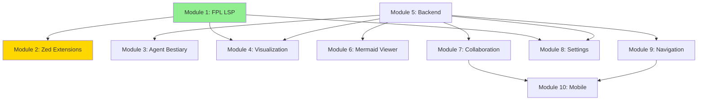

# Fermi Forecasting IDE - Master Roadmap

**Project:** Fermi Forecasting IDE  
**Vision:** Transform Zed into a specialized forecasting workbench  
**Status:** Phase 0 - Planning Complete, Phase 1 - Starting  
**Last Updated:** 2026-02-04

---

## Project Vision

Transform Zed from a code editor into a **Forecasting MMOG Client** where:
- FPL (Forecasting Programming Language) is the primary language
- Agents are first-class citizens with visual "bestiary" management
- Forecasts are living dynamic indexes, not static results
- Collaboration is native (tournaments, leaderboards, shared forecasts)

---

## Current Status

### ✅ Phase 0: FPL Core Engine (COMPLETE)
**Duration:** 5 weeks  
**Status:** ✅ Complete (v0.4.0)

**Achievements:**
- Lexer (900 lines, 13 tests)
- Parser (850 lines, 8 tests)
- Semantic Analyzer (1,020 lines, 12 tests)
- Execution Engine (1,330 lines, 26 tests)
- **Total:** ~4,950 lines, 59/59 tests passing

**Deliverable:** Complete FPL language processor that can execute Monte Carlo forecasts

---

## Implementation Phases

### 🔄 Phase 1: Core FPL Experience (Current)
**Duration:** 3 weeks (Weeks 6-8)  
**Modules:** Module 1 (FPL LSP), Module 2 (Zed Extensions)  
**Goal:** Write and execute .fpl files in Zed with real-time coaching

**Milestones:**
- [ ] FPL Language Server with LSP protocol (tower-lsp)
- [ ] Incremental parsing (salsa or rowan)
- [ ] Zed extension: tree-sitter grammar for syntax highlighting
- [ ] Inline diagnostics (errors, warnings)
- [ ] Fermi coaching (inline suggestions)
- [ ] Execute command (Cmd+R)
- [ ] Basic results panel (text output)

**Deliverable:** Users can write FPL in Zed, get real-time feedback, execute forecasts

**Start Date:** 2026-02-04  
**Target Completion:** 2026-02-25

---

### 🎯 Phase 2: Agent Bestiary (Next)
**Duration:** 3 weeks (Weeks 9-11)  
**Modules:** Module 3 (Agent Bestiary), Module 5 (Backend - partial)  
**Goal:** Visual agent management with ACP integration

**Milestones:**
- [ ] Fermi Backend (Rust) - Agent Registry (ACP-compatible)
- [ ] Agent Coordinator (async execution with callbacks)
- [ ] Basic auth (email/password + API keys)
- [ ] REST API for Zed
- [ ] Zed extension: Agent Bestiary panel
- [ ] Agent cards with yokai avatars
- [ ] Handle system (drag agent → insert in FPL)
- [ ] Agent execution from FPL code
- [ ] Manual review workflow

**Deliverable:** Users can browse agents, drag them into forecasts, execute with LLMs

**Target Start:** 2026-02-25  
**Target Completion:** 2026-03-18

---

### 📊 Phase 3: Visualization & Results
**Duration:** 2 weeks (Weeks 12-13)  
**Modules:** Module 4 (Visualization), Module 6 (Mermaid Viewer)  
**Goal:** Rich forecast visualization

**Milestones:**
- [ ] Charting library integration (Plotly or plotters)
- [ ] Forecast results panel (histograms, statistics)
- [ ] Tufte-style inline sparklines
- [ ] Distribution plots
- [ ] Confidence interval visualizations
- [ ] Mermaid ER diagram viewer
- [ ] Agent ontology visualization
- [ ] Model structure diagrams

**Deliverable:** Beautiful, information-dense forecast visualization

**Target Start:** 2026-03-18  
**Target Completion:** 2026-04-01

---

### 🤝 Phase 4: Collaboration Foundation
**Duration:** 3 weeks (Weeks 14-16)  
**Modules:** Module 5 (Backend - complete), Module 9 (Navigation)  
**Goal:** Multi-user forecasting basics

**Milestones:**
- [ ] PostgreSQL schema (forecasts, users, executions)
- [ ] Forecast storage and versioning
- [ ] User accounts & authentication
- [ ] Forecast library (browse, search, filter)
- [ ] Tag-based organization
- [ ] Share forecast (get link)
- [ ] View shared forecasts (read-only)
- [ ] Command palette navigation
- [ ] No-file-tree alternative UI

**Deliverable:** Users can save, share, and discover forecasts

**Target Start:** 2026-04-01  
**Target Completion:** 2026-04-22

---

### 🏆 Phase 5: Tournament System
**Duration:** 3 weeks (Weeks 17-19)  
**Modules:** Module 7 (Collaboration & Tournaments)  
**Goal:** Competitive forecasting (MMOG features)

**Milestones:**
- [ ] Tournament creation/management
- [ ] Tournament submission system
- [ ] Leaderboard calculation (Brier scores)
- [ ] Calibration tracking
- [ ] Resolve mechanism (outcome entry)
- [ ] Tournament browser UI
- [ ] Leaderboard display
- [ ] Personal calibration stats
- [ ] Real-time leaderboard updates

**Deliverable:** Full MMOG-style forecasting tournaments

**Target Start:** 2026-04-22  
**Target Completion:** 2026-05-13

---

### ⚙️ Phase 6: Polish & Configuration
**Duration:** 2 weeks (Weeks 20-21)  
**Modules:** Module 8 (Settings)  
**Goal:** Settings, preferences, customization

**Milestones:**
- [ ] Settings system (global, per-forecast, per-workspace)
- [ ] Agent-assisted configuration (ask Fermi to change settings)
- [ ] Traditional settings UI (backup)
- [ ] Theme customization
- [ ] Keyboard shortcuts configuration
- [ ] Execution preferences (iterations, timeout)
- [ ] Agent preferences (review mode, timeout)
- [ ] UI layout customization

**Deliverable:** Configurable, user-friendly system

**Target Start:** 2026-05-13  
**Target Completion:** 2026-05-27

---

### 📱 Phase 7: Mobile Client (Future)
**Duration:** 4-6 weeks (TBD)  
**Modules:** Module 10 (Mobile)  
**Goal:** Mobile forecasting experience

**Status:** Deferred - design phase only for now

**Potential Features:**
- View forecasts (read-only)
- Agent management (trigger research)
- Approve agent results
- Tournament participation
- Push notifications
- Light editing (parameter adjustments)

**Target Start:** TBD (after Phase 6 complete)

---

## Module Dependencies

**Legend:**
- 🟢 Green: Phase 1 (Current)
- 🟡 Yellow: Phase 2 (Next)
- ⚪ White: Future phases

---

## Technology Stack

### Frontend (Zed Extensions)
- **Language:** Rust
- **Framework:** Zed Extension API
- **UI:** Native Zed panels + custom extensions
- **Syntax:** tree-sitter grammar for FPL

### Language Server (FPL LSP)
- **Language:** Rust
- **Framework:** tower-lsp (LSP protocol)
- **Parsing:** salsa or rowan (incremental)
- **Execution:** Existing Fermi executor

### Backend (Fermi Backend)
- **Language:** Rust (rebuild from Node.js)
- **Framework:** axum or actix-web
- **Database:** PostgreSQL
- **Real-time:** WebSocket (async notifications)
- **Agents:** ACP (Agent Communication Protocol)

### External Services
- **LLMs:** Claude (Anthropic), GPT (OpenAI)
- **Tools:** MCP (Model Context Protocol) servers
- **Ontology:** Custom storage (evolving ER diagrams)

---

## Key Metrics & KPIs

### Performance Targets
- [ ] LSP response time: <50ms (diagnostics)
- [ ] Forecast execution: <100ms (10K iterations)
- [ ] Agent response: <30s (LLM calls)
- [ ] Page load: <1s (forecast library)
- [ ] Sync latency: <500ms (collaboration)

### User Experience Targets
- [ ] Time to first forecast: <5 minutes (new user)
- [ ] Coaching acceptance rate: >60% (suggestions used)
- [ ] Agent discovery rate: >80% (users find relevant agents)
- [ ] Tournament participation: >50% (active users)

### Technical Debt
- [ ] Test coverage: >80% (all modules)
- [ ] Documentation: 100% (public APIs)
- [ ] Code review: 100% (all PRs reviewed)
- [ ] Performance regression: 0 (monitored)

---

## Risk Management

### Critical Risks
| Risk | Impact | Probability | Mitigation |
|------|--------|-------------|------------|
| Zed Extension API limitations | High | Medium | Prototype early, have fallback plan |
| Incremental parsing complexity | High | Medium | Use proven libraries (salsa/rowan) |
| Agent integration issues | Medium | Medium | Start with simple agents, iterate |
| Scale performance issues | Medium | Low | Load test early, optimize incrementally |

### Risk Monitoring
- Weekly risk review in sprint retrospective
- Performance benchmarking every sprint
- User feedback collection (when available)

---

## Decision Log

Major architectural decisions are tracked as ADRs (Architecture Decision Records):

1. [ADR-001: Architecture Option C](decisions/001_architecture_option_c.md) - 2026-02-04
2. [ADR-002: Rust Backend Rebuild](decisions/002_rust_backend_rebuild.md) - 2026-02-04
3. *(More ADRs to be created as decisions are made)*

See [DECISIONS.md](DECISIONS.md) for full index.

---

## Team & Resources

### Current Status
- **Phase:** Planning → Implementation
- **Focus:** Module 1 (FPL LSP) + Module 2 (Zed Extensions)
- **Sprint:** Sprint 1 (Week 6)

### Documentation
- [Module Architecture](roadmap/MODULE_ARCHITECTURE.md) - High-level design
- [Project Rules](PROJECT_RULES.md) - Context management, workflows
- [Module 01: FPL LSP](modules/01_FPL_LSP.md) - *(to be created)*
- [Module 02: Zed Extensions](modules/02_ZED_EXTENSIONS.md) - *(to be created)*

### Communication
- All decisions documented in `docs/decisions/`
- Session summaries in `docs/sessions/`
- Open questions tracked in `docs/TODO.md`

---

## Success Criteria

### Phase 1 Success (Core FPL Experience)
- [ ] User can write .fpl file in Zed
- [ ] Syntax highlighting works
- [ ] Real-time diagnostics appear
- [ ] Fermi coaching provides helpful suggestions
- [ ] Execute command runs forecast
- [ ] Results display in panel
- [ ] Performance: <50ms diagnostics, <100ms execution

### Phase 2 Success (Agent Bestiary)
- [ ] Agent bestiary panel displays agents
- [ ] User can drag agent into code
- [ ] Agent execution is async with callbacks
- [ ] Manual review workflow works
- [ ] At least 5 agents available
- [ ] Agent cards show status/usage

### MVP Success (End of Phase 4)
- [ ] 10+ users can use system
- [ ] Forecasts can be created, executed, shared
- [ ] Agents enhance forecasts meaningfully
- [ ] Visualization is clear and useful
- [ ] System is stable (no crashes)

### Full Launch Success (End of Phase 6)
- [ ] 100+ users actively forecasting
- [ ] 10+ active tournaments
- [ ] Calibration scores tracked
- [ ] Community engagement (forums, discussions)
- [ ] Positive user feedback (>4/5 rating)

---

## Versioning Strategy

### Current Version
**v0.4.0** - Core FPL Engine Complete

### Future Versions
- **v0.5.0** - FPL LSP + Zed Extensions (Phase 1)
- **v0.6.0** - Agent Bestiary (Phase 2)
- **v0.7.0** - Visualization (Phase 3)
- **v0.8.0** - Collaboration (Phase 4)
- **v0.9.0** - Tournaments (Phase 5)
- **v1.0.0** - Full Launch (Phase 6 complete)
- **v2.0.0** - Mobile Client (Phase 7)

---

## Quick Links

### Documentation
- [Module Architecture](roadmap/MODULE_ARCHITECTURE.md)
- [Sprint Plan](roadmap/SPRINT_PLAN.md) *(to be created)*
- [Project Rules](PROJECT_RULES.md)
- [TODO List](TODO.md) *(to be created)*
- [Decisions Index](DECISIONS.md) *(to be created)*

### Code
- [FPL Core Engine](/src) - Lexer, Parser, Semantic, Executor
- [Language Server](/src/lsp) *(to be created)*
- [Zed Extensions](/extensions) *(to be created)*
- [Backend](/backend) *(to be created)*

### Current Sprint
- **Sprint 1** - Module 1 (FPL LSP)
- **Duration:** Weeks 6-7
- **Status:** Starting
- **Next Review:** 2026-02-11

---

## How to Contribute

1. **Read the docs:** Start with [PROJECT_RULES.md](PROJECT_RULES.md)
2. **Pick a module:** See [Module Architecture](roadmap/MODULE_ARCHITECTURE.md)
3. **Check open questions:** Review module docs for unanswered questions
4. **Create ADR:** Document any architectural decisions
5. **Write code:** Follow Rust conventions, add tests
6. **Update docs:** Keep module docs current
7. **Submit PR:** Reference relevant ADRs and discussions

---

## Contact & Support

**Project Lead:** [Your Name]  
**Repository:** [GitHub URL]  
**Documentation:** `/home/ilabra/fermi/docs/`  
**Issues:** See module docs for open questions

---

**Last Updated:** 2026-02-04  
**Next Review:** After Phase 1 completion (Week 8)  
**Version:** 1.0
