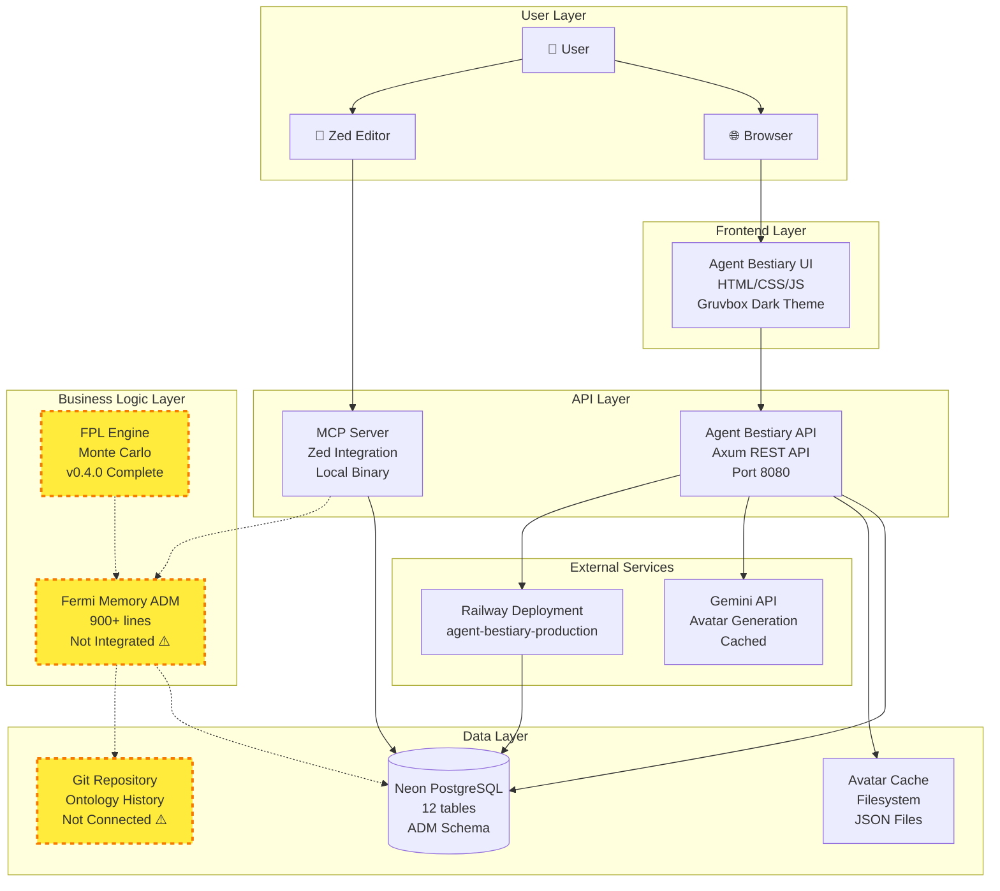
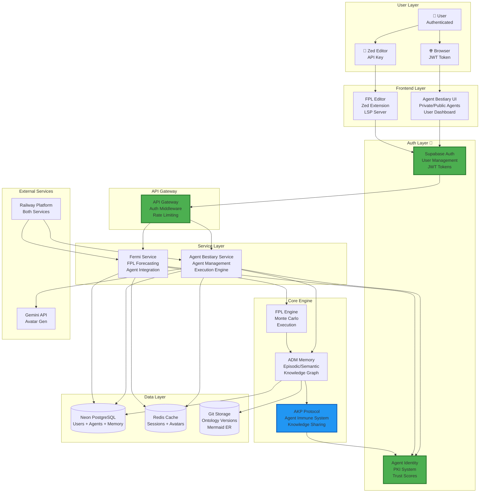
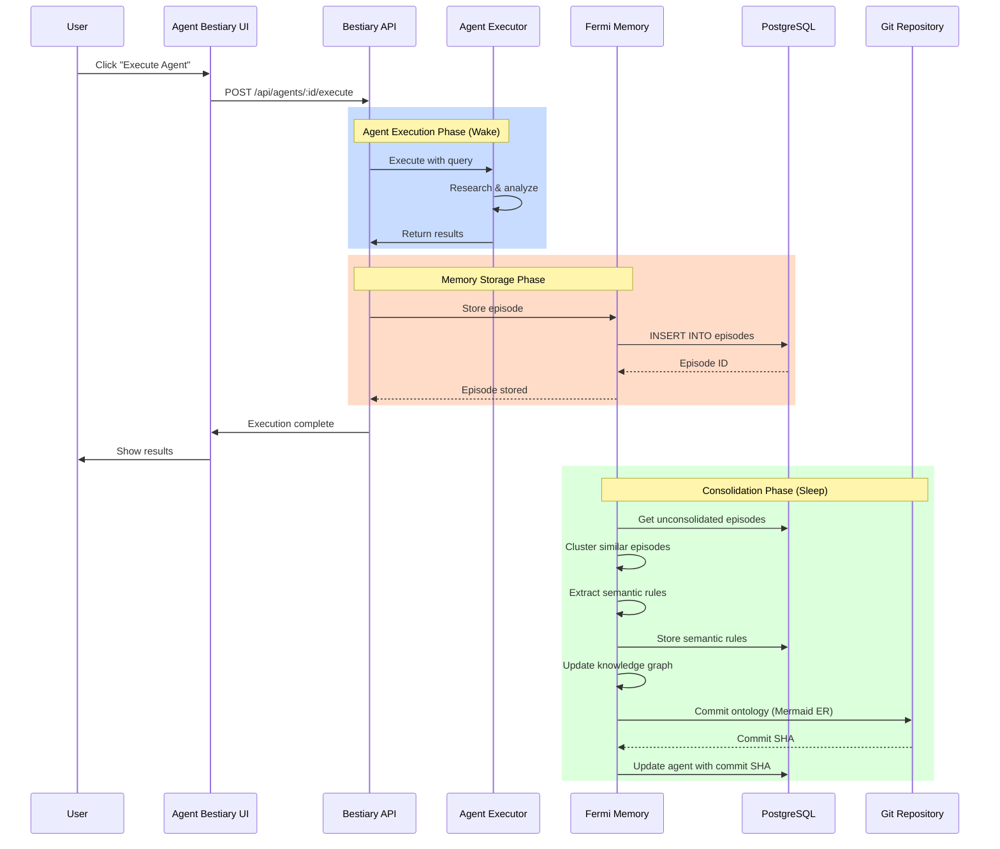
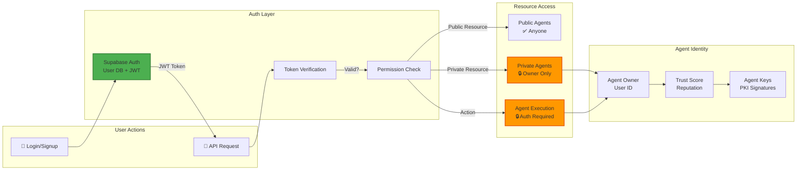
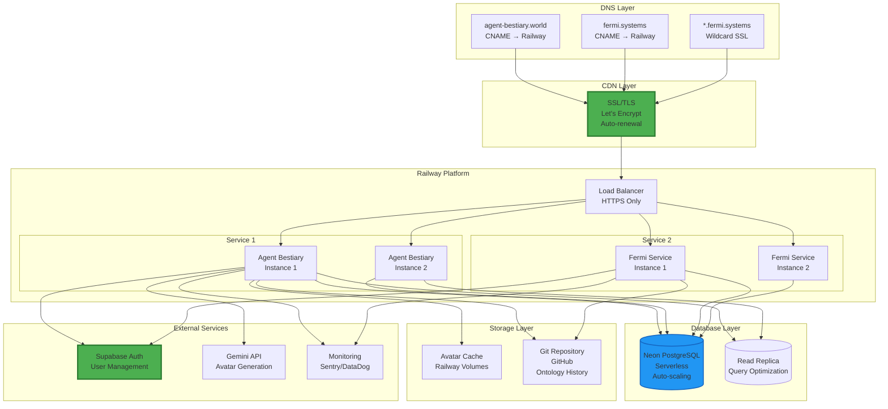
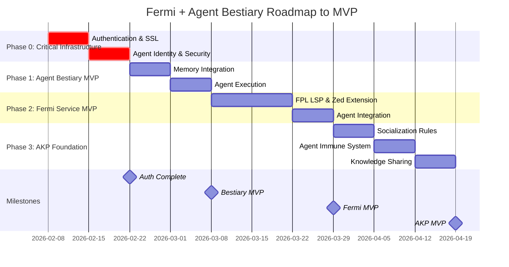

# State of the Project - Comprehensive Review

**Date:** 2026-02-08  
**Status:** Foundation Strong, Critical Gaps Identified, Clear Path Forward  
**Overall Health:** 5.3/10 - Functional but not production-ready

---

## 🎯 Executive Summary

**What We Have:** Beautiful, functional foundation with 4 working services  
**What We Need:** Authentication, security, integration, and AKP design  
**Time to MVP:** 10 weeks with focused execution  
**Overall Health:** 5.3/10 - Functional but not production-ready

---

## 📊 Project Metrics

### Code Base
- **Total Lines:** ~14,839 lines of code
- **Rust Files:** 135
- **Languages:** Rust, HTML/CSS, SQL
- **Recent Activity:** 27 commits in 2 days
- **Test Coverage:** ~5% (↑ from 1%)

### Services Status
```
┌─────────────────────────────────────────┐
│ Service              │ Status │ Ready?  │
├─────────────────────────────────────────┤
│ Agent Bestiary       │   90%  │ No auth │
│ FPL Engine           │  100%  │ Yes ✅  │
│ MCP Server           │  100%  │ Yes ✅  │
│ Fermi Memory (ADM)   │   90%  │ Not int │
└─────────────────────────────────────────┘
```

---

## 🏗️ Architecture Diagrams

### Current Architecture (As-Is)



**Legend:**
- Solid lines (→): Active connections
- Dashed lines (-.->): Planned but not connected
- Yellow highlight: Not integrated yet

### Target Architecture (To-Be with Auth)



### Data Flow: Agent Execution with ADM



### Authentication & Authorization Flow



### AKP (Agent Knowledge Protocol) Architecture

```mermaid
graph TB
    subgraph "Agent Layer"
        A1[Agent 1<br/>Market Research<br/>Trust: 0.85]
        A2[Agent 2<br/>Sentiment Analysis<br/>Trust: 0.92]
        A3[Agent 3<br/>New Agent<br/>Trust: 0.50]
    end

    subgraph "AKP Protocol Layer"
        Social[Socialization Rules<br/>Whitelist/Blacklist<br/>Consent Mechanism]
        Immune[Immune System<br/>Inoculation<br/>Quarantine]
        Verify[Verification System<br/>Contradiction Check<br/>Trust Calculation]
    end

    subgraph "Knowledge Layer"
        Ontology1[Ontology 1<br/>8 entities<br/>8 relationships]
        Ontology2[Ontology 2<br/>10 entities<br/>10 relationships]
        Alignment[Ontology Alignment<br/>Entity Mapping<br/>Concept Translation]
    end

    subgraph "Knowledge Transfer"
        Rule1[Semantic Rule<br/>"Check multiple sources"<br/>Confidence: 0.85]
        Rule2[Semantic Rule<br/>"Verify sentiment context"<br/>Confidence: 0.92]
        Transfer[Knowledge Transfer<br/>Trust-Based Sharing]
    end

    A1 --> Social
    A2 --> Social
    A3 --> Social
    
    Social --> |Approved?| Immune
    Immune --> |Quarantine| A3
    Immune --> |Pass| Verify
    
    Verify --> Transfer
    
    A1 --> Ontology1
    A2 --> Ontology2
    
    Ontology1 --> Alignment
    Ontology2 --> Alignment
    
    Alignment --> Transfer
    
    A1 --> Rule1
    A2 --> Rule2
    
    Rule1 --> Transfer
    Rule2 --> Transfer
    
    Transfer --> |Learn| A1
    Transfer --> |Learn| A2

    style A3 fill:#ffeb3b,stroke:#f57c00,stroke-width:3px
    style Immune fill:#f44336,stroke:#c62828,stroke-width:2px
    style Transfer fill:#4caf50,stroke:#2e7d32,stroke-width:2px
```

### Deployment Architecture



---

## ✅ What's Working Well

### 1. Agent Bestiary (Web Service) - 90% Complete

**Live:** https://agent-bestiary-production.up.railway.app  
**Domain:** agent-bestiary.world (SSL provisioning)

**Features Complete:**
- ✅ Beautiful architectural UI (Gruvbox Dark, Lacaton & Vassal inspired)
- ✅ Agent catalogue with circular avatars
- ✅ Detailed agent pages with all fields
- ✅ AI-generated avatars (Gemini, Hasui Kawase style)
- ✅ Avatar caching system
- ✅ Interactive D3.js ontology visualization
- ✅ Economic ledger with cost statistics
- ✅ Public crypto wallet display
- ✅ MCP tools display
- ✅ Sample ontologies seeded
- ✅ "Hire Agent" button placeholder
- ✅ REST API endpoints
- ✅ PostgreSQL database (Neon)
- ✅ Railway deployment pipeline

**What's Missing:**
- ❌ User authentication
- ❌ Agent execution (display only)
- ❌ ADM integration (memory tracking)
- ⚠️ Mermaid ER ontology (D3 is placeholder)
- ❌ API rate limiting
- ❌ Input validation

**Code Quality:** 8/10 - Clean, well-structured

### 2. FPL Core Engine - 100% Complete ✅

**Status:** Production-ready  
**Version:** v0.4.0

**Features:**
- ✅ Complete lexer (900 lines, 13 tests)
- ✅ Complete parser (850 lines, 8 tests)
- ✅ Semantic analyzer (1,020 lines, 12 tests)
- ✅ Execution engine (1,330 lines, 26 tests)
- ✅ Monte Carlo simulation
- ✅ All 59 tests passing
- ✅ Comprehensive documentation

**What's Missing:**
- ❌ Not integrated with agents yet
- ❌ No LSP for Zed editor
- ❌ No web interface

**Code Quality:** 9/10 - Excellent, well-tested

### 3. MCP Server (Zed Integration) - 100% Complete ✅

**Status:** Working locally  
**Binary:** `/home/ilabra/fermi/target/debug/agent-mcp-server`

**Features:**
- ✅ 4 tools implemented:
  - `list_agents` - Browse agent catalogue
  - `get_agent` - Get detailed agent info
  - `execute_agent` - Run research queries
  - `save_agent` - Save stats and commit to git
- ✅ Configured in Zed (`~/.config/zed/settings.json`)
- ✅ Running processes verified

**What's Missing:**
- ❌ Not deployed to Railway (local only)
- ❌ No authentication
- ❌ Limited testing

**Code Quality:** 8/10 - Clean implementation

### 4. Fermi Memory (ADM) - 90% Phase 1 Complete

**Status:** Foundation solid, not integrated  
**Crate:** `fermi-memory`

**Features Complete:**
- ✅ Core types (900+ lines):
  - Episode (episodic memory)
  - SemanticRule (consolidated knowledge)
  - Entity, Relationship, Fact (knowledge graph)
- ✅ MemoryStore with PostgreSQL connection pooling
- ✅ Episode CRUD operations
- ✅ Semantic rule CRUD operations
- ✅ Database connected (Neon, shared with Bestiary)
- ✅ 20 integration tests
- ✅ Error handling
- ✅ Comprehensive documentation

**What's Missing:**
- ❌ Not used by Agent Bestiary yet
- ❌ Embedding generation (Phase 2)
- ❌ Consolidation engine (Phase 3)
- ❌ Git integration (Phase 4)
- ❌ Mermaid ontology viz (Phase 5)

**Code Quality:** 8/10 - Solid abstractions

### 5. Testing Infrastructure - NEW! ✅

**Status:** Foundation complete  
**Coverage:** ~5% (target: 70%)

**Features:**
- ✅ GitHub Actions CI/CD pipeline
- ✅ PostgreSQL test database automation
- ✅ 4 quality gates (test, clippy, fmt, audit)
- ✅ 20 integration tests (fermi-memory)
- ✅ 5 API test stubs
- ✅ Testing strategy documented
- ✅ Runs on every commit/PR

**What's Missing:**
- ❌ Low coverage (need 150+ more tests)
- ❌ No mocking framework yet
- ❌ API tests need implementation
- ❌ No E2E tests

**Code Quality:** 9/10 - Great foundation

---

## 🚨 Critical Gaps (Blockers to Production)

### 1. Authentication & Authorization - 2/10 🔴 CRITICAL

**Current State:** NONE WHATSOEVER

**What's Missing:**
- ❌ No user accounts
- ❌ No login/logout
- ❌ No sessions
- ❌ No API authentication
- ❌ No permissions/roles
- ❌ No private/public distinction
- ❌ No API keys

**Impact:**
- 🚫 Anyone can access everything
- 🚫 No user-owned agents
- 🚫 No private data
- 🚫 AKP impossible (agents need identity)
- 🚫 Can't charge users
- 🚫 Security nightmare

**Priority:** CRITICAL - Blocks everything

**Recommendation:** Supabase Auth (Neon-compatible, fast to implement)

### 2. Security - 2/10 🔴 CRITICAL

**Vulnerabilities:**
- ❌ No input validation
- ❌ No rate limiting
- ❌ 1 known dependency vulnerability
- ⚠️ Potential XSS in templates
- ⚠️ SQL injection risk (parameterized queries help but not audited)
- ❌ No HTTPS enforcement
- ❌ No security headers

**Impact:**
- 🚫 Open to attacks
- 🚫 Data compromise risk
- 🚫 Service disruption possible
- 🚫 Reputation damage potential

**Priority:** CRITICAL - Can't launch publicly

**Recommendation:** Security audit + implement auth + add validation

### 3. Testing - 1/10 🔴 CRITICAL

**Current Coverage:** ~5%

**What's Missing:**
- ❌ Agent Bestiary: 0 tests
- ❌ API endpoints: 0 real tests (5 stubs)
- ❌ Integration tests: Minimal
- ❌ E2E tests: None
- ❌ Performance tests: None
- ❌ Security tests: None

**Impact:**
- 🚫 Can't refactor safely
- 🚫 Regressions likely
- 🚫 Bugs in production
- 🚫 No confidence in changes

**Priority:** HIGH - Risky without tests

**Recommendation:** 20% coverage this week, 40% next week

### 4. Agent Knowledge Protocol (AKP) - 0/10 🟡 DESIGN NEEDED

**Current State:** Conceptual only

**What's Missing:**
- ❌ Agent identity system
- ❌ Trust framework
- ❌ Socialization rules (who can interact)
- ❌ Inoculation rules (protect against bad knowledge)
- ❌ Quarantine rules (isolate problematic agents)
- ❌ Agent immune system
- ❌ Knowledge sharing protocols
- ❌ Consent mechanisms
- ❌ Ontology alignment

**Impact:**
- 🚫 Agents can't learn from each other (yet)
- 🚫 No safe knowledge propagation
- 🚫 Vision of "dreaming agents" incomplete

**Priority:** MEDIUM - Needed for differentiation

**Recommendation:** Design Phase 3 (weeks 8-10), implement after MVP basics

### 5. Service Integration - 3/10 🟡 NEEDS WORK

**Current State:** Services are siloed

**What's Missing:**
- ❌ Agent Bestiary doesn't use fermi-memory
- ❌ FPL engine not integrated with agents
- ❌ MCP server separate from web service
- ❌ No unified authentication
- ❌ Agents can't execute (display only)
- ❌ No forecast storage

**Impact:**
- 🚫 Services don't work together
- 🚫 Value not realized
- 🚫 User experience fragmented

**Priority:** HIGH - Needed for MVP

**Recommendation:** Integration sprints (weeks 3-4, 5-7)

---

## 📈 Health Scores by Category

```
Functionality:    ████████░░  8/10  Most features work
Code Quality:     ███████░░░  7/10  Clean but needs tests
Security:         ██░░░░░░░░  2/10  Major gaps 🔴
Performance:      ██████░░░░  6/10  Works but not optimized
Documentation:    ██████░░░░  6/10  Session notes good, code docs sparse
Testing:          █░░░░░░░░░  1/10  Almost none 🔴
Deployment:       ███████░░░  7/10  Works but manual
Integration:      ███░░░░░░░  3/10  Services siloed

OVERALL:          █████░░░░░  5.3/10
```

**Diagnosis:** Beautiful foundation, critical gaps prevent production launch

---

## 🗺️ Roadmap to MVP (10 Weeks)



### Phase 0: Critical Infrastructure (Weeks 1-2) **← START HERE**

**Week 1: Authentication & SSL**
- [ ] Set up fermi.systems SSL certificates
- [ ] Choose auth provider (Supabase recommended)
- [ ] Implement user registration/login
- [ ] Add JWT token management
- [ ] Secure API endpoints
- [ ] Add API key system

**Week 2: Agent Identity & Security**
- [ ] Add agent ownership (user_id → agent_id)
- [ ] Implement private/public agents
- [ ] Add input validation
- [ ] Add rate limiting
- [ ] Fix security vulnerability
- [ ] Security audit

**Deliverable:** Services are secure and authenticated

### Phase 1: Agent Bestiary MVP (Weeks 3-4)

**Week 3: Memory Integration**
- [ ] Integrate fermi-memory with Agent Bestiary
- [ ] Track agent executions as episodes
- [ ] Display memory statistics
- [ ] Replace D3 with Mermaid ER from git
- [ ] Add ontology time-travel

**Week 4: Agent Execution**
- [ ] Implement actual agent execution
- [ ] Store results in ADM
- [ ] Track costs and performance
- [ ] Manual review workflow
- [ ] Agent execution history

**Deliverable:** Agents work and learn from executions

### Phase 2: Fermi Service MVP (Weeks 5-7)

**Week 5-6: FPL LSP & Zed Extension**
- [ ] Build FPL language server (tower-lsp)
- [ ] Create Zed extension
- [ ] Syntax highlighting
- [ ] Real-time diagnostics
- [ ] Execute command (Cmd+R)
- [ ] Results panel

**Week 7: Agent Integration**
- [ ] Run agents from FPL code
- [ ] Store forecasts with user accounts
- [ ] Link agents to forecasts
- [ ] Agent suggestions in FPL

**Deliverable:** Full forecasting workflow in Zed

### Phase 3: AKP Foundation (Weeks 8-10)

**Week 8: Socialization Rules**
- [ ] Design agent socialization protocols
- [ ] Implement whitelist/blacklist
- [ ] Add consent mechanisms
- [ ] Create interaction logs
- [ ] Agent identity with PKI

**Week 9: Agent Immune System**
- [ ] Design inoculation rules
- [ ] Implement quarantine mechanisms
- [ ] Build verification system
- [ ] Add anomaly detection
- [ ] Trust score calculation

**Week 10: Knowledge Sharing**
- [ ] Ontology alignment basics
- [ ] Knowledge transfer protocols
- [ ] Trust-based sharing
- [ ] Test agent-to-agent learning
- [ ] Document AKP v1

**Deliverable:** Safe agent-to-agent knowledge sharing

---

## 💰 What Success Looks Like

### Agent Bestiary MVP Success
- [ ] 10+ curated agents
- [ ] Users can create accounts
- [ ] Users can "hire" agents
- [ ] Agents execute and store results
- [ ] ADM tracks agent memories
- [ ] Mermaid ER shows ontology evolution
- [ ] Basic usage analytics

### Fermi Service MVP Success
- [ ] FPL works in Zed
- [ ] Users can write forecasts
- [ ] Agents can run from FPL
- [ ] Forecasts are stored
- [ ] Results are visualized
- [ ] Authentication integrated

### AKP MVP Success (Future)
- [ ] Agents have identity
- [ ] Basic socialization rules work
- [ ] Simple inoculation implemented
- [ ] 2+ agents share knowledge safely
- [ ] Trust scores calculated
- [ ] Quarantine works

---

## 🎯 Strategic Decisions Needed

### 1. Authentication Provider
**Decision Required:** Which auth system?

**Options:**
- A) **Supabase Auth** ⭐ RECOMMENDED
  - Pro: Neon-compatible (both Postgres)
  - Pro: Fast to implement
  - Pro: Good docs
  - Con: Vendor lock-in (but open source)
  
- B) Custom Auth
  - Pro: Full control
  - Con: Security risk
  - Con: Months of work
  
- C) Auth0/Clerk
  - Pro: Enterprise-grade
  - Con: Expensive
  - Con: Overkill for MVP

**Recommendation:** Supabase Auth - fast, reliable, Postgres-native

### 2. Service Architecture
**Decision Required:** Merge or keep separate?

**Current:** Two separate services (Agent Bestiary, Fermi Service)

**Options:**
- A) **Keep Separate** ⭐ RECOMMENDED
  - Pro: Clear separation of concerns
  - Pro: Independent deployment
  - Pro: Can scale separately
  - Con: Need shared auth service
  
- B) Merge into Monolith
  - Pro: Simpler auth
  - Pro: Easier integration
  - Con: Tight coupling
  - Con: Complex codebase

**Recommendation:** Keep separate, build shared auth service

### 3. AKP Scope
**Decision Required:** How ambitious?

**Options:**
- A) **Minimal Viable AKP** ⭐ RECOMMENDED
  - Basic whitelist/blacklist
  - Simple verification
  - Trust score only
  - Pro: Fast to MVP
  - Con: Limited functionality
  
- B) Full Protocol
  - Complete immune system
  - Complex trust model
  - All socialization rules
  - Pro: Vision realized
  - Con: 6+ months of work

**Recommendation:** Minimal viable, iterate based on usage

### 4. Deployment Strategy
**Decision Required:** How to deploy both services?

**Current:** Only Agent Bestiary on Railway

**Options:**
- A) **Both on Railway** ⭐ RECOMMENDED
  - Pro: Simple
  - Pro: Same platform
  - Con: Railway cost scales
  
- B) Split platforms (Railway + Vercel)
  - Pro: Optimize per service
  - Con: Complex coordination
  
- C) Self-hosted (AWS/GCP)
  - Pro: Full control
  - Con: DevOps overhead

**Recommendation:** Both on Railway for now, optimize later

---

## 🔥 Immediate Priorities (This Week)

### Must Do
1. **Start Phase 0** - Authentication is blocking everything
2. **Choose auth provider** - Supabase recommended
3. **Set up fermi.systems SSL** - Need secure domains
4. **Increase test coverage** - Get to 20%
5. **Fix security vulnerability** - Address Dependabot warning

### Should Do
1. Review GitHub Actions status
2. Refactor api_server.rs for testability
3. Document auth architecture
4. Plan agent identity system
5. Start API endpoint tests

### Could Do
1. Add more agents to bestiary
2. Improve error messages
3. Add monitoring/observability
4. Performance profiling
5. User feedback collection

---

## 📚 Documentation Status

### Excellent ✅
- Session summaries (1,400+ lines)
- ADM architecture
- Testing strategy
- Code health assessment
- Roadmaps

### Good ⚠️
- README (updated for two-service architecture)
- fermi-memory docs
- FPL engine docs

### Needs Work ❌
- API documentation (OpenAPI spec?)
- User guides
- Architecture diagrams
- Code comments (sparse)
- Deployment guides

---

## 💡 Key Insights

### What's Working
1. **Beautiful UI** - Agent Bestiary looks professional
2. **Solid foundation** - FPL engine, ADM architecture are strong
3. **Working deployment** - Railway pipeline works well
4. **Clear vision** - AKP concept is compelling
5. **Good documentation** - Session notes are comprehensive

### What's Blocking
1. **No authentication** - Critical blocker for everything
2. **Poor test coverage** - Too risky to move fast
3. **Services siloed** - Not working together yet
4. **Security gaps** - Can't launch publicly
5. **AKP undefined** - Need design before implementation

### What's Next
1. **Phase 0 first** - Auth and security are foundation
2. **Integrate services** - Make them work together
3. **Test everything** - Build confidence
4. **Design AKP** - Plan agent immune system
5. **MVP in 10 weeks** - Realistic timeline with focus

---

## 🎓 Lessons Learned

### Do More Of
- Iterative polish (UI looks great)
- Comprehensive documentation
- Planning before coding
- Beautiful first (helps visualize)
- Honest assessment (found gaps early)

### Do Less Of
- Building without tests
- Skipping authentication
- Working in silos
- Scope creep
- Deferring security

### Remember
- **Beautiful ≠ Production-ready** - Need security
- **Foundation ≠ Integration** - Services must work together
- **Vision ≠ Implementation** - AKP needs design
- **Fast ≠ Right** - Better to pause and plan
- **Tests ≠ Optional** - Critical for quality

---

## 🚀 The Path Forward

### This Week (Week 1)
**Focus:** Authentication & SSL
- Set up auth provider
- Implement user accounts
- Secure API endpoints
- Get SSL certificates
- Increase test coverage to 20%

### Next Week (Week 2)
**Focus:** Agent Identity & Security
- Add agent ownership
- Private/public agents
- Input validation
- Rate limiting
- Security audit complete

### Following Weeks
**Focus:** Integration & MVP
- Connect services
- Agent execution
- FPL in Zed
- AKP foundation
- Launch MVP 🎉

---

## 📊 Final Assessment

**Current State:**
- **Code:** 14,839 lines, 135 files
- **Services:** 4 working (2 production-ready)
- **Coverage:** 5% tests
- **Security:** 2/10 (critical gaps)
- **Overall:** 5.3/10 (functional, not production-ready)

**Target State (10 weeks):**
- **Code:** ~25,000 lines (estimated)
- **Services:** 4 integrated and secure
- **Coverage:** 70% tests
- **Security:** 8/10 (production-grade)
- **Overall:** 8/10 (production-ready MVP)

**Bottom Line:**
We have a beautiful, functional foundation but critical gaps prevent production launch. The path forward is clear: **Phase 0 (auth/security) → Integration → AKP → MVP**. With focused execution, we can reach production-ready MVP in 10 weeks.

**Recommendation:** Start Phase 0 immediately. Everything else depends on authentication.

---

**Status:** Foundation Strong ✅ | Critical Gaps Identified 🔴 | Path Clear 🗺️  
**Next Session:** Phase 0 - Authentication Architecture  
**Confidence:** High - We know exactly what needs to be done
