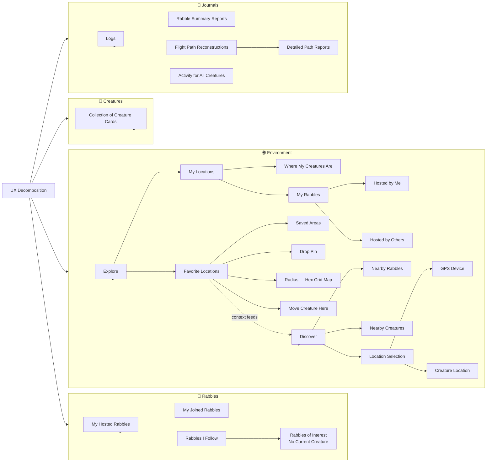

# UX Audit — Rabble + Agent Bestiary

> **Date:** 2026-02-14
> **Scope:** Flutter mobile app (Rabble), web platform (Agent Bestiary), Rust backend (Axum)
> **Input:** `docs/ux-notes.md` decomposition, `docs/ux-social-improvements.md`, codebase review
> **Goal:** Reconcile the cognitive disconnect in the UI by mapping the four-pillar decomposition to actual system state, identifying gaps, and producing an actionable plan.

---

## Table of Contents

1. [Executive Summary](#1-executive-summary)
2. [The Four-Pillar Decomposition](#2-the-four-pillar-decomposition)
3. [Pillar 1: Creatures — The Anchor Object](#3-pillar-1-creatures--the-anchor-object)
4. [Pillar 2: Rabbles — Social Context](#4-pillar-2-rabbles--social-context)
5. [Pillar 3: Environment — Spatial Awareness](#5-pillar-3-environment--spatial-awareness)
6. [Pillar 4: Journals — Temporal Record](#6-pillar-4-journals--temporal-record)
7. [The Creature Detail View as Universal Hub](#7-the-creature-detail-view-as-universal-hub)
8. [Backend Readiness Matrix](#8-backend-readiness-matrix)
9. [Web Platform (Agent Bestiary) Audit](#9-web-platform-agent-bestiary-audit)
10. [Design System Debt](#10-design-system-debt)
11. [Critical Bugs Still Open](#11-critical-bugs-still-open)
12. [Prioritised Implementation Plan](#12-prioritised-implementation-plan)
13. [Clarifying Questions](#13-clarifying-questions)

---

## 1. Executive Summary

The core UX problem is **cognitive fragmentation**: information about a creature's state is scattered across disconnected screens (rabble list, explore map, flight history, friends list, notifications). The user must hold a mental model of "where is my creature, what's it doing, who's it with" by navigating between four or five unrelated views.

The `ux-notes.md` decomposition proposes the fix: organise the entire experience around **four pillars** (Creatures, Rabbles, Environment, Journals) and treat the **Creature Detail Card as the always-current hub** that stitches them together. This audit validates that proposal against the actual codebase.

### Key findings

| Area | Status |
|------|--------|
| Backend readiness for four-pillar model | **~80%** — most endpoints exist; gaps are in the Flutter client not calling them |
| Creature Detail enrichment | **Backend done** — `social`, `active_flight`, `creature_state`, `rabble_id` all returned. **Flutter not rendering any of it.** |
| My Rabbles split (host vs participate) | **Backend done** — `GET /api/my/rabbles`. **Flutter not using it.** |
| Spatial / Environment | **Backend ~60%** — nearby, track, telemetry exist. Hex grid, favourites, "move creature here" are missing. |
| Journals / temporal record | **Backend ~40%** — flights and feed exist. Summary reports, path reconstructions, per-creature activity roll-ups are missing. |
| Web platform (Agent Bestiary) | **Three competing colour palettes**, 3,378-line workspace.html monolith, massive inline CSS duplication |
| Unverified migrations | **Migration 090** (social columns, SQL functions) and **PostGIS** availability not confirmed on prod — will cause 500s |

---

## 2. The Four-Pillar Decomposition

From `ux-notes.md`, rendered as information architecture:

```
┌──────────────────────────────────────────────────────────────────────┐
│                        UX DECOMPOSITION                              │
├────────────┬────────────┬──────────────────┬─────────────────────────┤
│ 🐾 CREATURES│ 👥 RABBLES  │ 🌍 ENVIRONMENT    │ 📓 JOURNALS             │
├────────────┼────────────┼──────────────────┼─────────────────────────┤
│ Collection │ Hosted     │ Explore          │ Logs                    │
│ of Cards   │ Joined     │  ├ My Locations  │ Rabble Summary Reports  │
│            │ Following  │  │  ├ Creatures  │ Flight Path Recon       │
│            │  └ Interest│  │  └ Rabbles    │  └ Detailed Path Reports│
│            │   (no bug) │  │    ├ Hosted   │ Activity (all creatures)│
│            │            │  │    └ Others   │                         │
│            │            │  └ Favorites     │                         │
│            │            │    ├ Saved Areas │                         │
│            │            │    ├ Drop Pin    │                         │
│            │            │    ├ Hex Radius  │                         │
│            │            │    └ Move Here   │                         │
│            │            │ Discover         │                         │
│            │            │  ├ Nearby Rabbles│                         │
│            │            │  ├ Nearby Bugs   │                         │
│            │            │  └ Location Src  │                         │
│            │            │    ├ GPS Device  │                         │
│            │            │    └ Creature Loc│                         │
└────────────┴────────────┴──────────────────┴─────────────────────────┘
```

The critical insight in the notes is the **cross-cutting principle**: the Creature Detail view must always reflect **the most recent state** drawn from all four pillars simultaneously. A creature card isn't just identity — it's identity + current rabble context + spatial position + recent activity. This is the fix for cognitive disconnect.

---

## 3. Pillar 1: Creatures — The Anchor Object

### What the decomposition says

A flat collection of Creature Cards. Each card is the primary object the user cares about. Everything else (rabbles, locations, journals) hangs off a creature.

### What the backend provides

| Endpoint | Data returned | Status |
|----------|--------------|--------|
| `GET /api/creatures` | Full list with `creature_state`, `rabble_id`, `rabble_name`, `visibility`, `presence`, `cognition_level`, `last_location_name` | ✅ Ready |
| `GET /api/creatures/:id` | All above + `social.friend_count`, `social.pending_friend_requests`, `social.rabble_role`, `social.is_tethered`, `social.is_anchor`, `active_flight.*`, `owner_display_name` | ✅ Ready |
| `GET /api/creatures/:id/image` | Persisted art (survives redeploys) | ✅ Ready |
| `GET /api/creatures/:id/friends` | Creature-to-creature friendships | ✅ Ready |
| `GET /api/creature-friendships/pending` | Inbound pending requests for my creatures | ✅ Ready |
| `POST /api/creatures` (mint) | Creates with GBIF taxonomy, Gemini art generation | ✅ Ready |

### Gaps

| Gap | Severity | Notes |
|-----|----------|-------|
| **Flutter card doesn't render social block** | 🔴 High | The data is returned but the UI shows none of it |
| **No "creature collection" grid view** | 🟡 Medium | Currently a plain list; needs a card grid with state badges |
| **No creature filtering by state** | 🟢 Low | Backend supports `?status=active` but no UI to filter by flying/perched/tethered |
| **No quick-action from card** | 🟡 Medium | Tap a card → detail view only. Should surface "Peek Rabble" / "View Track" / "Friends" inline |

### Recommendations

1. **Redesign the creature list as a card grid** with each card showing: image, name, state badge (flying/perched/tethered), rabble name chip (tappable), friend count, and a subtle location pin.
2. **The card is the entry point to everything.** Long-press or swipe should reveal contextual actions (peek rabble, view track, befriend, move to rabble).
3. **State badges use creature_state from the backend** — `flying`, `perched`, `roosting`, etc. Map each to an icon + colour.

---

## 4. Pillar 2: Rabbles — Social Context

### What the decomposition says

Three clear categories:
- **Hosted** — Rabbles I created and control
- **Joined** — Rabbles where my creature is participating
- **Following** — Rabbles I'm watching but have no creature in (the "Interest" note)

### What the backend provides

| Endpoint | Data returned | Status |
|----------|--------------|--------|
| `GET /api/my/rabbles` | `{ hosting: [...], participating: [...] }` with `my_creatures` array per rabble, ordered by `last_activity_at DESC` | ✅ Ready |
| `GET /api/swarms` / `GET /api/swarms/:id` | Full rabble details | ✅ Ready |
| `POST /api/swarms/:id/join` | Join with creature selection | ✅ Ready |
| `GET /api/swarms/join-by-qr/:token` | QR-based entry | ✅ Ready |
| `PATCH /api/swarms/:id` | Update rabble (creator only) | ✅ Ready |

### Gaps

| Gap | Severity | Notes |
|-----|----------|-------|
| **Flutter doesn't call `/api/my/rabbles`** | 🔴 High | Still using old `/api/swarms` which doesn't split host/participant |
| **No "Following" concept in backend** | 🟡 Medium | Need a `rabble_follows` table or soft-follow via contacts |
| **No "Interest" rabbles** | 🟡 Medium | Rabbles you've peeked at or bookmarked but haven't joined — no data model |
| **Rabble move endpoint incomplete** | 🟡 Medium | `PATCH /api/swarms/:id` doesn't accept `center_lat/center_lng` yet (see ux-social-improvements.md item 9) |
| **Creature picker on join is broken** | 🔴 High | Flutter not passing `owner_id` to filter creatures (item 6 from social improvements) |

### Recommendations

1. **Two-tab or two-section rabble screen**: "Hosting" and "Participating" — call `GET /api/my/rabbles`.
2. **Add a "Following" tab** backed by a lightweight `rabble_bookmarks` table (`user_id`, `swarm_id`, `created_at`). Populate from "peek" actions and explicit bookmarks.
3. **Each rabble card shows inline creature avatars** (the `my_creatures` array is already returned). Tapping a creature avatar goes to that creature's detail view.
4. **Fix the join flow** — pass `?owner_id=<user_id>` when fetching creature list for the picker.

### Backend work needed

```sql
-- New table for rabble bookmarks / following
CREATE TABLE IF NOT EXISTS rabble_bookmarks (
    id UUID PRIMARY KEY DEFAULT gen_random_uuid(),
    user_id TEXT NOT NULL REFERENCES users(user_id),
    swarm_id UUID NOT NULL REFERENCES swarm_events(swarm_id),
    created_at TIMESTAMPTZ DEFAULT NOW(),
    UNIQUE(user_id, swarm_id)
);
```

Two new endpoints:
- `POST /api/rabbles/:id/bookmark` — add bookmark
- `DELETE /api/rabbles/:id/bookmark` — remove bookmark
- `GET /api/my/rabbles` response gains a `following: [...]` array

---

## 5. Pillar 3: Environment — Spatial Awareness

### What the decomposition says

Two modes:
- **Explore** (outward from me): My Locations → where my creatures are, where my rabbles are; Favourites → saved areas, drop pin, hex grid radius, "move creature here"
- **Discover** (inward to me): Nearby Rabbles, Nearby Creatures; Location source is either GPS device or a creature's position

The cross-link from Favourites → Discover (context feeds) is key: your saved/favourite locations bias what "nearby" shows you.

### What the backend provides

| Endpoint | Data returned | Status |
|----------|--------------|--------|
| `GET /api/dashboard/nearby?lat=X&lng=Y&radius=Z` | Nearby rabbles with `distance_meters`, `user_in_area` | ✅ Ready |
| `GET /api/dashboard/my-rabbles` | My rabbles with spatial data | ✅ Ready |
| `GET /api/dashboard/creatures` | My creatures with `rabble_id`, `state`, `in_rabble_area` | ✅ Ready |
| `GET /api/creatures/:id/track?since=&limit=` | Telemetry breadcrumb trail | ✅ Ready |
| `POST /api/creatures/:id/push-telemetry` | Device → creature location push | ✅ Ready |
| Device pairing (`/api/devices/*`) | Pair/unpair/report location | ✅ Ready |

### Gaps

| Gap | Severity | Notes |
|-----|----------|-------|
| **No "Favourites" / saved locations** | 🟡 Medium | No `saved_locations` table — users can't bookmark places |
| **No "Drop Pin"** | 🟡 Medium | Needs client-side map pin → save as favourite |
| **No Hex Grid / H3 radius view** | 🟡 Medium | `h3_cell` is stored on swarms but there's no hex grid overlay endpoint or rendering |
| **No "Move Creature Here"** | 🟡 Medium | Can fly to a rabble via `/api/swarms/:id/join` but can't move a creature to an arbitrary location |
| **"Nearby Creatures" endpoint missing** | 🟡 Medium | Only nearby rabbles exist; need nearby creatures owned by other users (respecting visibility) |
| **Location Source toggle not wired** | 🟢 Low | Backend supports both GPS and creature-location telemetry, but Flutter has no UI to switch between them |
| **AR viewer buried in map** | 🟡 Medium | UX item 7 — needs to be a first-class entry point, not buried |
| **Tether track visualisation missing** | 🟡 Medium | UX item 8 — telemetry data exists, no Flutter map rendering |

### Recommendations

1. **Explore tab should be a map-first view** with two overlays:
   - My Creatures (pins with creature avatars)
   - My Rabbles (circles with radius)
   
2. **Favourites as saved map regions:**
   ```sql
   CREATE TABLE IF NOT EXISTS saved_locations (
       id UUID PRIMARY KEY DEFAULT gen_random_uuid(),
       user_id TEXT NOT NULL REFERENCES users(user_id),
       name TEXT NOT NULL,
       lat DOUBLE PRECISION NOT NULL,
       lng DOUBLE PRECISION NOT NULL,
       radius_meters INT DEFAULT 500,
       h3_cell TEXT,
       created_at TIMESTAMPTZ DEFAULT NOW()
   );
   ```

3. **Discover should support "from creature's eyes"** — location source toggle between device GPS and a selected creature's last known position. The backend telemetry endpoint already supports this; the Flutter client needs to pass the creature's position as `lat/lng` to the nearby endpoint.

4. **Hex grid overlay** — the `h3_cell` data is there. Serve an endpoint `GET /api/map/hexes?lat=X&lng=Y&radius=Z&resolution=8` that returns H3 cell boundaries as GeoJSON. Render with a map overlay.

5. **Promote the AR viewer** — make it accessible from: QR scan, proximity notification, peek button on any rabble card, and a prominent FAB on the explore map. Not buried inside a map detail panel.

---

## 6. Pillar 4: Journals — Temporal Record

### What the decomposition says

- **Logs** — raw activity stream
- **Rabble Summary Reports** — post-rabble recap
- **Flight Path Reconstructions** with detailed path reports
- **Activity for All Creatures** — aggregate view

### What the backend provides

| Endpoint | Data returned | Status |
|----------|--------------|--------|
| `GET /api/feed/events` | Activity feed, paginated, relationship-annotated | ✅ Ready |
| `GET /api/feed/stream` | SSE real-time activity stream | ✅ Ready |
| `GET /api/creatures/:id/track` | Telemetry breadcrumb points | ✅ Ready |
| `GET /api/rabble/:id/recap/:creature_id` | Post-rabble recap: who you met, friend suggestions | ✅ Ready |
| `GET /api/creatures/:id` → `total_flights`, `unique_locations` | Aggregate stats on creature | ✅ Ready |
| `GET /api/creatures/:id/flights` | Flight history | ✅ Ready |

### Gaps

| Gap | Severity | Notes |
|-----|----------|-------|
| **No "summary report" generation** | 🟡 Medium | Recap endpoint exists but doesn't generate a narrative report — just structured data |
| **No flight path reconstruction** | 🟡 Medium | Raw telemetry exists but no endpoint to stitch it into a continuous path with timestamps, speed, stops |
| **No per-creature activity roll-up** | 🟡 Medium | Feed is global; need `GET /api/creatures/:id/activity` that filters feed to events involving that creature |
| **No journal UI in Flutter** | 🔴 High | No journal/logs screen exists at all in the Flutter client |
| **No export / sharing** | 🟢 Low | Users may want to share a flight path or rabble report |

### Recommendations

1. **Add a Journals tab** to the Flutter bottom navigation. Four sub-views matching the decomposition:
   - **Activity Stream** — `GET /api/feed/events` rendered as a timeline
   - **Reports** — List of completed rabbles with "View Recap" linking to the recap endpoint
   - **Flight Paths** — List of past flights per creature with map preview
   - **All Creature Activity** — Filterable aggregate of all creatures' events

2. **New endpoint: `GET /api/creatures/:id/activity`** — filters the activity feed to events referencing a specific creature. This is the "journal entry for Luna."

3. **New endpoint: `GET /api/creatures/:id/flight-path/:flight_id`** — returns a stitched path from telemetry points as GeoJSON LineString with properties (timestamps, speed, stops, rabble crossings). This powers the "flight path reconstruction" visualization.

4. **Rabble recap should trigger a narrative summary** via the `swarm_host` agent (already used for welcome messages). After a rabble ends → agent generates a paragraph about what happened → stored as a report.

---

## 7. The Creature Detail View as Universal Hub

This is the single most important recommendation. The note in `ux-notes.md` says it directly:

> *"that in combination with the ability to always have most recent state in the creature detail view would reconcile a lot of the cognitive disconnect in the UI"*

### Current state

The backend returns a rich creature detail object:

```json
{
  "creature_id": "...",
  "specimen_name": "Luna",
  "scientific_name": "Vanessa cardui",
  "species_group": "butterfly",
  "creature_state": "flying",
  "rabble_id": "...",
  "rabble_name": "Bug Collectors",
  "social": {
    "friend_count": 3,
    "pending_friend_requests": 1,
    "rabble_role": "host",
    "is_tethered": true,
    "is_anchor": false
  },
  "active_flight": {
    "flight_id": "...",
    "data_source": "device",
    "started_at": "...",
    "location_name": "Camden Market, London"
  },
  "cognition_level": 4,
  "total_flights": 12,
  "unique_locations": 7
}
```

**The Flutter client renders almost none of this.** The creature detail card currently shows: image, name, species, and maybe a status string. All the contextual richness is discarded.

### Proposed Creature Detail Card

```
┌─────────────────────────────────────────────────┐
│                                                   │
│            [Creature Image — full width]          │
│                                                   │
│  Luna the Painted Lady                           │
│  Vanessa cardui · butterfly · ⭐ Level 4          │
│                                                   │
│  ─── STATE ──────────────────────────────────────│
│  ⚡ Flying (tethered to device)                   │
│  📍 Camden Market, London                        │
│  ⏱  Flight started 2h ago                        │
│                                                   │
│  ─── RABBLE ─────────────────────────────────────│
│  🏠 "Bug Collectors" — you're hosting            │  ← tap → rabble detail
│  🐛 3 other creatures in this rabble             │  ← tap → member list
│  👁 Peek                    💬 Chat               │  ← action buttons
│                                                   │
│  ─── SOCIAL ─────────────────────────────────────│
│  👫 3 friends              🔔 1 pending request   │  ← tap → friends list
│  [Befriend suggestions from last rabble]         │
│                                                   │
│  ─── JOURNAL ────────────────────────────────────│
│  📊 12 flights · 7 locations                     │
│  Last: "Flew through 2 rabbles in Camden"        │  ← tap → flight detail
│  [View full activity →]                          │
│                                                   │
│  ─── MAP ────────────────────────────────────────│
│  [Mini-map with current position + breadcrumb]   │  ← tap → full map
│                                                   │
│  ─── ACTIONS ────────────────────────────────────│
│  [Move to Rabble] [End Flight] [Transfer] [···]  │
│                                                   │
└─────────────────────────────────────────────────┘
```

### Design principles for the hub

1. **Always fresh** — On every open/resume, hit `GET /api/creatures/:id` to get latest state. Show a shimmer/skeleton while loading, not stale data.
2. **Every section links out** — Rabble name → rabble detail. Friends count → friends list. Map → full explore view centred on creature. Journal line → flight detail. The card is a switchboard.
3. **Actions are contextual** — If the creature is flying, show "End Flight" and "Peek Rabble". If perched, show "Fly" and "Move to Rabble". If tethered, show "Untether" and "View Track". The backend already returns enough state to determine which actions apply.
4. **Pending requests as ambient notification** — The "1 pending request" badge draws the eye without being a separate screen. Tapping it opens an inline accept/decline sheet.
5. **Journal summary line** — One sentence summarising recent activity, pulled from the activity feed. "Flew through 2 rabbles in Camden" or "Made a new friend: Atlas the Monarch."

---

## 8. Backend Readiness Matrix

Mapping every node in the `ux-notes.md` flowchart to its backend implementation status:

### Creatures

| UX Node | Backend | Status | Notes |
|---------|---------|--------|-------|
| Collection of Creature Cards | `GET /api/creatures?owner_id=<me>` | ✅ | Filter by owner works |
| Creature detail (full state) | `GET /api/creatures/:id` | ✅ | Rich social + flight context |
| Creature image | `GET /api/creatures/:id/image` | ✅ | Persisted to DB |
| Creature friends | `GET /api/creatures/:id/friends` | ✅ | |
| Befriend | `POST /api/creature-friendships` | ✅ | Notifications now fixed |
| Transfer | `POST /api/creatures/:id/transfer` | ✅ | |

### Rabbles

| UX Node | Backend | Status | Notes |
|---------|---------|--------|-------|
| Hosted Rabbles | `GET /api/my/rabbles` → `hosting[]` | ✅ | |
| Joined Rabbles | `GET /api/my/rabbles` → `participating[]` | ✅ | |
| Following Rabbles | — | ❌ | Need `rabble_bookmarks` table |
| Interest (no creature) | — | ❌ | Subset of following; render differently |
| Rabble detail | `GET /api/swarms/:id` | ✅ | |
| Join with creature | `POST /api/swarms/:id/join` | ✅ | Creature picker is broken in Flutter |
| QR join | `GET /api/swarms/join-by-qr/:token` | ✅ | |
| Add specialist creature | `POST /api/swarms/:id/join` (self) | ✅ | Host can join own creatures |
| Move rabble location | `PATCH /api/swarms/:id` | ⚠️ | Doesn't accept lat/lng yet |

### Environment — Explore

| UX Node | Backend | Status | Notes |
|---------|---------|--------|-------|
| My Locations → Creature Locations | `GET /api/dashboard/creatures` | ✅ | Returns `in_rabble_area`, last location |
| My Locations → Rabble Locations | `GET /api/dashboard/my-rabbles` | ✅ | With spatial data |
| Rabble Locations → Hosted by Me | `GET /api/my/rabbles` → `hosting[]` | ✅ | Has lat/lng |
| Rabble Locations → Hosted by Others | `GET /api/my/rabbles` → `participating[]` | ✅ | |
| Favourite Locations → Saved Areas | — | ❌ | Need `saved_locations` table |
| Favourite Locations → Drop Pin | — | ❌ | Client-side + save endpoint |
| Favourite Locations → Hex Grid Radius | — | ⚠️ | `h3_cell` stored but no hex API |
| Favourite Locations → Move Creature Here | `POST /api/swarms/:id/join` | ⚠️ | Only into rabbles, not arbitrary locations |

### Environment — Discover

| UX Node | Backend | Status | Notes |
|---------|---------|--------|-------|
| Nearby Rabbles | `GET /api/dashboard/nearby` | ✅ | |
| Nearby Creatures | — | ❌ | Need spatial query on creature positions |
| Location Source → GPS Device | Device telemetry endpoints | ✅ | |
| Location Source → Creature Location | `GET /api/creatures/:id/track` | ✅ | Can use last point as location |

### Journals

| UX Node | Backend | Status | Notes |
|---------|---------|--------|-------|
| Logs | `GET /api/feed/events` | ✅ | |
| Rabble Summary Reports | `GET /api/rabble/:id/recap/:creature_id` | ✅ | Structured data, no narrative |
| Flight Path Reconstructions | `GET /api/creatures/:id/track` | ⚠️ | Raw points, not stitched path |
| Detailed Path Reports | — | ❌ | Need path analysis endpoint |
| Activity for All Creatures | `GET /api/feed/events` | ⚠️ | Global feed, not per-creature |

### Summary

- **✅ Ready:** 20 / 30 nodes (67%)
- **⚠️ Partial:** 5 / 30 nodes (17%)
- **❌ Missing:** 5 / 30 nodes (17%)

The backend is in strong shape. The main gap is the **Flutter client not consuming what's already there**.

---

## 9. Web Platform (Agent Bestiary) Audit

The web platform serves a different audience (agent creators, workspace collaborators) but shares the same backend and has its own UX issues.

### 9.1 Architecture Issues

**Three competing colour systems:**

| System | Where | Variables | Theme |
|--------|-------|-----------|-------|
| Gruvbox | `variables.css` | `--bg0`, `--fg1`, `--yellow` | The actual design system |
| Ayu Mirage | `base.html` inline | `--bg-primary`, `--fg-primary`, `--accent` | Dead code in Askama base template |
| OP-1 | `variables.css` `.theme-op1` | Same vars, different values | Working light theme |

**Recommendation:** Delete the Ayu Mirage system entirely. `base.html` is only used by `agents_list.html` (the old Askama-rendered agent table) — migrate that to the standalone template pattern and remove `base.html`.

**Template monolith problem:**

| Template | Lines | Inline CSS | Inline JS | Verdict |
|----------|-------|------------|-----------|---------|
| `workspace.html` | 3,378 | 900 | 2,400 | 🔴 Must be decomposed |
| `dashboard.html` | 1,365 | 345 | 900 | 🟡 Should be decomposed |
| `landing.html` | 790 | 413 | 40 | 🟢 Acceptable |
| `agent_detail.html` | ~600 | 300 | 250 | 🟢 Acceptable |
| `index.html` (catalogue) | ~500 | 150 | 300 | 🟢 Acceptable |

**Recommendation for workspace.html:** Extract into modules:
- `static/js/workspace/chat.js` — message rendering, SSE, send
- `static/js/workspace/files.js` — file tree, viewer, git log
- `static/js/workspace/members.js` — member list, kick, invite
- `static/js/workspace/agents.js` — agent hiring, autocomplete
- `static/js/workspace/coherence.js` — coherence display, consultant
- `static/js/workspace/workflow.js` — Mermaid diagram, history
- `static/css/workspace.css` — all workspace styles extracted from inline

### 9.2 Navigation Issues

- `nav.js` is well-built and consistently used across most pages ✅
- Navigation links: Catalogue, Similarity Lab, Docs — but no link to Dashboard from nav (it's in the user dropdown only)
- No breadcrumbs: from workspace, no way to know you're "Dashboard → [Workspace Name]"
- The landing page links to `/catalogue` but the route serves `templates/index.html` — confusing for developers

### 9.3 Widget System — Bright Spots

The `static/js/widgets/` directory is well-factored:

| Widget | Purpose | Quality |
|--------|---------|---------|
| `nav.js` | Unified header with auth, notifications, theme toggle | ✅ Good |
| `toast.js` | Toast notifications | ✅ Good |
| `modal.js` | Reusable modal | ✅ Good |
| `agent-card.js` | Specimen card rendering | ✅ Good |
| `xaman-ek.js` | Platform navigator FAB | ✅ Good |
| `micro-chart.js` | Sparkline charts | ✅ Good |
| `tag-renderer.js` | Tag pill rendering | ✅ Good |
| `tabs.js` | Tab switching | ✅ Good |
| `fork-modal.js` | Agent forking with pricing | ✅ Good |

**Recommendation:** Continue this pattern. Extract workspace functionality into widgets rather than monolithic inline JS.

### 9.4 API Client

`static/js/api.js` provides a clean fetch wrapper with 401 redirect and toast error handling. All pages should use it, but workspace.html and dashboard.html mostly use raw `fetch()` calls.

**Recommendation:** Migrate all raw `fetch()` in templates to use the `API` client.

### 9.5 `pages.rs` Boilerplate

Every page handler in `src/handlers/pages.rs` follows the identical pattern:

```rust
pub async fn some_view() -> Html<String> {
    let html = match std::fs::read_to_string("templates/some.html") {
        Ok(content) => content,
        Err(e) => {
            eprintln!("Error loading templates/some.html: {}", e);
            format!("<h1>Title</h1><p>Error loading template: {}</p>", e)
        }
    };
    Html(html)
}
```

This is repeated 12 times with only the filename and title changing. It reads from the filesystem on every request (no caching), and provides no server-side template rendering — all data fetching is client-side JS.

**Recommendation:** Extract a helper `fn serve_template(name: &str, fallback_title: &str) -> Html<String>` and optionally add an LRU cache for production. This is low-priority but reduces 120 lines to 12.

---

## 10. Design System Debt

### 10.1 The Two Real Themes

The project has settled on two working themes:

| Theme | Class | Palette | Feel |
|-------|-------|---------|------|
| **Hasui** (dark, default) | `.theme-hasui` | Gruvbox: `#1d2021` bg, `#ebdbb2` fg, `#fabd2f` accent | Developer terminal, naturalist field journal |
| **OP-1** (light) | `.theme-op1` | Teenage Engineering: `#ffffff` bg, `#1a1a1a` fg, `#ff6b00` accent | Clean, playful, industrial-minimal |

These are defined in `variables.css` and toggled via `theme.js` / `nav.js`. They work.

### 10.2 What Needs Cleanup

| Issue | Files affected | Fix |
|-------|---------------|-----|
| Ayu Mirage palette in `base.html` | `base.html`, `agents_list.html` | Delete `base.html` and `layout.html`, migrate `agents_list.html` to standalone template |
| Inline `<style>` blocks duplicating `components.css` | `workspace.html`, `dashboard.html`, `landing.html`, `agent_detail.html`, `profile.html` | Extract to per-page CSS files, import `components.css` |
| OP-1 overrides duplicated | `index.html` repeats `.theme-op1 .specimen-card` rules already in `components.css` | Remove duplicates from `index.html` |
| Typography inconsistency | `base.html` uses monospace, `common.css` uses Helvetica Neue | Standardise: Hasui = monospace body, OP-1 = Helvetica Neue (already in `variables.css`) |
| No spacing scale | Ad-hoc `px` values everywhere | Define `--space-1: 4px` through `--space-8: 48px` in `variables.css` |

### 10.3 Proposed CSS Architecture

```
static/css/
├── variables.css       # Tokens: colours, spacing, type scale (already exists)
├── common.css          # Reset, base elements, nav, scrollbar (already exists)
├── components.css      # Shared components: btn, card, modal, form (already exists)
├── workspace.css       # NEW: extracted from workspace.html
├── dashboard.css       # NEW: extracted from dashboard.html
└── landing.css         # NEW: extracted from landing.html (optional)
```

---

## 11. Critical Bugs Still Open

These are blockers that will cause visible failures or 500 errors:

### 11.1 Migration 090 Verification (from ux-social-improvements.md)

**Status: UNVERIFIED**

The entire social layer depends on migration 090. If it failed partway through:
- `social_visibility` column on `users` table → column-not-found errors
- SQL functions (`get_pending_friendship_requests`, `get_creature_friends`, etc.) → function-not-found errors
- Activity feed tables → query failures

**Action required:**
```sql
-- Run these checks on production database:
SELECT column_name FROM information_schema.columns
WHERE table_name = 'users' AND column_name = 'social_visibility';

SELECT routine_name FROM information_schema.routines
WHERE routine_schema = 'public'
AND routine_name IN (
  'get_pending_friendship_requests',
  'get_creature_friends',
  'get_pending_creature_invites',
  'get_activity_feed',
  'get_creatures_met_in_rabble'
);
```

### 11.2 Notification Column Mismatch (FIXED in code, needs deploy)

Six handlers were inserting into non-existent columns (`notification_type` instead of `type`, `body` instead of `message`). Fixed in:
- `src/handlers/social.rs` (3 statements)
- `src/handlers/creatures/identity.rs` (1 statement)
- `src/handlers/rabble_chat.rs` (1 statement)
- `src/handlers/wallet.rs` (1 statement)

**Status:** Code fixed. Needs deployment to production.

### 11.3 Creature Picker in Join Flow (Flutter)

When a user tries to join a rabble and pick which creature to send, the Flutter client is not passing `?owner_id=<user_id>` to `GET /api/creatures`. This means the picker either shows all creatures or shows nothing.

**Fix:** In the Flutter join-rabble flow, add `owner_id` parameter from the auth state.

### 11.4 PostGIS Dependency

Dashboard spatial queries use `ST_Distance`, `ST_MakePoint`, `ST_DWithin`. If PostGIS is not installed on the production database, any call to `GET /api/dashboard/nearby` or the spatial views in `GET /api/dashboard/creatures` will 500.

**Action:** Verify PostGIS:
```sql
SELECT PostGIS_Version();
```

---

## 12. Prioritised Implementation Plan

### Phase 0 — Unblock (1-2 days)

| # | Task | Type | Effort |
|---|------|------|--------|
| 0.1 | Verify migration 090 on prod | Ops | 15 min |
| 0.2 | Verify PostGIS on prod | Ops | 15 min |
| 0.3 | Deploy notification column fix | Deploy | 30 min |
| 0.4 | Fix creature picker `owner_id` in Flutter | Flutter | 1 hour |

### Phase 1 — Creature Detail as Hub (3-5 days)

| # | Task | Type | Effort |
|---|------|------|--------|
| 1.1 | Redesign Flutter creature detail card to render full backend response (state, rabble, social, flight, journal summary) | Flutter | 2 days |
| 1.2 | Add contextual action buttons (fly, peek, end flight, befriend) based on `creature_state` and `social` block | Flutter | 1 day |
| 1.3 | Add mini-map to creature detail showing current position from telemetry | Flutter | 1 day |
| 1.4 | Make every section tappable (rabble → rabble detail, friends → friends list, journal → activity) | Flutter | 1 day |

### Phase 2 — Rabble Pillar (2-3 days)

| # | Task | Type | Effort |
|---|------|------|--------|
| 2.1 | Switch Flutter rabble list to call `GET /api/my/rabbles` | Flutter | 0.5 day |
| 2.2 | Build two-section UI: "Hosting" and "Participating" with creature avatar chips per rabble | Flutter | 1 day |
| 2.3 | Add `rabble_bookmarks` table + endpoints for "Following" tab | Backend | 0.5 day |
| 2.4 | Build "Following" tab showing bookmarked rabbles | Flutter | 0.5 day |
| 2.5 | Fix rabble move: add `center_lat`, `center_lng` to `UpdateSwarmRequest` | Backend | 0.5 day |

### Phase 3 — Environment Pillar (3-5 days)

| # | Task | Type | Effort |
|---|------|------|--------|
| 3.1 | Build Explore tab as map-first view with creature pins and rabble circles | Flutter | 2 days |
| 3.2 | Add `saved_locations` table + CRUD endpoints | Backend | 0.5 day |
| 3.3 | Build Favourites UI: saved areas, drop pin, "move creature here" | Flutter | 1 day |
| 3.4 | Add location-source toggle (GPS device vs creature position) | Flutter | 0.5 day |
| 3.5 | Promote AR viewer: FAB on explore, peek button on all rabble cards | Flutter | 0.5 day |
| 3.6 | Build tether track visualisation (polyline from telemetry on map) | Flutter | 1 day |

### Phase 4 — Journals Pillar (2-3 days)

| # | Task | Type | Effort |
|---|------|------|--------|
| 4.1 | Add Journals tab to Flutter bottom navigation | Flutter | 0.5 day |
| 4.2 | Build Activity Stream sub-view (timeline from `/api/feed/events`) | Flutter | 1 day |
| 4.3 | Add `GET /api/creatures/:id/activity` endpoint (per-creature feed filter) | Backend | 0.5 day |
| 4.4 | Build Reports sub-view: completed rabbles with recap links | Flutter | 0.5 day |
| 4.5 | Add `GET /api/creatures/:id/flight-path/:flight_id` (stitched GeoJSON path) | Backend | 0.5 day |
| 4.6 | Build Flight Paths sub-view with map preview per flight | Flutter | 1 day |
| 4.7 | Trigger narrative rabble recap via `swarm_host` agent on rabble completion | Backend | 0.5 day |

### Phase 5 — Web Platform Cleanup (parallel track, 3-5 days)

| # | Task | Type | Effort |
|---|------|------|--------|
| 5.1 | Delete `base.html` and `layout.html`; migrate `agents_list.html` to standalone template using `variables.css` + `common.css` + `components.css` | Web | 0.5 day |
| 5.2 | Extract `workspace.html` inline CSS → `static/css/workspace.css` | Web | 0.5 day |
| 5.3 | Extract `workspace.html` inline JS into `static/js/workspace/` modules (chat, files, members, agents, coherence, workflow) | Web | 2 days |
| 5.4 | Extract `dashboard.html` inline CSS → `static/css/dashboard.css` | Web | 0.5 day |
| 5.5 | Migrate raw `fetch()` calls in workspace + dashboard to use `API` client from `api.js` | Web | 0.5 day |
| 5.6 | Add spacing scale tokens (`--space-1` through `--space-8`) to `variables.css` | Web | 0.5 day |
| 5.7 | Extract `serve_template()` helper in `pages.rs` to replace 12 copy-pasted handlers | Backend | 0.5 day |
| 5.8 | Remove duplicate OP-1 overrides from `index.html` (already in `components.css`) | Web | 15 min |

### Phase 6 — Environment Extras (future, 2-3 days)

| # | Task | Type | Effort |
|---|------|------|--------|
| 6.1 | Add `GET /api/dashboard/nearby-creatures?lat=X&lng=Y` (nearby creatures from other users, respecting visibility) | Backend | 0.5 day |
| 6.2 | Add `GET /api/map/hexes?lat=X&lng=Y&radius=Z&resolution=8` (H3 cell boundaries as GeoJSON) | Backend | 1 day |
| 6.3 | Build hex grid overlay on explore map | Flutter | 1 day |
| 6.4 | Add "move creature to arbitrary location" flow (not just into rabbles) | Backend + Flutter | 1 day |

---

## 13. Clarifying Questions

These need answers before some implementation decisions can be finalised:

### Navigation Model

**Q1:** The four pillars (Creatures, Rabbles, Environment, Journals) — should these be the four tabs in the Flutter bottom navigation bar? Currently the app has a different tab structure. Changing this is a big UX shift but aligns perfectly with the decomposition.

**Q2:** Should the Creature Detail card be reachable from *every* other screen (rabble member list, explore map pin, journal event, notification)? I'm assuming yes — it becomes the universal hub — but it means every creature reference everywhere must be a tappable link.

### "Following" Rabbles

**Q3:** The decomposition shows "Rabbles I Follow" with a sub-note "Rabbles of Interest — No Current Creature." Is this a passive bookmark (I peeked and want to remember it), or is there an active "follow" with notifications (new creatures arrive, rabble about to start)?

**Q4:** Should a "peek" action auto-bookmark the rabble into the Following list?

### Environment — Location Source

**Q5:** The decomposition shows two location sources: GPS Device and Creature Location. When using "Creature Location" as the source, does Discover show things near *that specific creature* (even if the user is physically somewhere else)? This is powerful but potentially confusing — "nearby" means "near my creature" not "near me."

**Q6:** For the hex grid radius view — is this meant for setting up a new rabble's boundary area, or for general spatial awareness? The `h3_cell` data on swarms suggests rabble placement, but the decomposition puts it under Favourites.

### Journals — Flight Path Reconstruction

**Q7:** For "Detailed Path Reports" — what level of detail? Just the map trace with timestamps? Or computed metrics like total distance, average speed, time spent in each rabble, creatures encountered along the way?

**Q8:** Should flight path reconstructions be shareable (exportable as image/link)?

### Creature Detail — "Always Most Recent State"

**Q9:** How aggressive should the freshness guarantee be? Options:
- **On open:** Fetch latest when the card is opened (1 API call, slight delay)
- **Polling:** Re-fetch every 30s while the card is visible (works for tethered creatures moving)
- **SSE push:** Subscribe to a creature-specific event stream (most responsive, most complex)

My recommendation is "on open + polling every 30s for tethered creatures only."

### Web vs Mobile Priority

**Q10:** The web platform cleanup (Phase 5) and the Flutter mobile work (Phases 1-4) are independent tracks. Should they run in parallel, or is all effort on Flutter first?

---

## Appendix A: File Reference

| File | Role in audit |
|------|--------------|
| `docs/ux-notes.md` | Four-pillar decomposition (input) |
| `docs/ux-social-improvements.md` | Social features gap analysis (input) |
| `src/handlers/creatures/mod.rs` | Creature handler re-exports |
| `src/handlers/creatures/query.rs` | Creature list + detail endpoints |
| `src/handlers/creatures/state.rs` | Fly, perch, tether, track, join-swarm |
| `src/handlers/creatures/swarms.rs` | My-rabbles, create/update swarm |
| `src/handlers/creatures/identity.rs` | Mint, transfer, art generation |
| `src/handlers/social.rs` | Contacts, friendships, invites, feed |
| `src/handlers/dashboard/mod.rs` | Nearby, spatial dashboard queries |
| `src/handlers/pages.rs` | Template serving (boilerplate) |
| `src/api_server.rs` | Route registration, AppState, middleware |
| `templates/workspace.html` | 3,378-line monolith (web workspace) |
| `templates/dashboard.html` | 1,365-line dashboard (web) |
| `templates/landing.html` | Landing page (web) |
| `templates/index.html` | Catalogue page (web) |
| `static/css/variables.css` | Design tokens (Gruvbox + OP-1) |
| `static/css/common.css` | Base styles, nav, Xaman Ek |
| `static/css/components.css` | Shared components |
| `static/js/api.js` | Fetch wrapper |
| `static/js/widgets/nav.js` | Unified navigation widget |

---

## Appendix B: Mermaid Source (from ux-notes.md)

The four-pillar decomposition as a navigable flowchart — paste into any Mermaid renderer:



---

*End of audit. Ready to discuss in the morning.*