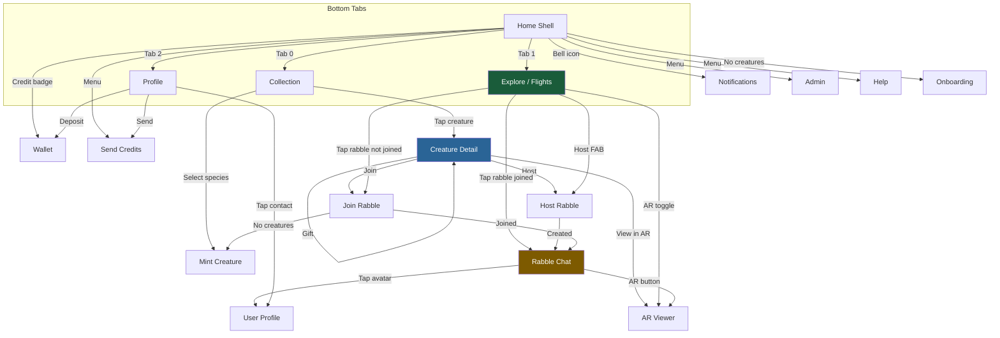
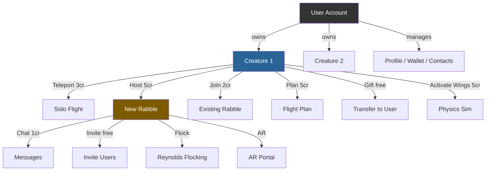
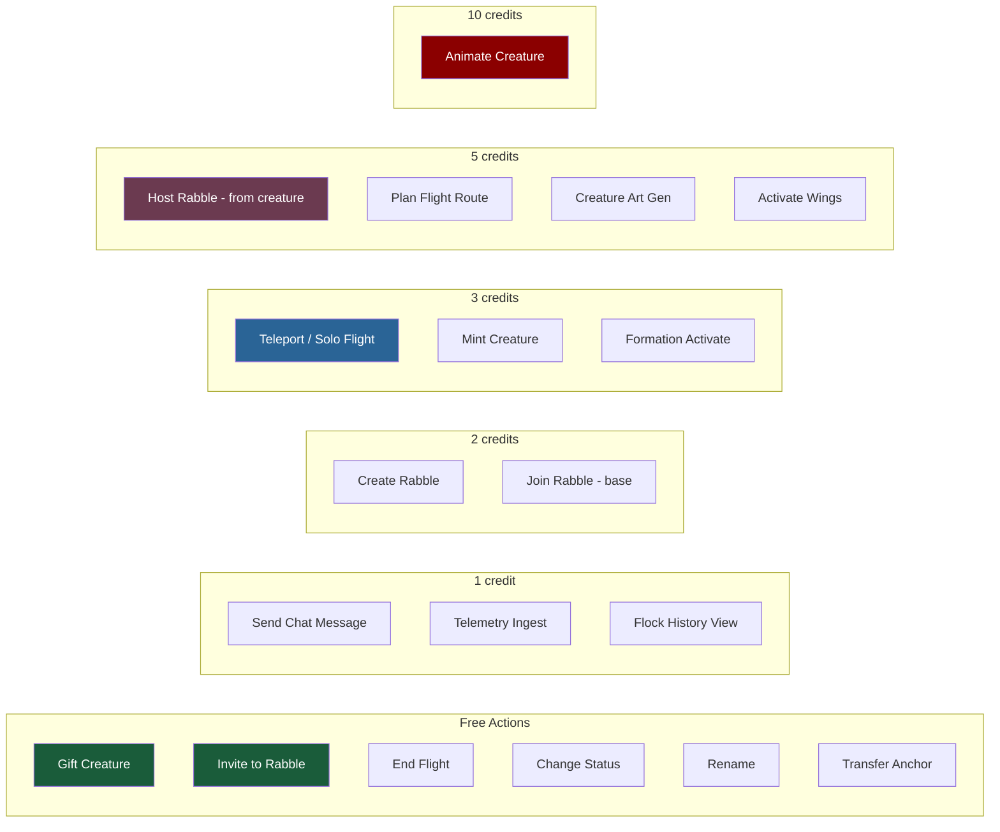
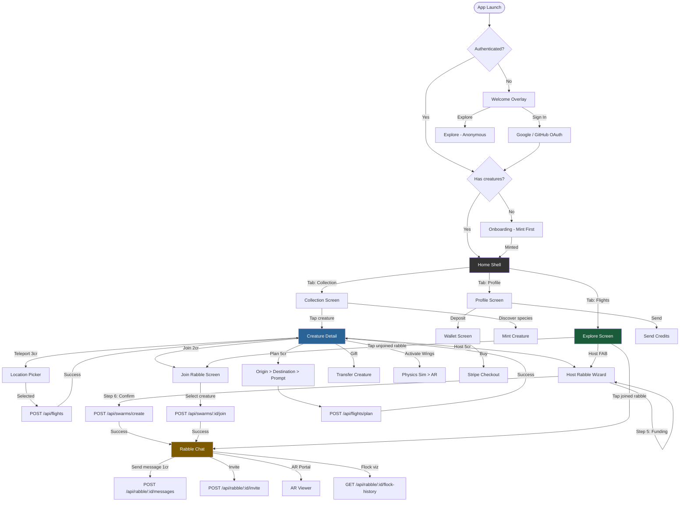

# Rabble UX Audit — Feb 14, 2026

## Executive Summary

This audit maps every screen, action, and API flow in the Rabble Flutter app against the backend handlers. It identifies **redundancies**, **integrity breaks**, **semantic overlaps**, and proposes a **clean hierarchy model** for all interactions.

**Core principle:** User manages Creatures. Creatures manage Flights, Rabbles, and Invites. Everything else is configuration.

---

## 1. Screen Inventory (17 screens)

| # | Screen | File | Role |
|---|--------|------|------|
| 1 | Home Shell | `home_shell.dart` | 3-tab hub (Collection, Flights, Profile) |
| 2 | Collection | `collection_screen.dart` | Creature inventory + species discovery |
| 3 | Creature Detail | `creature_detail.dart` | **Primary action hub** — all creature operations |
| 4 | Mint Creature | `mint_creature.dart` | Create creature from GBIF species |
| 5 | Explore | `explore_screen.dart` | Map/list of active rabbles + visible flights |
| 6 | Rabble Chat | `rabble_chat.dart` | Real-time chat + flock visualization |
| 7 | Host Rabble | `host_rabble.dart` | 6-step creation wizard |
| 8 | Join Rabble | `join_rabble.dart` | Join via link/QR, creature selection |
| 9 | AR Viewer | `ar_viewer.dart` | Live AR with formations (portal/swarm/static) |
| 10 | Profile | `profile_screen.dart` | User profile, wallet summary, contacts |
| 11 | Wallet | `wallet_screen.dart` | Credit purchase + transaction history |
| 12 | Notifications | `notifications_screen.dart` | Invites, mentions, updates |
| 13 | Onboarding | `onboarding_screen.dart` | First-time user flow |
| 14 | Admin | `admin_screen.dart` | Admin controls |
| 15 | User Profile | `user_profile_screen.dart` | View another user's profile |
| 16 | Send Credits | `send_credits.dart` | Credit transfer modal |
| 17 | Help | `help_screen.dart` | FAQ / tutorials |

---

## 2. Navigation Graph

---

## 3. Action Hierarchy (Current State)

---

## 4. Redundancies Found

### 4.1 RESOLVED: Fly Solo + Quick Send = Teleport
- **Before:** Two separate actions doing the same thing (pick location, create virtual flight)
- **Fix applied:** Merged into single "Teleport (3cr)" button
- **Status:** DONE (commit 9fd0b7b)

### 4.2 RESOLVED: Decision Sheet buried actions
- **Before:** Fly button opened a 5-option bottom sheet (Fly Solo, Join Nearby, Host, Plan, Quick Send)
- **Fix applied:** All 6 actions surfaced as top-level buttons on creature detail
- **Status:** DONE (commit 84b7db8)

### 4.3 OPEN: Host Rabble has TWO entry points with different flows
| Entry Point | Flow | Missing Steps |
|-------------|------|---------------|
| Creature Detail > Host | Location picker > HostRabbleScreen (6-step wizard) | None — full wizard |
| Explore > Host FAB | Quick host OR HostRabbleScreen | Quick host skips visibility/funding |

**Problem:** Quick-host from Explore creates a public/hosted rabble with defaults. The full wizard from Creature Detail gives full control. Users don't know which they're getting.

**Recommendation:** Remove quick-host. Always route to HostRabbleScreen with pre-filled location from context.

### 4.4 OPEN: Join has THREE entry points
| Entry Point | Flow |
|-------------|------|
| Creature Detail > Join | Loads nearby rabbles, picks one, joins |
| Explore > Tap unjoined rabble | Opens JoinRabbleScreen with swarm pre-loaded |
| QR/Deep Link | Opens JoinRabbleScreen with qr_token |

**Assessment:** This is acceptable — multiple discovery paths are good. The issue is that Creature Detail > Join should show the same JoinRabbleScreen (not an inline list).

### 4.5 OPEN: "Send to Location" still in overflow menu
- **creature_detail.dart** may still have "Send to Location" in the PopupMenuButton dropdown
- This duplicates Teleport
- **Action:** Remove from overflow menu

---

## 5. Integrity Breaks

### 5.1 CRITICAL: Invite is User-level, not Creature-level
**Current behavior:**
- `POST /api/rabble/:id/invite` takes `user_id` or `team_id`
- Grants visibility via `object_shares` (user can see + join the rabble)
- No creature reference in the invite

**Problem:** The hierarchy says "Creatures manage invites" but invites are issued by user accounts. A user invites another user — no creature involved. This means:
- The invite doesn't specify WHICH creature should join
- The invitee must separately select a creature to join with
- There's no creature-to-creature social graph

**Impact:** Low — this works functionally. The hierarchy principle applies to flight/rabble actions (creature must be active, must have a creature to join). Invites are a social/visibility action that correctly lives at the user level.

**Recommendation:** Keep invites at user level. Add optional `creature_id` to invite for "suggested creature" context.

### 5.2 MODERATE: Rabble Chat allows creator to post without a creature
**Current behavior:**
- `post_rabble_message` allows the swarm creator to chat even without a creature in the rabble
- Other users must have an active creature in the swarm

**Problem:** The creator can be a disembodied voice in their own rabble. This breaks the "everything goes through a creature" principle.

**Recommendation:** Accept this as intentional — the host has special privileges. But consider showing a "Host" badge instead of a creature avatar for hostless messages.

### 5.3 MODERATE: Formation features only accessible from AR Viewer
**Current behavior:**
- `getSwarmAlgorithms()` and `getActivatedFormations()` are only called from `ar_viewer.dart`
- Reynolds flocking tick (`POST /api/rabble/:id/flock`) requires API call but no UI exists outside AR

**Problem:** A rabble host should be able to trigger formation changes from the chat screen without opening AR.

**Recommendation:** Add "Formations" panel to Rabble Chat screen (accessible to rabble creator/host). Show available algorithms, activation toggles, and a "Run Flock Tick" button.

### 5.4 LOW: One-active-flight enforced in app logic, not DB
**Current behavior:**
- Before recording flight, handler queries for existing active flight
- If found, returns 409
- No database unique constraint (migration 069 was considered but not implemented as partial unique index)

**Risk:** Race condition — two concurrent `POST /api/flights` for same creature could both pass the check.

**Recommendation:** Add partial unique index: `CREATE UNIQUE INDEX ON creature_flights (creature_id) WHERE ended_at IS NULL`

### 5.5 LOW: Creature presence check missing from some action paths
**Checked:** `record_flight_handler` correctly checks `presence == 'active'`
**Checked:** `post_rabble_message` checks creature is active
**Unchecked:** `join_swarm_handler` — need to verify it checks presence

---

## 6. Semantic Overlaps

### 6.1 "Flight" means three different things
| Usage | Meaning | API |
|-------|---------|-----|
| Teleport (Solo Flight) | Instant relocation to a point | `POST /api/flights` |
| Swarm Flight | Creature joins a rabble at location | `POST /api/swarms/:id/join` (creates flight) |
| Flight Plan | AI-generated route between two points | `POST /api/flights/plan` |

**Recommendation:** In UI, use distinct verbs:
- "Teleport" for solo relocation
- "Join" for swarm participation
- "Plan Route" for AI path planning

### 6.2 "Host" vs "Create"
- UI says "Host Rabble" (user-facing)
- API says `POST /api/swarms/create` (developer-facing)
- These are correctly aligned — no issue

### 6.3 "Activate Wings" vs "Animate"
- "Activate Wings (5cr)" = physics simulation of winged flight for AR
- "Make it Alive" = AI animation generation (butterfly only, 10cr)
- These are distinct features but the naming is confusing

**Recommendation:** Rename "Activate Wings" to "Simulate Flight" or keep as-is with clear subtitle text (already done).

---

## 7. Clean Hierarchy Rules

```mermaid
graph TB
    subgraph "User Domain"
        U[User Account]
        U -->|manages| WALLET[Wallet / Credits]
        U -->|manages| CONTACTS[Contact List]
        U -->|manages| PROFILE[Profile / Settings]
        U -->|manages| NOTIFICATIONS[Notifications]
        U -->|invites users to| RABBLE_VIS[Rabble Visibility]
    end

    subgraph "Creature Domain"
        U -->|owns 1..N| CREATURE[Creature]
        CREATURE -->|config| NAME[Name / Description]
        CREATURE -->|config| STATUS[Presence: active/sleeping/parked]
        CREATURE -->|config| DEVICE[Paired Device]
        CREATURE -->|config| SOSA[SOSA Opt-in]
        CREATURE -->|config| AVATAR[Set as Avatar]
    end

    subgraph "Action Domain — requires active creature"
        CREATURE -->|action| TELEPORT[Teleport 3cr]
        CREATURE -->|action| HOST[Host Rabble 5cr]
        CREATURE -->|action| JOIN[Join Rabble 2cr]
        CREATURE -->|action| PLAN[Plan Route 5cr]
        CREATURE -->|action| GIFT[Gift / Transfer free]
        CREATURE -->|action| WINGS[Activate Wings 5cr]
    end

    subgraph "Rabble Domain — creature must be present"
        HOST --> RABBLE[Active Rabble]
        JOIN --> RABBLE
        RABBLE -->|action| CHAT[Send Message 1cr]
        RABBLE -->|action| FLOCK[Trigger Flocking]
        RABBLE -->|action| FORMATION[Change Formation 3cr]
        RABBLE -->|host only| ANCHOR[Transfer Anchor]
        RABBLE -->|host only| INVITE[Invite Users free]
        RABBLE -->|view| AR_PORTAL[AR Portal View]
        RABBLE -->|view| FLOCK_VIZ[Flock Visualization]
        RABBLE -->|view| LEADERBOARD[Attraction Leaderboard]
    end

    style U fill:#333,color:#fff
    style CREATURE fill:#2a6496,color:#fff
    style RABBLE fill:#7D5A00,color:#fff
```

### Rules

1. **User creates/configures Creatures** — naming, status, devices, visibility, SOSA
2. **Creature executes Actions** — teleport, host, join, plan, gift, wings. All require `presence == 'active'`
3. **Rabble requires Creature presence** — to chat, flock, or interact, a creature must be actively flying at the rabble
4. **Invites are User-level** — user invites another user (grants visibility). Joining is Creature-level (creature flies to rabble)
5. **One active flight per creature** — creature can only be at one location at a time
6. **Credits are User-level** — user's wallet pays for all creature actions
7. **Formations are Rabble-level** — host controls formations, visible to all members

---

## 8. Cost Map

---

## 9. Recommended Fixes (Priority Order)

| # | Issue | Severity | Fix |
|---|-------|----------|-----|
| 1 | Formation features only in AR | Moderate | Add Formations panel to Rabble Chat |
| 2 | Quick-host bypasses wizard | Moderate | Always use HostRabbleScreen |
| 3 | "Send to Location" still in overflow | Low | Remove from PopupMenuButton |
| 4 | One-active-flight race condition | Low | Add partial unique index on creature_flights |
| 5 | Join from Creature Detail uses inline list | Low | Route to JoinRabbleScreen instead |
| 6 | Creator chats without creature badge | Low | Show "Host" badge on creatureless messages |

---

## 10. Screen Flow Diagram (Complete)

---

## 11. API Route Map (Creature/Flight/Rabble Domain)

| Method | Route | Auth | Cost | Domain |
|--------|-------|------|------|--------|
| `POST` | `/api/flights` | YES | 3cr | Creature > Teleport |
| `PUT` | `/api/flights/:id/end` | YES | free | Creature > End Flight |
| `POST` | `/api/flights/:id/telemetry` | YES | 1cr | Creature > Stream GPS |
| `POST` | `/api/flights/plan` | YES | 5cr | Creature > Plan Route |
| `GET` | `/api/creatures/:id/flights` | NO | free | Read > Flight History |
| `POST` | `/api/swarms/create` | YES | 2cr | Creature > Host Rabble |
| `POST` | `/api/swarms/:id/join` | YES | varies | Creature > Join Rabble |
| `POST` | `/api/swarms/:id/join-batch` | YES | varies | Creature > Join Batch |
| `GET` | `/api/swarms` | NO | free | Read > List Rabbles |
| `GET` | `/api/swarms/:id` | NO | free | Read > Rabble Detail |
| `POST` | `/api/rabble/:id/messages` | YES | 1cr | Rabble > Chat |
| `GET` | `/api/rabble/:id/messages` | NO | free | Read > Messages |
| `GET` | `/api/rabble/:id/stream` | YES | free | Read > SSE Stream |
| `POST` | `/api/rabble/:id/invite` | YES | free | User > Invite |
| `GET` | `/api/rabble/:id/members` | YES | free | Read > Members |
| `DELETE` | `/api/rabble/:id/invite/:uid` | YES | free | User > Revoke Invite |
| `POST` | `/api/rabble/:id/flock` | YES | workspace | Rabble > Flock Tick |
| `GET` | `/api/rabble/:id/flock-history` | YES | 1cr | Read > Flock Data |
| `POST` | `/api/rabble/:id/transfer-anchor` | YES | free | Rabble > Anchor |
| `POST` | `/api/rabble/:id/update-anchor-position` | YES | free | Rabble > GPS Update |
| `GET` | `/api/rabble/:id/attraction-leaderboard` | YES | free | Read > Leaderboard |
