# Rabble UX Audit — Feb 14, 2026

## Executive Summary

This audit maps every screen, action, and API flow in the Rabble Flutter app against the backend handlers. It identifies **redundancies**, **integrity breaks**, **semantic overlaps**, and proposes a **clean hierarchy model** for all interactions.

**Core principle:** User manages Creatures. Creatures manage Flights, Rabbles, and Invites. Everything else is configuration.

---

## 1. Screen Inventory (17 screens)

| # | Screen | File | Role |
|---|--------|------|------|
| 1 | Home Shell | `home_shell.dart` | 3-tab hub (Collection, Flights, Profile) |
| 2 | Collection | `collection_screen.dart` | Creature inventory + species discovery |
| 3 | Creature Detail | `creature_detail.dart` | **Primary action hub** — all creature operations |
| 4 | Mint Creature | `mint_creature.dart` | Create creature from GBIF species |
| 5 | Explore | `explore_screen.dart` | Map/list of active rabbles + visible flights |
| 6 | Rabble Chat | `rabble_chat.dart` | Real-time chat + flock visualization |
| 7 | Host Rabble | `host_rabble.dart` | 6-step creation wizard |
| 8 | Join Rabble | `join_rabble.dart` | Join via link/QR, creature selection |
| 9 | AR Viewer | `ar_viewer.dart` | Live AR with formations (portal/swarm/static) |
| 10 | Profile | `profile_screen.dart` | User profile, wallet summary, contacts |
| 11 | Wallet | `wallet_screen.dart` | Credit purchase + transaction history |
| 12 | Notifications | `notifications_screen.dart` | Invites, mentions, updates |
| 13 | Onboarding | `onboarding_screen.dart` | First-time user flow |
| 14 | Admin | `admin_screen.dart` | Admin controls |
| 15 | User Profile | `user_profile_screen.dart` | View another user's profile |
| 16 | Send Credits | `send_credits.dart` | Credit transfer modal |
| 17 | Help | `help_screen.dart` | FAQ / tutorials |

---

## 2. Navigation Graph

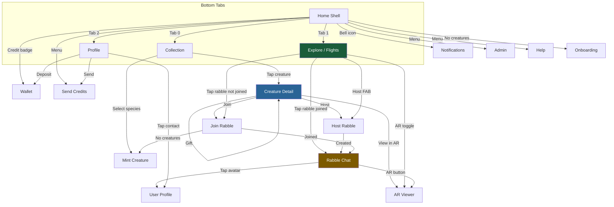

---

## 3. Action Hierarchy (Current State)

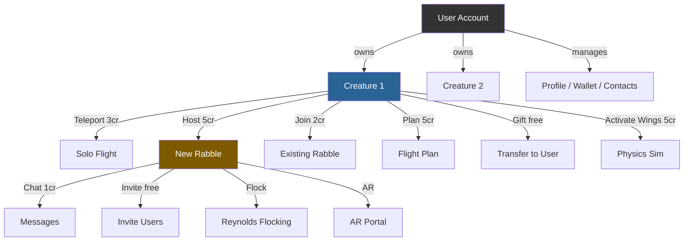

---

## 4. Redundancies Found

### 4.1 RESOLVED: Fly Solo + Quick Send = Teleport
- **Before:** Two separate actions doing the same thing (pick location, create virtual flight)
- **Fix applied:** Merged into single "Teleport (3cr)" button
- **Status:** DONE (commit 9fd0b7b)

### 4.2 RESOLVED: Decision Sheet buried actions
- **Before:** Fly button opened a 5-option bottom sheet (Fly Solo, Join Nearby, Host, Plan, Quick Send)
- **Fix applied:** All 6 actions surfaced as top-level buttons on creature detail
- **Status:** DONE (commit 84b7db8)

### 4.3 OPEN: Host Rabble has TWO entry points with different flows
| Entry Point | Flow | Missing Steps |
|-------------|------|---------------|
| Creature Detail > Host | Location picker > HostRabbleScreen (6-step wizard) | None — full wizard |
| Explore > Host FAB | Quick host OR HostRabbleScreen | Quick host skips visibility/funding |

**Problem:** Quick-host from Explore creates a public/hosted rabble with defaults. The full wizard from Creature Detail gives full control. Users don't know which they're getting.

**Recommendation:** Remove quick-host. Always route to HostRabbleScreen with pre-filled location from context.

### 4.4 OPEN: Join has THREE entry points
| Entry Point | Flow |
|-------------|------|
| Creature Detail > Join | Loads nearby rabbles, picks one, joins |
| Explore > Tap unjoined rabble | Opens JoinRabbleScreen with swarm pre-loaded |
| QR/Deep Link | Opens JoinRabbleScreen with qr_token |

**Assessment:** This is acceptable — multiple discovery paths are good. The issue is that Creature Detail > Join should show the same JoinRabbleScreen (not an inline list).

### 4.5 OPEN: "Send to Location" still in overflow menu
- **creature_detail.dart** may still have "Send to Location" in the PopupMenuButton dropdown
- This duplicates Teleport
- **Action:** Remove from overflow menu

---

## 5. Integrity Breaks

### 5.1 CRITICAL: Invite is User-level, not Creature-level
**Current behavior:**
- `POST /api/rabble/:id/invite` takes `user_id` or `team_id`
- Grants visibility via `object_shares` (user can see + join the rabble)
- No creature reference in the invite

**Problem:** The hierarchy says "Creatures manage invites" but invites are issued by user accounts. A user invites another user — no creature involved. This means:
- The invite doesn't specify WHICH creature should join
- The invitee must separately select a creature to join with
- There's no creature-to-creature social graph

**Impact:** Low — this works functionally. The hierarchy principle applies to flight/rabble actions (creature must be active, must have a creature to join). Invites are a social/visibility action that correctly lives at the user level.

**Recommendation:** Keep invites at user level. Add optional `creature_id` to invite for "suggested creature" context.

### 5.2 MODERATE: Rabble Chat allows creator to post without a creature
**Current behavior:**
- `post_rabble_message` allows the swarm creator to chat even without a creature in the rabble
- Other users must have an active creature in the swarm

**Problem:** The creator can be a disembodied voice in their own rabble. This breaks the "everything goes through a creature" principle.

**Recommendation:** Accept this as intentional — the host has special privileges. But consider showing a "Host" badge instead of a creature avatar for hostless messages.

### 5.3 MODERATE: Formation features only accessible from AR Viewer
**Current behavior:**
- `getSwarmAlgorithms()` and `getActivatedFormations()` are only called from `ar_viewer.dart`
- Reynolds flocking tick (`POST /api/rabble/:id/flock`) requires API call but no UI exists outside AR

**Problem:** A rabble host should be able to trigger formation changes from the chat screen without opening AR.

**Recommendation:** Add "Formations" panel to Rabble Chat screen (accessible to rabble creator/host). Show available algorithms, activation toggles, and a "Run Flock Tick" button.

### 5.4 LOW: One-active-flight enforced in app logic, not DB
**Current behavior:**
- Before recording flight, handler queries for existing active flight
- If found, returns 409
- No database unique constraint (migration 069 was considered but not implemented as partial unique index)

**Risk:** Race condition — two concurrent `POST /api/flights` for same creature could both pass the check.

**Recommendation:** Add partial unique index: `CREATE UNIQUE INDEX ON creature_flights (creature_id) WHERE ended_at IS NULL`

### 5.5 LOW: Creature presence check missing from some action paths
**Checked:** `record_flight_handler` correctly checks `presence == 'active'`
**Checked:** `post_rabble_message` checks creature is active
**Unchecked:** `join_swarm_handler` — need to verify it checks presence

---

## 6. Semantic Overlaps

### 6.1 "Flight" means three different things
| Usage | Meaning | API |
|-------|---------|-----|
| Teleport (Solo Flight) | Instant relocation to a point | `POST /api/flights` |
| Swarm Flight | Creature joins a rabble at location | `POST /api/swarms/:id/join` (creates flight) |
| Flight Plan | AI-generated route between two points | `POST /api/flights/plan` |

**Recommendation:** In UI, use distinct verbs:
- "Teleport" for solo relocation
- "Join" for swarm participation
- "Plan Route" for AI path planning

### 6.2 "Host" vs "Create"
- UI says "Host Rabble" (user-facing)
- API says `POST /api/swarms/create` (developer-facing)
- These are correctly aligned — no issue

### 6.3 "Activate Wings" vs "Animate"
- "Activate Wings (5cr)" = physics simulation of winged flight for AR
- "Make it Alive" = AI animation generation (butterfly only, 10cr)
- These are distinct features but the naming is confusing

**Recommendation:** Rename "Activate Wings" to "Simulate Flight" or keep as-is with clear subtitle text (already done).

---

## 7. Three-Layer Interaction Model

The app has three distinct layers. Each layer has a clear responsibility:

### Layer 1: USER — Configuration

The user configures creatures and manages their own account. These are all **setup/management** actions, never runtime activities.

| Action | Target | Notes |
|--------|--------|-------|
| Mint creature | New creature | Species selection, art generation |
| Name / Rename | Creature | Display identity |
| Associate device | Creature | Pair AirTag, SmartTag, GPS, BLE |
| Gift / Transfer | Creature | Change ownership to another user |
| Fund creature | User wallet | Credits drawn from user wallet for all creature actions |
| Give Wings | Creature | Physics simulation capability |
| Group creatures | Sub-flock | Organize for batch operations |
| Share creature | Visibility | Public, shared, private |
| Set presence | Creature | Active, sleeping, parked |
| Set as avatar | Profile | Use creature image as user avatar |
| SOSA opt-in | Creature | Consent for observation data |
| Manage wallet | User account | Buy credits, view transactions |
| Manage contacts | User account | Add/remove, invite friends |
| Manage profile | User account | Display name, bio |
| **Social invite** | **User-to-user** | **"Come join Rabble" — grants visibility, sends notification** |

**Social invites** are user-to-user. They say "I want you to be able to see and join this rabble." They grant visibility via `object_shares` and send a notification. No creature is involved — this is a social/configuration action.

### Layer 2: CREATURE — Actions (The Agent)

The creature is the **agent** that performs all runtime actions. It plans, teleports, hosts, joins, leaves, coordinates, and chats. The creature is the proxy for all activity.

| Action | Cost | Prerequisite | Notes |
|--------|------|--------------|-------|
| **Creature invite** | free | Active creature in rabble | "Come fly with me" — creature-to-creature |
| Plan flight | 5cr | Active creature | AI route between two points |
| Teleport | 3cr | Active creature | Instant relocation |
| Host rabble | 5cr | Active creature | Create gathering at location |
| Join rabble | 2cr | Active creature | Fly to existing gathering |
| Leave rabble | free | In-flight creature | End flight, depart |
| Coordinate rabble | varies | Host creature | Flight dynamics, formations, flocking |
| Chat in rabble | 1cr | Creature present | Speak through creature |
| Transfer anchor | free | Host creature | Hand off anchor role |

**Creature invites** are creature-to-creature. A creature already in a rabble says "come fly with me" to another creature. This is an action, not configuration — the inviting creature is actively participating.

### Two-Tier Invite Model

| Tier | Who | What | Layer | Example |
|------|-----|------|-------|---------|
| **Social invite** | User -> User | Grants rabble visibility + notification | Layer 1 (config) | "Hey, check out this rabble I'm hosting" |
| **Creature invite** | Creature -> Creature | Active call to join current location | Layer 2 (action) | Creature A is in a rabble, beckons Creature B |

**Rule:** All actions require `presence == 'active'`. One active flight per creature (creature exists at one location at a time, but this doesn't prevent non-location actions).

### Credit Flow: Creature acts, Owner pays

When a creature performs an action (join rabble, teleport, host, plan, chat), the system:
1. Resolves the creature's `owner_id`
2. Gets the **owner's wallet** via `get_or_create_wallet(pool, "user", &owner_id)`
3. Charges the owner's wallet automatically

The creature never has its own credit balance. The owner never has to pre-fund a creature or approve each charge — if the creature acts and the owner has credits, it just works. If the owner has no credits, the action returns 402.

**Backend confirmation:** All handlers (`join_swarm_handler`, `record_flight_handler`, `plan_flight_handler`, `post_rabble_message`, etc.) use `get_or_create_wallet("user", &user_id)` — always the authenticated user's wallet, never a creature wallet.

### Layer 3: FLIGHTS / RABBLES — Reports and Views

Everything else is **reporting, visualization, and drill-down** on activity that creatures have generated. This is the observation layer, not the action layer.

| View | Scope | Content |
|------|-------|---------|
| Creature Activity Dashboard | Per creature | Flight history, rabble participation, telemetry |
| Flight Log | Per creature | Current + past flights, duration, path, location |
| Flight Detail / Telemetry | Per flight | GPS breadcrumbs, speed, heading, SOSA observations |
| Rabble View | Per rabble | Who's there, chat, flock visualization |
| Flock History | Per rabble | Normalized creature paths, attraction scores |
| AR Portal | Per rabble | Live spatial view of creatures in formation |
| Attraction Leaderboard | Per rabble | Which creatures drew others in |
| Explore Map | Global | All visible flights + active rabbles |
| User Profile | Per user | Roll-up of all creature activity, social interactions |

**Creatures can:** view, join, and serve as proxies for managing the activities.

**User Profile is:** the roll-up view — managing activity, social interactions with other users, aggregate stats across all owned creatures.

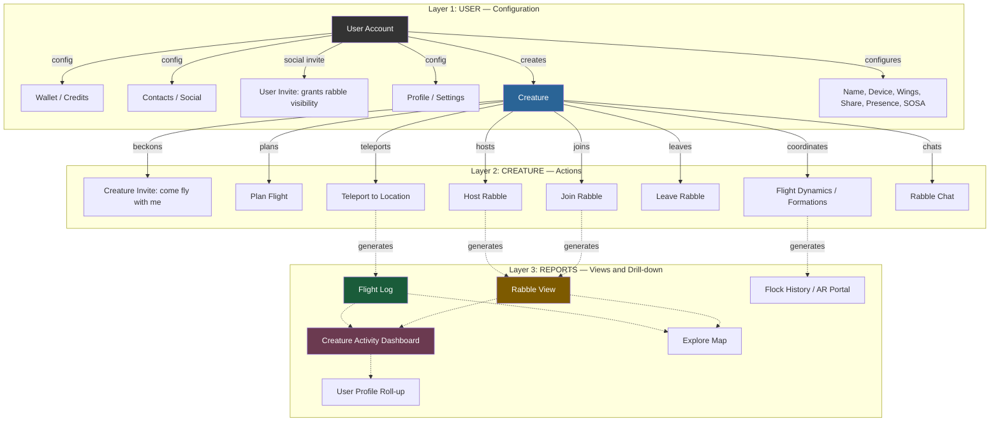

### Design Rules

1. **User configures, Creature acts.** Users never directly fly, chat, or join — they do it through a creature.
2. **One creature, one location.** A creature can only be at one place at a time (one active flight). This doesn't block non-location actions like renaming or gifting.
3. **Credits are User-level only.** The user's wallet pays for all creature actions. A creature should never be unable to perform an action because of credits unless the *user* has no credits. There is no per-creature credit balance that can independently run dry.
4. **Two-tier invites.** Social invites (user-to-user) grant visibility. Creature invites (creature-to-creature) are active calls to join. Don't conflate them.
5. **Creature is the social identity in rabbles.** Chat messages, flock positions, attraction scores — all tied to creature, not user.
6. **Everything below actions is reporting.** Flight Log, Flock History, Leaderboard, AR Portal — these are views on data that creatures generated through actions.
7. **User Profile = roll-up.** Aggregate view across all owned creatures: total flights, rabbles hosted/joined, social interactions, activity timeline.
8. **Explore = global view.** All visible flights + active rabbles, filterable by proximity, species, status.

---

## 8. Cost Map

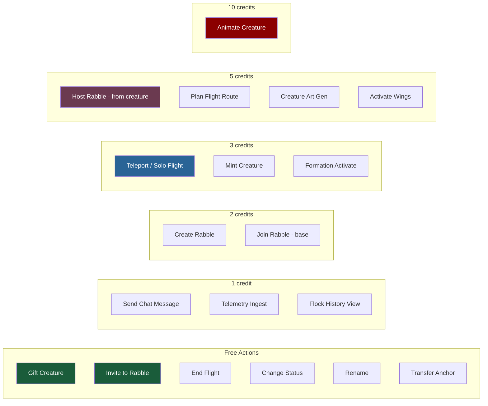

---

## 9. Recommended Fixes (Priority Order)

| # | Issue | Severity | Fix |
|---|-------|----------|-----|
| 1 | Formation features only in AR | Moderate | Add Formations panel to Rabble Chat |
| 2 | Quick-host bypasses wizard | Moderate | Always use HostRabbleScreen |
| 3 | "Send to Location" still in overflow | Low | Remove from PopupMenuButton |
| 4 | One-active-flight race condition | Low | Add partial unique index on creature_flights |
| 5 | Join from Creature Detail uses inline list | Low | Route to JoinRabbleScreen instead |
| 6 | Creator chats without creature badge | Low | Show "Host" badge on creatureless messages |

---

## 10. Screen Flow Diagram (Complete)


---

## 11. Creature Action Interaction Diagrams

Each creature action is a discrete flow with clear entry, validation, payment, mutation, and result. These diagrams define the canonical path for each action.

### 11.1 Teleport

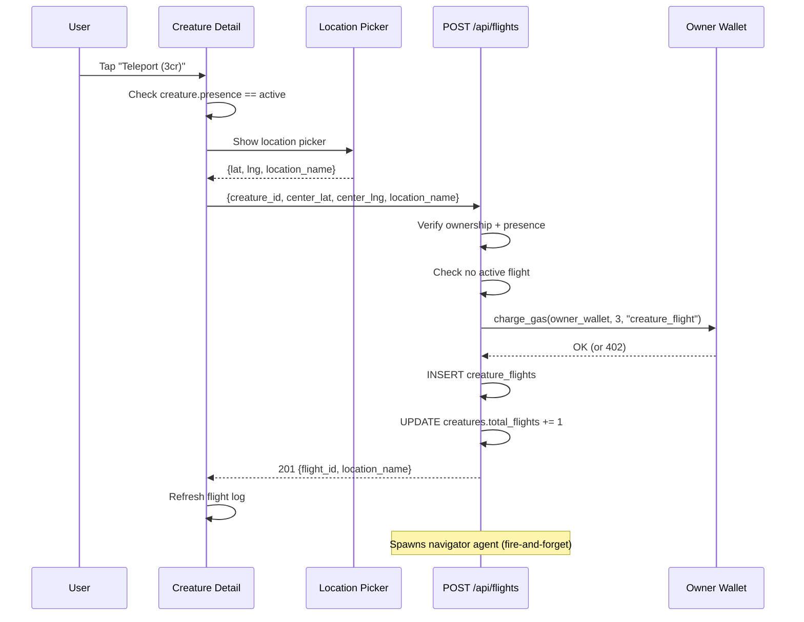

### 11.2 Host Rabble

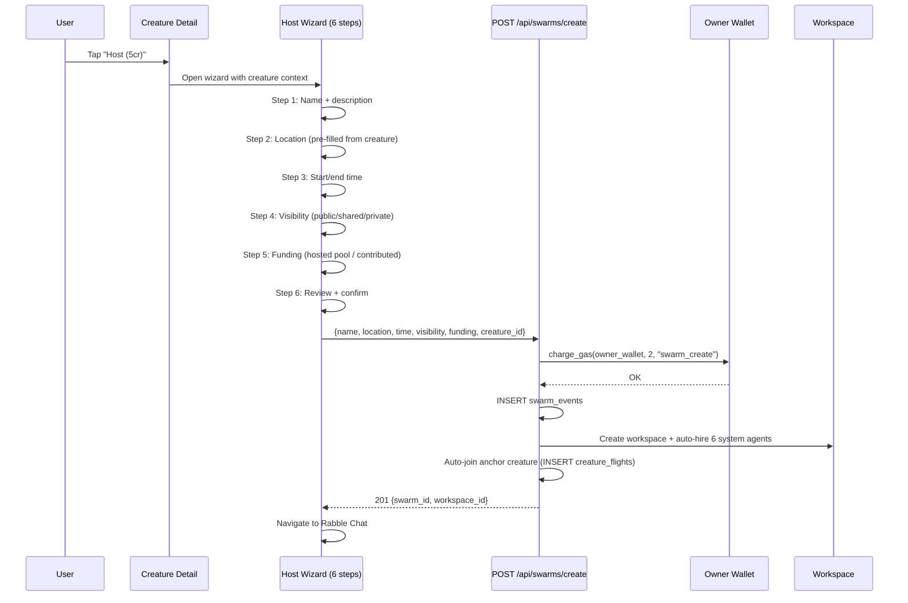

### 11.3 Join Rabble

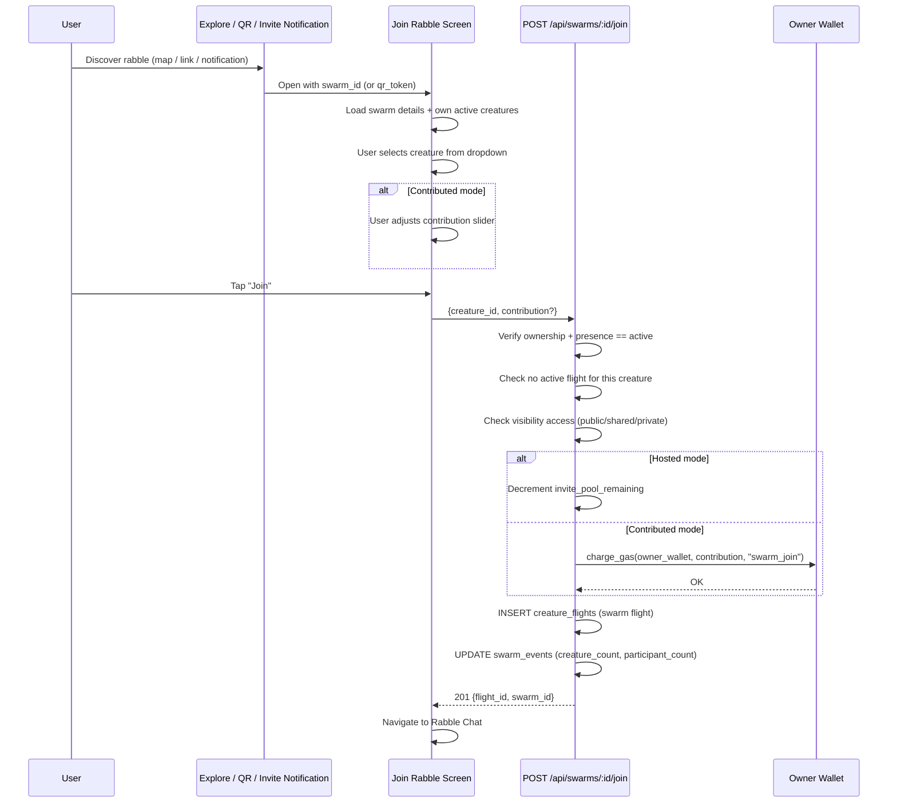

### 11.4 Plan Flight

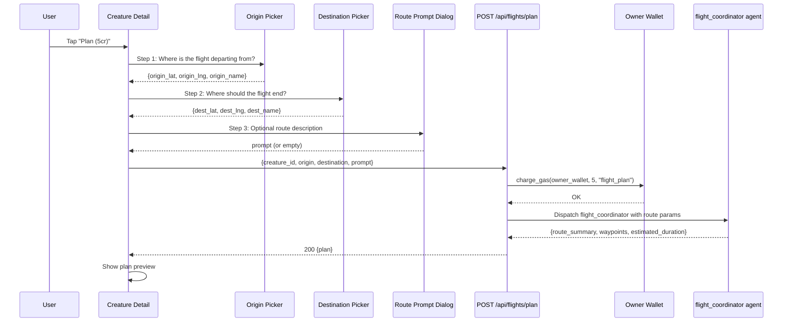

### 11.5 Chat in Rabble

```mermaid
sequenceDiagram
    participant U as User
    participant RC as Rabble Chat Screen
    participant API as POST /api/rabble/:id/messages
    participant W as Owner Wallet

    U->>RC: Type message + tap send
    RC->>API: {creature_id, content}
    API->>API: Verify creature in this swarm (active flight)
    API->>API: Verify creature.presence == active
    API->>W: charge_gas(owner_wallet, 1, "rabble_chat")
    W-->>API: OK
    API->>API: INSERT rabble_messages
    API->>API: Broadcast via SSE
    API-->>RC: 200 {message_id}
    Note over API: Every Nth message: spawn swarm_host narrator
```

### 11.6 Creature Invite ("Come fly with me")

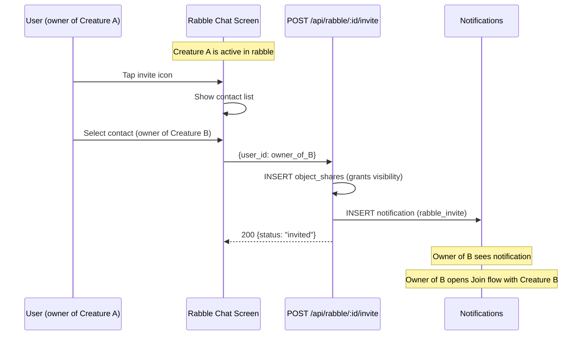

### 11.7 Social Invite (User-to-User)

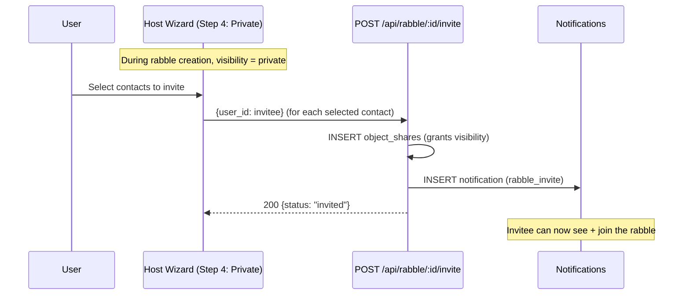

### 11.8 Leave Rabble

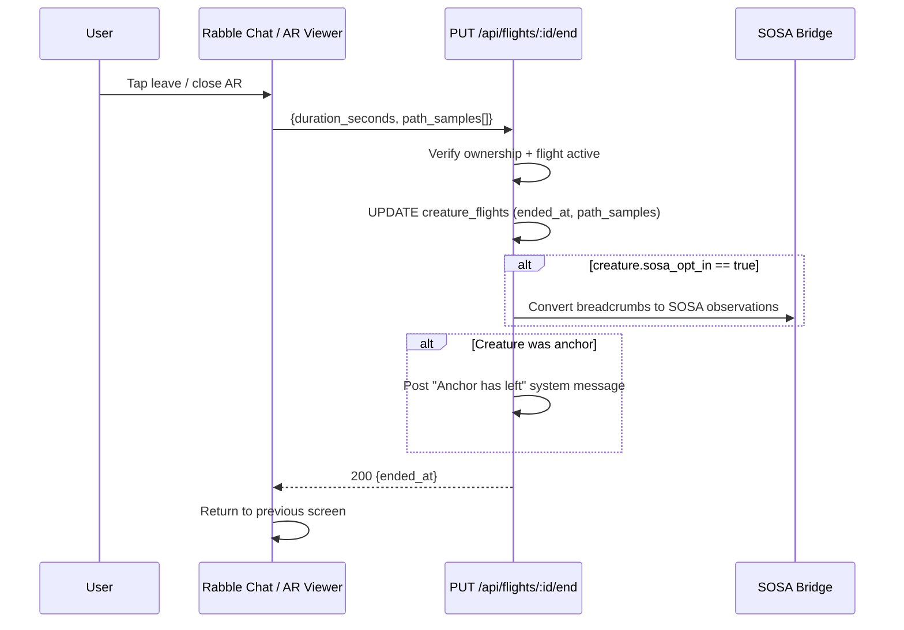

### 11.9 Coordinate Rabble (Formations / Flocking)

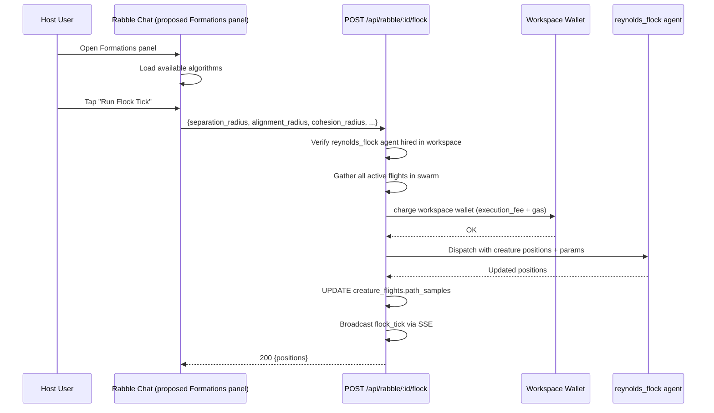

---

## 12. UI Grouping (Based on Three-Layer Model)

The creature detail screen should be reorganized into three visually distinct zones:

### Zone 1: Configuration (Layer 1 — top, collapsible)

Settings and upgrades the user applies to the creature. Collapsed by default, but some items are **economic offers** that merit highlighting (e.g., Wings is a paid upgrade, Device pairing unlocks real-flight data).

| Element | Type | Economic? | Notes |
|---------|------|-----------|-------|
| Name / Rename | Inline edit | No | Display identity |
| Presence toggle | Segmented control | No | Active / Sleeping / Parked |
| Activate Wings | Upgrade card | **Yes (5cr)** | Unlocks physics sim — highlight as offer |
| Paired devices | List + add | **Yes (unlocks)** | Pair tracker — upgrades data_source to "device" |
| SOSA opt-in | Toggle | No | Location data consent |
| Share / Visibility | Selector | No | Public / Shared / Private |
| Set as avatar | Button | No | Use image as profile pic |
| Animate | Upgrade card | **Yes (10cr)** | AI animation — highlight as offer |

Config items that are economic offers (Wings, Animate, Device pairing) can be visually distinguished — e.g., a subtle "upgrade" badge or different card treatment — so they read as opportunities, not just toggles.

### Zone 2: Actions (Layer 2 — always visible, primary)

The core interaction buttons. These are what the creature **does**. Always visible, prominently placed. Every cost shown inline. Every cost is a **pass-through to the owner's wallet** — the creature acts, the owner pays automatically.

| Button | Cost | Flow | Leads to |
|--------|------|------|----------|
| Teleport | 3cr | Location picker -> flight created | Stays on detail |
| Host Rabble | 5cr | 6-step wizard | Rabble Chat |
| Join Rabble | 2cr | Rabble list -> creature select | Rabble Chat |
| Plan Flight | 5cr | Origin -> Destination -> Prompt | Plan preview |
| Invite (creature) | free | Contact picker | Notification sent |
| Gift | free | Contact picker -> transfer | Creature leaves inventory |

**Economics pass-through:** When a creature hosts a rabble, the workspace earns from chat fees and agent executions. Those earnings pass through to the owner via auto-collect. When a creature attracts others to a rabble, the owner earns attraction rewards. The action costs are the input; the activity reports show the output (earnings, scores, participation).

### Zone 3: Activity (Layer 3 — scrollable, split into Live + Historical)

The observation layer. Split into two distinct sub-zones:

**Zone 3a: Live Activity** — what's happening right now

| Element | Type | Content |
|---------|------|---------|
| Active flight banner | Status card (prominent) | Current location, duration, swarm name, "End Flight" button |
| Active rabble status | Status card | If in a rabble: member count, chat preview, "Open Chat" |
| Live controls | Contextual buttons | If host: formation controls, anchor transfer. If member: leave. |
| Costs/earnings ticker | Inline stats | Credits spent this session, attraction rewards earned |

**Zone 3b: Historical Activity** — what's happened before

| Element | Type | Content |
|---------|------|---------|
| Flight Log | Expandable list | Past flights, duration, location, tap for telemetry |
| Rabble history | List | Rabbles hosted/joined, participation stats |
| Activity sparkline | Chart | 30-day flight frequency |
| Lifetime stats | Summary card | Total flights, rabbles, credits spent, credits earned |
| Data Card | Collapsible | Species info, creation date |
| Description | Collapsible | Variation notes |

The controlling creature (active in a rabble) sees **live controls** in Zone 3a — the actions available to them *within that session*, with costs and earnings visible. This is distinct from Zone 2 (which initiates new actions) — Zone 3a is about managing an ongoing session.

### Proposed Layout

```
┌─────────────────────────────┐
│ Image + Name + Stats        │
├─────────────────────────────┤
│ ZONE 1: CONFIG (v collapsed)│
│ Presence, Devices,          │
│ [Get Wings 5cr] [Animate]   │
│ SOSA, Share, Visibility     │
├─────────────────────────────┤
│ ZONE 2: ACTIONS             │
│ [Teleport 3cr] [Join 2cr]   │
│ [Host 5cr]     [Plan 5cr]   │
│ [Invite]       [Gift]       │
├─────────────────────────────┤
│ ZONE 3a: LIVE ACTIVITY      │
│ ● In flight at London       │
│   Duration: 12m | [End]     │
│ ● In rabble "Morning Flock" │
│   3 creatures | [Open Chat] │
│   Earned: +2cr attractions  │
├─────────────────────────────┤
│ ZONE 3b: HISTORICAL         │
│ Flight Log (24 flights)     │
│   └ Tap for telemetry       │
│ Rabble History (8 rabbles)  │
│   └ Tap for detail          │
│ [Activity sparkline ~~~~~~~~]│
│ Lifetime: 47 flights, +15cr │
│ [Data Card v] [Desc v]      │
└─────────────────────────────┘
```

**Key insight:** The value of actions is proven by visibility into activity. The user spends credits on actions (Zone 2), and sees the payoff in real-time earnings and historical impact (Zone 3). Config upgrades (Zone 1) unlock *better* actions — Wings enables physics sim, Device pairing enables real flight data, which feeds richer telemetry in Zone 3. The economics flow is: **config unlocks capability -> actions spend credits -> activity shows return**.

---

## 13. API Route Map (Creature/Flight/Rabble Domain)

| Method | Route | Auth | Cost | Domain |
|--------|-------|------|------|--------|
| `POST` | `/api/flights` | YES | 3cr | Creature > Teleport |
| `PUT` | `/api/flights/:id/end` | YES | free | Creature > End Flight |
| `POST` | `/api/flights/:id/telemetry` | YES | 1cr | Creature > Stream GPS |
| `POST` | `/api/flights/plan` | YES | 5cr | Creature > Plan Route |
| `GET` | `/api/creatures/:id/flights` | NO | free | Read > Flight History |
| `POST` | `/api/swarms/create` | YES | 2cr | Creature > Host Rabble |
| `POST` | `/api/swarms/:id/join` | YES | varies | Creature > Join Rabble |
| `POST` | `/api/swarms/:id/join-batch` | YES | varies | Creature > Join Batch |
| `GET` | `/api/swarms` | NO | free | Read > List Rabbles |
| `GET` | `/api/swarms/:id` | NO | free | Read > Rabble Detail |
| `POST` | `/api/rabble/:id/messages` | YES | 1cr | Rabble > Chat |
| `GET` | `/api/rabble/:id/messages` | NO | free | Read > Messages |
| `GET` | `/api/rabble/:id/stream` | YES | free | Read > SSE Stream |
| `POST` | `/api/rabble/:id/invite` | YES | free | User > Invite |
| `GET` | `/api/rabble/:id/members` | YES | free | Read > Members |
| `DELETE` | `/api/rabble/:id/invite/:uid` | YES | free | User > Revoke Invite |
| `POST` | `/api/rabble/:id/flock` | YES | workspace | Rabble > Flock Tick |
| `GET` | `/api/rabble/:id/flock-history` | YES | 1cr | Read > Flock Data |
| `POST` | `/api/rabble/:id/transfer-anchor` | YES | free | Rabble > Anchor |
| `POST` | `/api/rabble/:id/update-anchor-position` | YES | free | Rabble > GPS Update |
| `GET` | `/api/rabble/:id/attraction-leaderboard` | YES | free | Read > Leaderboard |
