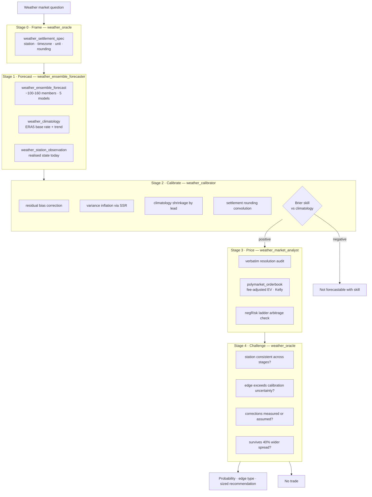

# Weather Oracle

> **Composition:** `weather_oracle` + 3 members
> **Orchestra:** Fermi (declares `fermi_contract`)
> **Tools:** `src/agent_backend/weather_tools.rs` (6 tools, all keyless)
> **Research provenance:** [`docs/WEATHER_MARKETS_RESEARCH.md`](../WEATHER_MARKETS_RESEARCH.md)
> **Station registry:** [`docs/weather_stations_verified.csv`](../weather_stations_verified.csv)
> **Created:** 2026-08-13

A compound agent for betting on weather prediction markets — built for
[polymarket.com/weather](https://polymarket.com/weather) and registered in the
Fermi orchestra.

---

## The thesis

Most attempts at this problem start by trying to build a better weather model.
That is the wrong end of the problem. Three observations drive this design:

**1. The largest error is definitional, not meteorological.** Polymarket's NYC
temperature markets settle on **KLGA (LaGuardia)**, not Central Park. Dallas
settles on **Love Field**, not DFW. Denver on **Buckley Space Force Base**.
Paris on **Le Bourget**. London on **London City**. Seoul on **Incheon**.
Taipei on **Songshan**. A world-class forecast of the wrong station loses money
with perfect consistency. So the pipeline resolves the settlement instrument
*before* it forecasts anything, and the station registry is the first tool.

**2. Every published ensemble is overconfident, and threshold markets are
tails.** ECMWF ENS, GenCast and U-Cast all report spread-skill ratios below 1
at 1–7 day lead times; deep ensembling lifts U-Cast only to ~0.85. Under-
dispersion systematically *underprices* the tail — which is the only thing a
threshold market pays on. So calibration is a mandatory, separate stage whose
every step either shifts the mean or widens the variance, never narrows it.

**3. The best edges barely depend on the weather.** Ranked by how little model
skill they require:

| Rank | Edge type | Model dependence | Why it exists |
|---|---|---|---|
| 1 | **Settlement timing** | almost none | Resolution runs 45–90 min after local midnight; the source has already published the figure while the market is open |
| 2 | **Realised state** | low | After the solar afternoon the day's high is nearly determined, while the book may still reflect a morning forecast |
| 3 | **Ladder arbitrage** | none | negRisk ladders are arbitrage-linked to sum to 1; deviations are free money and need no weather view |
| 4 | **Calibration** | total | The market prices off a deterministic forecast and misprices tails |

Only the fourth requires the distribution to be right, so it gets the most
humility and the smallest size.

---

## Architecture



### The four agents

| Agent | Role | Refuses to |
|---|---|---|
| **`weather_oracle`** | Orchestrates the pipeline, then adversarially attacks its own chain | Sharpen a member's confidence; proceed past negative skill |
| **`weather_ensemble_forecaster`** | Resolves the target, pulls the member cloud, decomposes uncertainty | Calibrate or price; guess a number a tool didn't return |
| **`weather_calibrator`** | Statistical post-processing into a bettable probability | Narrow a distribution; apply Gaussian logic to precipitation |
| **`weather_market_analyst`** | Rules lawyer + microstructure analyst | Trade a degenerate book; ignore the fee floor |

The split is deliberate. A single agent that forecasts *and* prices will
rationalise its forecast toward the price it wants. Separating them means the
calibrator never sees the market price, so it cannot anchor on it.

---

## Error sources and the technique that addresses each

This is the design's backbone — each error source is assigned exactly one
mitigation, so nothing is double-counted and nothing is left uncovered.

| Error source | Mitigation | Where |
|---|---|---|
| Settlement/definitional | Verified station registry + verbatim rules audit | `weather_settlement_spec`, market analyst |
| Model/structural error | 5 independent ensembles, not one | `weather_ensemble_forecast` |
| Regime-dependent error | Anomaly percentile vs climatology → reweight physics over AI in extremes | forecaster prompt |
| Grid→station representativeness | Residual correction (`obs − forecast`), elevation gap | calibrator prompt |
| Systematic bias + conditional dispersion | EMOS/NGR-style mean and variance correction | calibrator |
| Structural overconfidence | Variance inflation `1/SSR²`, prior SSR ≈ 0.85 | calibrator |
| Epistemic model risk | Cross-model median range → widen no-trade band | `epistemic_disagreement` field |
| Long-lead skill collapse | Lead-dependent shrinkage to trend-adjusted base rate | `weather_climatology` + calibrator |
| Distributional misspecification | Bernoulli–Gamma for precipitation, not Gaussian | calibrator prompt |
| Temporal aggregation | Daily aggregates computed in the station's own timezone | tool-level (`timezone` param) |
| Measurement/rounding | Convolution with the published-integer rule | calibrator |
| Monte Carlo sampling noise | Reported SE on every tail probability | `weather_ensemble_forecast` |
| Execution cost | Taker vs maker EV reported separately | `polymarket_orderbook` |
| Stale/settled markets | `book_quality.tradeable` gate | `polymarket_orderbook` |

---

## Tools

All six are **keyless and free**. The agents declare no `requires_secrets`.

| Tool | Upstream | Notes |
|---|---|---|
| `weather_settlement_spec` | none (local) | 50-station registry, 49 series mappings, per-station trap warnings |
| `weather_ensemble_forecast` | `ensemble-api.open-meteo.com` | ECMWF IFS 51 + ICON-EU 40 + GEFS 31 + GEM 21 + BOM 18 |
| `weather_climatology` | `archive-api.open-meteo.com` | ERA5; per-year window sample, OLS warming trend, detrended base rate |
| `weather_station_observation` | `api.weather.gov` | US only; 5-min obs + parsed CLI products |
| `polymarket_weather_markets` | `gamma-api.polymarket.com` | Verbatim rules text + ladder token ids |
| `polymarket_orderbook` | `clob.polymarket.com` | Normalised book, fee-adjusted EV, Kelly, degeneracy gate |

### Open-Meteo free tier

Non-commercial, 600/min · 5k/hr · 10k/day · 300k/month, CC BY 4.0 attribution,
no SLA. **Commercial use requires a paid plan** — note that the ensemble and
historical APIs are on the Free and Professional tiers but *not* the paid
Standard tier. Verify licensing before trading real money at scale.

### Deliberate omission

The research identified an undocumented Weather Underground backing endpoint
that reproduces the exact settlement table for ~44 of the series, and matched
8/8 settled markets in backtest. **It is not wired in.** The API key is scraped
from WU's own web client, and programmatic use is very likely outside The
Weather Company's terms. It is documented in the research brief for manual
backtesting only.

The consequence is honest and material: for non-US stations there is **no
settlement-grade verification feed**. `weather_settlement_spec` says so in its
`warnings`, `weather_station_observation` returns `available: false` with an
explanation rather than a wrong number, and the agents are instructed to widen
uncertainty accordingly.

---

## Traps encoded in the tools

Each of these was verified against live data and would silently cost money.

**Station identity.** Covered above. `weather_settlement_spec` emits a specific
warning per trapped station.

**Never convert units to derive the settlement value.** For KLGA on 2026-08-12
there were *four* defensible "daily max" values:

| Source | Value | → °F |
|---|---|---|
| `api.weather.gov` 5-min feed peak | 31.0 °C | 87.8 → **88** |
| Hourly METAR `RMK T`-group peak | 30.0 °C | **86** |
| Preliminary NWS CLI (20:34Z) | — | **86** |
| Final NWS CLI (06:17Z next day) | — | **87** |

The market resolved `86-87°F`. Read the source's own published integer.

**CLI products are dated *yesterday* and get revised.** A CLI issued at 06:17Z
on Aug 13 carries the header `...CLIMATE SUMMARY FOR AUGUST 12 2026...`. The
tool extracts `summary_is_for_date` explicitly, because an agent that assumes
the newest product describes today is a full day out of phase. The live smoke
test reproduces the documented revision every run: preliminary max 86 at
2:59 PM, final max 87 at 4:34 PM, same summary date.

**CLI rows are columnar.** `MAXIMUM  87  434 PM  98  2016  85  2  91` is
observed=87, time=4:34 PM, record=98 (2016), normal=85, departure=+2, last
year=91. A naive "first integer after the label" parser gets the observed value
right by luck and everything else wrong. Bonus: the normals and records are a
free, station-exact cross-check on ERA5.

**Bucket labels are integer sets, not intervals.** `86-87°F` means the
published integer ∈ {86, 87}, so the continuous interval is `[85.5, 87.5)`. A
forecast of 87.4 belongs in that bucket. Hong Kong is the sole exception —
0.1 °C precision, no rounding cushion.

**Event slugs are year-suffixed.** An un-suffixed slug returns the *prior*
year's event, whose rules may differ materially: London settled in Fahrenheit
in 2025 and Celsius in 2026.

**`endDate` is a nominal 12:00Z placeholder.** Not a trading deadline, not the
measurement window. Use `gameStartTime` (local midnight) instead.

**Fees eat most edges.** `0.05 × p × (1−p)` per share peaks at 2.5% of notional
at p = 0.5. Default stance: post, don't take.

**Models drop out silently.** `icon_eu` is Europe-only and returns nothing for
US stations; Open-Meteo also renames `gfs025` to `ncep_gefs025` in response
keys. The tool reports `models_missing` with reasons and warns when fewer than
three models returned — because a quietly narrower ensemble reads as
*confidence*.

**Degenerate books manufacture huge fake edges.** A resting ask at $0.001 on a
settled market against a 0.55 fair value computes to +54¢/share of EV. The
`book_quality` gate flags one-sided books, extreme-tick prices and absurd
spreads, and forces the verdict to `DO NOT TRADE`.

---

## Research foundations

| Source | What it contributed |
|---|---|
| **GenCast** — Price et al., *Nature* 637:84–90 (2024) | Ensemble members as an empirical CDF; beats ENS on 97.2% of targets; the uncertainty source is the member cloud, not the mean |
| **U-Cast** — Rühling Cachay et al., arXiv:2604.09041, ICML 2026 | CRPS as the proper objective; the Skill − ½·Spread diagnostic; SSR < 1 means overconfident; deep ensembling fixes dispersion more cheaply than better single models |
| **HR-Extreme** — Ran et al., arXiv:2409.18885v2 | Inside extreme events RMSE rose +78% for physics NWP but +122% (FuXi) and +394% (Pangu) for AI models → reweight toward physics in extreme regimes |
| **Street-scale RF** — Gkirmpas et al., *Atmosphere* 16(7):877 (2025) | **Predict the residual, not the value.** With a raw target, time-of-day takes ~50% of feature importance and the spatial features contribute ~0% — the model relearns the diurnal cycle and adds no skill. Also: validate by holding out *stations*, not time slices |
| **DeepMC** — Kumar & Chandra, MSR / KDD '21 | Independent confirmation of residual learning in a different domain; encode station→target geometry explicitly; error grows monotonically with horizon |
| **WRF / HRRR** — NSF NCAR MMM | Don't run WRF; consume HRRR. Below ~4 km convection is explicit, above it precip timing is unreliable. Informs the lead-time routing rule |

The two independent papers converging on residual learning is the strongest
single design signal in the set, and it is why `weather_calibrator`'s prompt
forbids training on raw observations.

---

## Usage

### Direct
```
Will the highest temperature in NYC on 2026-08-16 land in the 86-87°F bucket,
and is the current Polymarket price a trade?
```

### Scan for opportunities
```
Scan the open Polymarket daily temperature ladders and tell me which single
outcome has the largest fee-adjusted edge right now.
```

### Weather-view-free
```
Is there ladder arbitrage in today's London daily weather event?
```

### Fermi orchestra
Emits findings labelled `BASE RATE`, `ENSEMBLE`, `CALIBRATION`,
`SETTLEMENT RISK`, `MULTIPLIER`, with the multiplier constrained to
`[0.1, 10.0]`. Eight seed facts populate the CEP knowledge graph on first run,
covering ensemble under-dispersion, AI-vs-physics extreme degradation, residual
learning, mesoscale daytime bias, the fee formula, CLI revision risk, station
identity and settlement timing.

---

## Validation

```sh
# 21 unit tests: registry integrity, station traps, CLI parsing,
# book ordering, card conformance, orchestra contract
cargo test --lib weather_tools

# Platform-wide card conformance (13 tests, all 100 curated agents)
cargo test --lib agent_card::tests

# Live end-to-end against all four upstream APIs
cargo run --example weather_oracle_smoke
```

The smoke test asserts on invariants that must hold regardless of the weather:
bucket probabilities sum to 1, the ensemble has ≥100 members, NYC resolves to
KLGA, and non-US stations report `available: false`.

---

## Known limitations

1. **No fitted station bias.** The calibrator uses a documented SSR prior
   (≈0.85) rather than a measured one, and labels it as a prior. Fitting real
   per-station, per-hour residuals requires a backtest archive that does not
   exist yet. This is the highest-value next increment.
2. **No live reliability diagram.** Without one, the isotonic recalibration
   step is specified but cannot fire. Until it does, treat the fractional-Kelly
   default as a ceiling, not a target.
3. **12-hourly AI models are not integrated.** GenCast and AIFS produce
   12-hourly steps, so a daily max needs sub-daily reconstruction. The current
   stack uses Open-Meteo's native daily aggregates instead, which is correct but
   forgoes GenCast's skill advantage. ECMWF AIFS open data (free, commercial
   use permitted, no key) is the natural addition — note that AIFS carries only
   instantaneous 6-hourly `2t`, with no `mx2t6` field, so a naive AIFS daily max
   underestimates the diurnal peak.
4. **No HRRR for short-lead precipitation.** Below ~18 h a 3 km
   convection-allowing model should dominate for precipitation questions.
5. **Non-US settlement is unverifiable** on free, licensed feeds. Structural,
   and surfaced rather than hidden.
6. **No execution.** The stack recommends; it does not place orders. There is
   deliberately no wallet or trading integration.

---

## Extension points

- **Backtest harness.** `polymarket_weather_markets` accepts `closed: true`,
  which returns settled events with known outcomes. Combined with
  `weather_climatology`, that is enough to build a reliability diagram and
  measure a real per-station SSR — which would upgrade every "prior" in the
  calibrator to a "measurement".
- **BayesOps integration.** `fermi_fit_conditional` / `fermi_prob_exceeds`
  could fit the residual correction as a proper conditional posterior, with
  features for lead time, hour, elevation gap and regime.
- **More stations.** The registry is a flat table in `weather_tools.rs`; adding
  a series means one row in `STATIONS` and one in `SERIES_MAP`. The
  `stations_are_sorted_and_unique` test enforces ordering.
