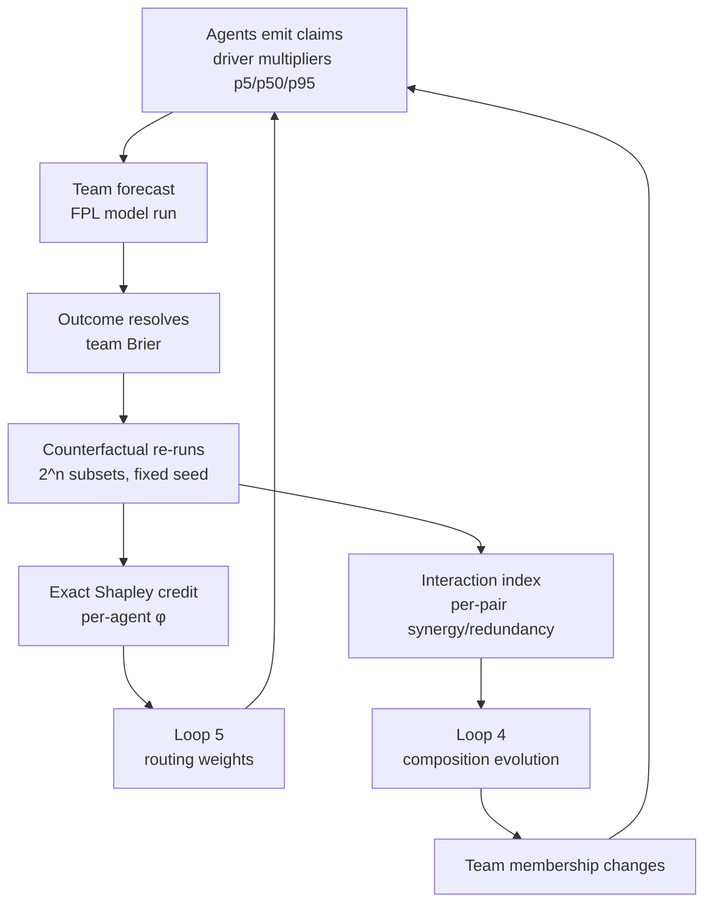

# Combinatorial Credit Assignment

### How the Agent Bestiary learns which agents are good and which teams work

**Status:** draft explainer · implementation in `src/attribution/`
**Audience:** anyone who needs to understand what a per-agent score on this platform means, and what it does not mean
**Related:** `docs/architecture/FEEDBACK_LOOPS.md` (Loops 4 and 5), `scripts/loop5_brier_mechanical_check.sql`

---

## 1. The problem in one paragraph

A forecast is produced by a team of agents. When it resolves, the world scores
the *team*: one probability, one outcome, one Brier score. But the system needs
two things that a team score cannot provide. Loop 5 needs to know **which agent
was good**, so routing weights can favour it. Loop 4 needs to know **which
combination worked**, so team composition can evolve. Reading the team's score as
if it were each member's score answers neither question, and answers them
confidently, which is worse than not answering at all.

## 2. How the naive version fails

The obvious approach is to attribute a resolved forecast's Brier score to every
agent named in its roster. This is what the platform did, and it fails in a
specific, diagnosable way.

The World Cup tournament model uses six factors supplied by four specialists.
Every forecast cites every specialist. So every specialist accumulates an
*identical* set of forecasts, and therefore an identical score — 48 resolved
forecasts produced four numbers that agreed to the last decimal place.

The instinct is that this is a data problem: run more team permutations and the
scores will separate. That instinct is half right, and the wrong half matters.

Write the situation as a linear system. Let $b_f$ be the team's score on forecast
$f$, and $s_i$ the skill of agent $i$. Roster membership forms a design matrix
$M$ where $M_{fi} = 1$ if agent $i$ was on forecast $f$. Recovering per-agent
skill means solving $M s \approx b$. That system is identifiable only if $M$ has
full column rank. When every agent is on every forecast, $M$ is a matrix of ones:
**rank 1**. No amount of additional data raises the rank of a matrix of ones. The
scores are not noisy estimates of per-agent skill that will sharpen with volume;
they are not estimates of per-agent skill at all.

Running more compositions does raise the rank. But it buys a weaker quantity than
it appears to: agent $i$'s score becomes *"the mean performance of teams
containing $i$"*, which credits $i$ for its teammates' work. Two agents that
always appear together stay perfectly collinear and permanently inseparable. And
the data cost is brutal — isolating $n$ agents needs at least $n{+}1$ well-chosen
rosters with enough resolved questions each. For a quadrennial tournament that is
not a mechanism, it is a wish.

> The platform now detects this condition directly. Check `L5-I03` in the
> mechanism probe: it counts agents whose attributed forecast set is identical to
> another's — the rank-deficiency case, reported as a structural finding rather
> than a thin-data caveat.

## 3. The key move: counterfactuals instead of permutations

We do not need to observe alternative teams in the world, because **the forecast
model is a program**.

Each specialist's contribution enters the model as a declared parameter. The
factor templates look like this:

```text
param socio_p5:  real
param socio_p50: real
param socio_p95: real

driver socio_capital continuous {
    distribution: triangular(socio_p5, socio_p50, socio_p95)
}

model: 0.0208
     * (socio_capital ^ 0.5)
     * (dynamic_performance ^ 1.8)
     * ...
```

and each agent emits a claim into exactly those parameters:

```text
[MULTIPLIER] Suggested p50: 1.15 (p5: 1.05, p95: 1.28)
```

So if we know what each agent claimed, we can re-run the model with **any subset**
of agents contributing and the rest neutralised. One real forecast yields $2^n$
synthetic forecasts. With four specialists that is 16 model runs; with six
drivers, 64. Trivial next to the Monte Carlo itself.

This converts an unidentifiable regression problem into a **cooperative game**,
which is a solved problem.

## 4. The value function

For a resolved forecast with outcome $y$ and agent subset $S$, let $p_S$ be the
probability the model produces using only $S$'s claims. Define

$$v(S) = \mathrm{Brier}(p_\emptyset, y) - \mathrm{Brier}(p_S, y)$$

This is *improvement over the no-agent baseline*: positive means the subset moved
the forecast toward the truth. By construction $v(\emptyset) = 0$.

The World Cup template makes this especially clean. Its own comments note that
neutral teams — all $p_{50} = 1.0$ — reproduce the base rate. So $p_\emptyset$ is
the uniform $1/48$ prior, and $v(N)$ is exactly *how much the whole team improved
on knowing nothing*. The counterfactual semantics were already latent in the
model design; we are reading them out, not imposing them.

### Neutralisation is a modelling choice, not a detail

"Agent absent" is ambiguous, and the two readings answer different questions. The
implementation makes the choice explicit and records it with every result.

| Mode | Absent agent's driver becomes | Question answered |
|---|---|---|
| `Identity` | its identity value (`1.0` for a multiplier) | *What if this agent had said nothing?* |
| `Reference` | a supplied reference triple (BayesOps posterior, or pooled mean of all agents' historical claims) | *What if an average agent replaced it?* |

`Identity` measures credit against **silence**; it flatters an agent on a
heavily-weighted driver, because that agent collects the whole distance from
neutral. `Reference` measures credit against **replacement**, isolating the
agent's edge over the field — which is the fairer question for routing, since a
real composition change swaps an agent rather than deleting it.

A $\phi$ computed under one mode is **not comparable** to one computed under the
other. Always report the mode.

## 5. Why Shapley, specifically

Given $v$, we need to split $v(N)$ among the agents. The Shapley value is the
*unique* rule satisfying all four of:

- **Efficiency** — $\sum_i \phi_i = v(N) - v(\emptyset)$. Per-agent credit
  exactly decomposes the team's total improvement. Nothing invented, nothing
  lost. This is what makes the output *accounting* rather than a heuristic split,
  and it is machine-checkable.
- **Symmetry** — agents with identical marginal behaviour receive identical
  credit, regardless of label or ordering.
- **Dummy** — an agent that changes no subset's value receives exactly zero. A
  neutral specialist cannot accumulate credit by merely being on the roster.
  *This is the axiom that kills the original bug.*
- **Additivity** — attribution over a sum of games is the sum of attributions,
  which is what licenses averaging per-forecast credit across forecasts.

The formula averages an agent's marginal contribution over every possible
ordering of arrivals:

$$\phi_i = \sum_{S \subseteq N \setminus \{i\}} \frac{|S|!\,(n-|S|-1)!}{n!}\,\bigl[v(S \cup \{i\}) - v(S)\bigr]$$

Cheaper alternatives all break at least one axiom. Splitting evenly breaks dummy.
Sobol-weighting breaks efficiency. Plain leave-one-out — computing only
$v(N) - v(N \setminus \{i\})$ — measures each agent solely in the presence of all
others, so it misattributes every interaction effect and its parts do not sum to
the whole. Shapley averages over all orderings, which is precisely why it is the
correct tool for a *combinatorial* loop rather than a merely additive one.

We enumerate exactly rather than sampling. Sampling approximations exist for large
$n$, but they trade away exactness of the efficiency property — and exactness is
the entire reason for choosing Shapley.

## 6. Interactions: the Loop 4 signal

Marginal credit still cannot answer *"which team should we run?"*. Two agents may
each be individually valuable yet redundant together, or individually weak yet
complementary. That information lives in second-order structure.

For each pair the implementation computes the Shapley interaction index, averaging

$$\Delta_{ij}(S) = v(S \cup \{i,j\}) - v(S \cup \{i\}) - v(S \cup \{j\}) + v(S)$$

whose sign is directly actionable:

| Sign | Reading | Action |
|---|---|---|
| $> 0$ | **synergy** — worth more together than apart | keep both |
| $\approx 0$ | independent | treat separately |
| $< 0$ | **redundancy** — they substitute for each other | consider dropping the cheaper |

This is the quantity Loop 4 needs to propose composition changes on evidence
rather than on vibes. Notably, the original World Cup failure mode reappears here
as a *measurement* instead of a bug: two agents whose claims always coincide split
their credit rather than double-counting it, and their interaction index reads
strongly negative — correctly flagging them as substitutable.

## 7. What this fixes, concretely

The properties below are not aspirations; each is pinned by a test in
`src/attribution/`.

**Credit is signed correctly regardless of team outcome.** In a worked
four-specialist example where one agent's claim is badly wrong, the team as a
whole ends up *worse* than the no-agent baseline — yet the three agents that
helped still receive positive credit, and the one that hurt receives negative
credit. A team-level Brier gets this backwards in both directions: it punishes
the three and rewards the one. The mirror case also holds — when the team
improves overall, an agent dragging against the outcome is still penalised.

**Agents are discriminated on a single forecast.** Two specialists on the same
forecast with the same outcome receive different credit, ordered by their drivers'
influence: the agent on the exponent-1.8 driver out-earns the one on
exponent-0.5. No permutations, no additional data — the discrimination the naive
scheme could never produce at any sample size.

**Silence earns nothing.** An agent claiming the neutral value receives credit
within $10^{-9}$ of zero.

## 8. A bug this construction exposed

Efficiency is not just an elegance property — it is a live diagnostic, and
building it surfaced a real defect in the simulation engine.

The Shapley decomposition requires $v(S)$ to be **deterministic**. If two subset
evaluations differ by Monte Carlo noise, that noise is silently misread as agent
credit. So every subset is evaluated under the same fixed seed.

That was not sufficient. `Executor::with_seed` existed and appeared to guarantee
reproducibility, but the per-iteration sampling loop iterated a `HashMap` of
drivers. Rust randomises `HashMap` iteration order, so the RNG stream was consumed
in a different order in each `Executor` instance: **two executors built with the
same seed and the same program could return different results.** Anything relying
on seeded reproducibility was relying on luck.

The symptom was the dummy-player test: an agent that claimed the neutral value —
provably worth zero — picked up roughly $10^{-4}$ of phantom credit. The fix was
to switch the driver maps to `BTreeMap` so sample order is sorted and the seed
becomes authoritative.

Two lessons worth generalising:

1. **Efficiency alone would not have caught this.** Because efficiency is computed
   from the same memoised subset values, it stays internally consistent even when
   those values are noisy; the noise redistributes credit *between* players
   without changing the sum. The axiom that caught it was *dummy*. Testing a
   construction against all of its properties, not just its headline one, is what
   made the bug visible.
2. **Sample order is part of a seed's contract.** Any seeded stochastic system
   that iterates an unordered collection while drawing samples is not actually
   reproducible.

## 9. The resolution-time job, and its two validity gates

Attribution runs on both resolution paths (the API `/resolve` handler and the
Polymarket oracle), spawned rather than awaited because `2^n` model runs must not
delay a resolution. `src/handlers/attribution.rs`:

1. Load the forecast's `fpl_source`, outcome, and `scored_probability` — mig-174's
   *frozen* anchor, not the still-mutable `predicted_probability`.
2. Reconstruct each agent's claims from the ledger. Explicit `forecast_id`
   bindings win; otherwise the as-of join takes the latest claim per
   `(workspace, driver)` at or before scoring time.
3. Enumerate all `2^n` subsets under `stable_seed(forecast_id)`.
4. Exact Shapley + pairwise interactions.
5. **Gate.** Then persist header + per-agent credit + interactions (mig-188),
   idempotently, in one transaction.

The gates exist because Loop 4 and Loop 5 are optimisers, and a credit signal
they cannot trust is worse than no signal at all — they will faithfully optimise
toward whatever they are given.

| Gate | Meaning | Action |
|---|---|---|
| `efficiency_residual` | `\|Σφᵢ − (v(N)−v(∅))\|`. Exact Shapley ⇒ ~1e-12. Larger means the value function wasn't deterministic, so Monte Carlo noise has been redistributed as credit. | **Refuses to write** above 1e-6 |
| `reconstruction_error` | `\|p_full − scored_probability\|`. If re-applying every claim doesn't reproduce the probability that was scored, the φ values describe a forecast that never existed. | Warns and records; consumers filter |

`reconstruction_error` is deliberately not a hard refusal: a BayesOps refit or a
manual edit can move params without going through an agent claim, so a forecast
legitimately may not reconstruct from claims alone. Refusing outright would
suppress attribution for every fitted forecast. Recording it lets a consumer
decide.

Interactions are derived from the subset probabilities already computed, so they
cost no extra model runs *and* are guaranteed to share the same randomness as the
marginals — the two can never disagree. A test pins cached interactions against
freshly-computed ones.

## 10. Honest limits

- **The claims must be retained.** Attribution requires knowing what each agent
  individually claimed. The multiplier hook previously wrote claims to a
  current-state params record that the next write overwrote, so historical
  forecasts have no recoverable per-agent inputs and **cannot be backfilled**.
  Migration 187 adds `forecast_agent_claims`, an append-only ledger; attribution
  is available only for forecasts made after it is deployed.
- **Claim-to-forecast binding is temporal.** Claims are recorded before a forecast
  row exists, so binding is an as-of join: the forecast evaluated at $T$ used the
  latest claim per `(workspace, driver)` with `claimed_at <= T`.
- **An unclaimed driver contributes nothing.** A model may declare drivers no
  agent claimed — an agent failed, a driver has no owner, or the ledger predates
  that specialist. Every declared driver is pre-seeded at the multiplicative
  identity so those parameters are neutral rather than unbound. Without this, one
  missing claim aborts attribution for the entire forecast with
  `Undefined variable: <driver>_p5`. The consequence to keep in mind: a driver
  whose agent silently stopped reporting looks *neutral*, not *missing*.
- **Attribution inherits the model's structure.** $\phi_i$ measures an agent's
  contribution *through the model as specified*. If a driver's exponent is
  mis-set, or the decomposition omits a real causal factor, credit is distorted
  in exactly that way. This is a faithful measurement of contribution-to-forecast,
  not a model-free measure of agent quality.
- **Correlated forecasts inflate apparent sample size.** The 48 World Cup
  forecasts are one tournament with a shared outcome structure — not 48
  independent draws. Per-forecast decompositions are exact; the *mean* $\phi_i$
  across them has a far smaller effective sample than $n=48$ suggests. Report
  bootstrap confidence intervals clustered by tournament, and keep the
  `evidence_class` gate (`none` / `undiscriminating` / `no_skill` / `provisional`
  / `thin` / `usable`) on top.
- **Mechanism soundness is a separate question from score quality.** A perfectly
  wired loop with $n=3$ still yields a provisional number. Verify the machinery
  with `scripts/loop5_brier_mechanical_check.sql` or
  `GET /api/observatory/loops/brier/mechanism`; those checks are sample-size
  independent and must be clean at $n=1$.

## 11. Why this is the recursive core

The loop closes on itself, which is the point.



Loop 5 uses $\phi_i$ to route more work to agents that demonstrably move
forecasts toward truth. Loop 4 uses the interaction matrix to change who is on
the team. Both feed back into which claims get made on the next forecast, which
regenerates the evidence both loops learn from.

The reason this is worth the rigour: **a credit signal that is merely plausible
does not just fail to help, it actively degrades the system.** Loop 4 and Loop 5
are optimisers. Give them a confounded signal and they will faithfully optimise
toward it — concentrating work on agents that were lucky in their teammates, and
pruning agents whose contribution was real but attributed elsewhere. Under a
rank-1 design matrix they optimise toward noise while reporting improvement.

Exact Shapley over a counterfactual value function is, as far as we can tell, the
weakest assumption set under which combinatorial self-improvement is sound rather
than superstitious.

---

## Appendix: API surface

```rust
use fermi::attribution::{exact_shapley, pairwise_interactions};
use fermi::attribution::counterfactual::{
    CounterfactualModel, AgentClaims, DriverClaim, Neutralisation, attribute_forecast,
};

// Seed derived from the forecast id so recomputation months later is identical.
let model = CounterfactualModel::from_source(&fpl_snapshot, 10_000, seed)?;

let agents = vec![
    AgentClaims {
        agent_name: "macro_data_agent".into(),
        drivers: vec![DriverClaim::multiplier("socio", 1.05, 1.15, 1.30)],
    },
    AgentClaims {
        agent_name: "football_analyst".into(),
        // One agent, three drivers, one Shapley player.
        drivers: vec![
            DriverClaim::multiplier("dynamic",  1.20, 1.40, 1.65),
            DriverClaim::multiplier("squad",    1.10, 1.25, 1.40),
            DriverClaim::multiplier("tactical", 1.05, 1.15, 1.25),
        ],
    },
];

let att = attribute_forecast(&model, &agents, outcome, Neutralisation::Identity)?;

// Assert the decomposition before trusting or persisting it.
assert!(att.shapley.efficiency_residual() < 1e-9);

for (name, phi) in att.agent_names.iter().zip(&att.shapley.values) {
    println!("{name}: {phi:+.5}");
}
```

Score **drivers** as players instead of agents for a finer decomposition — the
machinery is identical, only the grouping changes.

### Reading the results

```sql
-- Per-agent credit, gated on both validity checks. Never read shapley_value
-- without these predicates: an ungated read can act on credit derived from
-- Monte Carlo noise, or from a reconstruction of a forecast that never existed.
SELECT c.agent_name,
       count(*)                       AS n_forecasts,
       round(avg(c.shapley_value)::numeric, 5) AS mean_credit,
       round(stddev(c.shapley_value)::numeric, 5) AS sd
  FROM forecast_agent_credit c
  JOIN forecast_attributions a
    ON a.forecast_id = c.forecast_id
   AND a.neutralisation = c.neutralisation
 WHERE c.neutralisation = 'identity'
   AND a.efficiency_residual < 1e-6
   AND (a.reconstruction_error IS NULL OR a.reconstruction_error < 0.01)
 GROUP BY c.agent_name
 ORDER BY mean_credit DESC;

-- Loop 4: which pairs are complementary, which are redundant.
SELECT agent_a, agent_b,
       round(avg(interaction_index)::numeric, 5) AS mean_interaction,
       CASE WHEN avg(interaction_index) > 0 THEN 'synergy'
            WHEN avg(interaction_index) < 0 THEN 'redundant'
            ELSE 'independent' END AS reading
  FROM forecast_agent_interactions
 WHERE neutralisation = 'identity'
 GROUP BY agent_a, agent_b
 ORDER BY abs(avg(interaction_index)) DESC;
```

Apply the same honesty gate as elsewhere: with correlated forecasts, `n_forecasts`
overstates the effective sample. Cluster bootstrap intervals by tournament before
letting either loop act on a ranking.

### The live read path

`GET /api/agents/:id/calibration` now returns a `contribution` block carrying
mean $\phi$, `n_forecasts`, `n_clusters`, `positive_rate`, and a 90% cluster
bootstrap interval — gated on both validity checks.

It is reported **alongside** the pre-existing team fields, not instead of them.
`calibration_score`, `brier_mean` and `brier_skill_score` are now explicitly
labelled `score_scope: "team"`, because that is what they always were:
properties of the forecasts an agent participated in, identical across all
members of a composition that cites everyone. `moe_router_strategist` already
consumes `calibration_score`, and silently redefining a live field is how a
measurement problem becomes a routing problem. Consumers migrate deliberately.

The interval deserves attention because of what it says about the current data.
Clustering is by forecast `domain`, and `cluster_bootstrap_ci` returns `None`
below three distinct clusters. For a single tournament that is exactly what
happens: `n_forecasts: 48, n_clusters: 1, ci_low: null`, with

> *Interval undefined: fewer than 3 independent clusters. All evidence comes from
> one correlated group, which carries no information about between-group
> variability. Treat the mean as a point observation, not an estimate.*

That is the honest answer, and it is a stronger statement than a wide interval
would be. One tournament contains no replication to resample; any interval
computed from within-tournament spread would be false precision of roughly
$\sqrt{48}$. A test pins this: ignoring clustering demonstrably produces a
narrower interval than respecting it.
