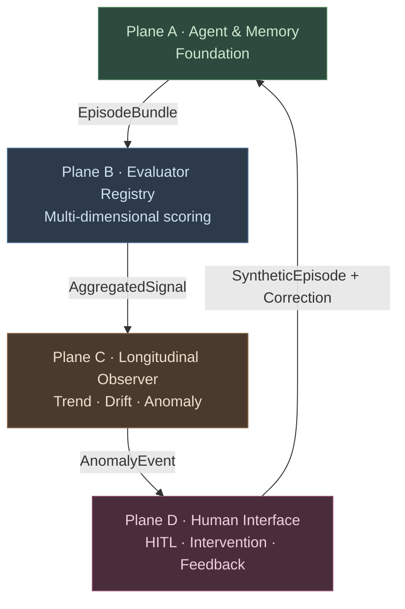
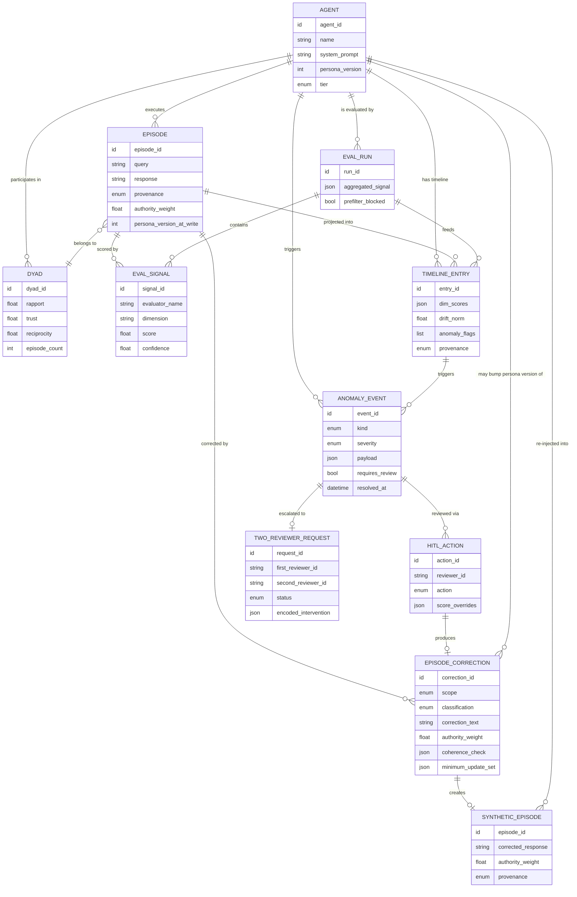
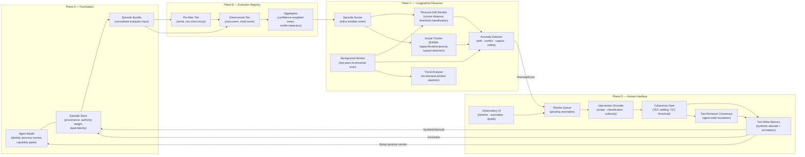
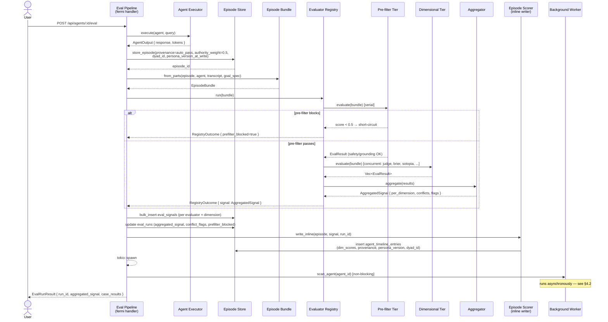
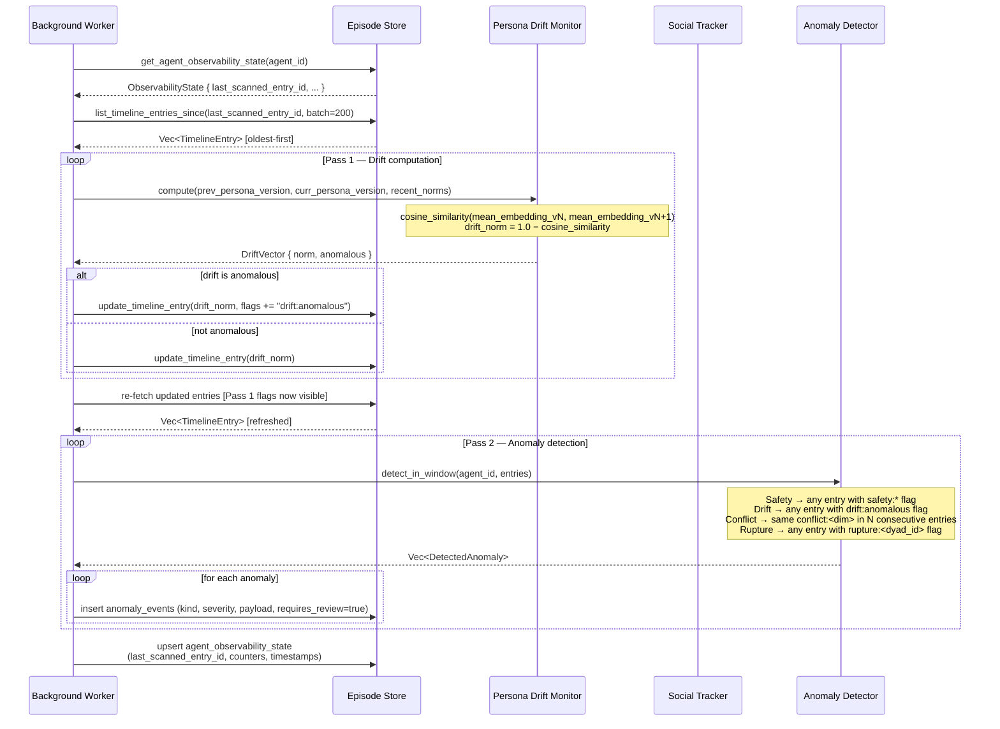
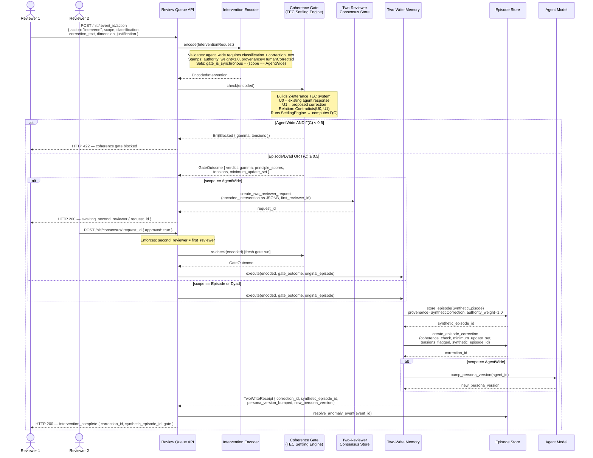
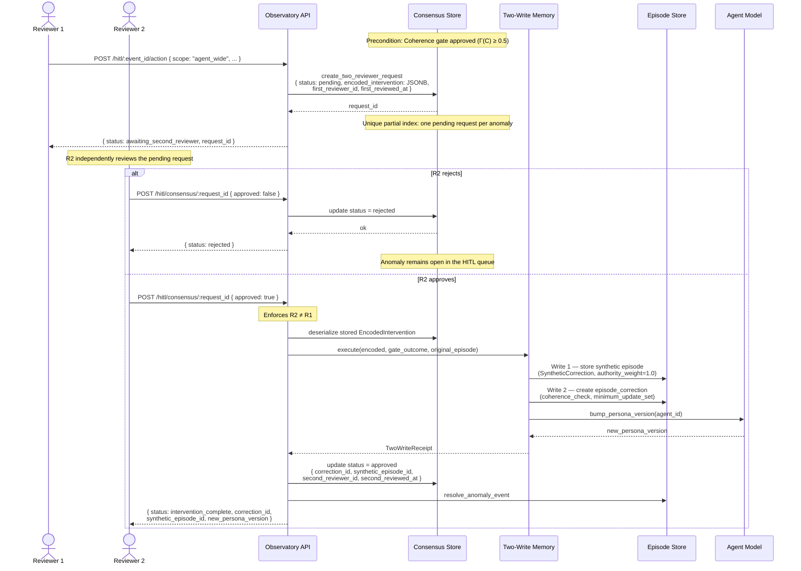
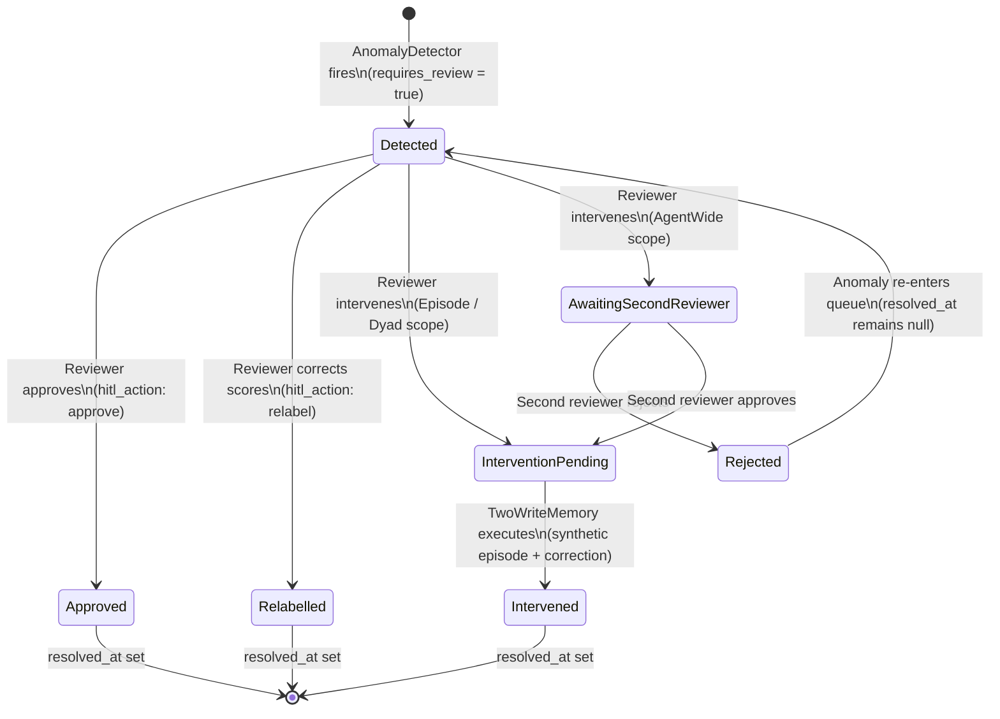
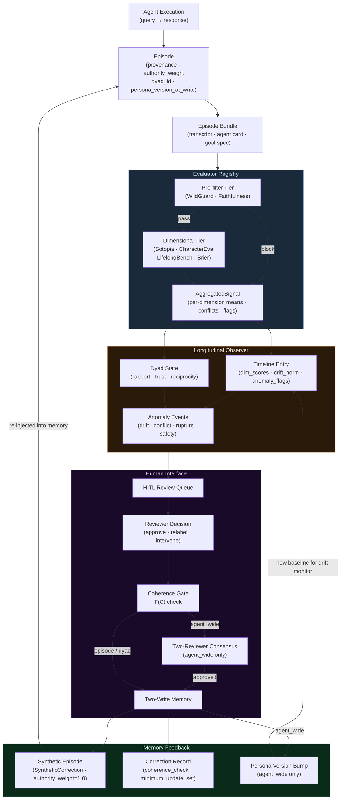

# Social Agent Observability Platform — Logical Architecture

**Audience:** Technical leads, architects, senior contributors  
**Companion to:** `OBSERVABILITY_ARCHITECTURE_SPEC.md` (physical implementation detail)  
**Purpose:** Defines the system in logical terms — what the components *are*,
what domain concepts they own, and how they interact — independent of language,
crate boundaries, or SQL schema particulars.

---

## 1. System Overview

The Social Agent Observability Platform is a **closed-loop behavioral monitoring
system** for AI agents. It continuously evaluates agent behavior across multiple
dimensions, builds a longitudinal record of how an agent's behavior evolves over
time, surfaces anomalies to human reviewers, and — when reviewers intervene —
feeds corrective signals back into the agent's behavioral baseline through a
coherence-gated memory write.

The system is organized into four logical planes. Each plane transforms the
outputs of the plane below it into richer, more actionable information.

The feedback arrow from Plane D back to Plane A is the defining feature of the
system: it is not a one-way monitoring pipeline but a **recursive improvement
loop** in which human review decisions are re-injected as high-authority
behavioral evidence.

---

## 2. Domain Ontology (Entity-Relationship)

The following ER diagram expresses the domain model — the *concepts* and their
relationships — not the physical schema columns.

### Key ontological relationships

| Relationship | Meaning |
|---|---|
| `AGENT` → `EPISODE` | An agent's execution history. Every interaction produces an episode. |
| `EPISODE` → `DYAD` | Episodes between the same agent and human are grouped into a dyad, which tracks relational dynamics over time. |
| `EPISODE` → `EVAL_SIGNAL` | One episode may be scored by multiple evaluators across multiple dimensions. |
| `EVAL_SIGNAL` → `TIMELINE_ENTRY` | Scores are projected into a denormalized timeline entry, the primary read surface for trend analysis. |
| `TIMELINE_ENTRY` → `ANOMALY_EVENT` | When the timeline reveals drift, conflict, rupture, or safety issues, an anomaly event is raised. |
| `ANOMALY_EVENT` → `HITL_ACTION` | A human reviewer acts on the anomaly — approving, relabelling, or intervening. |
| `HITL_ACTION` → `EPISODE_CORRECTION` | An intervention produces an immutable correction record. |
| `EPISODE_CORRECTION` → `SYNTHETIC_EPISODE` | The correction is materialized as a new high-authority episode that feeds back into the agent's behavioral baseline. |
| `AGENT.persona_version` | Increments on system-prompt edits and agent-wide interventions, creating version boundaries that the drift monitor tracks across. |

---

## 3. Logical Module Map

The following diagram shows the logical modules of the system and their
dependency relationships. Each logical module is named on the left; its
implementing Rust crate is shown on the right.

### Logical → physical crate mapping

| Logical Module | Rust Crate | Key Types |
|---|---|---|
| Agent Model, Episode Store, Episode Bundle | `agent-bestiary-memory` | `Agent`, `Episode`, `EpisodeBundle`, `MemoryStore` |
| Pre-filter Tier, Dimensional Tier, Aggregator | `agent-bestiary-evaluators` | `EvalModel`, `EvalTier`, `EvaluatorRegistry`, `Aggregator`, `AggregatedSignal` |
| Episode Scorer, Drift Monitor, Social Tracker, Anomaly Detector, Trend Analyser, Background Worker | `agent-bestiary-observability` | `EpisodeScorer`, `PersonaDriftMonitor`, `SocialInteractionTracker`, `AnomalyDetector`, `TrendAnalyzer`, `ObservabilityWorker` |
| Intervention Encoder, Coherence Gate, Two-Write Memory | `agent-bestiary-coherence-gate` | `InterventionEncoder`, `CoherenceGate`, `TwoWriteMemory` |
| Observatory UI, Review Queue (HTTP handlers) | `fermi` (application) | `src/handlers/observatory.rs` |
| LLM Judge, Brier Lookup (production EvalModel adapters) | `fermi` (application) | `src/handlers/eval_judge.rs`, `src/handlers/eval_brier.rs` |

---

## 4. Interaction Diagrams

### 4.1 Eval pipeline → evaluator registry → timeline write (hot path)

This is the primary data ingestion path. It runs synchronously for every eval
case and ends with a non-blocking background worker spawn.

---

### 4.2 Background worker scan (drift + anomaly detection)

The worker runs after the hot path completes. It is also triggered on-demand
via the observatory UI's "Trigger Scan" button.

---

### 4.3 HITL action → coherence gate → two-write feedback loop

This diagram covers the full intervention path from a reviewer's action in the
observatory UI to the memory write that closes the improvement loop. It shows
both the `episode`/`dyad` path (immediate write) and the `agent_wide` path
(two-reviewer consensus required).

---

### 4.4 Two-reviewer consensus flow (agent-wide scope detail)

This diagram isolates the two-reviewer workflow to show the state machine of
a `two_reviewer_requests` record across its lifecycle.

---

## 5. State Machine — Anomaly Event Lifecycle

An anomaly event passes through a well-defined set of states from detection to
resolution. This state machine is the operational contract between Plane C
(which creates events) and Plane D (which resolves them).

---

## 6. Logical Data Flow — End to End

This diagram shows how a single agent execution event flows through the entire
system and loops back as a corrective signal.

---

## 7. Module Responsibilities Summary

| Logical Module | Owns | Consumes | Produces |
|---|---|---|---|
| **Agent Model** | Agent identity, `persona_version`, capability gates | — | Agent metadata for all planes |
| **Episode Store** | Episode history, provenance, authority weight, dyad identity | Agent execution output | Episodes, EpisodeBundles, MemoryStore R/W |
| **Episode Bundle** | Normalized evaluator input contract | Raw episode + agent card | `EpisodeBundle` for the registry |
| **Pre-filter Tier** | Safety + grounding checks | `EpisodeBundle` | `EvalResult` or short-circuit signal |
| **Dimensional Tier** | Multi-dimensional behavioral scoring | `EpisodeBundle` | `Vec<EvalResult>` |
| **Aggregator** | Confidence-weighted mean, conflict detection | `Vec<EvalResult>` | `AggregatedSignal` |
| **Episode Scorer** | Inline timeline write | `AggregatedSignal` + episode | `TimelineEntry` (hot path) |
| **Persona Drift Monitor** | Cross-version embedding distance | Episode embeddings per persona version | `DriftVector` (norm, anomalous flag) |
| **Social Tracker** | Per-dyad relational state (rapport/trust/reciprocity) | `AggregatedSignal` per dyad | Updated `DyadState`, rupture flags |
| **Anomaly Detector** | Four anomaly kinds (drift/conflict/rupture/safety) | `Vec<TimelineEntry>` | `Vec<DetectedAnomaly>` |
| **Trend Analyser** | On-demand window statistics per dimension | `Vec<TimelineEntry>` | `TrendReport` |
| **Background Worker** | Two-pass incremental scan, checkpoint management | Timeline entries since last scan | Updated drift fields, `AnomalyEvent` rows, checkpoint |
| **Observatory UI** | Dashboard and HITL queue rendering | Timeline, dyad, anomaly, trend APIs | Human-readable views |
| **Intervention Encoder** | Validation and stamping of reviewer intent | Raw `InterventionRequest` | `EncodedIntervention` (authority_weight=1.0) |
| **Coherence Gate** | TEC constraint satisfaction, Γ(C) threshold | `EncodedIntervention` | `GateOutcome` (approved/settled/blocked) |
| **Two-Reviewer Consensus** | Four-eyes enforcement for agent-wide scope | `EncodedIntervention` from first reviewer | Confirmed or rejected consensus record |
| **Two-Write Memory** | Synthetic episode + immutable correction annotation | `EncodedIntervention` + `GateOutcome` | `SyntheticEpisode`, `EpisodeCorrection`, optional persona version bump |
