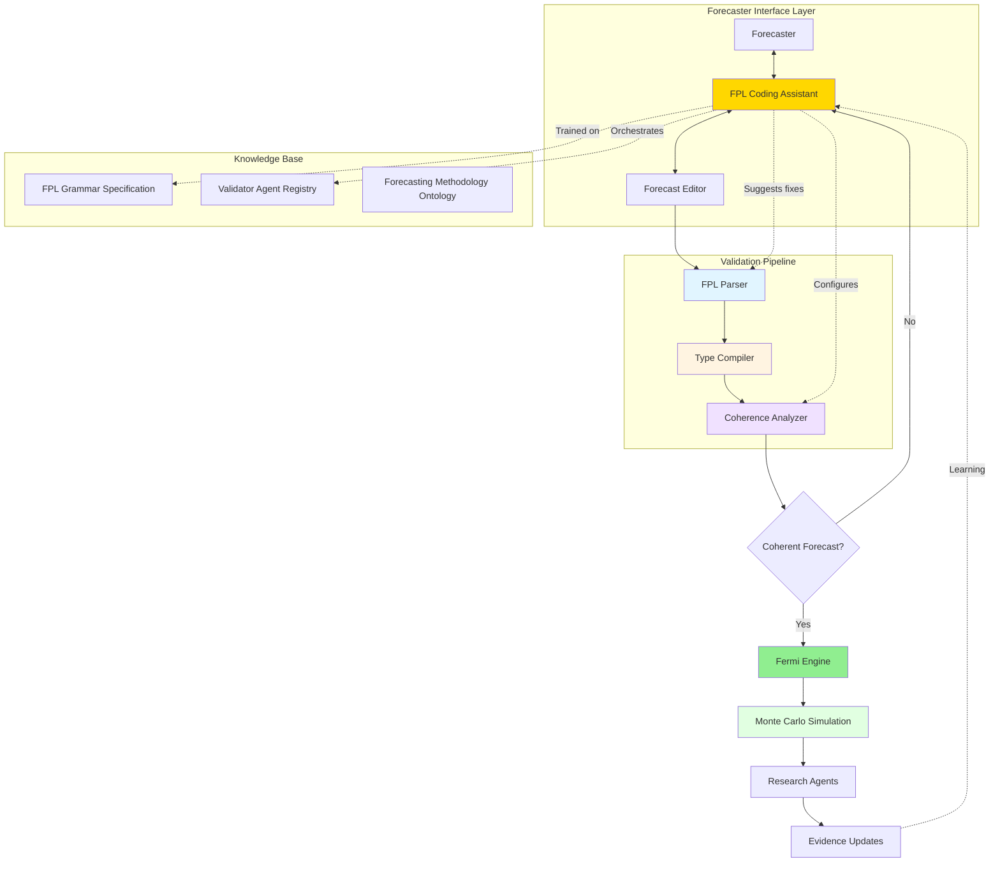
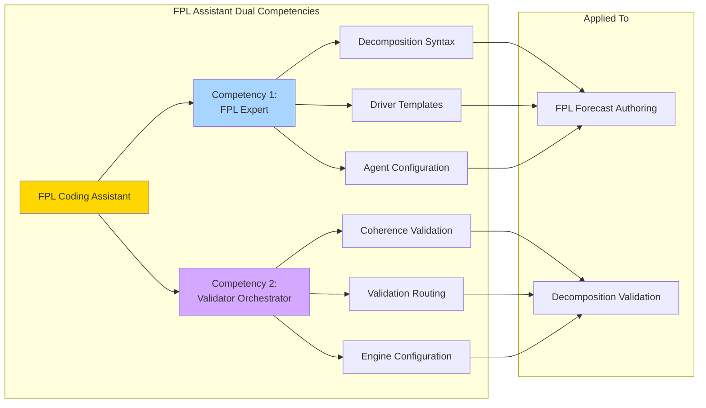
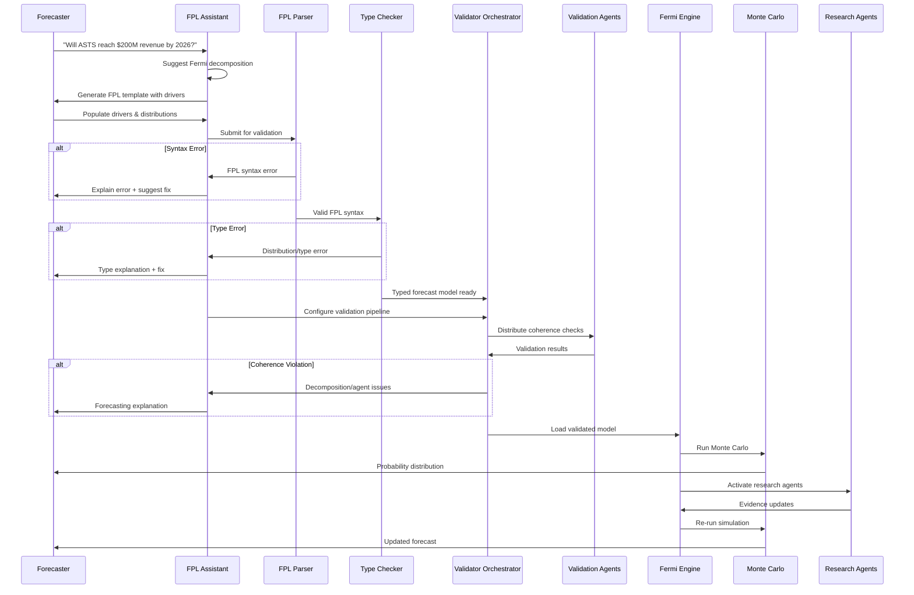
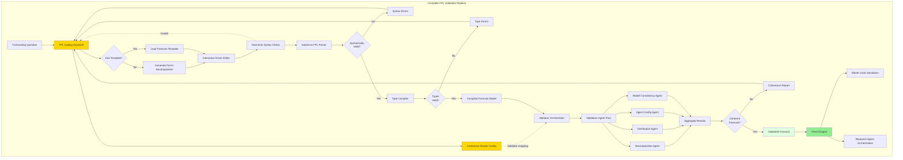
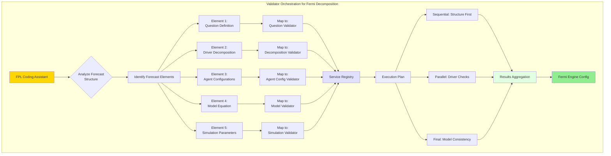

# Agent-Assisted Probabilistic Forecasting: FPL as an Interface to Decomposition-Based Reasoning

## White Paper

**Abstract:** This paper presents a novel architecture for expressing probabilistic forecasts through the Forecasting Programming Language (FPL), a domain-specific language that interfaces with a decomposition-based probabilistic reasoning engine. The system combines formal language theory (BNF grammars), probabilistic type systems, and agent-based semantic validation, with a specialized coding assistant that bridges forecasters and the underlying Fermi decomposition engine to ensure both syntactic correctness and forecasting coherence.

---

## System Architecture











---

## Introduction

Probabilistic forecasting—estimating the likelihood of future events through quantified uncertainty—requires both rigorous decomposition methodology and continuous evidence integration. Domain experts can intuitively break questions into component drivers but struggle to express these decompositions in forms suitable for Monte Carlo simulation, agent-based research, and calibration tracking.

This architecture introduces the Forecasting Programming Language (FPL) as a human-readable interface to a **Fermi decomposition engine**—a probabilistic reasoning system that:

1. **Decomposes** complex questions into quantifiable drivers
2. **Simulates** uncertainty propagation through Monte Carlo methods
3. **Orchestrates** research agents to gather evidence
4. **Updates** probability estimates based on new evidence
5. **Detects arbitrage** between internal forecasts and external signals
6. **Tracks calibration** through Brier scoring at resolution

The system ensures FPL programs are syntactically valid, type-safe, and **methodologically coherent**—satisfying Fermi decomposition principles, distributional reasonableness, agent configuration validity, and simulation tractability.

## The Fermi Decomposition Engine

Before describing FPL's role, we must understand the underlying reasoning engine:

### Core Capabilities

**Fermi Decomposition:** Breaks complex questions into multiplicative or additive drivers:
```
P(Revenue ≥ $200M) ← Revenue = TAM × MarketShare × ARPU × (Months/12)
```

**Monte Carlo Simulation:** Samples from driver distributions to propagate uncertainty:
- Each driver has a probability distribution (triangular, normal, lognormal, etc.)
- Engine draws N samples, evaluates model equation for each
- Produces output distribution and probability estimates

**Research Agent Orchestration:** Coordinates specialized agents that:
- Search for evidence on specific queries
- Update driver distributions based on findings
- Monitor external signals (market consensus, analyst forecasts)
- Trigger on keywords, sentiment changes, or schedules

**Evidence Integration:** Updates beliefs based on agent findings:
- Manual evidence with impact assessments (weak/moderate/strong)
- Automated evidence from configured agents
- Bayesian updating of driver distributions

**Arbitrage Detection:** Identifies disagreements between:
- Internal forecast probability
- External signals (analyst consensus, prediction markets, options pricing)
- Generates trade signals or research hypotheses when gaps exceed threshold

**Calibration Tracking:** At question resolution:
- Fetches ground truth outcome
- Calculates Brier score: `BS = (forecast - outcome)²`
- Updates user calibration profile
- Performs retrospective analysis on which drivers were wrong

### Requirements for Input Models

The Fermi engine requires models that satisfy:

1. **Valid Decomposition:** Model equation references defined drivers
2. **Distribution Specifications:** Each driver has well-formed probability distribution
3. **Type Consistency:** Operations match driver types (continuous vs binary)
4. **Agent Coherence:** Research agents have valid queries and schedules
5. **Simulation Feasibility:** Model complexity supports requested iterations
6. **Resolution Criteria:** Clear definition of what constitutes question resolution

FPL's role is to provide a human-friendly way to specify models meeting these requirements.

## FPL Language Constructs

### Question Definition

```fpl
question "Will ASTS reach $200M revenue by 2026-12-31?" {
  domain: satellite_telecom
  resolution_criteria: "Audited annual revenue ≥ $200M in fiscal 2026"
  target_date: 2026-12-31
  base_rate: reference_class(
    "pre-revenue satellite companies reaching 24mo targets",
    confidence: medium
  )
  model: revenue_model
}
```

**Purpose:** Defines the forecasting question, resolution criteria, and anchoring base rate

### Driver Decomposition

```fpl
driver market_tam: continuous {
  name: "Total Addressable Market"
  unit: USD
  dist: triangular {
    p5: 2_000_000_000,   // $2B pessimistic
    p50: 5_000_000_000,  // $5B likely
    p95: 7_000_000_000   // $7B optimistic
  }
  rationale: """
    Conservative estimate based on:
    - IoT connectivity growth projections
    - Maritime/aviation demand trends
    - Emergency services adoption rates
  """
  agents: [
    research_analyst {
      query: "satellite connectivity market TAM 2026"
      schedule: weekly(monday, 09:00)
      confidence_threshold: 0.7
    }
  ]
  evidence: [
    manual {
      source: "Morgan Stanley Research"
      date: 2024-11-15
      content: "TAM $5.8B by 2026, 28% CAGR"
      impact: increase(moderate)
    }
  ]
}

driver regulatory_risk: binary {
  name: "Major Regulatory Blocker"
  prob: 0.15  // 15% chance of blocker
  if_true: {
    launch_timeline *= 1.5,  // 50% delay
    market_tam *= 0.7        // 30% TAM reduction
  }
  agents: [
    regulatory_monitor {
      query: "FCC spectrum AST SpaceMobile"
      schedule: daily
      triggers: ["FCC", "spectrum", "approval", "denial"]
    }
  ]
}
```

**Purpose:** Specifies individual drivers with uncertainty distributions, evidence, and research agents

### Model Equation

```fpl
model: multiplicative {
  revenue = market_tam * market_share * arpu * (months_active / 12)
}
```

**Purpose:** Defines how drivers combine to produce the forecast output

### Monte Carlo Simulation

```fpl
simulate: monte_carlo {
  iterations: 10_000
  seed: random
  output: {
    probability: p(revenue >= 200_000_000),
    distribution: histogram(bins: 50),
    sensitivity: variance_decomposition,
    confidence_interval: [p10, p50, p90]
  }
}
```

**Purpose:** Configures uncertainty propagation and output statistics

### External Signals

```fpl
external_signals: [
  analyst_consensus {
    source: "Bloomberg Terminal"
    query: "ASTS revenue estimates 2026"
    update: daily
  },
  options_market {
    source: "CBOE"
    instrument: "ASTS 2026 calls"
    implied_probability: extract_from_options
  }
]
```

**Purpose:** Integrates external probability estimates for comparison

### Arbitrage Detection

```fpl
arbitrage: detect {
  internal: this.probability,
  external: [analyst_consensus, options_market],
  when abs(internal - external.mean) > 0.15 {
    alert: "Disequilibrium detected"
    hypothesis: generate_explanation(internal, external)
    trade_signal: if internal < external then "SHORT" else "LONG"
  }
}
```

**Purpose:** Identifies and acts on disagreements between forecasts

### Resolution and Learning

```fpl
on_resolve: {
  outcome: fetch_from("SEC EDGAR", "ASTS 2026 annual revenue")
  brier_score: calculate(this.probability, outcome)
  calibration: update_user_profile(this.brier_score)
  retrospective: {
    decompose_error: which_drivers_were_wrong,
    pattern_detection: analyze_bias,
    learning_note: extract_lessons
  }
}
```

**Purpose:** Enables calibration tracking and learning from forecast outcomes

## Architecture Components

### 1. Forecaster Interface Layer

The FPL coding assistant serves as an intelligent intermediary between forecasters and the Fermi engine. The assistant possesses dual competencies:

**FPL Expertise:** Deep understanding of Fermi decomposition methodology:
- How to decompose questions into independent drivers
- Distribution selection for different variable types
- Research agent configuration patterns
- Model equation formulation (multiplicative vs additive vs scenario-weighted)
- Common forecasting pitfalls and how to avoid them

The assistant translates forecasting intent ("I want to estimate whether a company will hit a revenue target") into valid FPL syntax with appropriate decomposition structure.

**Validator Orchestration:** Knowledge of forecasting validation requirements:
- Which validators check which aspects of forecast coherence
- Dependencies between validation steps
- How to configure validators based on forecast type
- Interpretation of validator results in forecasting terms

### 2. Formal Validation Layer

**FPL Parser:** Enforces grammatical correctness of forecast specifications. The parser recognizes:
- Question blocks with resolution criteria
- Driver declarations (continuous/binary) with distributions
- Model equations (multiplicative/additive/scenario-weighted)
- Agent configurations with schedules and triggers
- Simulation parameters
- External signal definitions
- Arbitrage detection rules
- Resolution specifications

**Type Checker:** Enforces type safety specific to Fermi decomposition:
- **Distribution Types:** Parameters appropriate for distribution families (p5 < p50 < p95 for triangular)
- **Driver Types:** Operations valid for continuous vs binary drivers
- **Unit Consistency:** Dimensional analysis in model equations
- **Probability Ranges:** Binary driver probabilities in [0,1]
- **Temporal Validity:** Target dates in future, schedules well-formed
- **Reference Integrity:** Model equation references defined drivers

The type checker produces a typed AST representing the forecast model, ready for coherence validation.

### 3. Coherence Validation Layer

A pool of specialized validation agents ensures forecasting methodological coherence:

**Decomposition Coherence Agent:** Validates Fermi decomposition structure:
- Drivers are reasonably independent (low correlation)
- Decomposition covers major sources of uncertainty
- Model equation appropriately combines drivers
- Base rate reference class is relevant
- At least 2 drivers specified (Fermi principle)

**Distribution Reasonableness Agent:** Checks probability distributions:
- Distribution family appropriate for variable type
- Uncertainty ranges are realistic (not too wide/narrow)
- P5-P50-P95 follow monotonicity (triangular)
- Parameters match domain expectations
- Binary probabilities have supporting rationale

**Agent Configuration Validity Agent:** Validates research agent setup:
- Query strings are specific and actionable
- Schedules are appropriate for information cadence
- Triggers are well-defined keywords or conditions
- Agent types match data sources
- No duplicate or conflicting agents

**Model Consistency Agent:** Ensures model equation coherence:
- All referenced drivers are defined
- Mathematical operations are valid
- Units cancel appropriately
- Binary driver conditionals properly structured
- Constraints don't create contradictions

**Evidence Quality Agent:** Assesses manual evidence:
- Sources are credible
- Dates are recent enough to be relevant
- Impact assessments are justified
- Evidence doesn't contradict other evidence
- Evidence updates align with driver uncertainty

**Simulation Feasibility Agent:** Checks Monte Carlo parameters:
- Iteration count adequate for precision
- Output metrics are computable
- Sensitivity analysis is feasible
- Query complexity matches model structure

**External Signal Coherence Agent:** Validates external integrations:
- Data sources are accessible
- Extraction methods are valid
- Update frequencies are realistic
- Probability extraction is appropriate

**Arbitrage Logic Agent:** Checks arbitrage detection:
- Threshold is reasonable
- Actions are well-defined
- External signals are comparable to internal forecast
- Trade signals are actionable

### 4. Knowledge Base

**FPL Grammar Specification:** BNF definition provided in the uploaded document

**Validator Agent Registry:** Maps FPL components to validators:

```json
{
  "question": ["decomposition_coherence_agent"],
  "driver": [
    "distribution_reasonableness_agent",
    "agent_config_validity_agent",
    "evidence_quality_agent"
  ],
  "model": ["model_consistency_agent"],
  "simulate": ["simulation_feasibility_agent"],
  "external_signals": ["external_signal_coherence_agent"],
  "arbitrage": ["arbitrage_logic_agent"]
}
```

**Forecasting Methodology Ontology:** Shared concepts including:
- Fermi decomposition principles
- Distribution families and their use cases
- Research agent types and capabilities
- Model combination strategies
- Calibration metrics
- Common forecasting biases

## The FPL Assistant's Role in Fermi Decomposition

### FPL Expertise: Guiding Forecast Construction

**Decomposition Template Generation:** When a forecaster poses a question, the assistant suggests a Fermi decomposition:

```
Forecaster: "Will SpaceX successfully land humans on Mars by 2030?"

Assistant analyzes and generates:
----------------------------------------
question "Will SpaceX land humans on Mars by 2030-12-31?" {
  domain: space_exploration
  resolution_criteria: "Crewed SpaceX mission lands on Mars surface"
  target_date: 2030-12-31
  base_rate: reference_class(
    "ambitious space mission timeline predictions",
    confidence: low
  )
  model: mission_success_model
}

// Suggested Fermi decomposition:
// Mission Success = Technical × Funding × Regulatory × Timeline

model: multiplicative {
  mission_success = technical_readiness * 
                    funding_sustained * 
                    regulatory_approval * 
                    timeline_feasibility
}

driver technical_readiness: binary {
  name: "Starship achieves orbital refueling"
  prob: <SPECIFY>
  rationale: """
    Key milestone: demonstrate in-orbit propellant transfer
    Required for Mars trajectory delta-v
  """
}

driver funding_sustained: binary {
  name: "SpaceX maintains $5B+/year Mars funding"
  prob: <SPECIFY>
}

driver regulatory_approval: binary {
  name: "FAA/NASA approve crewed Mars mission"
  prob: <SPECIFY>
}

driver timeline_feasibility: continuous {
  name: "Development schedule compression factor"
  dist: triangular {
    p5: <OPTIMISTIC>,
    p50: <LIKELY>,
    p95: <PESSIMISTIC>
  }
  unit: dimensionless
}
----------------------------------------
```

**Real-time Decomposition Guidance:**

```
Forecaster types: 
  driver market_size: continuous {
    dist: normal { mean: 100, stddev: 200 }
  }

Assistant warns: "Your distribution has negative support 
(Normal can go negative). For market sizes, consider:
- Lognormal (always positive, right-skewed)
- Triangular with positive bounds
- Uniform with [min, max] both positive"

Forecaster: "Use lognormal"

Assistant suggests: "For lognormal, specify:
- median (p50 value you expect)
- sigma (uncertainty spread, typically 0.3-0.8)

Example: lognormal { median: 100, sigma: 0.5 }
This gives roughly p5≈45, p50=100, p95≈220"
```

**Agent Configuration Assistance:**

```
Forecaster: "I need to track regulatory developments"

Assistant generates:
----------------------------------------
agents: [
  regulatory_monitor {
    query: "FAA Starship launch license updates"
    schedule: weekly(monday, 09:00)
    triggers: [
      "FAA", "Starship", "license", "approval", "delay",
      "environmental review", "public comment"
    ],
    alert_on: sentiment_change(threshold: 0.3)
  },
  legal_analyst {
    query: "space law crewed Mars mission requirements"
    schedule: monthly
    regions: ["united_states", "international"]
  }
]
----------------------------------------

🦊 Fermi tip: Set weekly monitoring for fast-moving regulatory 
processes, monthly for slower policy developments. Triggers 
should include both positive (approval) and negative (delay) 
keywords to catch all updates.
```

**Evidence Impact Guidance:**

```
Forecaster adds evidence:
  evidence: [
    manual {
      source: "Elon Musk tweet"
      date: 2026-02-01
      content: "Starship orbital refueling test scheduled for Q3"
      impact: increase(strong)
    }
  ]

Assistant analyzes: "⚠️ Consider impact calibration:
- 'strong' increases p50 by ~15-25%
- Source credibility: Musk tweets are aspirational, success 
  rate on timelines ≈40%
- Recommendation: Use 'moderate' impact, or adjust credibility 
  in rationale

Would you like me to suggest a credibility discount?"
```

**Model Equation Validation:**

```
Forecaster writes:
  model: multiplicative {
    revenue = tam * market_share * price
  }

But defines drivers:
  driver tam: continuous {...}
  driver market_share: continuous {...}
  driver arpu: continuous {...}

Assistant catches: "❌ Model references 'price' but you 
defined 'arpu'. Did you mean:
  revenue = tam * market_share * arpu
Or do you need to add a 'price' driver?"
```

### Validator Orchestration: Intelligent Coherence Checking

**Service Discovery:** The assistant understands validation requirements:

```
For forecast with:
- 5 continuous drivers
- 2 binary drivers with conditionals
- 3 research agents
- External market signal
- Arbitrage detection

Assistant determines validation pipeline:
1. Decomposition Coherence (sequential, foundation)
2. Distribution Reasonableness (parallel for all drivers)
3. Agent Config Validity (parallel)
4. Model Consistency (sequential, after drivers validated)
5. Evidence Quality (parallel)
6. External Signal Coherence (parallel)
7. Simulation Feasibility (sequential, after model)
8. Arbitrage Logic (sequential, after external)
```

**Dynamic Pipeline Construction:**

```
FPL program has:
  - Question with base rate
  - 4 drivers (3 continuous, 1 binary)
  - Model: multiplicative
  - No agents configured
  - No external signals
  - No arbitrage detection

Assistant configures minimal validation:
  Parallel: [
    Decomposition Coherence,
    Distribution Reasonableness (×4),
    Model Consistency
  ]
  Sequential after:
    Simulation Feasibility

Skips: Agent Config, Evidence Quality, External Signal, 
       Arbitrage Logic (not present in program)

⚠️ Assistant warns: "No research agents configured. Your 
forecast is static—it won't update with new evidence. 
Consider adding at least one agent to monitor your key 
driver assumptions."
```

**Failure Analysis and Guidance:**

```
Validation fails on Distribution Reasonableness:

Agent reports:
  driver market_share: continuous {
    dist: triangular { p5: 0.5, p50: 0.15, p95: 0.8 }
  }
  
  Violation: p5 > p50 (pessimistic > likely estimate)

Assistant translates:
----------------------------------------
❌ Distribution Error in 'market_share' driver

Your estimates are backwards:
- p5 (pessimistic): 0.5 (50%)
- p50 (likely): 0.15 (15%)
- p95 (optimistic): 0.8 (80%)

🦊 Fermi: In a triangular distribution:
- p5 is your pessimistic estimate (bad scenario)
- p50 is your most likely estimate
- p95 is your optimistic estimate (good scenario)

So: p5 should be ≤ p50 ≤ p95

Did you mean:
  p5: 0.05 (5% pessimistic)
  p50: 0.15 (15% likely)
  p95: 0.30 (30% optimistic)

Or perhaps you were thinking in different units?
----------------------------------------
```

**Coherence Suggestions:**

```
Validation passes but Assistant notices potential issue:

program has:
  driver revenue: continuous {
    dist: triangular { p5: 50M, p50: 200M, p95: 500M }
  }
  driver costs: continuous {
    dist: triangular { p5: 30M, p50: 150M, p95: 300M }
  }
  
  model: additive {
    profit = revenue - costs
  }

Assistant warns:
⚠️ Coherence Note: Your revenue and costs are independent 
in the model, but they likely correlate in reality:
- High revenue scenarios often mean high costs (scaling)
- Low revenue scenarios may have fixed cost base

Consider:
1. Adding constraints linking them:
   constraints: [
     if revenue > 400M then costs *= 1.2
   ]
2. Or using a margin-based model:
   model: multiplicative {
     profit = revenue * profit_margin
   }
3. Or adding correlation coefficient (advanced):
   [This would require engine extension]

Current model may underestimate profit variance.
```

## Validation Pipeline Flow

### Phase 1: Question Analysis and Template Creation

```
Forecaster → "Will event X happen by date Y?"
        ↓
FPL Assistant analyzes question domain
        ↓
Suggests Fermi decomposition structure
        ↓
Generates FPL template with driver scaffolding
        ↓
Forecaster populates distributions, evidence, agents
```

### Phase 2: Formal Validation

```
Populated FPL program
        ↓
FPL Parser (syntactic check)
        ↓
Type Checker (distribution/type validation)
        ↓
Typed AST produced
```

### Phase 3: Coherence Validation Orchestration

```
FPL Assistant receives AST
        ↓
Analyzes forecast structure
        ↓
Determines which validators apply
        ↓
Configures validation pipeline with dependencies
        ↓
Validator Orchestrator executes plan:
  - Sequential: Decomposition → Model → Simulation
  - Parallel: Distributions, Agents, Evidence
        ↓
Results aggregated with context
```

### Phase 4: Error Handling or Engine Submission

```
If validation errors:
    FPL Assistant explains failures in Fermi terms
    Suggests specific fixes maintaining intent
    Offers to auto-correct if unambiguous
    Loop to Phase 1 or 2
    
If validation passes:
    FPL Assistant configures Fermi Engine
    Submits validated model
    Engine runs Monte Carlo simulation
    Research agents activated on schedules
    Results presented to forecaster
```

### Phase 5: Ongoing Evidence Integration

```
Research agents execute queries
        ↓
New evidence updates driver distributions
        ↓
Engine re-runs simulation automatically
        ↓
Forecaster notified of material changes
        ↓
External signals monitored
        ↓
Arbitrage detection triggers alerts
```

### Phase 6: Resolution and Learning

```
Question resolves (target date reached)
        ↓
Engine fetches outcome per resolution criteria
        ↓
Calculates Brier score
        ↓
Performs retrospective analysis
        ↓
Updates forecaster calibration profile
        ↓
FPL Assistant learns from decomposition accuracy
```

## Key Innovations

### 1. **Fermi Methodology as First-Class Language Construct**

FPL embeds decomposition principles directly in syntax:
- Questions must specify resolution criteria and base rates
- Drivers have explicit uncertainty distributions
- Model equations show how drivers combine
- Evidence and agents explicitly update beliefs

This makes forecasting methodology **auditable and reproducible**.

### 2. **Agent Orchestration as Declarative Configuration**

Rather than imperative agent management, FPL declares:
- What agents should research
- When they should search (schedules/triggers)
- How findings should update distributions

The Fermi engine handles execution, coordination, and evidence integration.

### 3. **Continuous Forecaster Guidance**

Unlike traditional DSLs, the FPL Assistant provides:
- Decomposition suggestions based on question analysis
- Distribution selection guidance for variable types
- Evidence impact calibration
- Common bias warnings
- Fermi-style coaching throughout

### 4. **Arbitrage Detection as Native Feature**

FPL treats disagreement-finding as a core capability:
- Compare internal decomposition to external signals
- Generate hypotheses for divergence
- Produce actionable signals (research, betting, revision)

### 5. **Calibration Tracking Built In**

Forecasting improvements require feedback loops:
- Resolution criteria specified upfront
- Automatic Brier scoring at resolution
- Retrospective analysis identifies which drivers were wrong
- Learning accumulates in forecaster profile

## Benefits

**Methodological Rigor:** Fermi decomposition principles enforced through language structure

**Evidence Integration:** Automated research agents continuously update forecasts

**Reduced Cognitive Load:** Assistant handles syntax complexity, forecaster focuses on decomposition logic

**Scalable Forecasting:** Once model specified, simulations and updates happen automatically

**Calibration Culture:** Brier tracking and retrospectives build forecasting skill over time

**Arbitrage Discovery:** Systematic detection of disagreements with external signals

**Reproducible Forecasts:** FPL programs document reasoning, can be audited and versioned

**Learning Feedback:** Retrospectives inform future decompositions

## Trade-offs

**Complexity:** Four-layer architecture requires careful design

**Assistant Training:** FPL Assistant needs deep knowledge of Fermi methodology

**Forecaster Learning Curve:** Understanding decomposition principles takes time

**Agent Coordination:** Managing multiple research agents requires orchestration logic

**Computational Cost:** Monte Carlo with 10K+ iterations requires compute resources

**Evidence Quality:** Automated agents may return noisy or contradictory findings

**Overfitting Risk:** Too many drivers can create false precision

## Ideal Use Cases

This architecture excels for:

### 1. **Strategic Business Forecasting**
- Market sizing and TAM estimation
- Revenue projections with uncertainty
- Competitive positioning assessments
- Product launch success probability

### 2. **Geopolitical Forecasting**
- Election outcomes with scenario analysis
- Policy change probability tracking
- International relations developments
- Regulatory approval timelines

### 3. **Technology Forecasting**
- Research breakthrough timelines
- Adoption curve projections
- Infrastructure deployment rates
- Technical milestone achievement

### 4. **Financial Forecasting**
- Company performance forecasts
- Market movement probability
- Macro indicator predictions
- Investment thesis quantification

### 5. **Scientific Forecasting**
- Research outcome likelihood
- Clinical trial success rates
- Environmental change trajectories
- Technology maturation timelines

### Common Characteristics

- **Complex decomposition:** Multiple independent drivers
- **Evidence-rich domains:** Continuous information flow
- **Measurable outcomes:** Clear resolution criteria
- **Medium-term horizons:** Weeks to years (not decades)
- **Calibration valuable:** Repeated forecasting builds skill

## Implementation Considerations

### FPL Assistant Training

The assistant requires training on:

**Fermi Methodology:**
- Decomposition heuristics (multiplicative vs additive)
- Distribution selection for variable types
- Base rate identification and reference class construction
- Common forecasting biases (overconfidence, anchoring, etc.)
- Sensitivity analysis interpretation

**FPL Language Expertise:**
- Grammar specification and production rules
- Type system and constraints
- Agent configuration patterns
- Model equation formulation
- Simulation parameter tuning

**Validation Orchestration:**
- Validator capabilities and limitations
- Validation dependency graphs
- Performance characteristics
- Error interpretation and explanation
- Fix suggestion strategies

### Validator Agent Registry

Structured registry maps FPL elements to validators:

```json
{
  "question": {
    "validators": ["decomposition_coherence_agent"],
    "priority": "critical",
    "blocking": true
  },
  "driver": {
    "validators": [
      "distribution_reasonableness_agent",
      "agent_config_validity_agent",
      "evidence_quality_agent"
    ],
    "priority": "high",
    "blocking": true
  },
  "model": {
    "validators": ["model_consistency_agent"],
    "priority": "critical",
    "blocking": true,
    "depends_on": ["driver"]
  },
  "simulate": {
    "validators": ["simulation_feasibility_agent"],
    "priority": "medium",
    "blocking": false,
    "suggests_alternatives": true
  }
}
```

### Performance Optimization

**Caching:**
- Memoize Monte Carlo results for unchanged drivers
- Cache research agent findings with TTL
- Store validation results for incremental updates

**Incremental Validation:**
- Re-validate only changed components
- Propagate changes through dependency graph
- Skip unaffected validators

**Parallel Execution:**
- Distribute independent driver validations
- Parallelize Monte Carlo sampling
- Concurrent research agent queries

**Adaptive Simulation:**
- Start with 1K iterations, increase if high variance
- Early termination if convergence detected
- Dynamic precision based on output sensitivity

## Example Walkthrough

### Initial Question

```
Forecaster: "Will ASTS reach $200M revenue by end of 2026?"
```

### Assistant Analysis and Template Generation

```
FPL Assistant analyzes:
- Domain: Satellite telecommunications (high uncertainty)
- Target: Specific revenue milestone
- Timeline: ~1 year
- Decomposition approach: Revenue = TAM × Share × ARPU × Time

Generates template:
----------------------------------------
question "Will ASTS reach $200M revenue by 2026-12-31?" {
  domain: satellite_telecom
  resolution_criteria: "Audited annual revenue ≥ $200M in fiscal 2026"
  target_date: 2026-12-31
  base_rate: reference_class(
    "pre-revenue satellite companies reaching 24mo targets",
    confidence: medium
  )
  model: revenue_model
}

model: multiplicative {
  revenue = market_tam * market_share * arpu * (months_active / 12)
}

driver market_tam: continuous {
  name: "Total Addressable Market"
  unit: USD
  dist: triangular {
    p5: <SPECIFY>,
    p50: <SPECIFY>,
    p95: <SPECIFY>
  }
  rationale: """<YOUR_REASONING>"""
  agents: []
  evidence: []
}

driver market_share: continuous {
  name: "Market Share"
  unit: percent
  dist: triangular {
    p5: <SPECIFY>,
    p50: <SPECIFY>,
    p95: <SPECIFY>
  }
  constraints: []
}

driver arpu: continuous {
  name: "Average Revenue Per User"
  unit: USD_per_month
  dist: triangular {
    p5: <SPECIFY>,
    p50: <SPECIFY>,
    p95: <SPECIFY>
  }
}

driver months_active: continuous {
  name: "Months of Commercial Service"
  unit: months
  dist: triangular {
    p5: <SPECIFY>,
    p50: 12,
    p95: 12
  }
}

simulate: monte_carlo {
  iterations: 10_000
  seed: random
  output: {
    probability: p(revenue >= 200_000_000),
    distribution: histogram(bins: 50),
    confidence_interval: [p10, p50, p90]
  }
}
----------------------------------------
```

### Forecaster Populates Drivers

```
Forecaster fills in estimates:

driver market_tam: continuous {
  dist: triangular {
    p5: 2_000_000_000,
    p50: 5_000_000_000,
    p95: 7_000_000_000
  }
  rationale: """
    Based on IoT connectivity projections, maritime/aviation 
    markets, and emergency services. FCC approval reduces 
    regulatory risk.
  """
  agents: [
    research_analyst {
      query: "satellite connectivity market TAM 2026"
      schedule: weekly(monday, 09:00)
    }
  ]
}
```

### Validation Pipeline Execution

```
1. FPL Parser: ✓ Syntax valid
2. Type Checker: ✓ All types consistent
3. Validator Orchestration:
   
   Decomposition Coherence Agent:
   ✓ Four independent drivers identified
   ✓ Multiplicative model appropriate
   ✓ Base rate specified
   
   Distribution Reasonableness Agent (parallel):
   ✓ market_tam: reasonable range for satellite market
   ✓ market_share: realistic for new entrant
   ✓ arpu: within industry norms
   ✓ months_active: optimistic assumption (p95=12 suggests full year)
   
   Model Consistency Agent:
   ✓ All drivers referenced in model
   ✓ Units compatible (USD, percent, USD/month, months)
   ✓ No circular dependencies
   
   Agent Config Validity Agent:
   ✓ research_analyst has valid query
   ✓ Schedule well-formed
   ⚠️ Warning: Only 1 agent configured. Consider adding:
      - Competitive intelligence agent
      - Regulatory monitor
      - Financial analyst
   
   Simulation Feasibility Agent:
   ✓ 10K iterations sufficient for precision
   ✓ Output metrics computable
   
All critical validations passed. Ready for Fermi Engine.
```

### Engine Execution

```
Fermi Engine receives validated model
        ↓
Runs 10,000 Monte Carlo simulations:
  For each iteration:
    - Sample TAM ~ Triangular(2B, 5B, 7B)
    - Sample Share ~ Triangular(...)
    - Sample ARPU ~ Triangular(...)
    - Sample Months ~ Triangular(...)
    - Compute: Revenue = TAM × Share × ARPU × (Months/12)
    - Check: Revenue ≥ $200M?
        ↓
Results:
  P(Revenue ≥ $200M) = 0.23 (23%)
  
  Distribution:
    p10: $85M
    p50: $180M
    p90: $310M
  
  Sensitivity (variance decomposition):
    market_tam: 45% of variance
    market_share: 30% of variance
    arpu: 20% of variance
    months_active: 5% of variance
        ↓
Research agent activated:
  - research_analyst queries weekly
  - Updates market_tam distribution based on findings
        ↓
Forecast updates automatically when evidence changes
```

### Evidence Update Example

```
3 weeks later, research_analyst finds:

New evidence: {
  source: "Quilty Analytics Report"
  date: 2026-02-25
  content: "Satellite IoT market revised upward to $6.5B by 2026"
  confidence: 0.85
}

Engine updates:
  market_tam.dist: triangular {
    p5: 2_000_000_000,
    p50: 5_500_000_000,  // Increased from 5B
    p95: 7_500_000_000   // Increased from 7B
  }

Re-runs simulation:
  P(Revenue ≥ $200M) = 0.28 (28%)  // Up from 23%

Forecaster notified:
  "🔔 Your forecast updated: 23% → 28% (+5pp)
   Driver: market_tam
   Reason: Quilty Analytics upward TAM revision
   Evidence confidence: 85%"
```

### Resolution and Calibration

```
2027-01-15 (after fiscal 2026 ends):

Engine executes on_resolve:
  outcome: fetch_from("SEC EDGAR", "ASTS 2026 annual revenue")
  Result: $175M (actual revenue)
  
  brier_score: calculate(0.28, 0)  // Forecast 28%, outcome = No
  Brier Score: (0.28 - 0)² = 0.0784
  
  retrospective: {
    decompose_error: 
      - market_tam was accurate (actual ~$5.2B)
      - market_share was accurate (~0.032)
      - arpu was overestimated (actual $45 vs forecast $55)
      - months_active was optimistic (only 10 operational months)
    
    pattern_detection:
      - User tends to be optimistic on operational timelines
      - User's ARPU estimates trend 15-20% high
      
    learning_note:
      "Consider using more conservative timeline assumptions.
       Your ARPU estimates should be discounted by ~18%."
  }
  
  calibration: update_user_profile
    → User's overall Brier score: 0.095 (good calibration)
    → Identified bias: Timeline optimism
```

## Conclusion

This architecture represents a rigorous approach to probabilistic forecasting that combines Fermi decomposition methodology with automated evidence integration and continuous calibration. By introducing FPL as a domain-specific language with an intelligent coding assistant, the system bridges the gap between intuitive reasoning and formal probabilistic simulation.

The key insight is that forecasting is not a one-time estimation exercise but an ongoing process of decomposition, evidence gathering, belief updating, and learning. FPL provides the language to express this process declaratively, while the Fermi engine executes it rigorously.

The FPL Assistant's dual competencies—deep knowledge of forecasting methodology and orchestration of validation agents—make rigorous forecasting accessible to domain experts who understand their questions but lack formal probabilistic modeling expertise. By validating decomposition coherence, distribution reasonableness, agent configurations, and model consistency, the system ensures that forecasts are both structurally sound and methodologically defensible.

As forecasting becomes increasingly important for strategic decision-making under uncertainty—from business planning to policy analysis to technology assessment—architectures that combine human intuition with computational rigor will become essential. This pattern offers a blueprint for building such systems: formal languages that embed methodology, intelligent assistants that guide construction, automated agents that gather evidence, and feedback loops that drive continuous improvement.

The result is not just better forecasts, but better forecasters: humans who learn to decompose uncertainty, integrate evidence systematically, and calibrate their judgments through disciplined practice.

---

## References

1. Tetlock & Gardner - "Superforecasting: The Art and Science of Prediction"
2. Pearl - "Causality: Models, Reasoning, and Inference"
3. Montgomery & Runger - "Applied Statistics and Probability for Engineers"
4. Mauboussin - "More Than You Know: Finding Financial Wisdom in Unconventional Places"
5. Hubbard - "How to Measure Anything: Finding the Value of Intangibles in Business"
6. Silver - "The Signal and the Noise: Why So Many Predictions Fail—But Some Don't"
7. Domain-Specific Languages: Patterns and Implementation Strategies
8. Probabilistic Programming: Foundations and Applications
