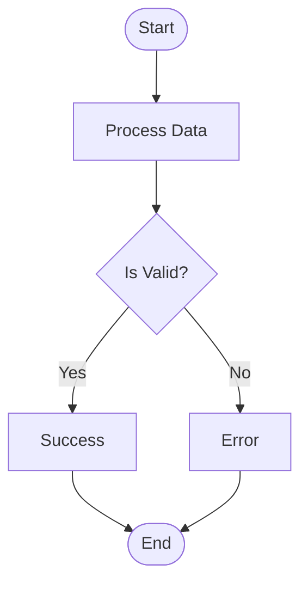
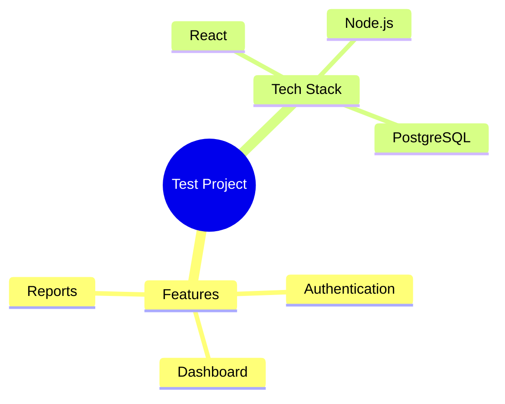
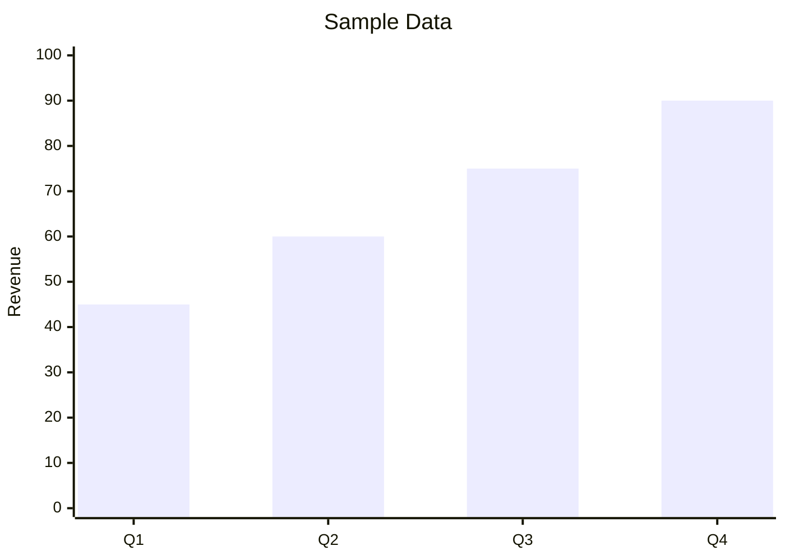

# Test Document

This is a test markdown file with Mermaid diagrams.

## Flowchart Example

```mermaid
flowchart TD
    Start([Start]) --> Process[Process Data]
    Process --> Decision{Is Valid?}
    Decision -->|Yes| Success[Success]
    Decision -->|No| Error[Error]
    Success --> End([End])
    Error --> End
```

## Mind Map Example

```mermaid
mindmap
  root((Test Project))
    Features
      Authentication
      Dashboard
      Reports
    Tech Stack
      React
      Node.js
      PostgreSQL
```

## Chart Example

```mermaid
xychart-beta
  title "Sample Data"
  x-axis ["Q1", "Q2", "Q3", "Q4"]
  y-axis "Revenue" 0 --> 100
  bar [45, 60, 75, 90]
```

## Conclusion

All diagrams should be rendered!
