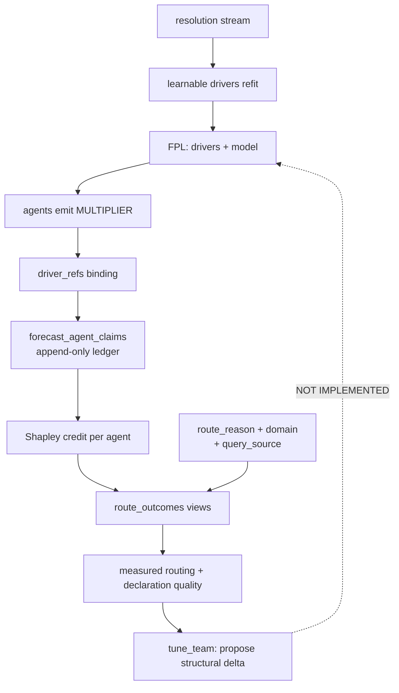

# Building Fermi Teams — a pattern and guide

> **Audience:** anyone adding a forecasting domain to the Fermi orchestra.
> **Status:** derived from the `weather_oracle` build (2026-08-13) and the
> defects it surfaced. Worked example: `docs/agents/WEATHER_ORACLE.md`.
> **Ground truth:** `src/agent_backend/agent_card.rs`,
> `crates/fermi-console/src/negotiate.rs`, `templates/world_cup/team_prior.fpl`

---

## 0. The one-paragraph version

A Fermi team is **an FPL program plus a set of agents that fill its drivers.**
The FPL is the forecast — it holds the question, the drivers, the model
expression, and the base rate. The agents are interchangeable evidence
suppliers bound to drivers by *declaration*, never by identity. Everything the
platform learns is downstream of that separation: hold the structure fixed and
you can measure the agents; declare the bindings and any agent can compete.

Get this wrong in the obvious way — an agent that "does forecasting" and
returns a number — and you have built something unmeasurable.

---

## 1. Decide which shape you are building

Two shapes exist and they have different economics. Choose deliberately; most
mistakes here are silent.

| | **One-off decomposition** | **Template (recurring)** |
|---|---|---|
| Origin | Fermi's `decompose_question` builds drivers on the fly | Hand-authored `.fpl` in `templates/` |
| Question count | 1 | tens to thousands, near-identical |
| Structure | new every time | fixed, `param`-bound per instance |
| Learns | little — n=1 per structure | a lot — drivers refit, agents accrue credit |
| Example | "Will Company X IPO in 2027?" | `team_prior.fpl` (48 teams), weather ladders (~50/day) |

**The counterintuitive part:** templates are where measurement becomes
possible. With a fresh decomposition every time, every structure has n=1, so
"agent X improves forecasts" is unfalsifiable — the agent did a different job
each run. A template holds structure fixed and varies the world, which gives
per-agent credit, per-route outcomes, and driver refits a real sample size.

**The trap:** templates freeze the layer whose learning loop is
**not yet implemented** (§7). So write a template when the question genuinely
recurs, and expect to hand-tune its structure for now.

---

## 2. Write the FPL first, before any agent

The program is the artefact. Agents are hired into it.

```
question "..." { base_rate { ... } }   ← the outside view, always
param  <name>: <type>                  ← per-instance bindings
driver <name> continuous { ... }       ← one per independent uncertainty
agent  <id> { driver_refs: [...] }     ← who researches what
model: <expression>                    ← THE forecast quantity
simulate N iterations
```

### Rules that matter

**One driver per *independent* source of uncertainty.** If two drivers move
together, you are double-counting and the model will be overconfident. Run
`run_sensitivity_analysis` before you trust a decomposition: if one driver
carries almost all total-order variance, the others are decoration.

**The `model:` expression IS the forecast.** The cockpit takes the Monte Carlo
mean directly — no normalisation, no implicit base-rate multiply. So the base
rate scalar lives *inside* the expression (`0.0208 * ...` in `team_prior`).
That is the operator's responsibility.

**Put a real base rate in `question`.** It is the outside view, the Brier Skill
Score denominator, and the sanity check. A forecast that cannot beat its own
base rate has negative skill and is not tradeable.

**Distribution parameters go in `param`, not literals.** `triangular(socio_p5,
socio_p50, socio_p95)` is refittable and inspectable; `triangular(0.9, 1.0,
1.1)` is neither.

**Declare `driver_refs` on every agent.** This is the binding. It is read at
runtime by `resolve_driver_prefixes`. Omit it and the agent's multiplier is
discarded with a warning — the agent runs, costs money, and contributes
nothing.

**Mark drivers `learnable: true` when a resolution stream exists.** With a
`feeds_from { source, extractor, config }` block, BayesOps refits the
distribution from observations and writes `params.<driver>_fitted`, which the
executor then uses in place of your prior. This is the only loop that
currently self-improves. Available extractors: `scalar_field_value`,
`scalar_difference`, `binary_field_value`, `binary_winner_id_match`.

---

## 3. Design the agents as evidence suppliers, not forecasters

### Split roles so they cannot rationalise each other

The `weather_oracle` split, which generalises:

| Role | Owns | Must not |
|---|---|---|
| **Data/spec resolver** | what exactly is being predicted; raw distributions | calibrate, price |
| **Calibrator** | bias, dispersion, base-rate blending, skill check | see the market price |
| **Market/decision analyst** | resolution rules, pricing, sizing | forecast |
| **Compound front** | orchestration + adversarial self-challenge | do the members' jobs |

The critical separation is **calibrator never sees the price**. A single agent
that forecasts *and* prices will drift toward the number it wants. Structure
beats instruction here.

### Declare a real contract

Non-negotiable, because it is the entire basis of composability:

```json
"fermi_contract": {
  "finding_labels": ["BASE RATE", "...", "MULTIPLIER"],
  "multiplier_range": [0.1, 10.0],
  "kg_fact_categories": ["..."],
  "seed_facts": [ ... ]
}
```

`negotiate.rs` composes the query from a three-rung ladder over what you
declare — `prompt_template` → `finding_labels` → generic floor — with **no
branch on who your agent is**. Declaring labels is how you get asked precisely.
Declaring nothing gets you the honest floor and a `qsrc:undeclared` tag that
will show up in `declaration_quality_outcomes` as underperformance.

`MULTIPLIER` must be present: it is the orchestra's terminator, parsed as
`[MULTIPLIER] Suggested p50: X (p5: Y, p95: Z)`.

**Seed facts are load-bearing, not decoration.** They populate the CEP
knowledge graph on first boot. Put your domain's hard-won quantitative
findings there with sources and confidence — they are what the team knows
before it has run once.

### Put inference in FPL, not in prompts

The mistake worth naming, because it is the default one: writing a system
prompt that instructs a language model to do numerical error propagation in
prose. Do not.

The `weather_oracle` calibration chain, as prose in a prompt, produced
untestable arithmetic. As an FPL program with the corrections as drivers, it
produced a checkable answer that differed by **6.2×** on the tail probability
that mattered — and Sobol then showed that **34% of total-order variance came
from one unmeasured assumption**, which is a decline signal a prompt could
never have surfaced.

Rule of thumb: **LLM for judgement and evidence, FPL for arithmetic and
uncertainty, Rust for I/O and verified reference data.**

---

## 4. Build tools in Rust, keep them honest

Card-declared `mcp_tools` must have a dispatch arm or they are **phantom
tools** — advertised to the model, called, answered `Unknown tool: X`. A test
should pin this (see `weather_agent_cards_declare_no_phantom_tools`).

Design tools to make the *domain's traps* unrepresentable:

- **Encode verified reference data as a table with tests.** Weather's station
  registry exists because Polymarket's NYC market settles on KLGA, not Central
  Park. That single fact outweighs any modelling choice, and a `const` array
  plus five assertions makes it impossible to get wrong twice.
- **Return refusals, not wrong answers.** Non-US station → `available: false`
  plus an explanation, never a plausible number from the wrong source.
- **Gate degenerate inputs.** A settled order book with a $0.001 ask computes a
  +54¢/share "edge". `book_quality.tradeable` turns that into `DO NOT TRADE`.
- **Report what is missing.** Two of five ensemble models silently returned
  nothing; a narrower ensemble *reads as confidence*. Name the gap.
- **Attach the Monte Carlo error.** A 1.9% tail from 103 members is two members
  and ±1.4pp of noise. Never quote precision the sample cannot support.

---

## 5. Wire the learning loops — the part that is usually skipped

A team that runs but cannot be measured is a demo. Three loops; check each.



| Loop | Improves | Status | You must |
|---|---|---|---|
| **Parametric** | driver distributions | working | mark drivers `learnable` + declare `feeds_from` |
| **Credit** | which agent to trust | working | declare `driver_refs` so claims are recorded |
| **Provenance** | routing + declaration quality | new (mig-193) | nothing — automatic once contracts are declared |
| **Structural** | the decomposition itself | **table only, no code** | hand-tune, and expect to |

### Verify your team is measurable

```sql
-- Are your agents' claims landing at all?
SELECT agent_name, driver, COUNT(*) FROM forecast_agent_claims
WHERE workspace_id = '<ws>' GROUP BY 1,2;

-- Is your domain routing to the right agent, by evidence?
SELECT * FROM domain_agent_ranking WHERE domain = '<yours>'
ORDER BY avg_shapley DESC;

-- Does your declared contract actually help?
SELECT * FROM declaration_quality_outcomes;

-- Was overruling the strategist right?
SELECT * FROM router_override_scorecard WHERE domain = '<yours>';
```

If the first query returns nothing, your `driver_refs` are missing and nothing
downstream will ever work. Check the logs for
`[multiplier] agent produced a multiplier but no driver binding was found`.

---

## 6. Anti-patterns, each one observed in this codebase

**Hardcoding an agent id anywhere.** The recurring defect. Three instances
existed; one is fixed, one is scoped, one remains:

| Site | Was | Now |
|---|---|---|
| `negotiate.rs` query templates | `match (domain, agent_id)` | declaration ladder |
| `agent_params_hook.rs` bindings | `n.contains("analyst")` | reads FPL `driver_refs` |
| `routing.rs::domain_specialist` | `match domain` | still a table; mig-193 supplies the evidence to replace it |

The substring version is actively dangerous, not merely limiting:
`weather_market_analyst` matched `contains("analyst")` and wrote World Cup
football params into an unrelated workspace. Use whole-word matching at
minimum; prefer reading a declaration.

**Adding "one line" to a closed-world table.** The reflex to resist. Adding
`"climate" => "weather_oracle"` to `domain_specialist` works and makes the next
domain's author do it again. Prefer deriving candidates from declarations.

**Trusting an aggregate skill score for a threshold question.** Threshold
markets are tails by construction. On the HR-Extreme benchmark, error inside
extreme events rose +78% for physics NWP but +122% to +394% for AI models.
Headline RMSE is measured where you are not trading.

**Training a correction on raw observations.** Two independent papers
(Gkirmpas 2025; Microsoft DeepMC) found the same thing: with a raw target the
learner relearns the diurnal/seasonal cycle — ~50% feature importance on
time-of-day, ~0% on the features meant to be doing the work. **Learn the
residual, `observation − forecast`.** And validate by holding out *entities*
(stations, teams), not time slices, or you will massively overstate skill.

**Narrowing a distribution during calibration.** Every step should shift the
mean or widen the variance. A calibrated forecast sharper than the raw
ensemble means you made an error.

**Letting the front agent be a pass-through.** If the compound agent only
forwards member outputs, delete it and call the members. Its job is the
adversarial pass: is the target consistent across stages? Does the edge exceed
the calibration uncertainty? Were the corrections measured or assumed? Does it
survive a 40% wider spread?

---

## 7. What is not built yet — plan around it

**Structural learning has no implementation.** `composition_versions` exists
(mig-113, mig-120) and `docs/COMPOSITION_AS_FIRST_CLASS.md` specifies
`tune_team` RSI, but `grep tune_team --include=*.rs` returns nothing. Nothing
measures whether a decomposition was good, and nothing proposes a better one.

Consequences you inherit:

- Your model expression and exponents are hand-tuned and stay that way.
  `team_prior.fpl`'s Cobb-Douglas exponents were fitted **by eye against
  Polymarket prices** — the file says so — and 48 teams have since resolved
  without anyone re-fitting them.
- There is no promotion path from a good one-off decomposition to a template.
- There is no demotion path for a template whose structure underperforms.

**The risk this creates is template monoculture:** signal concentrates where
structure repeats, so effort concentrates on templates, so the system gets
better and better at questions it already has a template for and never
discovers new shapes. Classic explore/exploit collapse.

Mitigations available today:

1. Ship your template as **one candidate structure, not the answer.** Keep a
   second variant and Brier-compare them manually.
2. Reserve budget for non-templated decompositions in your domain.
3. Use `run_sensitivity_analysis` as a structural critic: if total-order
   variance concentrates on a parameter *you invented*, your decomposition is
   suspect regardless of its Brier score.

A domain with fast resolution is the right first customer for `tune_team` when
it is built — weather's ~50 resolutions/day converges a structural A/B in a
week, where the World Cup takes a cycle.

---

## 8. Checklist

**FPL**
- [ ] `question` has a real, sourced `base_rate`
- [ ] one driver per independent uncertainty; Sobol confirms none dominates by construction
- [ ] distribution parameters are `param`s, not literals
- [ ] `model:` expression is the forecast quantity, base rate included
- [ ] every agent declares `driver_refs`
- [ ] drivers with a resolution stream are `learnable` with `feeds_from`

**Agents**
- [ ] roles split so no agent both forecasts and prices
- [ ] `fermi_contract` with `finding_labels` including `MULTIPLIER`, and a `multiplier_range`
- [ ] `seed_facts` carry the domain's quantitative findings, with sources and confidence
- [ ] `accepts` / `produces` are precise enough to compose against
- [ ] no agent id hardcoded anywhere in Rust
- [ ] numerical work is in FPL, not prose

**Tools**
- [ ] every declared tool has a dispatch arm (test it)
- [ ] verified reference data is a tested table
- [ ] refusals where a wrong answer is possible
- [ ] missing inputs reported, not silently dropped
- [ ] sampling error attached to every tail probability

**Measurement**
- [ ] `forecast_agent_claims` receives rows when the team runs
- [ ] your domain appears in `domain_agent_ranking`
- [ ] the front agent can output "no forecast" / "no trade" and that counts as success
- [ ] Brier Skill Score against the base rate is reported, and negative skill halts the pipeline

---

## 9. Reference

| Topic | Where |
|---|---|
| Worked example | `docs/agents/WEATHER_ORACLE.md` |
| Template example | `templates/world_cup/team_prior.fpl` |
| Card schema | `src/agent_backend/agent_card.rs`, `agents/templates/agent_card.json` |
| Contract composition | `crates/fermi-console/src/negotiate.rs` (read the module doc) |
| Routing | `crates/fermi-console/src/routing.rs` |
| Driver binding | `src/handlers/workspace/agent_params_hook.rs` |
| BayesOps refit | `src/handlers/workspace/refit.rs`, `crates/posterior/src/extractors.rs` |
| Credit / Shapley | `src/attribution/`, migrations 187–188 |
| Route provenance views | `migrations/193_route_provenance_outcomes.sql` |
| Orchestra membership | `src/handlers/orchestras.rs` |
| Composition design intent | `docs/COMPOSITION_AS_FIRST_CLASS.md` |
