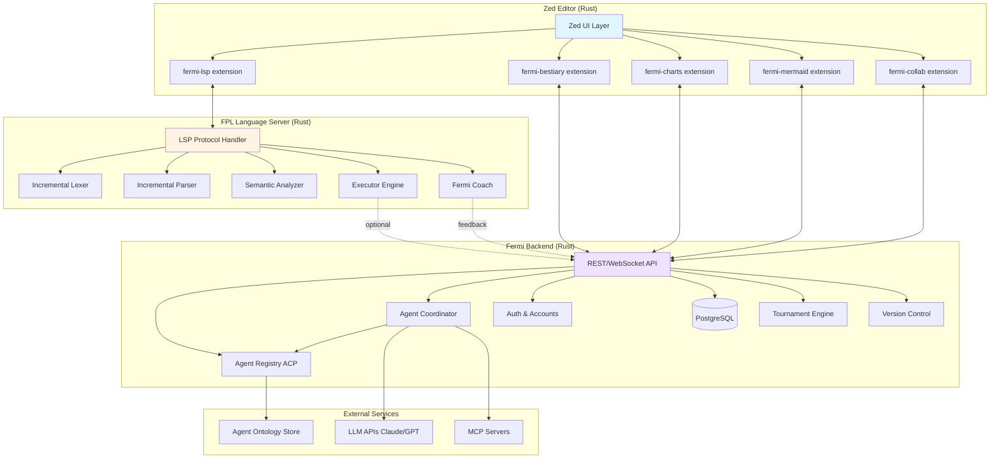

# Fermi Forecasting IDE - Module Architecture

**Date:** 2026-02-04  
**Status:** Planning Phase  
**Version:** 1.0

---

## Vision Statement

**Transform Zed into a Forecasting Workbench** - a specialized IDE where forecasting is the primary activity, not code editing. This is an **MMOG client for collaborative forecasting** where:

- **FPL is the language** (not just "code")
- **Agents are first-class citizens** (not just tools)
- **Forecasts are living indexes** (not static outputs)
- **Collaboration is native** (tournaments, leaderboards, shared forecasts)

---

## High-Level Architecture

**Selected Approach:** Option C - Clean Separation of Concerns



---

## Architectural Principles

### 1. Loose Coupling
- **FPL Language Server:** Standalone process, LSP-only interface
- **Fermi Backend:** Separate service, REST/WebSocket API
- **Zed Extensions:** UI layer only, no business logic
- Each component can be developed, tested, deployed independently

### 2. Modular Complexity Management
- **Core:** FPL LSP (diagnostics, execution)
- **Layer 1:** Agent system (bestiary, registry)
- **Layer 2:** Collaboration (tournaments, leaderboards)
- **Layer 3:** Advanced features (time travel, ontology evolution)

### 3. Agents as First-Class Citizens
- Agent Bestiary = Visual registry UI
- Agents have **handles** (not just IDs) that pull up preview cards
- Agents configured **in context of FPL** (not global settings)
- Fermi = Special inline agent (always active, coaching)

---

## Module Breakdown

### Module 1: FPL Language Server
**Purpose:** Core language intelligence (diagnostics, execution, coaching)  
**Status:** Foundation exists (lexer, parser, semantic, executor)  
**Next:** Add LSP protocol layer, incremental parsing  
**Doc:** [01_FPL_LSP.md](../modules/01_FPL_LSP.md)

### Module 2: Zed Extensions - Core
**Purpose:** Bridge between Zed UI and FPL Language Server  
**Status:** Not started  
**Dependencies:** Module 1 (FPL LSP), Zed Extension API  
**Doc:** [02_ZED_EXTENSIONS.md](../modules/02_ZED_EXTENSIONS.md)

### Module 3: Agent Bestiary UI
**Purpose:** Visual agent management, ACP registry interface  
**Status:** Not started  
**Dependencies:** Module 5 (Backend - Agent Registry)  
**Doc:** [03_AGENT_BESTIARY.md](../modules/03_AGENT_BESTIARY.md)

### Module 4: Visualization & Charts
**Purpose:** Rich forecast result display  
**Status:** Not started  
**Dependencies:** Module 1 (execution results), Module 5 (backend for history)  
**Doc:** [04_VISUALIZATION.md](../modules/04_VISUALIZATION.md)

### Module 5: Fermi Backend
**Purpose:** Agent coordination, storage, collaboration  
**Status:** Needs rebuild from uffp-backend (Node.js → Rust)  
**Doc:** [05_BACKEND.md](../modules/05_BACKEND.md)

### Module 6: Mermaid ER Viewer
**Purpose:** Visualize agent ontologies, model structures  
**Status:** Not started  
**Dependencies:** Module 5 (backend - ontology storage)  
**Doc:** [06_MERMAID_VIEWER.md](../modules/06_MERMAID_VIEWER.md)

### Module 7: Collaboration & Tournaments
**Purpose:** Multi-user forecasting, competitive play  
**Status:** Not started  
**Dependencies:** Module 5 (backend - tournaments, scoring)  
**Doc:** [07_COLLABORATION.md](../modules/07_COLLABORATION.md)

### Module 8: Settings & Configuration
**Purpose:** User preferences, system configuration  
**Status:** Not started  
**Dependencies:** All modules (each has config needs)  
**Doc:** [08_SETTINGS.md](../modules/08_SETTINGS.md)

### Module 9: Navigation & Discovery
**Purpose:** Find forecasts without file tree  
**Status:** Not started  
**Dependencies:** Module 5 (backend - forecast storage)  
**Doc:** [09_NAVIGATION.md](../modules/09_NAVIGATION.md)

### Module 10: Mobile Client
**Purpose:** Mobile forecasting experience  
**Status:** Future (deferred)  
**Doc:** [10_MOBILE.md](../modules/10_MOBILE.md)

---

## Module Interaction Patterns

### Pattern 1: LSP Communication
```
Zed Extension → LSP Protocol → FPL Language Server
                  (JSON-RPC)
```

**Used by:** Module 1, Module 2

### Pattern 2: REST API
```
Zed Extension → HTTP/REST → Fermi Backend → PostgreSQL
                 (JSON)
```

**Used by:** Module 3, Module 4, Module 5, Module 7, Module 9

### Pattern 3: WebSocket (Real-time)
```
Zed Extension ← WebSocket ← Fermi Backend
                 (Events)
```

**Used by:** Module 3 (agent callbacks), Module 7 (collaboration)

### Pattern 4: Agent Execution
```
FPL Code → LSP → Backend → Agent Registry → LLM API
                                          → MCP Server
```

**Used by:** Module 3, Module 5

---

## UI Layout Concept

```
┌─────────────────────────────────────────────────────────────┐
│ Fermi Forecasting IDE                              [Fermi 🤖]│
├─────────────────────────────────────────────────────────────┤
│                                                              │
│  ┌────────────────────────────────────────────────────────┐ │
│  │  Editor Pane (.fpl files)                              │ │
│  │                                                         │ │
│  │  question "Will AMD reach $200?"                       │ │
│  │                                                         │ │
│  │  driver market_size continuous {                       │ │
│  │      distribution: triangular(500, 1200, 2500)         │ │
│  │      # ▁▃▅▇▅▃▁ [1200±800]  ← Tufte sparkline          │ │
│  │  }                                                      │ │
│  │                                                         │ │
│  │  model: market_size * 1.25  ← Fermi: "Consider adding │ │
│  │                                 growth uncertainty"    │ │
│  └────────────────────────────────────────────────────────┘ │
│                                                              │
│  ┌──────────────┐  ┌──────────────┐  ┌──────────────────┐  │
│  │ Agent        │  │ Forecast     │  │ ER Diagram       │  │
│  │ Bestiary     │  │ Results      │  │ Viewer           │  │
│  │              │  │              │  │                  │  │
│  │ 🎭 Market    │  │ Mean: 1,500  │  │ [Mermaid ER]     │  │
│  │ Research     │  │ p50: 1,450   │  │                  │  │
│  │ ● Active     │  │ p90: 2,800   │  │ Agent ontology   │  │
│  │ [Use Agent]  │  │              │  │ evolution v3.2   │  │
│  │              │  │ [Chart] 📊   │  │                  │  │
│  └──────────────┘  └──────────────┘  └──────────────────┘  │
└─────────────────────────────────────────────────────────────┘
```

**Key UI Features:**
1. **Editor Pane:** Syntax highlighting, inline diagnostics, Fermi coaching
2. **Tufte Sparklines:** Inline distribution visualization
3. **Agent Bestiary:** Card-based agent browser (yokai avatars)
4. **Forecast Results:** Charts, statistics, confidence intervals
5. **ER Diagram Viewer:** Agent ontologies, model structure
6. **No File Tree:** Navigation via command palette or forecast library

---

## Client-Server Architecture Decision

> **Superseded (as shipped).** The "offline capable / sync on demand" leg below was
> never made to work and has been removed from the console. `save_forecast` writes
> only to the backend, and the auth gate replaces the whole panel router when the
> client is disconnected, so there is no local store to sync and no divergence to
> reconcile. Local execution of simulations survives; local *storage* does not.
> Treat this section as the original planning intent, not current behavior.

**Selected:** Hybrid (Smart Client)

### Rationale:
- **Local execution:** Fast diagnostics, instant feedback
- **Backend agents:** Heavy LLM calls, collaborative features
- **Offline capable:** Work without network (local forecasts)
- **Sync on demand:** Push/pull forecast history

### Trade-offs:
| Aspect | Local | Backend |
|--------|-------|---------|
| Diagnostics | ✅ Instant | ❌ Network latency |
| Execution | ✅ Fast (10K iter) | ✅ Scalable (1M+ iter) |
| Agents | ❌ No LLM access | ✅ Full agent system |
| Collaboration | ❌ N/A | ✅ Real-time sync |
| Storage | ⚠️ Limited | ✅ Unlimited |

### Implementation:
- FPL LSP runs **locally** (Rust process)
- Backend handles **agents, storage, tournaments**
- Local cache for **recent forecasts**
- Sync on save (optional auto-sync)

**See:** [ADR-003: Hybrid Client-Server Architecture](../decisions/003_hybrid_architecture.md) *(to be created)*

---

## Key Design Decisions

### Decision 1: No File Tree
**Rationale:** Forecasts are not "files", they're living documents  
**Alternative Navigation:**
- Command palette (fuzzy search)
- Forecast library (card gallery)
- Tag-based filtering
- Recent/starred lists

### Decision 2: Agents in FPL Code
**Rationale:** Agents configured in context, not global settings  
**Example:**
```fpl
agent market_research {
    query: "Current GPU market size"
    review: manual  # or auto
}
```

### Decision 3: Fermi as Special Agent
**Rationale:** Always-on coaching, inline suggestions  
**Interaction:**
- Inline suggestions (like Copilot)
- Sidebar chat (optional)
- Access to execution results (calibration feedback)

### Decision 4: Tufte-Style Inline Annotations
**Rationale:** Information-dense, non-intrusive  
**Content:**
- Distribution shape (sparkline)
- Confidence band (p10-p90)
- Median estimate
- Interactive on hover

### Decision 5: Yokai Avatar Theme
**Rationale:** Memorable, playful, cultural richness  
**Implementation:** Pre-designed set (10-20 avatars per agent type)  
**Future:** AI-generated custom avatars

---

## Open Architectural Questions

### Q1: Incremental Parsing Strategy
**Options:**
- A) salsa (rust-analyzer's framework)
- B) rowan (lossless syntax tree)
- C) Custom incremental parser

**Status:** Open - needs investigation  
**Track in:** [Module 1 Discussion](../modules/01_FPL_LSP.md#incremental-parsing)

### Q2: Agent Callback Mechanism
**Options:**
- A) WebSocket (real-time push)
- B) Polling (simpler, less efficient)
- C) Webhook (agent posts back)

**Status:** Open - needs design  
**Track in:** [Module 5 Discussion](../modules/05_BACKEND.md#agent-callbacks)

### Q3: Forecast Versioning
**Options:**
- A) Git-like (commits, branches)
- B) Automatic snapshots (on every change)
- C) Manual checkpoints (user tags)

**Status:** Open - needs discussion  
**Track in:** [Module 7 Discussion](../modules/07_COLLABORATION.md#versioning)

### Q4: Mobile Strategy
**Options:**
- A) View-only (review forecasts)
- B) Agent management (trigger research)
- C) Light editing (adjust parameters)
- D) Full editing (complete IDE)

**Status:** Deferred to Phase 2  
**Track in:** [Module 10 Discussion](../modules/10_MOBILE.md)

---

## Implementation Roadmap

### Phase 1: Core FPL Experience (Weeks 1-3)
**Modules:** 1, 2  
**Goal:** Write and execute .fpl files in Zed with real-time coaching  
**Deliverable:** Users can write FPL, get coached, execute, see results

### Phase 2: Agent Bestiary (Weeks 4-6)
**Modules:** 3, 5 (partial)  
**Goal:** Visual agent management with ACP integration  
**Deliverable:** Users can browse agents, use them in forecasts

### Phase 3: Visualization (Weeks 7-8)
**Modules:** 4, 6  
**Goal:** Rich forecast visualization  
**Deliverable:** Beautiful charts, sparklines, ER diagrams

### Phase 4: Collaboration Foundation (Weeks 9-11)
**Modules:** 5 (complete), 9  
**Goal:** Multi-user forecasting basics  
**Deliverable:** Save, share, discover forecasts

### Phase 5: Tournament System (Weeks 12-14)
**Modules:** 7  
**Goal:** Competitive forecasting  
**Deliverable:** Full MMOG-style tournaments

### Phase 6: Polish & Configuration (Weeks 15-16)
**Modules:** 8  
**Goal:** Settings, preferences, customization  
**Deliverable:** Configurable, user-friendly system

---

## Success Criteria

### Technical
- [ ] FPL LSP responds in <50ms (incremental)
- [ ] 10K forecast executes in <100ms (local)
- [ ] Agent execution is async with callbacks
- [ ] All modules are loosely coupled
- [ ] Tests cover all critical paths

### User Experience
- [ ] Users can write forecasts without reading docs
- [ ] Fermi coaching is helpful, not annoying
- [ ] Agent bestiary makes agents discoverable
- [ ] Visualization is information-dense (Tufte)
- [ ] No file tree confusion (alternative nav works)

### Collaboration
- [ ] Tournaments support 100+ participants
- [ ] Leaderboards update in real-time
- [ ] Forecast versioning is intuitive
- [ ] Sharing is one-click easy

---

## Risk Assessment

### High Risk
- **Incremental parsing complexity** - May need significant R&D
- **Zed Extension API limitations** - May not support all desired features
- **Agent integration** - ACP protocol may have limitations

### Medium Risk
- **Performance at scale** - 1M+ iterations may need optimization
- **WebSocket stability** - Real-time sync can be flaky
- **Mobile experience** - Different paradigm may require rethink

### Low Risk
- **FPL core** - Already implemented and tested
- **Visualization** - Standard charting libraries available
- **Database** - PostgreSQL well-understood

---

## Next Steps

1. **Create module documentation stubs** (01-10)
2. **Answer open questions** for Module 1 (FPL LSP)
3. **Create ADR** for first architectural decision
4. **Start Sprint 1** (Module 1 + Module 2 core)

---

## References

- [Project Rules](../PROJECT_RULES.md)
- [Sprint Plan](SPRINT_PLAN.md) *(to be created)*
- [Master Roadmap](ROADMAP.md) *(to be created)*
- [Decisions Index](../DECISIONS.md) *(to be created)*

---

**Last Updated:** 2026-02-04  
**Next Review:** After Module 1 completion
