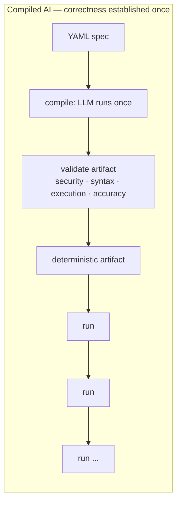
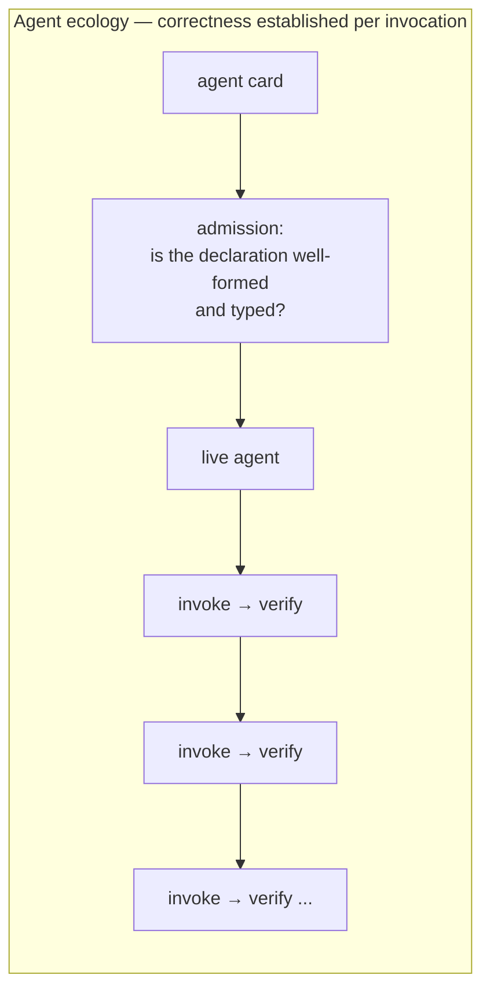
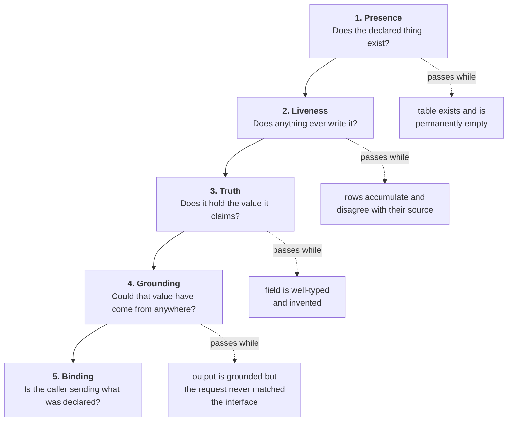
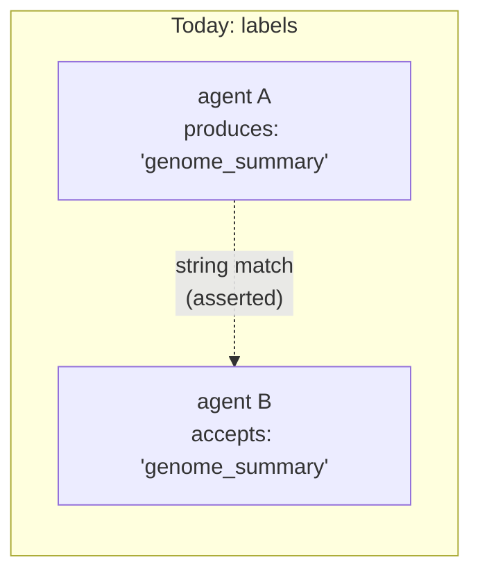
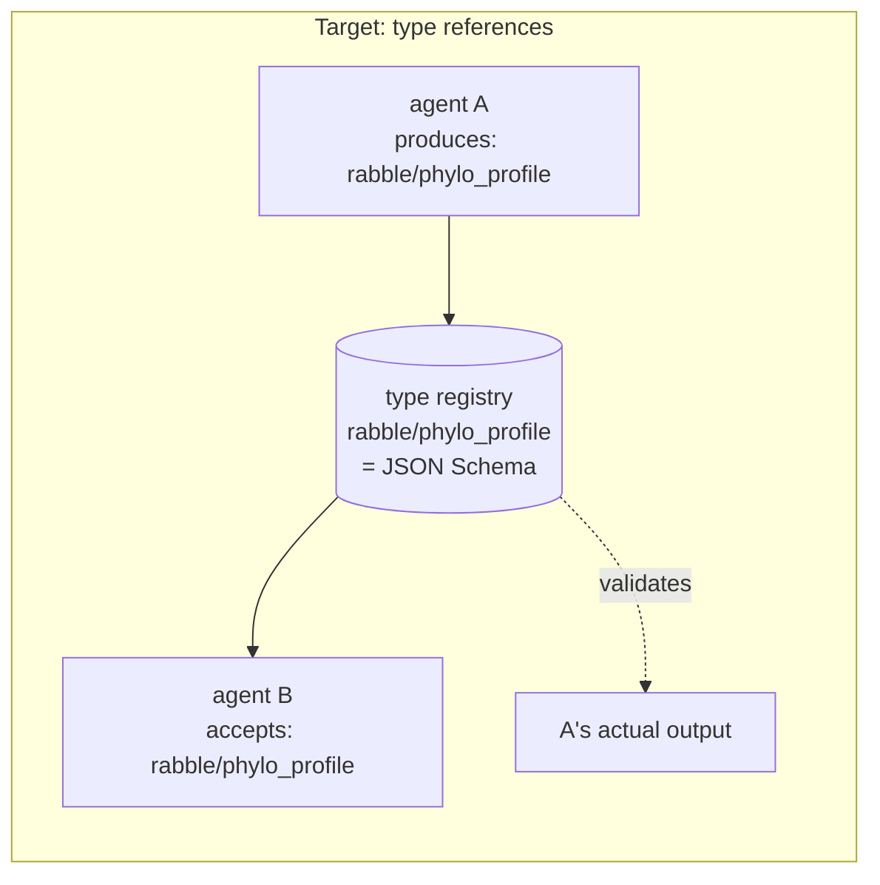
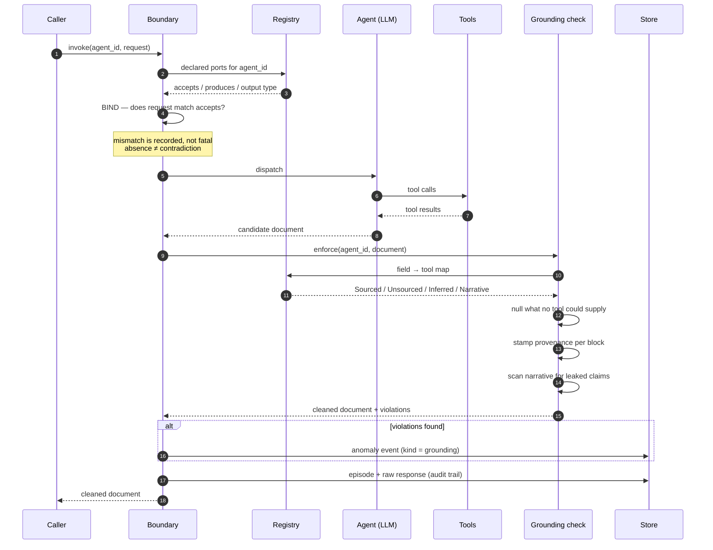
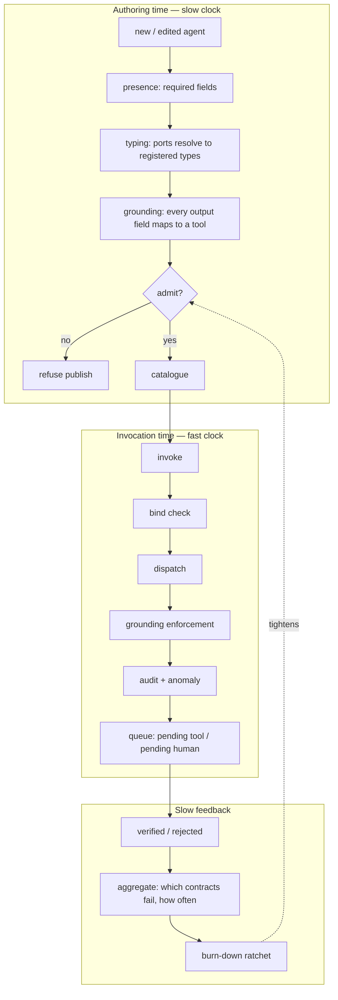

# Verification for Agent Ecologies

### Why a declared contract is not a contract, and what to do about it

**Status:** working paper · **Date:** 2026-08-18 · **Level:** logical architecture
**Implements:** `docs/ABW_VERIFICATION_RECONCILIATION.md`
**Situates against:** Trooskens et al., *Compiled AI: Deterministic Code Generation for
LLM-Based Workflow Automation*, arXiv:2604.05150v2

> **On the figures.** Every count here is a read-only snapshot of one live production
> deployment, taken on the paper's date. The corpus grows continuously, so exact totals drift
> upward between drafts; ratios and directions do not. Where a number carries an argument it is
> given precisely; where it is merely scale it is given approximately — a habit adopted after a
> comment in our own code cited a figure that had already moved by the time anyone read it.

---

## Abstract

An agent ecology is a population of LLM-backed agents, authored continuously — often by
other agents — each declaring an interface and a set of capabilities. Composition depends
on those declarations being true. We report a class of defect in which they are not, and
in which no existing check could have noticed: the declaration is well-formed, the output
parses, the types check, and the content is fabricated.

We argue that this class is not addressable by the dominant answer in the literature —
removing the model from the control plane and validating a compiled artifact once — because
an ecology has no artifact and no compile step. We propose instead a **verification
ladder**: five contracts asking five progressively harder questions about the same
declaration, each cheap enough to run continuously, each required to demonstrate its own
ability to fail.

Two results were forced on us by building it. First, the rung that went missing longest was
not the most sophisticated but the **cheapest**: whether the code that writes a record ever
runs at all. Reading the source cannot answer it — in every instance we found, the writer was
present, correctly wired, and sometimes the most carefully documented code in the file.
Second, **provenance is not transitive upward.** A claim distilled from well-sourced evidence
does not inherit that sourcing, and an ecology which lets it manufactures verified facts out
of nothing but its own reading. Both results concern composition rather than any individual
agent, which is why neither appears in the single-agent literature.

A third finding changed what enforcement means. Nulling a value no tool could supply is
data destruction dressed as rigour: for a research agent the unsourced claim *is* the
product. Unverified evidence should therefore be **routed, not removed** — automatically
where a contract already names a tool, to a person otherwise — which turns a verdict into a
work item and produces the first per-agent quality signal that is not self-reported.

We describe the logical architecture, the invocation lifecycle it induces, and eight design
rules derived from getting it wrong. The organising claim is small and, we think, general:
**a check that reasons about shape will pass while content is wrong; and a check that
examines data cannot see data that was never written.** Almost every check does one or the
other.

---

## 1. The defect class

An agent in our catalogue is asked, by its own system prompt, to return four blocks of
data: taxonomy, genome, phylogeny, conservation. It has two tools, both of which return
taxonomy. Three of the four blocks have no possible source.

It filled them in. Confidently, for fifty-six episodes, with values like
`estimated_size_mb: "200-400"` and `chromosome_count: "typically 10-20 (variable in scale
insects)"` for a species nobody has sequenced. Thirteen of those documents were cached and
served to users.

The point is not that a model hallucinated. The point is the list of things that passed:

| Check | Why it passed |
|---|---|
| Card conformance tests | description, tags, sample queries, tools-as-objects: all present |
| Publish gate | `accepts` and `produces` non-empty: both were |
| JSON parsing | the document parsed perfectly |
| Cache validity | required non-empty `taxonomy` — the one block that *does* have a tool |
| Type checking | `String` is `String` whether it means a measurement or an invention |
| Anomaly detection | its `kind` CHECK admitted four values, none of which was this |

Every one of these reasons about **shape**. The failure was in **content**. The gap between
those two words is the subject of this paper.

The same shape holds elsewhere. A denormalised counter was present, correctly typed,
declared in the schema contract, and permanently zero because nothing ever wrote it; six
user-facing surfaces read it and served zeros. A rate-limiting middleware was written,
correct, and attached to no router, so the endpoints that spend money were the only ones
unprotected. A port named `tree_visualization_description` advertised an output the agent
has no field for and whose prompt never mentions rendering.

Each is the same failure: **a spec-shaped artifact that is not spec-enforcing**, sitting
where a reader — human or machine — will take it for the real thing.

The most instructive members of the class arrived last, and they are all the same shape as
each other:

| Declared thing | State when found |
|---|---|
| a `CHECK` constraint on the ledger's transaction types | declared by **seventeen** successive migrations, present after none of them |
| a provenance resolver for extracted knowledge | three call sites, one wired |
| a per-agent claims ledger, the substrate for attribution | coded, wired, exhaustively commented, **zero rows** |
| an anomaly event stream | its vocabulary extended for a new kind, never once written |
| three rule-utility counters | declared in an early migration, never incremented |

None of these is a fabrication. Each is a **write path that has never executed**, and the
list is the answer to a question we had been asking wrongly. We had assumed the hard cases
would be the subtle ones. They were the cheapest ones: `SELECT count(*)`.

Two properties make this class worse than fabrication. It is invisible to every check that
examines data, because there is no data to examine. And **reading the code does not detect
it** — in all five cases the writer was present and correct-looking, and the claims ledger
carried the most thorough comments in the repository while holding nothing. The constraint
case is the sharpest: each of the seventeen dropped the constraint and then failed to
re-add it, because the two statements ran in separate implicit transactions through a
connection pooler and the migration runner logged the failure and continued. **The net
effect of every attempted repair was to delete the thing being repaired**, and three
migrations exist for no purpose other than that repair.

### 1.1 Why declarations rot specifically in an ecology

Three properties make this worse than ordinary documentation drift.

**Declarations are load-bearing for composition.** In a monolith, a wrong comment misleads
a person. Here, `produces: X` → `accepts: X` is how a planner decides two agents compose.
A wrong label is an input to an automated decision.

**Declarations are generated at agent speed.** Cards are authored by agents, from
templates, in bulk. Review is not the trust mechanism and cannot be. Whatever verifies must
be automatic and must run at authoring time.

**Declarations have no compiler.** A type annotation in a program is checked by
construction. A `produces` label in a JSON card is checked by nothing at all, unless
something is built to check it.

The result, measured across our own 100 curated cards: **513 distinct port labels, of which
only 14 appear on both an `accepts` and a `produces`.** 499 labels cannot form a seam with
anything. Normalising for spelling collapses only 11 of them, so this is genuine vocabulary
invention rather than punctuation drift. The port graph is, in the main, decorative.

---

## 2. Why the compiled-AI answer does not transfer

Trooskens et al. give the strongest current answer to LLM unreliability in workflow
systems: **take the model out of the control plane.** Compile once, validate the artifact
through four stages — security, syntax, execution, accuracy — then execute deterministically
with zero runtime inference. Where a step genuinely needs semantic judgement, invoke the
model as a *bounded tool call* whose schema and trigger are fixed at compile time.

The empirical case is strong, and their citation of Cemri et al. is the one that matters
most here: **79% of multi-agent failures are specification and coordination failures, not
infrastructure.** That is precisely our finding, arrived at independently. Our
fabricated fields and decorative ports are specification failures in the exact sense
intended.

But the remedy does not transfer, for a structural reason.

| | Compiled AI | Agent ecology |
|---|---|---|
| Unit of correctness | a generated code artifact | a live agent with a prompt and tools |
| When correctness is established | once, at compile time | continuously, per invocation |
| What is validated | code | a probability distribution over documents |
| Who authors | a compiler, from a YAML spec | agents and users, continuously |
| Control plane | deterministic by construction | the model *is* the control plane |

An ecology has **no artifact to validate and no compile step in which to validate it.** The
agent is the artifact, it is nondeterministic by design, and its correctness is not a
property it has once but a property each of its outputs may or may not have.

So the question becomes: *what does verification look like when you cannot remove the model
from the loop?*

### 2.1 The part that does transfer, and matters most

Their **bounded tool call** — an LLM invocation whose schema and trigger are fixed ahead of
time — is exactly the right primitive, and it is what a typed agent port should be. Their
Appendix A "Safety Sandwich" (after Dalrymple et al.'s *Guaranteed Safe AI*) generalises
cleanly:

> input validation → probabilistic model → deterministic validation → audit trail

We adopt that sandwich wholesale. Our contribution is what to put in each slice when the
filling is a whole agent rather than a single extraction step, and when the sandwich must
be assembled per invocation rather than per compilation.





The shapes differ in where the validation sits. Compiled AI validates a thing that will
then be run many times. An ecology must validate each run, because each run is a fresh
sample.

---

## 3. The verification ladder

The organising insight is that "is this correct?" is not one question. It is at least five,
they are ordered by difficulty, and **a check answering an easier one will pass while a
harder one fails.** Naming them separately is what stops a presence check being mistaken
for a truth check.



Each rung is a **contract**: a hand-declared manifest in code, paired with a check that
enforces it. The manifest is the design commitment; the check is the proof it is kept.

| Rung | Question | Substrate | Catches |
|---|---|---|---|
| **Presence** | Does the declared object exist? | live schema catalogue, at boot | a renamed column, a dropped view |
| **Liveness** | Does the writer ever run? | sink count vs. **opportunity count** | a ledger nothing has ever written |
| **Truth** | Does the stored value equal its source of truth? | aggregate query against real rows | a counter that disagrees with reality |
| **Grounding** | Could this value have come from any available tool? | field → tool map, per agent | a fabricated measurement |
| **Binding** | Does the invocation match the declared interface? | declared ports vs. actual request | prose sent to a structured-only port |

### 3.1 Why liveness is not a special case of truth

We originally believed Truth covered this, and said so in an earlier draft: a counter nothing
writes is exactly what a rollup contract catches. That is true **only for a derived value**,
and the reason is worth stating precisely, because it is what makes liveness a separate rung
rather than a corollary.

A rollup contract works by recomputing the value from its source and comparing. It needs a
source of truth to compare against. A cached execution count has one — the rows it summarises
— so its being zero is detectable as a disagreement.

An **original record has no source of truth by definition.** A claims ledger is not a cache
of anything; it is the only place its facts exist. There is nothing to recompute it from, so
no aggregate query can find it wanting. Its emptiness is not a disagreement, and Truth is
structurally unable to ask about it.

**Why nobody writes this check.** Because `count(*) = 0` is ambiguous: *unused* and *broken*
are indistinguishable, so the check appears unactionable and gets skipped. The disambiguator
is the **opportunity count** — how many times the writer should have fired. Zero claims
beside twenty-two episodes that each stated a claim is broken. Zero beside zero is merely
unused. Same number, opposite meanings, and only the second is acceptable.

That distinction forces a three-valued verdict, and each value has a different owner:

| Verdict | Meaning | Why it is not the others |
|---|---|---|
| `Ok` | opportunities exist, the sink has rows | the path demonstrably runs |
| `Silent` | opportunities exist, the sink is empty | *not* `Broken`: the writer may be buggy or merely undeployed. Different remedies, identical consequence — the signal does not exist — so the verdict does not guess |
| `Inert` | no opportunities yet | **not a pass.** A contract watching a feature nobody has exercised, reporting healthy, is the original defect wearing the machinery built to prevent it |

Liveness is also deliberately **binary**. Once a sink holds one row the path works; whether
it fires *often enough* is a calibration question with a different remedy and a different
owner. Keeping that out is what stops the rung becoming a vague "does this number look
plausible" check — the shape of check that gets ignored, then deleted.

One further requirement, learned immediately: a liveness suite needs **positive controls**.
Our first run declared three contracts and reported **zero live**, and `0 live` cannot
distinguish "every path is broken" from "the runner is broken". Two contracts on paths known
to work resolve that, and one of them turned a worry into a diagnosis: the observability
scanner
demonstrably writes some 1,300 entries, and the anomaly detector immediately downstream of it
demonstrably never fires. One number cannot tell you that. Two can.

Two properties make this a ladder rather than a list.

**Each rung is invisible to the one below it.** A grounding failure is a *valid* value of a
*present* column. That is why they must be separate contracts and not one "validation
layer" — a single layer inevitably reasons at one level of abstraction and silently
declines to ask the others.

**Each rung costs more and runs less often.** Presence is a catalogue read at boot. Liveness
is two `count(*)` queries. Truth is a `GROUP BY` against production, run in CI and on
demand. Grounding is a pure function over a JSON document, run per invocation. Binding is a
string comparison, run per request. The ladder is ordered by cost as well as by difficulty,
which is what makes running all five affordable — and the cheapest rung was the one missing
longest.

### 3.2 The typing layer beneath the ladder

Grounding and binding — rungs 4 and 5 — both need to know what a port *means*, and today a port is a free string.
That is the missing substrate, and it is where the compiled-AI notion of a compile-time
schema re-enters.

The target state is that every `accepts`/`produces` entry is a **reference to a registered
type**, not a label:





The difference is not notational. On the left, "A composes with B" is a claim about two
strings. On the right it is a claim about **type identity**, and the same schema that makes
the claim checkable also validates A's actual output at runtime. One artifact, two uses —
which is exactly the property that makes a compile-time schema worth having in the bounded
tool-call pattern.

Four checks fall out of the typing layer, none of which needs a model or a database:

| Check | Asks | Failure looks like |
|---|---|---|
| **Resolves** | does the label name a registered type? | 499 labels that match nothing |
| **Backed** | does a `produces` label map to something in the output? | a port with no field behind it |
| **Grounded** | are that port's fields sourceable? | a port advertising unsourceable data |
| **Bound** | does the request match the declared input? | prose into a structured port |

The third is the one that keeps the campaign honest. Without it, an ecology can be fully
typed and still fully fabricated — every port resolving, every schema validating, every
value invented. **Typing is necessary and nowhere near sufficient**; a schema makes a wrong
field *more* credible, not less.

### 3.3 Provenance is not transitive upward

Everything above governs one agent's output on one invocation. It says nothing about what
happens to that output next, and in an ecology what happens next is the point.

In ours, a consolidation agent reads another agent's episodes on a timer, distils semantic
rules from them, and those rules are retrieved later and appended to an agent's system prompt
under a heading like *Learned Knowledge*. At that moment a stored sentence stops being data
and becomes a **premise another agent reasons from**.

Nothing on that path recorded how well-grounded the episodes were. A rule distilled from ten
tool-verified lookups and a rule distilled from ten paragraphs of prose were stored in the
same table, retrieved by the same query, and rendered in the same line of the same prompt.
The second is worse than a bare hallucination, because **its citation is real**: the source
list genuinely points at episodes that genuinely said that.

The prompt line read:

```
- (72% match, 90% confidence) <rule>
```

Both numbers are real and neither is a measurement. The "confidence" is the extraction
model's self-report about a generalisation it had just written; the "match" is cosine
similarity. Side by side and labelled *confidence*, they read as calibration — and to a
model, `90% confidence` is licence to assert the content downstream.

Two rules fix this, and they are independent:

| Rule | Statement | Why |
|---|---|---|
| **floor** | a derived claim is as good as its **weakest** source | nine sourced episodes and one guess is a guess; averaging lets volume launder a fabrication |
| **ceiling** | extraction can never exceed *inference* | reading well-sourced inputs and generalising over them is judgement, and **judgement does not inherit retrieval** |

The ceiling is the load-bearing half and the counter-intuitive one. It means the best value
any extracted rule can hold is "model inference" — permanently, not pending better tooling.
That is not a defect to engineer away; it is the honest ceiling for the class of operation.
Without it, a consolidation agent manufactures tool-verified facts out of nothing but its own
reading, and the knowledge graph fills with claims no tool ever made.

The same rule applies one layer out, to the quantities agents assert. A *multiplier on a
base rate* cannot be tool-verified because no database contains "the multiplier for this
driver" — the agent is commissioned to produce one. Which settles a question that otherwise
has no answer: **you cannot verify a judgement.** "Is 0.85 correct?" is not a checkable
proposition. Verification routes to the judgement's *basis* — the ratings, the roster, the
statistics — and the judgement's standing is the floor over those. Verify the inputs;
inherit the verdict.

**Unknown is not a rung on the ladder.** The subtlety that took two attempts. Verdicts are
ordered, but *unknown* is the absence of information about an order and cannot participate in
a minimum. Nine verified sources plus one that cannot be graded does **not** floor at
verified — the tenth could be anything. Nor at ungrounded: the tenth is not known to be bad
either. The honest answer is unknown. But nine verified, one *known* bad, and one ungradeable
floors at bad, and the unknown changes nothing, because no verdict it could hold would lower
a floor already resting on the bottom. **An unknown source poisons a result only when it
could still move it.** Get this wrong in the lenient direction and a single ungradeable
episode in a cluster of ten manufactures a clean verdict for the other nine.

### 3.4 An implementation note that is really a design rule

The rules above live with the field contracts. The consolidation layer that needs them sits
*below* that in the dependency graph, so it cannot call them.

Copying the arithmetic across was the obvious alternative and would have been a mistake.
There would then be two implementations of one trust calculation — and when they disagree,
the one that gets believed is **the one nearest the writer**. We had already had that bug in
miniature: agent cards named a provenance value the runtime never emitted, and nothing
noticed until a guard was written for it.

So the lower layer declares an interface and the layer that owns the contracts implements it.
This is unremarkable engineering, but it generalises into a rule worth stating: **a trust
calculation must have exactly one implementation, and the layer that owns the vocabulary
must own the arithmetic.** Every duplicate is a second answer to the same question.

---

## 4. The invocation lifecycle

Here is the ladder assembled into a single request path — the Safety Sandwich with an agent
in the middle.



Four things in that diagram are load-bearing and easy to get wrong.

**The bind check is at the boundary, not in the client.** We had a correct implementation of
it living in a desktop client, and the server recorded the *caller's claim* about whether
the interface matched. A claim transcribed into an audit field reads exactly like a finding.
Verification belongs where the authority is.

**Grounding runs before anything persists or renders.** Not as a report afterward. The check
that runs after the write is a metric; the check that runs before it is a control.

**The narrative is checked too.** Nulling a fabricated number is insufficient if the prose
summary restates it — and the summary is typically what a human reads and what downstream
extraction lifts out as "the evidence". A prose channel that is not checked is the channel
the fabrication moves into.

**The raw response is retained.** Not the digest. We discovered we had been keeping a
*per-agent parser's reading* of each output and discarding the output, which means the
historical record silently changed whenever the parser did — and that there was no corpus
from which to induce what an agent actually produces. Retention is a precondition for every
later form of verification, and it accrues only from the moment you start.

### 4.1 Two gates, two clocks

Verification happens on two independent schedules, and conflating them is a mistake.



The authoring gate is where **enforcement by default** actually lives: a new agent cannot
enter the catalogue with an untyped or ungrounded interface. The invocation gate catches
what the authoring gate cannot know — that this particular output, on this particular run,
contains something no tool could have supplied.

The ledger closes the loop, and it is the piece most systems omit. Without it you cannot
answer "is this getting better?", and a verification system that cannot report its own
trend gets quietly disabled.

The queue between them is what makes the loop more than reporting. An enforcement step that
only strips produces a cleaner document and no new knowledge; one that routes produces work
whose outcome — verified, or rejected — is the first per-agent quality signal that is not
self-reported. Note also what the ledger's own liveness says about it: this diagram was
accurate as a *design* while the anomaly stream it depends on had never once been written.

---

## 5. Eight design rules

These are not principles we started with. Each is the residue of getting it wrong, usually
within an hour of writing the check.

### 5.1 A check that has never failed has not been tested

Every contract in this architecture has been deliberately broken to confirm it goes red.
When we removed a clause from the port-binding rule, the parity test named all eight
affected agents. When we falsified the burn-down baseline, the ratchet named both
regressions and their required directions. When we inverted the provenance floor's empty
case — the single most likely way that calculation breaks, and it breaks in the direction
that manufactures trust — the named test failed on exactly that. When we unwired the
provenance resolver from the highest-volume writer, the coverage scan named the file.

Two of those deserve emphasis because the check caught its own author. A guard requiring
every provenance verdict to have a *deliberately assigned* strength fired the moment we
widened the vocabulary, refusing five new values until someone decided where each sat. And the
liveness suite's own final assertion fired on its first run, when nothing yet had a positive
control: *"nothing has been demonstrated to work, and this assertion is the only thing
standing between that state and a green tick."* A suite that can say that about itself is
the only kind worth trusting.

This is not ceremony. A verification layer is subject to the identical trap as the thing it
verifies: it looks done. A green check and an inert check are indistinguishable from the
outside, and the inert one is worse than nothing because it consumes the attention that
would otherwise notice.

### 5.2 A check that fires on correct behaviour will be deleted, and the deletion will look like cleanup

Our narrative-leak scanner searched for `" gb"` to catch a fabricated genome size. It
matched **"GBIF"** — the name of the very database that grounds the agent — so an honest
summary citing its source was flagged as fabricating one.

Over-reach is not a smaller error than under-reach; it is usually a larger one, because it
destroys the check's standing. The first person inconvenienced removes it, the diff reads as
tidying, and nobody learns that a real signal went with it. Where a rule cannot be made
precise, report the ambiguity as its own category instead of guessing.

### 5.3 Silence is not a verdict

An agent that declares no inputs has not contradicted anything. An agent with no grounding
contract has not been found compliant. A write path with no opportunities has not been shown
to work. A column that is `NULL` because the feature postdates the row is not clean. All four
must be distinguishable from a pass.

Systems that collapse absence into success accumulate a population of unexamined things
that look examined — which is the original defect, reintroduced by the machinery built to
prevent it.

The tell is directional, and it is worth keeping as a diagnostic: **if a metric improves when
coverage gets worse, absence is being counted as success somewhere.** A report treating an
ungraded rule as grounded shows a corpus getting cleaner as retention degrades. A liveness
suite treating *inert* as *ok* reports healthiest when nothing has run at all.

### 5.4 The scoreboard must not reward deletion

Retiring two fabricated ports moved our corpus from 513 distinct labels to 510. A metric
keyed on "unresolved labels falling" would have scored that as progress equal to typing two
ports properly. It is not equal: one is honesty, the other is capability.

So the leading indicator is the count of labels that **resolve to a registered type** — the
only counter that deletion cannot fake. Choose burn-down metrics by asking which cheap
action would move them, and lead with the one where the answer is "none".

The dual of this rule cost us a confusing half hour and is worth stating separately:
**improving coverage can look exactly like regression.** Typing one agent's output moved
`registered` from 4 to 5 and simultaneously moved `unbacked` from 42 to **46**. No label got
worse. Four of that agent's six ports had always been unbacked; while the card had no
machine-readable output shape the question could not be asked at all, so they were counted as
*unresolvable* instead. Giving the agent a schema is what made them answerable, and the
answer was bad.

A ratchet that only knows "this number went up" reads that as a step backwards and blocks the
change that caused the improvement. Ours demands the baseline be regenerated in the same
commit, which is the right shape: the loosening becomes reviewable rather than invisible, and
the commit has to say which of the two things happened. It is the same distinction as
*unknown* versus *clean*, and as *inert* versus *pass*, arriving for the third time in a
different costume — **a metric must distinguish "got worse" from "became measurable"**, and
almost none do.

### 5.5 Distinguish retrieval from judgement, or the contract condemns competence

The grounding contract nearly failed on its second agent. A threat-assessment agent is asked
to rate predation risk from taxonomy and proximity. That rating is in no database. Treating
it like a fabricated genome size would have nulled the agent's entire product.

A genome size is a fact sitting in a source the agent did not consult. A threat level is a
judgement the agent was commissioned to make. Both are model output; only one is a
retrieval claim. Without that distinction every agent looks guilty — and a checker that
flags everything is indistinguishable from a broken one.

The resulting vocabulary is four-valued, and the middle two are what make it usable:

| Grounding | Meaning | Disposition |
|---|---|---|
| `Sourced` | a named tool returned it | keep, mark verified |
| `Inferred` | judgement over sourced inputs, by design | keep, mark as inference |
| `Narrative` | prose | keep, scan for claims it cannot support |
| `Unsourced` | no tool could supply it | **route it — see 5.6** |

### 5.6 Unverified is a work item, not a verdict

The disposition above used to read *"null it, record what was removed"*. That was wrong, and
the paper's own next sentence had already noticed why: the removed value is calibration data,
so *tag, do not delete*. We tagged. Nothing ever read the quarantine, so the practical effect
was deletion with extra steps.

The error was treating "nobody has checked this" and "nothing could check this" as one state.
The first is work waiting to be done. The second is an honest absence. Collapsing them
discards the only actionable thing in the system — and it discards *research*, which for a
research agent is the product.

So the vocabulary gains a **pending tier**, and the route falls out of the contract with no
new declarations. A field declared `Sourced` already names its tool and response field, so a
value that arrived without a recorded tool call has an automated check available *and the
contract already says which one*. A field that is `Unsourced` has no tool at all, so it
routes to a person — and the same gap is a tool-integration request, which is the identical
fact seen from the other side.

| State | Meaning | Route |
|---|---|---|
| verified | a tool returned it | none |
| **pending (tool)** | `Sourced`, unconfirmed | **automated**; the contract names the tool |
| **pending (human)** | no tool exists; someone must source it | **human, citation required** |
| unavailable | no tool, and nothing claimed | the honest null |
| **rejected** | checked, and found wrong | retract, and count it |

Three consequences we did not anticipate:

**Pending must rank below inference.** A judgement the agent was *asked* to make is
legitimate output; a retrieval claim with no retrieval behind it is not yet anything. If
pending outranked inference, an agent could improve its standing by asserting an unsourced
fact instead of reasoning — rewarding precisely the behaviour the contract exists to
discourage.

**A human verdict without a citation is endorsement, not verification.** If a reviewer can
produce "verified" with a click, the queue is a laundering interface: the cheapest path from
a guess to a fact, with a person's name attached. A cited check ranks with a tool call
*because* someone else can follow the citation to the same source — reproducibility is the
only property the ladder measures — so the citation is enforced by constraint rather than
encouraged by convention. An uncited human verdict remains available and ranks with a model's
inference, because requiring a citation for every judgement would push reviewers to paste a
plausible URL, which is worse than an admitted opinion.

**`rejected` is the first honest per-agent quality signal.** Everything else the platform
knew about an agent was self-reported. A rejection rate is not.

And the presentation rule that makes the tier worth having: **presented always, used but
marked.** Hiding unverified research loses the work; letting it move a number silently is the
laundering. Each forecast therefore carries the fraction of its evidence that is unverified —
which is itself testable later, against whether those forecasts were worse.

### 5.7 A verdict must name a mechanism that was actually used

Our floor calculation returned the *representative of a strength tier* rather than the verdict
it had actually seen. Two values scoring equally are not the same claim: a value settled by a
human citing a source came back asserting that a **tool** had run, and "the tool answered and
had nothing" came back as "no tool exists".

Both are misattributions of mechanism, both were invisible because the *strength* was right,
and the second is a false statement about our own tooling. The invariant is now asserted
directly: the floor must return a verdict that actually occurred among its inputs. It is
worth stating as a rule because the bug is attractive — collapsing to tiers makes the code
shorter and the arithmetic identical, and only the *explanation* is wrong.

### 5.8 Reading the code proves nothing

The five write paths in §1 were all present, wired, and plausible on inspection; one carried
the most careful comments in the repository and had never written a row. Code review, type
checking and unit tests all operate on the writer in isolation, and all five writers were
correct in isolation.

This is the same epistemic error as the rest of the paper, applied to ourselves. We inspected
a declaration — the source — and concluded something about behaviour. The remedy is the same
too: ask the database, and bring an opportunity count so the answer can be interpreted.

---

## 6. What this architecture does not do

Stated plainly, because a verification paper that oversells is self-refuting.

**It does not make agents correct.** It makes a specific class of incorrectness *visible and
non-serving*. A grounded, well-typed, correctly-bound answer can still be wrong.

**It cannot detect semantic hallucination inside a sourced field.** If a tool returns data
and the model paraphrases it wrongly, every contract here passes. This is the same limit
Trooskens et al. acknowledge for bounded tool calls: schema validation catches structural
errors, not semantic drift. That needs outcome scoring against ground truth, on a slower
clock.

**The grounding contract is hand-declared and therefore incomplete.** It covers the agents
someone has written it for. Coverage is itself a metric, and pretending otherwise would
reproduce the defect.

**Heuristics remain where types are absent.** The rule guessing whether a port takes free
text has no correct setting — widen it and it swallows structured ports, narrow it and it
misses real declarations. It exists only because 510 uncontrolled strings exist. Its
deletion is the success condition for the typing layer, and we have said so in the code so
that its removal reads as completion rather than regression.

**Liveness cannot tell broken from undeployed.** A silent write path may be a bug or may be
code that has not shipped. The consequence is identical — the signal does not exist — so the
verdict does not guess, but the remedy differs and a human has to decide which it is.

**A verification queue can rot, and rotting looks like success.** The pending tier converts
unverified data from a deletion into a work item, which only helps if the work is done. A
year-old pending value behind a mild badge is functionally trusted. That needs an owner and a
decay, and neither is a property of the architecture — we assign the queue to whoever owns the
forecast, and an unowned queue would quietly reintroduce the original defect.

**The floor is only as good as the coverage beneath it.** Ours currently grades 5 of roughly 170
active rules; the rest predate response retention and are permanently ungradeable. That figure
is a finding, not a failure, but it must be read as *missing coverage* rather than as clean —
a report counting unknown as grounded would show a corpus getting cleaner as coverage got
worse.

**Determinism is not on offer.** Compiled AI can promise zero control-plane entropy because
it removes the model. We cannot. We are trading that for the thing an ecology buys —
open-ended composition — and paying for it with per-invocation verification.

---

## 7. Position

Trooskens et al. resolve the reliability problem by **eliminating the nondeterministic
component from the control plane**. Where a workflow is well-specified, high-volume and
compliance-bound, that is plainly right, and their token and determinism results are not
arguable.

An agent ecology occupies the opposite corner: the workflow is *not* known in advance, which
is the entire reason for having a population of composable agents rather than a compiled
pipeline. We cannot take the model out of the loop without deleting the product.

What we take from their work is the **discipline**, decoupled from the mechanism:

| Compiled AI | Ecology equivalent |
|---|---|
| schema fixed at compile time | type registry, referenced by ports |
| four-stage validation before deploy | five-rung ladder, at admission and per invocation |
| bounded tool call | typed agent invocation |
| Safety Sandwich | bind → dispatch → ground → audit |
| deterministic control plane | *not available* — replaced by per-invocation verification |
| regenerate on validation failure | route-and-mark: retained, presented, and queued for a tool or a person |
| compile-time artifact is verified once | provenance floor: no derived claim outranks its weakest source |

The synthesis is that the two architectures are the same design in different regimes.
Compiled AI moves verification **earlier** until the runtime needs none. An ecology cannot
move it earlier, so it must make verification **cheap enough to run every time**. Both are
refusals of the same thing: the assumption that a well-formed declaration is a true one.

Cemri et al.'s finding — 79% of failures are specification failures — is the bridge. If most
failures are specification failures, then the specification is the artifact that has to be
made executable. Compiled AI executes it by compiling it. We execute it by checking it
continuously. Neither is served by a specification that is merely *written down*, which is
the state we found ours in and the state most declarative agent frameworks currently ship.

---

## 8. Summary

- The defect class is **spec-shaped but not spec-enforcing**: declarations that are
  well-formed, well-typed, and false.
- Shape-based checks cannot see it, and almost all checks are shape-based. Checks that
  examine data cannot see data that was never written, and that blind spot is cheaper to
  close than any other on the ladder.
- In an ecology there is no artifact and no compile step, so the compiled-AI remedy does not
  transfer — but its *discipline* does.
- The remedy is a **ladder of five contracts** — presence, liveness, truth, grounding,
  binding — each invisible to the one below, each ordered by cost, each required to
  demonstrate it can fail.
- The cheapest rung was missing longest. **Liveness** — does the writer ever run? — is not a
  special case of truth, because an original record has no source of truth to be compared
  against. `count(*) = 0` is only interpretable beside an **opportunity count**, and *inert*
  must never be spelled *pass*.
- **Provenance is not transitive upward.** A derived claim is bounded by its weakest source
  (floor) and can never exceed inference (ceiling), so extraction cannot manufacture verified
  facts. *Unknown* is not a rung on that ladder: it poisons a result only when it could still
  move it.
- **Unverified is a work item, not a verdict.** Ungrounded research is routed — automatically
  where a contract names a tool, to a person otherwise — presented always, used but marked,
  and a human verdict without a citation is endorsement rather than verification.
- Beneath the ladder sits a **typing layer** that converts ports from labels into type
  references, making composition checkable and output validatable with one artifact.
- Typing is necessary and insufficient. Grounding is what stops a fully-typed ecology from
  being a fully-fabricated one.
- A trust calculation must have **exactly one implementation**, owned by the layer that owns
  the vocabulary. When two disagree, the one believed is the one nearest the writer.
- A verdict must name a **mechanism that was actually used**. Two values of equal strength are
  not the same claim, and collapsing them to a tier is a misattribution that no strength check
  can see.
- Verification runs on two clocks: an admission gate that is the real meaning of
  "enforcement by default", and a per-invocation gate that catches what admission cannot
  know.
- The whole thing is worthless without a ledger showing whether it is improving, and a
  metric that deletion cannot fake.

---

## References

1. Trooskens, G., Sharma, A., Karlsberg, A., De Brouwer, L., Van Puyvelde, M., Young, M.,
   Thickstun, J., Alterovitz, G., De Brouwer, W. A. *Compiled AI: Deterministic Code
   Generation for LLM-Based Workflow Automation.* arXiv:2604.05150v2 [cs.SE], 2026.
2. Cemri, M., et al. *Why Do Multi-Agent LLM Systems Fail?* arXiv:2503.13657, 2025.
   — 79% of failures are specification and coordination, not infrastructure.
3. Dalrymple, D., et al. *Towards Guaranteed Safe AI.* arXiv:2405.06624, 2024.
   — the Safety Sandwich framing.
4. Khattab, O., et al. *DSPy: Compiling Declarative Language Model Calls.*
   arXiv:2310.03714, 2023.
5. Ouyang, S., et al. *Non-determinism of ChatGPT in Code Generation.* arXiv:2308.02828,
   2023. — 18–75% output variance at temperature 0.
6. Zaharia, M., et al. *The Shift from Models to Compound AI Systems.* BAIR, 2024.

### Internal

- `docs/ABW_VERIFICATION_RECONCILIATION.md` — the audit and remediation plan this
  generalises from, including measured corpus figures.
- `docs/SCHEMA_AND_RULE_INTEGRITY_RECONCILIATION.md` — the prior audit at the database and
  business-rule layers, where the presence/truth distinction originated.

The five rungs, as implemented, for anyone checking the claims against the code:

| Rung | Contract | Live tier |
|---|---|---|
| Presence | `src/schema_trust.rs` (+ `SCHEMA_CONSTRAINTS`) | `tests/constraint_trust.rs` |
| Liveness | `src/liveness_trust.rs` | `tests/liveness_contract.rs`, `scripts/liveness_contract_live.sh` |
| Truth | `src/rollup_trust.rs` | `scripts/rollup_contract_live.sh` |
| Grounding | `src/grounding_trust.rs`, `src/card_contract.rs` | `tests/grounding_contract.rs`, `scripts/grounding_contract_live.sh` |
| Binding | `src/port_trust.rs` | `tests/port_binding_parity.rs`, `scripts/port_census.py` |

The composition machinery §3.3 and §5.6 describe: `src/assertions.rs` (assertion kinds, the
extraction ceiling, routing), `src/provenance_oracle.rs` (the floor over source episodes, and
the reason *unknown* is not a rung), `src/agent_backend/kg_context.rs` (the prompt boundary
where a stored claim becomes another agent's premise), and migrations 203–205.
