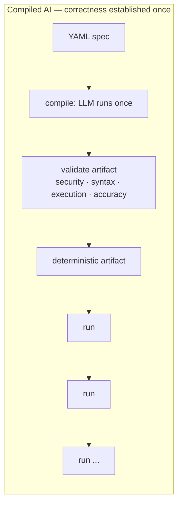
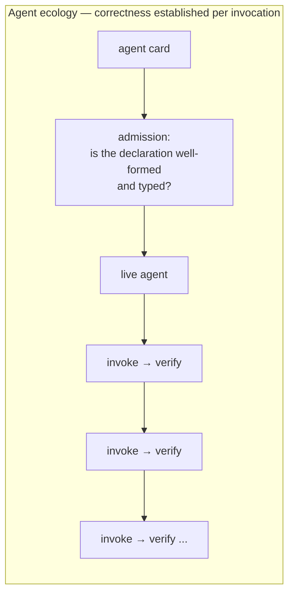
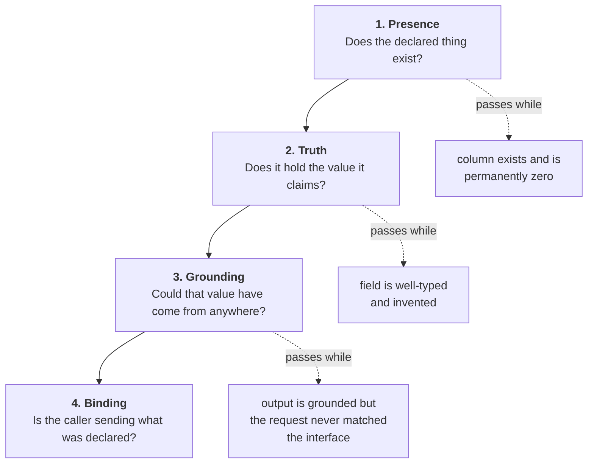
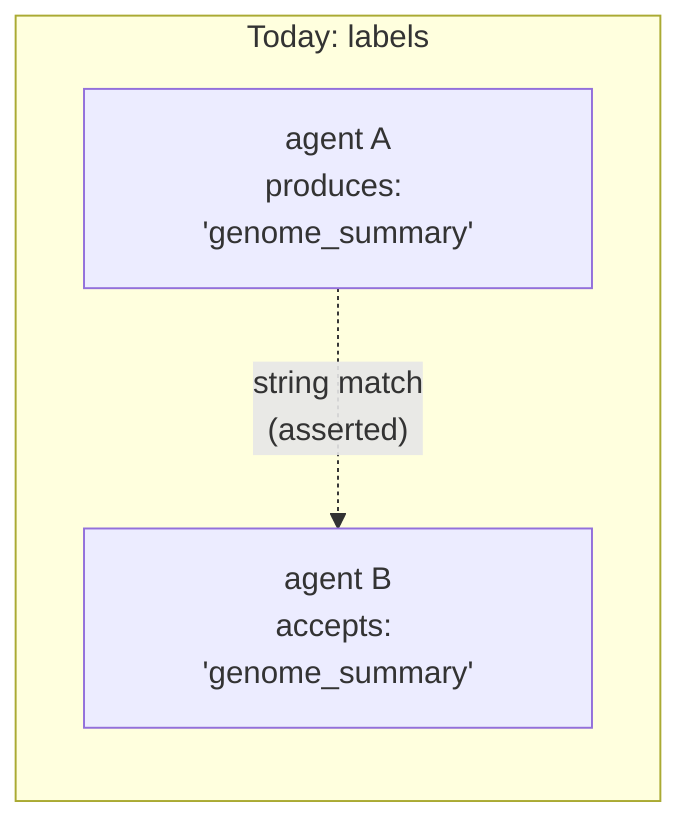
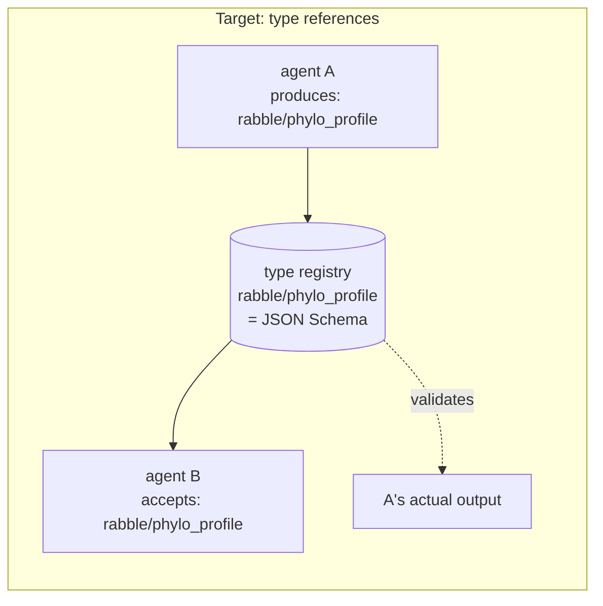
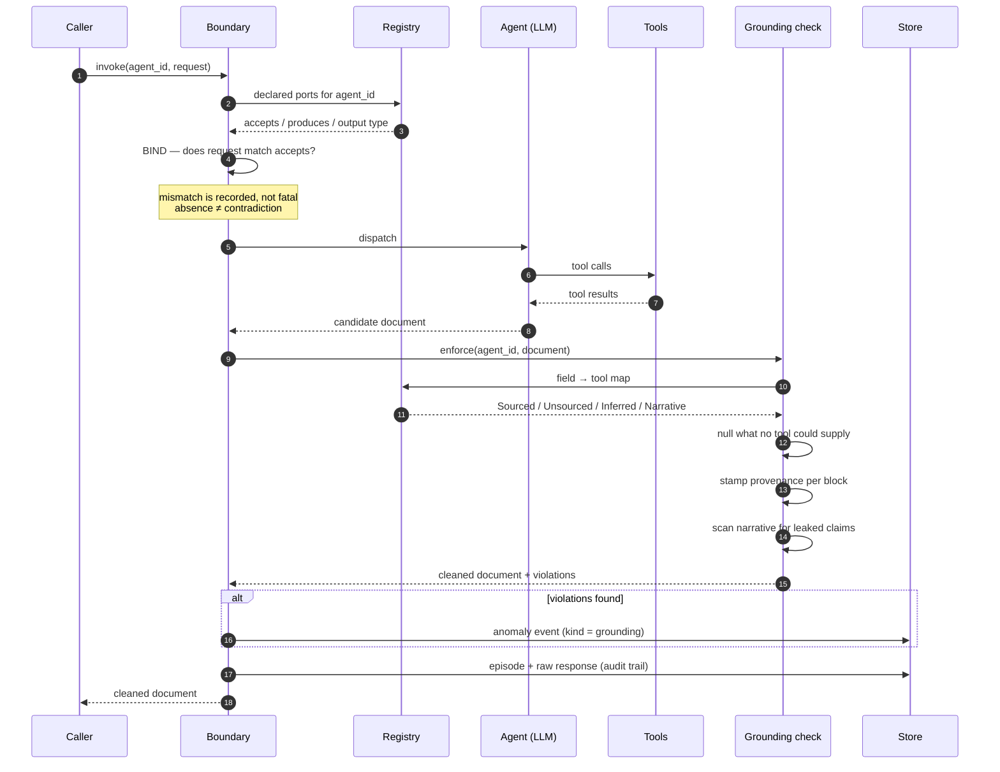
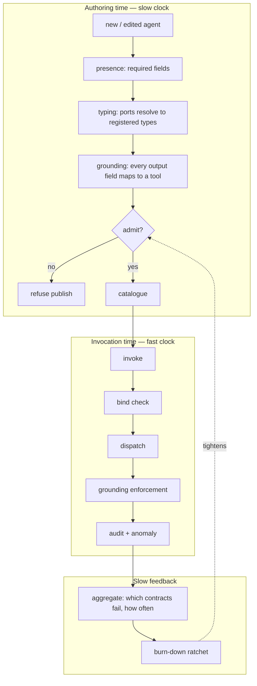

# Verification for Agent Ecologies

### Why a declared contract is not a contract, and what to do about it

**Status:** working paper · **Date:** 2026-08-15 · **Level:** logical architecture
**Implements:** `docs/ABW_VERIFICATION_RECONCILIATION.md`
**Situates against:** Trooskens et al., *Compiled AI: Deterministic Code Generation for
LLM-Based Workflow Automation*, arXiv:2604.05150v2

---

## Abstract

An agent ecology is a population of LLM-backed agents, authored continuously — often by
other agents — each declaring an interface and a set of capabilities. Composition depends
on those declarations being true. We report a class of defect in which they are not, and
in which no existing check could have noticed: the declaration is well-formed, the output
parses, the types check, and the content is fabricated.

We argue that this class is not addressable by the dominant answer in the literature —
removing the model from the control plane and validating a compiled artifact once — because
an ecology has no artifact and no compile step. We propose instead a **verification
ladder**: four contracts asking four progressively harder questions about the same
declaration, each cheap enough to run continuously, each required to demonstrate its own
ability to fail.

We describe the logical architecture, the invocation lifecycle it induces, and five design
rules derived from getting it wrong. The organising claim is small and, we think, general:
**a check that reasons about shape will pass while content is wrong, and shape is what
almost every check reasons about.**

---

## 1. The defect class

An agent in our catalogue is asked, by its own system prompt, to return four blocks of
data: taxonomy, genome, phylogeny, conservation. It has two tools, both of which return
taxonomy. Three of the four blocks have no possible source.

It filled them in. Confidently, for fifty-six episodes, with values like
`estimated_size_mb: "200-400"` and `chromosome_count: "typically 10-20 (variable in scale
insects)"` for a species nobody has sequenced. Thirteen of those documents were cached and
served to users.

The point is not that a model hallucinated. The point is the list of things that passed:

| Check | Why it passed |
|---|---|
| Card conformance tests | description, tags, sample queries, tools-as-objects: all present |
| Publish gate | `accepts` and `produces` non-empty: both were |
| JSON parsing | the document parsed perfectly |
| Cache validity | required non-empty `taxonomy` — the one block that *does* have a tool |
| Type checking | `String` is `String` whether it means a measurement or an invention |
| Anomaly detection | its `kind` CHECK admitted four values, none of which was this |

Every one of these reasons about **shape**. The failure was in **content**. The gap between
those two words is the subject of this paper.

The same shape holds elsewhere. A denormalised counter was present, correctly typed,
declared in the schema contract, and permanently zero because nothing ever wrote it; six
user-facing surfaces read it and served zeros. A rate-limiting middleware was written,
correct, and attached to no router, so the endpoints that spend money were the only ones
unprotected. A port named `tree_visualization_description` advertised an output the agent
has no field for and whose prompt never mentions rendering.

Each is the same failure: **a spec-shaped artifact that is not spec-enforcing**, sitting
where a reader — human or machine — will take it for the real thing.

### 1.1 Why declarations rot specifically in an ecology

Three properties make this worse than ordinary documentation drift.

**Declarations are load-bearing for composition.** In a monolith, a wrong comment misleads
a person. Here, `produces: X` → `accepts: X` is how a planner decides two agents compose.
A wrong label is an input to an automated decision.

**Declarations are generated at agent speed.** Cards are authored by agents, from
templates, in bulk. Review is not the trust mechanism and cannot be. Whatever verifies must
be automatic and must run at authoring time.

**Declarations have no compiler.** A type annotation in a program is checked by
construction. A `produces` label in a JSON card is checked by nothing at all, unless
something is built to check it.

The result, measured across our own 100 curated cards: **513 distinct port labels, of which
only 14 appear on both an `accepts` and a `produces`.** 499 labels cannot form a seam with
anything. Normalising for spelling collapses only 11 of them, so this is genuine vocabulary
invention rather than punctuation drift. The port graph is, in the main, decorative.

---

## 2. Why the compiled-AI answer does not transfer

Trooskens et al. give the strongest current answer to LLM unreliability in workflow
systems: **take the model out of the control plane.** Compile once, validate the artifact
through four stages — security, syntax, execution, accuracy — then execute deterministically
with zero runtime inference. Where a step genuinely needs semantic judgement, invoke the
model as a *bounded tool call* whose schema and trigger are fixed at compile time.

The empirical case is strong, and their citation of Cemri et al. is the one that matters
most here: **79% of multi-agent failures are specification and coordination failures, not
infrastructure.** That is precisely our finding, arrived at independently. Our
fabricated fields and decorative ports are specification failures in the exact sense
intended.

But the remedy does not transfer, for a structural reason.

| | Compiled AI | Agent ecology |
|---|---|---|
| Unit of correctness | a generated code artifact | a live agent with a prompt and tools |
| When correctness is established | once, at compile time | continuously, per invocation |
| What is validated | code | a probability distribution over documents |
| Who authors | a compiler, from a YAML spec | agents and users, continuously |
| Control plane | deterministic by construction | the model *is* the control plane |

An ecology has **no artifact to validate and no compile step in which to validate it.** The
agent is the artifact, it is nondeterministic by design, and its correctness is not a
property it has once but a property each of its outputs may or may not have.

So the question becomes: *what does verification look like when you cannot remove the model
from the loop?*

### 2.1 The part that does transfer, and matters most

Their **bounded tool call** — an LLM invocation whose schema and trigger are fixed ahead of
time — is exactly the right primitive, and it is what a typed agent port should be. Their
Appendix A "Safety Sandwich" (after Dalrymple et al.'s *Guaranteed Safe AI*) generalises
cleanly:

> input validation → probabilistic model → deterministic validation → audit trail

We adopt that sandwich wholesale. Our contribution is what to put in each slice when the
filling is a whole agent rather than a single extraction step, and when the sandwich must
be assembled per invocation rather than per compilation.

The shapes differ in where the validation sits. Compiled AI validates a thing that will
then be run many times. An ecology must validate each run, because each run is a fresh
sample.

---

## 3. The verification ladder

The organising insight is that "is this correct?" is not one question. It is at least four,
they are ordered by difficulty, and **a check answering an easier one will pass while a
harder one fails.** Naming them separately is what stops a presence check being mistaken
for a truth check.

Each rung is a **contract**: a hand-declared manifest in code, paired with a check that
enforces it. The manifest is the design commitment; the check is the proof it is kept.

| Rung | Question | Substrate | Catches |
|---|---|---|---|
| **Presence** | Does the declared object exist? | live schema catalogue, at boot | a renamed column, a dropped view |
| **Truth** | Does the stored value equal its source of truth? | aggregate query against real rows | a counter nothing writes |
| **Grounding** | Could this value have come from any available tool? | field → tool map, per agent | a fabricated measurement |
| **Binding** | Does the invocation match the declared interface? | declared ports vs. actual request | prose sent to a structured-only port |

Two properties make this a ladder rather than a list.

**Each rung is invisible to the one below it.** A grounding failure is a *valid* value of a
*present* column. That is why they must be separate contracts and not one "validation
layer" — a single layer inevitably reasons at one level of abstraction and silently
declines to ask the others.

**Each rung costs more and runs less often.** Presence is a catalogue read at boot. Truth
is a `GROUP BY` against production, run in CI and on demand. Grounding is a pure function
over a JSON document, run per invocation. Binding is a string comparison, run per request.
The ladder is ordered by cost as well as by difficulty, which is what makes running all
four affordable.

### 3.1 The typing layer beneath the ladder

Rungs 3 and 4 both need to know what a port *means*, and today a port is a free string.
That is the missing substrate, and it is where the compiled-AI notion of a compile-time
schema re-enters.

The target state is that every `accepts`/`produces` entry is a **reference to a registered
type**, not a label:

The difference is not notational. On the left, "A composes with B" is a claim about two
strings. On the right it is a claim about **type identity**, and the same schema that makes
the claim checkable also validates A's actual output at runtime. One artifact, two uses —
which is exactly the property that makes a compile-time schema worth having in the bounded
tool-call pattern.

Four checks fall out of the typing layer, none of which needs a model or a database:

| Check | Asks | Failure looks like |
|---|---|---|
| **Resolves** | does the label name a registered type? | 499 labels that match nothing |
| **Backed** | does a `produces` label map to something in the output? | a port with no field behind it |
| **Grounded** | are that port's fields sourceable? | a port advertising unsourceable data |
| **Bound** | does the request match the declared input? | prose into a structured port |

The third is the one that keeps the campaign honest. Without it, an ecology can be fully
typed and still fully fabricated — every port resolving, every schema validating, every
value invented. **Typing is necessary and nowhere near sufficient**; a schema makes a wrong
field *more* credible, not less.

---

## 4. The invocation lifecycle

Here is the ladder assembled into a single request path — the Safety Sandwich with an agent
in the middle.

Four things in that diagram are load-bearing and easy to get wrong.

**The bind check is at the boundary, not in the client.** We had a correct implementation of
it living in a desktop client, and the server recorded the *caller's claim* about whether
the interface matched. A claim transcribed into an audit field reads exactly like a finding.
Verification belongs where the authority is.

**Grounding runs before anything persists or renders.** Not as a report afterward. The check
that runs after the write is a metric; the check that runs before it is a control.

**The narrative is checked too.** Nulling a fabricated number is insufficient if the prose
summary restates it — and the summary is typically what a human reads and what downstream
extraction lifts out as "the evidence". A prose channel that is not checked is the channel
the fabrication moves into.

**The raw response is retained.** Not the digest. We discovered we had been keeping a
*per-agent parser's reading* of each output and discarding the output, which means the
historical record silently changed whenever the parser did — and that there was no corpus
from which to induce what an agent actually produces. Retention is a precondition for every
later form of verification, and it accrues only from the moment you start.

### 4.1 Two gates, two clocks

Verification happens on two independent schedules, and conflating them is a mistake.

The authoring gate is where **enforcement by default** actually lives: a new agent cannot
enter the catalogue with an untyped or ungrounded interface. The invocation gate catches
what the authoring gate cannot know — that this particular output, on this particular run,
contains something no tool could have supplied.

The ledger closes the loop, and it is the piece most systems omit. Without it you cannot
answer "is this getting better?", and a verification system that cannot report its own
trend gets quietly disabled.

---

## 5. Five design rules

These are not principles we started with. Each is the residue of getting it wrong, usually
within an hour of writing the check.

### 5.1 A check that has never failed has not been tested

Every contract in this architecture has been deliberately broken to confirm it goes red.
When we removed a clause from the port-binding rule, the parity test named all eight
affected agents. When we falsified the burn-down baseline, the ratchet named both
regressions and their required directions.

This is not ceremony. A verification layer is subject to the identical trap as the thing it
verifies: it looks done. A green check and an inert check are indistinguishable from the
outside, and the inert one is worse than nothing because it consumes the attention that
would otherwise notice.

### 5.2 A check that fires on correct behaviour will be deleted, and the deletion will look like cleanup

Our narrative-leak scanner searched for `" gb"` to catch a fabricated genome size. It
matched **"GBIF"** — the name of the very database that grounds the agent — so an honest
summary citing its source was flagged as fabricating one.

Over-reach is not a smaller error than under-reach; it is usually a larger one, because it
destroys the check's standing. The first person inconvenienced removes it, the diff reads as
tidying, and nobody learns that a real signal went with it. Where a rule cannot be made
precise, report the ambiguity as its own category instead of guessing.

### 5.3 Silence is not a verdict

An agent that declares no inputs has not contradicted anything. An agent with no grounding
contract has not been found compliant. Both must be distinguishable from a pass.

Systems that collapse absence into success accumulate a population of unexamined things
that look examined — which is the original defect, reintroduced by the machinery built to
prevent it.

### 5.4 The scoreboard must not reward deletion

Retiring two fabricated ports moved our corpus from 513 distinct labels to 510. A metric
keyed on "unresolved labels falling" would have scored that as progress equal to typing two
ports properly. It is not equal: one is honesty, the other is capability.

So the leading indicator is the count of labels that **resolve to a registered type** — the
only counter that deletion cannot fake. Choose burn-down metrics by asking which cheap
action would move them, and lead with the one where the answer is "none".

### 5.5 Distinguish retrieval from judgement, or the contract condemns competence

The grounding contract nearly failed on its second agent. A threat-assessment agent is asked
to rate predation risk from taxonomy and proximity. That rating is in no database. Treating
it like a fabricated genome size would have nulled the agent's entire product.

A genome size is a fact sitting in a source the agent did not consult. A threat level is a
judgement the agent was commissioned to make. Both are model output; only one is a
retrieval claim. Without that distinction every agent looks guilty — and a checker that
flags everything is indistinguishable from a broken one.

The resulting vocabulary is four-valued, and the middle two are what make it usable:

| Grounding | Meaning | Disposition |
|---|---|---|
| `Sourced` | a named tool returned it | keep, mark verified |
| `Inferred` | judgement over sourced inputs, by design | keep, mark as inference |
| `Narrative` | prose | keep, scan for claims it cannot support |
| `Unsourced` | no tool could supply it | **null it, record what was removed** |

Retaining the removed value matters: when a real source is eventually integrated, the
model's prior guess becomes free calibration data. Tag, do not delete.

---

## 6. What this architecture does not do

Stated plainly, because a verification paper that oversells is self-refuting.

**It does not make agents correct.** It makes a specific class of incorrectness *visible and
non-serving*. A grounded, well-typed, correctly-bound answer can still be wrong.

**It cannot detect semantic hallucination inside a sourced field.** If a tool returns data
and the model paraphrases it wrongly, every contract here passes. This is the same limit
Trooskens et al. acknowledge for bounded tool calls: schema validation catches structural
errors, not semantic drift. That needs outcome scoring against ground truth, on a slower
clock.

**The grounding contract is hand-declared and therefore incomplete.** It covers the agents
someone has written it for. Coverage is itself a metric, and pretending otherwise would
reproduce the defect.

**Heuristics remain where types are absent.** The rule guessing whether a port takes free
text has no correct setting — widen it and it swallows structured ports, narrow it and it
misses real declarations. It exists only because 510 uncontrolled strings exist. Its
deletion is the success condition for the typing layer, and we have said so in the code so
that its removal reads as completion rather than regression.

**Determinism is not on offer.** Compiled AI can promise zero control-plane entropy because
it removes the model. We cannot. We are trading that for the thing an ecology buys —
open-ended composition — and paying for it with per-invocation verification.

---

## 7. Position

Trooskens et al. resolve the reliability problem by **eliminating the nondeterministic
component from the control plane**. Where a workflow is well-specified, high-volume and
compliance-bound, that is plainly right, and their token and determinism results are not
arguable.

An agent ecology occupies the opposite corner: the workflow is *not* known in advance, which
is the entire reason for having a population of composable agents rather than a compiled
pipeline. We cannot take the model out of the loop without deleting the product.

What we take from their work is the **discipline**, decoupled from the mechanism:

| Compiled AI | Ecology equivalent |
|---|---|
| schema fixed at compile time | type registry, referenced by ports |
| four-stage validation before deploy | four-rung ladder, at admission and per invocation |
| bounded tool call | typed agent invocation |
| Safety Sandwich | bind → dispatch → ground → audit |
| deterministic control plane | *not available* — replaced by per-invocation verification |
| regenerate on validation failure | strip-and-flag, with the removed value retained |

The synthesis is that the two architectures are the same design in different regimes.
Compiled AI moves verification **earlier** until the runtime needs none. An ecology cannot
move it earlier, so it must make verification **cheap enough to run every time**. Both are
refusals of the same thing: the assumption that a well-formed declaration is a true one.

Cemri et al.'s finding — 79% of failures are specification failures — is the bridge. If most
failures are specification failures, then the specification is the artifact that has to be
made executable. Compiled AI executes it by compiling it. We execute it by checking it
continuously. Neither is served by a specification that is merely *written down*, which is
the state we found ours in and the state most declarative agent frameworks currently ship.

---

## 8. Summary

- The defect class is **spec-shaped but not spec-enforcing**: declarations that are
  well-formed, well-typed, and false.
- Shape-based checks cannot see it, and almost all checks are shape-based.
- In an ecology there is no artifact and no compile step, so the compiled-AI remedy does not
  transfer — but its *discipline* does.
- The remedy is a **ladder of four contracts** — presence, truth, grounding, binding — each
  invisible to the one below, each ordered by cost, each required to demonstrate it can
  fail.
- Beneath the ladder sits a **typing layer** that converts ports from labels into type
  references, making composition checkable and output validatable with one artifact.
- Typing is necessary and insufficient. Grounding is what stops a fully-typed ecology from
  being a fully-fabricated one.
- Verification runs on two clocks: an admission gate that is the real meaning of
  "enforcement by default", and a per-invocation gate that catches what admission cannot
  know.
- The whole thing is worthless without a ledger showing whether it is improving, and a
  metric that deletion cannot fake.

---

## References

1. Trooskens, G., Sharma, A., Karlsberg, A., De Brouwer, L., Van Puyvelde, M., Young, M.,
   Thickstun, J., Alterovitz, G., De Brouwer, W. A. *Compiled AI: Deterministic Code
   Generation for LLM-Based Workflow Automation.* arXiv:2604.05150v2 [cs.SE], 2026.
2. Cemri, M., et al. *Why Do Multi-Agent LLM Systems Fail?* arXiv:2503.13657, 2025.
   — 79% of failures are specification and coordination, not infrastructure.
3. Dalrymple, D., et al. *Towards Guaranteed Safe AI.* arXiv:2405.06624, 2024.
   — the Safety Sandwich framing.
4. Khattab, O., et al. *DSPy: Compiling Declarative Language Model Calls.*
   arXiv:2310.03714, 2023.
5. Ouyang, S., et al. *Non-determinism of ChatGPT in Code Generation.* arXiv:2308.02828,
   2023. — 18–75% output variance at temperature 0.
6. Zaharia, M., et al. *The Shift from Models to Compound AI Systems.* BAIR, 2024.

### Internal

- `docs/ABW_VERIFICATION_RECONCILIATION.md` — the audit and remediation plan this
  generalises from, including measured corpus figures.
- `docs/SCHEMA_AND_RULE_INTEGRITY_RECONCILIATION.md` — the prior audit at the database and
  business-rule layers, where the presence/truth distinction originated.
