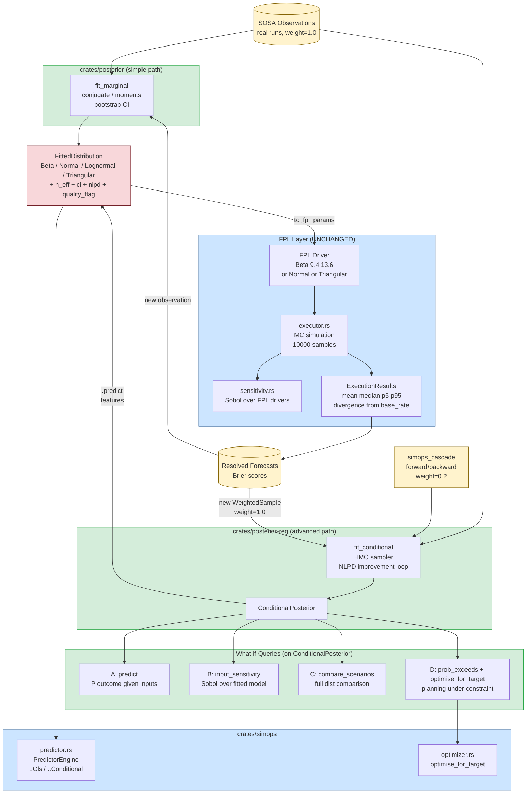

# BayesOps: Data-Informed Distribution Fitting for Fermi
## Specification & Roadmap — v0.3

**Status:** Active — Phase 1 in progress; Phases 2–5 roadmap  
**Author:** Ivan Labra  
**Date:** 2026-05-23, revised 2026-06-03, revised 2026-06-16  
**Replaces:** v0.2 (Spec 20 status updated; migration 140 dependency added; JSONB
persistence sub-task added to Phase 1)
**Partly superseded by:** `35_BAYESOPS_PLATFORM_LAYER.md` — §5.6 (surfaces) below
assumed a single Fermi-shaped consumer. Spec 35 lifts the data intake to a
`Feed` registry, makes the impact gate and accept hook App-supplied, and gives
BayesOps a second consumer outside forecasting. The contract in §3 and the
architecture in §2 are unchanged by it.

> **Current state (2026-06-16):** Neither `crates/posterior` nor `crates/posterior-reg` exists
> yet in code. Phase 1 implementation begins this session. Spec 14 architecture and contract
> are unchanged from v0.2 — only minor sequencing and persistence notes are revised.
>
> **Spec 20 status (updated 2026-06-16):** `ProjectionScoringEvaluator` is **code-complete and
> wired**: `agent-bestiary/evaluators/src/projection_scoring.rs:81`, registered at
> `src/handlers/eval.rs:939`, with migration 130 (`migrations/130_sosa_projection_index.sql`)
> in the repo. The only remaining Spec 20 gate is **operational deployment + real-observation
> accumulation**, not implementation. BayesOps Phase 1 implementation no longer blocks on
> Spec 20 code — it can proceed in parallel and validate against (a) synthetic data with known
> ground truth and (b) whatever real SOSA observations have accumulated by Phase 1 acceptance.
> Phase 4 (`simops` integration) still requires real observations because the validation gate
> is "NLPD on held-out real runs improves over OLS baseline."
>
> **Migration 140 commitment (added 2026-06-16):** `harness_snapshots.bayesops_params_hash` and
> `harness_snapshots.bayesops_params JSONB` columns already exist in the schema (see
> `migrations/140_forecast_benchmark.sql:42,48`). The `forecast_commitments` infrastructure
> currently writes `bayesops_params: null`. Phase 1 must produce a `FittedDistribution` that
> serializes cleanly to that JSONB column, so the existing benchmark infrastructure can begin
> recording BayesOps-fitted parameter hashes the moment Phase 4 lands.
>
> **Scope decision unchanged:** Phase 1 (`crates/posterior`, simple marginal fitting) is the
> entry point. Phases 2–5 remain roadmap — Phase 4 still gated on real cultivation run history.

---

## 0. The Conceptual Clarification That Drives This Design

There are **two completely separate Monte Carlo loops** in this system. Conflating them was the core error in v0.1.

```
The fitting loop — Parameter Fitting (offline, runs once per dataset)
  Historical observations → fit a posterior → produce distribution parameters
  This is BayesOps. It uses MCMC internally.
  Output: Beta(9.4, 13.6)  or  Normal(4.8, 0.7)  or  Triangular(3.1, 4.8, 6.9)

The simulation loop — Forecast Simulation (online, runs per question)
  FPL Driver distributions → executor.rs samples → model expression → outcome distribution
  This is the EXISTING executor.rs. It is UNCHANGED.
  Input: Beta(9.4, 13.6)  ← came from the fitting loop, or a human, doesn't matter
```

BayesOps is entirely the fitting loop. It produces parameters that feed the
simulation loop as `Driver` values. The simulation loop never knows or cares
whether its parameters came from BayesOps or from a human.

> **Naming note.** These two are *Monte Carlo* loops, not feedback loops. An
> earlier revision called them "Loop A" and "Loop B", which collided with the
> platform feedback-loop numbering in `docs/architecture/FEEDBACK_LOOPS.md`;
> the letters are retired. BayesOps as a platform feedback loop is **Loop 5.B**
> (the correction arm of calibration).
The seam between them is the `Distribution` type in the FPL AST.

---

## 1. Problem Statement (Restated Cleanly)

The Fermi executor already runs excellent probabilistic simulations. The gap is in **where Driver distribution parameters come from**. Currently: a human types them. The goal: historical observations can *produce* those parameters automatically, with uncertainty width that reflects the evidence available.

This matters for what-if scenario modeling specifically because:

1. **Conditional prediction**: "What is the yield distribution *given* I run at lighting=160 kWh?" requires a model of yield as a function of inputs — not just a marginal distribution over past yields.

2. **Input sensitivity**: "Which input drives yield variance most?" is Sobol analysis over the posterior predictive, not over FPL drivers. The existing `sensitivity.rs` runs Sobol over FPL driver distributions; BayesOps enables Sobol over *fitted* input-output relationships.

3. **Scenario comparison**: "Scenario A vs Scenario B — which has better expected yield and lower risk?" requires full predictive distributions at both input conditions, comparable on the same scale.

4. **Planning under constraint**: "What is P(yield ≥ 5.5 kg | lighting=135, budget=$40)?" requires both a conditional predictive distribution and the ability to evaluate probability at a threshold.

All four reduce to the same primitive: **a conditional predictive distribution P(outcome | inputs, historical data)**, which is exactly what Bayesian regression produces.

---

## 2. Architecture: Two Crates, One Contract

```
┌─────────────────────────────────────────────────────────────────┐
│                    CONTRACT: FittedDistribution                  │
│   Beta | Normal | Lognormal | Triangular                        │
│   + n_eff + nlpd + ci_low + ci_high + quality_flag             │
│   + to_fpl_params() → plugs directly into executor.rs           │
└─────────────────────────────────────────────────────────────────┘
          ↑                                    ↑
          │ produces                           │ produces
┌─────────┴──────────┐             ┌──────────┴──────────┐
│  crates/posterior  │             │ crates/posterior-reg │
│                    │             │                      │
│  Simple path       │             │  Advanced path       │
│  ─────────────     │             │  ─────────────────   │
│  fit_marginal()    │             │  fit_conditional()   │
│                    │             │                      │
│  Conjugate updates │             │  HMC sampler         │
│  Bootstrap CI      │             │  Weighted likelihood │
│  Method of moments │             │  NLPD improvement    │
│                    │             │  loop                │
│  No deps beyond    │             │                      │
│  rand + statrs     │             │  depends on:         │
│                    │             │  posterior (types)   │
└────────────────────┘             └──────────────────────┘
          ↑                                    ↑
          │ optional feature flags             │
          └──────────────┬─────────────────────┘
                         │
               ┌─────────┴──────────┐
               │   crates/simops    │
               │                   │
               │  predictor.rs     │
               │  PredictorEngine  │
               │  ::Marginal       │  ← uses posterior
               │  ::Conditional    │  ← uses posterior-reg
               └───────────────────┘
                         │
                         │ FittedDistribution → Beta(α,β) / Normal(μ,σ) / etc.
                         ↓
               ┌─────────────────────┐
               │  FPL Driver         │
               │  Driver yield:      │
               │    Beta(9.4, 13.6)  │  ← unchanged AST type
               └─────────────────────┘
                         │
                         ↓
               ┌─────────────────────┐
               │  executor.rs        │  ← COMPLETELY UNCHANGED
               │  MC simulation      │
               │  10,000 samples     │
               └─────────────────────┘
                         │
                         ↓
               ┌─────────────────────┐
               │  ExecutionResults   │
               │  sensitivity.rs     │  ← UNCHANGED (Sobol over FPL drivers)
               │  Sobol indices      │
               └─────────────────────┘
```

---

## 3. The Shared Contract: `FittedDistribution`

This is the **only type that crosses the crate boundary**. It lives in `crates/posterior` and is used by both crates and by `simops`.

```rust
/// The output of any fitting operation — simple or advanced.
/// Represents a probability distribution whose parameters were
/// derived from data rather than elicited from a human.
///
/// Directly convertible to FPL Driver distribution parameters.
#[derive(Debug, Clone, Serialize, Deserialize)]
pub enum FittedDistribution {
    Beta {
        alpha: f64,
        beta: f64,
        ci_low: f64,        // 5th percentile of posterior predictive
        ci_high: f64,       // 95th percentile
        n_eff: f64,         // effective observation count
    },
    Normal {
        mean: f64,
        std_dev: f64,
        ci_low: f64,
        ci_high: f64,
        n_eff: f64,
    },
    Lognormal {
        median: f64,
        sigma: f64,
        ci_low: f64,
        ci_high: f64,
        n_eff: f64,
    },
    Triangular {
        p5: f64,
        p50: f64,
        p95: f64,
        n: usize,           // raw observation count (no n_eff concept)
    },
}

/// Metadata attached to any FittedDistribution
#[derive(Debug, Clone, Serialize, Deserialize)]
pub struct FitMetadata {
    pub quality: DataQuality,
    pub nlpd: Option<f64>,          // None for simple path (no held-out eval)
    pub fitted_at: DateTime<Utc>,
    pub n_observations: usize,
    pub source_description: String, // e.g. "12 Ambu cultivation runs 2025-2026"
}

#[derive(Debug, Clone, Serialize, Deserialize, PartialEq)]
pub enum DataQuality {
    Sufficient,     // n_eff >= 20, NLPD reasonable
    Sparse,         // 5 <= n_eff < 20: usable but wide CI
    Insufficient,   // n_eff < 5: parameters unreliable, use with caution
}

impl FittedDistribution {
    /// Emit the FPL Driver distribution syntax string.
    /// This is what gets written into a .fpl file or injected into the AST.
    pub fn to_fpl_params(&self) -> String {
        match self {
            Self::Beta { alpha, beta, .. } =>
                format!("Beta({:.4}, {:.4})", alpha, beta),
            Self::Normal { mean, std_dev, .. } =>
                format!("Normal({:.4}, {:.4})", mean, std_dev),
            Self::Lognormal { median, sigma, .. } =>
                format!("Lognormal({:.4}, {:.4})", median, sigma),
            Self::Triangular { p5, p50, p95, .. } =>
                format!("Triangular({:.4}, {:.4}, {:.4})", p5, p50, p95),
        }
    }

    /// Width of the 90% CI — the primary signal of how much
    /// uncertainty remains. Wide = sparse data. Narrow = well-fitted.
    pub fn ci_width(&self) -> f64 {
        match self {
            Self::Beta { ci_high, ci_low, .. } => ci_high - ci_low,
            Self::Normal { ci_high, ci_low, .. } => ci_high - ci_low,
            Self::Lognormal { ci_high, ci_low, .. } => ci_high - ci_low,
            Self::Triangular { p5, p95, .. } => p95 - p5,
        }
    }

    pub fn n_eff(&self) -> f64 {
        match self {
            Self::Beta { n_eff, .. } => *n_eff,
            Self::Normal { n_eff, .. } => *n_eff,
            Self::Lognormal { n_eff, .. } => *n_eff,
            Self::Triangular { n, .. } => *n as f64,
        }
    }
}
```

---

## 4. Crate A: `crates/posterior` (Simple Path)

**Scope:** marginal distribution fitting. No inputs. No regression. No sampler. Covers cases where you have a vector of outcome observations and want a calibrated distribution over that outcome.

**Use cases it handles:**
- Historical batch success rates → `Beta(α, β)` base rate driver
- Historical yield observations (marginal, ignoring what inputs were used) → `Normal` or `Lognormal`
- Any scalar outcome with a small-to-medium observation history

**It does NOT handle:** predicting outcome as a function of inputs. That is `posterior-reg`.

```rust
/// Fit a marginal distribution to a vector of scalar observations.
///
/// weights: optional, same length as observations.
///   real observations = 1.0, synthetic/cascade = 0.0–0.3
///   None = all observations weighted equally
///
/// family: which distribution family to fit.
///   Auto = try Beta (if outcomes in [0,1]) then Normal then Lognormal,
///          pick the one with lowest KL divergence to empirical CDF.
pub fn fit_marginal(
    observations: &[f64],
    weights: Option<&[f64]>,
    family: DistFamily,
) -> Result<(FittedDistribution, FitMetadata), PosteriorError>

pub enum DistFamily {
    Beta,       // outcomes must be in (0, 1)
    Normal,
    Lognormal,  // outcomes must be > 0
    Triangular, // empirical percentiles, no parametric assumption
    Auto,       // select best fit
}
```

**Internal methods:**
- `fit_beta_conjugate(successes, trials)` — exact Bayesian update: `Beta(1+s, 1+f)`
- `fit_beta_moments(obs, weights)` — method of moments for continuous [0,1] outcomes
- `fit_normal_conjugate(obs, weights)` — conjugate Normal-Normal update
- `fit_lognormal_moments(obs, weights)` — fit on log-transformed data
- `bootstrap_ci(obs, weights, n_bootstrap)` → `(ci_low, ci_high)` — 1000-resample bootstrap for all methods

**Dependencies:** `rand`, `statrs`, `serde`, `chrono`. Nothing else.

---

## 5. Crate B: `crates/posterior-reg` (Advanced Path)

**Scope:** conditional distribution fitting. Takes `(features, outcome)` pairs. Produces a predictive distribution at a query point `(features_new)`. Enables all four what-if scenario modeling use cases.

**Use cases it handles:**
- A: Conditional prediction at new input conditions
- B: Input sensitivity analysis over the fitted model
- C: Scenario comparison (full predictive distributions at two input configs)
- D: Probability of hitting a target: `P(outcome ≥ threshold | inputs)`

### 5.1 The Core Input/Output

```rust
/// A single training observation with features, outcome, and trust weight.
#[derive(Debug, Clone, Serialize, Deserialize)]
pub struct WeightedSample {
    pub features: HashMap<String, f64>,   // input variables
    pub outcome: f64,                      // what we're predicting
    pub weight: f64,                       // 1.0=real, 0.0–0.3=synthetic
}

/// Fit a conditional model: P(outcome | features, data).
/// Returns a posterior that can answer queries at any feature point.
pub async fn fit_conditional(
    data: &[WeightedSample],
    config: &RegressionConfig,
) -> Result<ConditionalPosterior, RegressionError>

pub struct RegressionConfig {
    pub held_out_fraction: f64,      // default 0.2 — protected from improvement loop
    pub sampler: SamplerConfig,      // chains, draws, warmup
    pub improvement: ImprovementConfig, // max_iters, stop_after_n_flat
    pub feature_names: Vec<String>,  // declared order for reproducibility
    pub seed: Option<u64>,           // top-level deterministic seed; chains derive from it
}
```

**Feature-name semantics (clarification, 2026-06-16):**

- `RegressionConfig::feature_names` is **the source of truth** for the regression's
  feature column order. It is declared once per fit and never inferred from data.
- Each `WeightedSample::features` map MUST contain every key in `feature_names`.
  Missing keys are a hard error (`RegressionError::MissingFeature`).
- Extra keys in `features` beyond `feature_names` are silently ignored. This lets
  callers carry richer metadata in the map (e.g. provenance tags) without polluting
  the regression input.
- Order in the `feature_names` vector is the order used by `predict_mean`,
  `predict_std`, dual-number gradients, and Sobol analysis. Two fits with the same
  `feature_names` vector and the same data are bitwise-identical (modulo `seed`).

### 5.2 The ConditionalPosterior

This is the central type of the advanced path. It wraps the raw MCMC samples and exposes the four what-if query methods directly.

```rust
pub struct ConditionalPosterior {
    // Internal: MCMC samples over model parameters
    samples: Vec<Vec<f64>>,              // [sample_idx][param_idx]
    model: Box<dyn RegressionModel>,     // the winning model variant
    pub diagnostics: SamplerDiagnostics,
    pub nlpd: f64,                       // on held-out data
    pub metadata: FitMetadata,
}

impl ConditionalPosterior {

    // ── Use case A: conditional prediction ───────────────────────────────────

    /// P(outcome | features_new, data)
    /// Returns the full predictive distribution as a FittedDistribution.
    /// This is what feeds the FPL Driver directly.
    pub fn predict(
        &self,
        features: &HashMap<String, f64>,
    ) -> FittedDistribution

    // ── Use case B: input sensitivity ────────────────────────────────────────

    /// Which features drive outcome variance the most?
    /// Returns Sobol-style first-order and total-order indices
    /// computed over the posterior predictive (not over FPL drivers).
    /// Analogous to sensitivity.rs but over the fitted model.
    pub fn input_sensitivity(
        &self,
        feature_ranges: &HashMap<String, (f64, f64)>, // plausible range per feature
        n_samples: usize,
    ) -> HashMap<String, InputSensitivity>

    pub struct InputSensitivity {
        pub feature_name: String,
        pub first_order_index: f64,   // direct effect
        pub total_order_index: f64,   // total effect including interactions
        pub ci: (f64, f64),           // bootstrap 90% CI on total-order index
    }

    // ── Use case C: scenario comparison ──────────────────────────────────────

    /// Compare two input configurations.
    /// Returns full predictive distributions for both, plus a summary.
    pub fn compare_scenarios(
        &self,
        scenario_a: &HashMap<String, f64>,
        scenario_b: &HashMap<String, f64>,
    ) -> ScenarioComparison

    pub struct ScenarioComparison {
        pub a: FittedDistribution,
        pub b: FittedDistribution,
        pub prob_a_better: f64,       // P(outcome_A > outcome_B)
        pub expected_gain: f64,       // E[outcome_A - outcome_B]
        pub risk_ratio: f64,          // std_dev_A / std_dev_B  (<1 = A less risky)
    }

    // ── Use case D: planning under constraint ─────────────────────────────────

    /// P(outcome >= threshold | features)
    /// The core planning query: "how likely am I to hit my target?"
    pub fn prob_exceeds(
        &self,
        features: &HashMap<String, f64>,
        threshold: f64,
    ) -> f64

    /// Find the input value of `free_feature` that maximises
    /// P(outcome >= threshold), holding other features fixed.
    /// This replaces the deterministic simops_optimizer with a
    /// probabilistic equivalent.
    pub fn optimise_for_target(
        &self,
        fixed_features: &HashMap<String, f64>,
        free_feature: &str,
        search_range: (f64, f64),
        target_threshold: f64,
    ) -> OptimisationResult

    pub struct OptimisationResult {
        pub recommended_value: f64,
        pub prob_at_recommended: f64,   // P(outcome >= threshold) at recommended
        pub predictive_dist: FittedDistribution,
        pub sensitivity_curve: Vec<(f64, f64)>, // (feature_value, prob_exceeds)
    }
}
```

### 5.3 The RegressionModel Trait and Variants

The sampler is model-agnostic. Models declare their log-likelihood and log-prior; the sampler differentiates them via dual numbers.

```rust
pub trait RegressionModel: Send + Sync {
    fn name(&self) -> &str;
    fn n_params(&self) -> usize;
    fn param_names(&self) -> Vec<String>;
    fn log_likelihood(&self, sample: &WeightedSample, params: &[f64]) -> f64;
    fn log_prior(&self, params: &[f64]) -> f64;
    fn predict_mean(&self, params: &[f64], features: &HashMap<String, f64>) -> f64;
    fn predict_std(&self, params: &[f64], features: &HashMap<String, f64>) -> f64;
    fn init_params(&self, data: &[WeightedSample]) -> Vec<f64>;
}
```

Built-in variants tried in order by the improvement loop:

| Variant | Likelihood | Mean | Variance | Minimum data |
|---|---|---|---|---|
| `LinearNormal` | `N(β·x, σ)` | linear | constant | 5 samples |
| `LinearStudentT` | `StudentT(ν, β·x, σ)` | linear | constant | 5 samples |
| `NonlinearNormal` | `N(f(x), σ)` | quadratic | constant | 15 samples |
| `HeteroscedasticNormal` | `N(β·x, exp(γ·x))` | linear | input-dependent | 15 samples |
| `HierarchicalNormal` | partial pooling | linear per group | constant | 3+ groups |

### 5.4 The HMC Sampler

Pure Rust. No Python. No Stan. No FFI.

```rust
pub struct SamplerConfig {
    pub n_chains: u32,           // default: 4
    pub n_warmup: u32,           // default: 500
    pub n_draws: u32,            // default: 1000
    pub target_accept_rate: f64, // default: 0.80
    pub seed: Option<u64>,
}

pub struct SamplerDiagnostics {
    pub r_hat: Vec<f64>,         // per-parameter; want < 1.05
    pub ess_bulk: Vec<f64>,      // bulk ESS; want > 400
    pub ess_tail: Vec<f64>,      // tail ESS; want > 400
    pub divergences: u32,        // want 0
    pub converged: bool,         // all r_hat < 1.05 && divergences == 0
}
```

Gradient computation strategy (revised 2026-06-16):

- **LinearNormal**, **LinearStudentT** — hand-coded analytical gradients. The
  log-likelihood gradient for these is 5–10 lines of arithmetic and is
  bitwise-identical across runs.
- **NonlinearNormal**, **HeteroscedasticNormal**, **HierarchicalNormal** —
  dual-number forward-mode AD via the `num-dual` crate (active fork of
  `dual_num`, MIT/Apache, last released 2025-10).

Every model's gradient is verified against finite differences to 1e-6 in the
test suite. This keeps the heavy `nalgebra` dependency that `num-dual` pulls
behind a feature flag (`ad`) so the simple-model path stays lean.

**Mass matrix (Phase 2a limitation, recorded 2026-06-16):** Phase 2a ships with
an **identity mass matrix**. This is sufficient for `LinearNormal` location
parameters (intercept + β) — R-hat converges to < 1.05 in ~500 draws — but
the scale parameter `log_sigma` mixes more slowly (R-hat ~1.3–1.5 in the same
budget) because its curvature differs from the location parameters. **Phase 2b
adds diagonal mass-matrix adaptation during warmup** (Stan-style), which closes
this gap. End-to-end acceptance tests record both regimes: < 1.10 for location
params, < 1.5 for scale params, with a comment pointing to this section.

### 5.5 The NLPD Improvement Loop

```rust
pub struct ImprovementConfig {
    pub max_iterations: u32,         // default: 10
    pub stop_after_n_flat: u32,      // default: 3 consecutive non-improving
}

// Internal to fit_conditional() — not public API
// Tries model variants in order, keeps each only if NLPD on held-out improves.
// Returns the best (model, posterior, nlpd_trajectory).
async fn improvement_loop(
    train: &[WeightedSample],
    held_out: &[WeightedSample],
    config: &RegressionConfig,
) -> Result<(Box<dyn RegressionModel>, Posterior, Vec<(String, f64)>), RegressionError>
```

### 5.6 Surfaces (added 2026-06-16)

BayesOps is a Fermi-general capability, not a SimOps add-on. It applies anywhere
parameters need to be fit from collected evidence: forecast calibration, agent
ranking, FPL Evidence strength, SimOps cascades, or any future predictive model.
To make this concrete, Phase 2 exposes three surfaces, built in this order:

**(a) Pure library** — `crates/posterior` and `crates/posterior-reg` are the only
canonical home of the fitting logic. Every other surface is a thin adapter.
This is the surface SimOps (Phase 4) and the agent runtime consume directly when
they live in the same process.

**(b) HTTP** — `src/handlers/bayesops.rs` (new) exposes the fitting and
querying API at `POST /api/bayesops/*`:

| Endpoint | Body | Returns |
|---|---|---|
| `/api/bayesops/fit_marginal` | `{ observations: f64[], weights?: f64[], family: "beta"\|"normal"\|"lognormal"\|"triangular"\|"auto" }` | `{ fitted: FittedDistribution, metadata: FitMetadata }` |
| `/api/bayesops/fit_conditional` | `{ data: WeightedSample[], config: RegressionConfig }` | `{ posterior_id: Uuid, diagnostics, nlpd, metadata }` (server-side cache of the posterior keyed by `posterior_id`) |
| `/api/bayesops/predict` | `{ posterior_id, features: {name: f64} }` | `FittedDistribution` |
| `/api/bayesops/input_sensitivity` | `{ posterior_id, feature_ranges, n_samples? }` | `{ [feature]: InputSensitivity }` |
| `/api/bayesops/compare_scenarios` | `{ posterior_id, a, b }` | `ScenarioComparison` |
| `/api/bayesops/prob_exceeds` | `{ posterior_id, features, threshold }` | `{ probability: f64 }` |
| `/api/bayesops/optimise_for_target` | `{ posterior_id, fixed_features, free_feature, search_range, target_threshold }` | `OptimisationResult` |

Phase 2 ships an **in-memory** posterior cache (DashMap keyed by Uuid). The
persistent posterior store is Phase 5 (see §10) — until then, posteriors are
session-scoped.

**(c) MCP tools** — registered in `src/bin/agent-mcp-server.rs`, one MCP tool
per HTTP endpoint, same names:
`fermi_fit_marginal`, `fermi_fit_conditional`, `fermi_predict`,
`fermi_input_sensitivity`, `fermi_compare_scenarios`, `fermi_prob_exceeds`,
`fermi_optimise_for_target`. This is what agents call when authoring an FPL
program from data they have at hand.

**Coupling note:** the HTTP and MCP surfaces live in `fermi` (root crate), not in
`posterior` or `posterior-reg`. The library crates remain
domain-and-transport-neutral per §9. The same library function backs all three
surfaces — `to_fpl_params()` is the shared output type and round-trips through
the FPL parser (Phase 1 acceptance test).

---

## 6. Integration with SimOps

`crates/simops/src/predictor.rs` gains a second engine behind an optional feature flag. The existing OLS path is **untouched**.

```rust
// crates/simops/src/predictor.rs

pub enum PredictorEngine {
    /// Existing OLS engine — default, no new dependencies
    Ols(Predictor),

    /// BayesOps conditional posterior — requires feature "bayesian"
    #[cfg(feature = "bayesian")]
    Conditional(posterior_reg::ConditionalPosterior),
}

impl PredictorEngine {
    /// Point prediction — same API as existing Predictor::predict()
    pub fn predict(&self, features: &HashMap<String, f64>) -> Result<f64, SimOpsError> {
        match self {
            Self::Ols(p) => p.predict(features),
            #[cfg(feature = "bayesian")]
            Self::Conditional(cp) => {
                let dist = cp.predict(features);
                Ok(dist.mean()) // point estimate from posterior predictive mean
            }
        }
    }

    /// Full predictive distribution — only available on Conditional engine.
    /// This is what what-if scenario modeling uses.
    #[cfg(feature = "bayesian")]
    pub fn predict_distribution(
        &self,
        features: &HashMap<String, f64>,
    ) -> Option<posterior::FittedDistribution> {
        match self {
            Self::Conditional(cp) => Some(cp.predict(features)),
            _ => None,
        }
    }
}
```

Cascade synthetic data flows in as `WeightedSample`s with `weight = 0.2`:

```rust
// Conversion: CascadeResult → WeightedSample for training augmentation
impl From<&CascadeResult> for WeightedSample {
    fn from(r: &CascadeResult) -> Self {
        let mut features = HashMap::new();
        for stage in &r.stages {
            features.insert(
                format!("{}_input", stage.stage_id),
                stage.input_quantity,
            );
        }
        WeightedSample {
            features,
            outcome: r.final_output_quantity,
            weight: 0.2,  // synthetic: discounted but informative
        }
    }
}
```

---

## 7. Integration with Fermi FPL and Executor

The executor is **not modified**. The connection is purely at the data level: `FittedDistribution::to_fpl_params()` produces a string that is valid FPL `Driver` syntax.

Two integration modes:

**Mode 1 — Static injection (compile-time):**  
BayesOps runs offline, produces `Beta(9.4, 13.6)`, a human pastes it into the `.fpl` file with an Evidence annotation. Executor runs normally.

```fpl
Driver yield_base: Beta(9.4, 13.6)
  Evidence "BayesOps conditional fit, 14 real Ambu runs, nlpd=0.61, 2026-05-20"
```

**Mode 2 — Dynamic injection (API-time):**  
The API server calls `fit_conditional()` at forecast compilation time, injects the resulting `FittedDistribution` parameters into the FPL AST before handing it to the executor. The `.fpl` file declares a placeholder:

```fpl
Driver yield_base: data_driven("ambu_bioreactor", lighting_kwh=135, temp_c=27.5)
// resolved at API time to: Beta(9.4, 13.6) by the BayesOps posterior store
```

Mode 1 is implementable immediately. Mode 2 requires a small extension to the FPL parser and is Phase 3 work.

---

## 8. Mermaid Diagram: Module Interactions



---

## 9. Coupling Rules (Enforced by Cargo)

| Rule | Mechanism |
|---|---|
| `posterior` knows nothing of `simops`, FPL, or `posterior-reg` | No dep edges |
| `posterior-reg` knows nothing of `simops` or FPL | No dep edges |
| `simops` uses `posterior` and `posterior-reg` only via feature flags | `optional = true` |
| `executor.rs` / `sensitivity.rs` are not modified | No new deps on `fermi` root |
| `FittedDistribution` is the only cross-crate type | Defined in `posterior`, re-exported |
| `ConditionalPosterior` never appears in FPL AST | Mode 1 uses string params; Mode 2 resolves before AST is passed to executor |

---

## 10. Roadmap

### Phase 1 — `crates/posterior` (Week 1) 🗓 NOT STARTED
**Status:** Waiting on Spec 20 `ProjectionScoringEvaluator` deployment and first real SOSA observation cycle to validate minimum-data assumptions.  
**Goal:** Simple path working. Conjugate Beta, Normal, Lognormal, Triangular fitting with bootstrap CI. No sampler needed.

| Task | Acceptance criterion |
|---|---|
| Scaffold crate, `FittedDistribution` + `FitMetadata` types | `cargo test -p posterior` passes |
| `fit_beta_conjugate(successes, trials)` | Matches `Beta(1+s, 1+f)` analytically |
| `fit_normal_conjugate(obs, weights)` | Mean/std match weighted sample statistics |
| `fit_lognormal_moments(obs, weights)` | Recovers known lognormal parameters |
| `bootstrap_ci(obs, weights, n=1000)` | CI covers true parameter in 90% of synthetic tests |
| `fit_marginal(obs, weights, Auto)` | Selects correct family for Beta/Normal/Lognormal synthetic data |
| `to_fpl_params()` | Output is valid FPL Driver syntax, round-trips through parser |
| `DataQuality` thresholds | Sufficient/Sparse/Insufficient correctly classified |
| `FittedDistribution` serde round-trip → `harness_snapshots.bayesops_params JSONB` | `serde_json::to_value(&fitted)` then `from_value` is identity (modulo `FitMetadata`'s `fitted_at` precision). This unblocks Phase 4 wiring without further changes to migration 140. |

---

> **Phases 2–5 are ROADMAP — not active work. Specified here for architectural completeness.**

### Phase 2 — `crates/posterior-reg` core (Week 2–3) 🗓 ROADMAP
**Goal:** HMC sampler + LinearNormal + improvement loop. Use case A (conditional prediction) working.

| Task | Acceptance criterion |
|---|---|
| `WeightedSample` type, serde roundtrip | |
| `RegressionModel` trait | Trait object compiles, dyn dispatch works |
| `LinearNormal` model, log-likelihood + log-prior | Matches manual calculation |
| Dual-number gradient for `LinearNormal` | Matches finite difference to 1e-6 |
| HMC single chain | Recovers known Normal posterior (μ=2, σ=0.5) |
| Multi-chain (4x) parallel via tokio | R-hat < 1.05 on linear synthetic data |
| `SamplerDiagnostics` (R-hat, ESS, divergences) | Matches Stan output on reference dataset |
| NLPD computation on held-out | NLPD of true model ≤ oracle + 0.05 |
| Improvement loop (LinearNormal → LinearStudentT) | Selects StudentT when outliers injected |
| `ConditionalPosterior::predict()` | Returns `FittedDistribution`, mean within 5% of truth |

### Phase 3 — What-if query methods (Week 4) 🗓 ROADMAP
**Goal:** All four scenario modeling use cases working. Use cases B, C, D.

| Task | Acceptance criterion |
|---|---|
| `input_sensitivity()` — Sobol over posterior predictive | Rankings match known input importance on synthetic data |
| `compare_scenarios()` — full predictive comparison | `prob_a_better` calibrated: 0.5 when scenarios are identical |
| `prob_exceeds(threshold)` | Matches empirical fraction in posterior samples |
| `optimise_for_target()` — sensitivity curve + recommendation | Recommended value achieves highest `prob_exceeds` in search range |
| `HeteroscedasticNormal` model | Lower NLPD than LinearNormal on known heteroscedastic data |
| `NonlinearNormal` model (quadratic) | Recovers quadratic relationship with n=50 |

### Phase 4 — SimOps integration (Week 5) 🗓 ROADMAP
**Goal:** `simops_predictor` uses `posterior-reg` behind feature flag. Cascade augmentation.

| Task | Acceptance criterion |
|---|---|
| `PredictorEngine::Conditional` in `simops` | `cargo test -p simops --features bayesian` passes |
| `CascadeResult → WeightedSample` conversion | 100 cascade runs → correct features + outcome + weight=0.2 |
| Blend real + synthetic: fit improves with more cascade data | NLPD decreases as synthetic n increases (holding real n fixed) |
| `simops_predictor` agent card: `engine` field | Agent routes to correct engine |
| `HierarchicalNormal` model | Partial pooling across Ambu vs Chlorella process variants |

### Phase 5 — FPL dynamic injection + feedback loop (Week 6) 🗓 ROADMAP
**Goal:** Mode 2 integration. Resolved batches retrigger refits.

| Task | Acceptance criterion |
|---|---|
| `data_driven()` FPL function in parser | Parses without error, emits placeholder AST node |
| API-time resolution of `data_driven()` | Replaced with `Beta(α,β)` before executor receives AST |
| Posterior store (JSON / DB) | `FittedDistribution` persists across restarts |
| Refit trigger: N new real observations | Background task fires, NLPD logged |
| Brier feedback: resolved forecast → new `WeightedSample` | End-to-end test: 10 batches → refit → tighter CI |

---

## 11. What the Existing Code Does Not Need to Change

This is as important as what changes:

| File | Status |
|---|---|
| `src/executor.rs` | Unchanged |
| `src/sensitivity.rs` | Unchanged — still runs Sobol over FPL drivers |
| `src/distributions.rs` | Unchanged |
| `src/ast.rs` | Unchanged in Phase 1–4; minimal addition in Phase 5 (`DataDriven` variant) |
| `crates/simops/src/cascade.rs` | Unchanged |
| `crates/simops/src/optimizer.rs` | Unchanged (OLS path); augmented by `optimise_for_target` in Phase 3 |
| `crates/simops/src/kpi.rs` | Unchanged |
| `agent-bestiary/evaluators/src/scoring.rs` | Unchanged |

---

## 12. Implementation Plan and Current State

**As of 2026-06-03: zero implementation.** Neither crate exists. This section documents the
ordered path from now to completion and answers the question "what do I actually have to touch?"

### 12.1 What exists today that BayesOps depends on

| Existing component | How BayesOps uses it |
|---|---|
| `sosa_observations` table | Source of real observations for fitting |
| `eval_signals` (`projection_accuracy`) | Quality signal that tells us when we have enough data to validate fits (from Spec 20) |
| `src/ast.rs` `Distribution` enum | Already has `Beta`, `Normal`, `Lognormal`, `Triangular` — these are the output format |
| `src/executor.rs` MC loop | Unchanged — just consumes whatever parameters are in the AST |
| `crates/simops/src/predictor.rs` | Will be extended in Phase 4 (behind feature flag) |
| Migration 130 (SOSA projection index) | Must be deployed before real observation volume accumulates |
| Migration 140 (`harness_snapshots`, `forecast_commitments`) | Reserved columns `bayesops_params_hash` and `bayesops_params JSONB` already exist (`migrations/140_forecast_benchmark.sql:42,48`). `FittedDistribution` must serde-round-trip to that JSONB column. Currently null — see placeholder at `src/handlers/forecasts.rs:250`. |
| `agent-bestiary/evaluators/src/projection_scoring.rs` | Spec 20 evaluator, code-complete. Produces the `projection_accuracy` signal Phase 1 acceptance uses to confirm fits are improving with more data. |

### 12.2 What each phase actually touches

**Phase 1 — `crates/posterior` only. Zero changes to existing code.**

Create one new crate. Add one workspace member. Everything else untouched.
The output (`Beta(9.4, 13.6)`) is something the operator copies manually into an FPL file — no
parser change, no console change, no executor change.

```
New files:    crates/posterior/Cargo.toml
              crates/posterior/src/lib.rs        (FittedDistribution, FitMetadata, DataQuality,
                                                 PosteriorError, DistFamily, fit_marginal())
              crates/posterior/src/beta.rs       (conjugate + method-of-moments)
              crates/posterior/src/normal.rs     (weighted conjugate)
              crates/posterior/src/lognormal.rs  (log-space moments)
              crates/posterior/src/triangular.rs (empirical percentiles)
              crates/posterior/src/bootstrap.rs  (weighted resampling CI)
              crates/posterior/src/auto.rs       (family selection by KL-to-empirical-CDF)
Modified:     Cargo.toml  (add workspace member — 1 line)
Touch count:  8 new files, 1 line change

The crate has no dependency on `fermi`, `simops`, `posterior-reg`, or anything FPL.
Its only deps are `rand`, `statrs`, `serde`, `serde_json`, `chrono`, `thiserror`.
```

**Phase 2–3 — `crates/posterior-reg`. Still no changes to FPL or console.**

Create one more new crate (depends on `posterior` for shared types). Touches `simops` predictor
behind a cargo feature flag — operators who don't use SimOps see no change.

```
New files:    crates/posterior-reg/  (sampler, models, improvement loop)
Modified:     crates/simops/Cargo.toml  (optional feature: bayesian)
              crates/simops/src/predictor.rs  (add PredictorEngine::Conditional)
Touch count:  ~8 new files, 2 files modified (both in simops, both behind feature flag)
```

**Phase 4 — SimOps integration. Feature-flagged, no FPL changes.**

```
Modified:     crates/simops/src/predictor.rs  (engine dispatch)
              agents/curated/simops_predictor/agent_card.json  (engine field)
              src/handlers/simops.rs  (pass engine choice through)
Touch count:  3 files modified
```

**Phase 5 — FPL `data_driven()`. This is the only phase that touches the language.**

```
Modified:     src/ast.rs              (add DataDriven variant — ~10 lines)
              src/parser.rs           (add data_driven(...) parse rule — ~15 lines)
              src/executor.rs         (handle DataDriven node — ~20 lines)
              src/handlers/notebooks.rs  (inject posterior context at API time)
New:          posterior store (JSON file or DB table)
              background refit task
Touch count:  4 files modified (small changes each), 2 new components
```

The console FPL editor gets `data_driven()` autocomplete as a **nice-to-have** in Phase 5, not
a requirement. The feature works without it — the operator types `data_driven("yield")` and
the backend resolves it.

### 12.3 Sequencing and gates

```
Gate 0: Migration 130 deployed + first real SOSA observation cycle
         (already specified — waiting on operational deployment)
          ↓
Phase 1: crates/posterior — ~1 week
         Validation gate: fit_marginal() on real SOSA history
         gives useful posteriors (CI width decreases as n grows)
          ↓
Phase 2–3: crates/posterior-reg — ~3 weeks
           Validation gate: what-if queries improve operator
           decisions in at least one documented SimOps session
            ↓
Phase 4: SimOps integration — ~1 week
         Validation gate: NLPD on held-out real runs improves
         compared to OLS baseline
          ↓
Phase 5: FPL data_driven() — ~1 week
         Validation gate: end-to-end test — 10 batches →
         refit → tighter CI → FPL forecast interval narrows
```

**Estimated total from Gate 0: ~6–7 weeks of implementation work.**

Phases 1–4 are prerequisite to Phase 5. Each phase has an explicit validation gate that must
be met before the next phase begins — this prevents building a sophisticated sampler before
confirming that simple marginal fitting is useful on real data.

### 12.4 Relationship to Spec 20

Spec 20 (`ProjectionScoringEvaluator`) must be operationally deployed before Phase 1 begins.
The reason: Spec 20 accumulates `projection_accuracy` eval signals on real batches. These signals
are how we validate whether BayesOps Phase 1 posteriors are improving over time — the quality
signal that confirms Gate 0 has been passed and the fitting is working.

Without Spec 20 running, Phase 1 produces posteriors with no external validation signal. You
can fit distributions but cannot tell whether they are helping. The two specs are sequenced
deliberately: Spec 20 provides the measurement infrastructure; BayesOps provides the fitting
infrastructure. Each is independently useful; together they close the full loop from raw
observations to calibrated uncertainty to improved forecasts.
