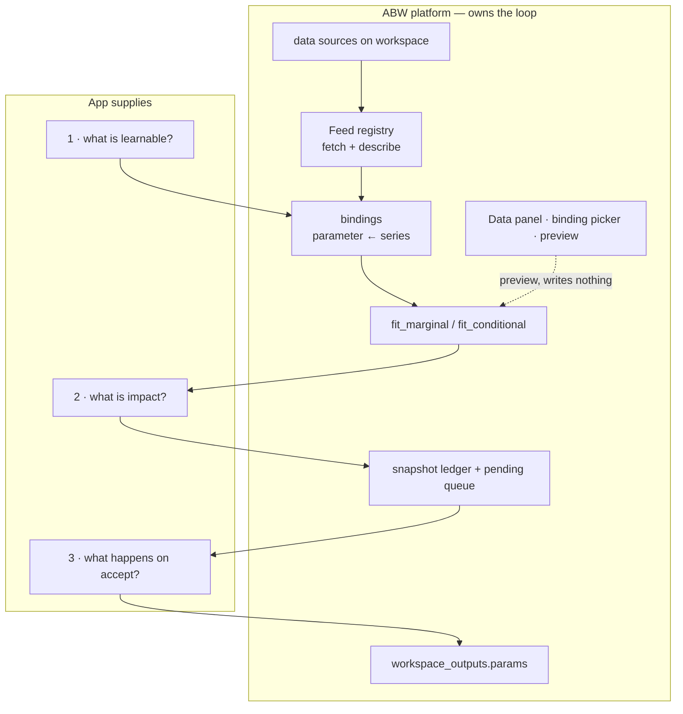

# BayesOps as a Platform Layer — Feeds, Bindings, and Loop 5.B

**Status:** Design — pre-implementation. The fitting engine, the ledger and the
gate are shipped; this spec lifts them off Fermi and gives them a data intake.
**Date:** 2026-08-23
**Author:** Ivan Labra
**Supersedes in part:** `14_BAYESOPS_SPEC.md` §5.6 (surfaces) and
`23_BAYESOPS_WORLD_CUP_DEMO.md` §3.4 (`feeds_from`), both of which assumed a
single Fermi-shaped consumer.
**Audience:** whoever wires the intake; the parallel loop-closing string; the
Loop 4.B work.

---

## 0. The one-sentence problem

BayesOps is a working engine bolted to exactly one intake pipe, with a UI
toggle that isn't connected to anything.

Everything expensive is built: the fitting math (`crates/posterior`,
`crates/posterior-reg`), the Monte Carlo impact gate, the accept/reject ledger
(`migrations/148_bayesops_refit_ledger.sql`), the executor substitution, the
provenance events. What is missing is cheap: **a second way to get numbers in,
and a button wired to it.**

This spec is about the intake, not the mathematics. No fitting code changes.

---

## 1. Verified starting state

Claims below were read out of the tree on 2026-08-23. They are the ground this
design stands on; if one is false the design is wrong.

### 1.1 What genuinely closes

The World Cup rail is wired end to end, not documented-but-forgotten:

```
upstream workspace resolves
  → post-commit hook (src/handlers/workspace/resolution.rs:353)
  → refit_workspace (src/handlers/workspace/refit.rs)
  → collect observations → fit_marginal → impact gate
  → auto-accept (write params.<driver>_fitted) | stage pending | hard-block
  → snapshot to bayesops_posterior_snapshots
  → executor substitutes the fit at next sim
```

`BAYESOPS_CONTRACT.md` records measured before/after: prior `triangular(3,5,7)`
→ mean 5.01, sd 0.80; fitted `Normal(4.8, 0.55)` → mean 4.81, sd 0.55.

### 1.2 What is already platform-level, by accident

These are the reason this refactor is small:

| Thing | Where | Fermi-specific? |
|---|---|---|
| Parameter store | `workspace_outputs` key `params` | **no** |
| Snapshot ledger + pending queue | migration 148, keyed on workspace | **no** |
| Observation graph traversal | `workspace_dependencies` + `workspace_outputs` | **no** |
| Fitting crates | `posterior`, `posterior-reg` | **no**, by spec 14 §9 |
| Weight-aware `n_eff` | `effective_sample_size(weights, n)` | **no** |
| `learnable_manifest` output | workspace output | **no** |
| Files API | `GET/PUT /api/workspaces/:id/files/*path` | **no** |

### 1.3 What is welded to Fermi

| Coupling | Location | Depth |
|---|---|---|
| Refuses non-forecast workspaces | `load_forecast_fpl` → `SELECT … FROM fermi_forecasts` → `RefitError::NoForecast` | **structural — hard stop at the door** |
| Declaration is FPL | `extract_learnable_drivers` walks the FPL AST | shallow |
| Impact = run the FPL twice | `compute_impact` → `fermi::Executor`, returns `ImpactSample {mean, p5, p95}` | shallow |
| Accept writes a forecast row | `fermi_forecast_updates` + spacetime trigger | shallow |

The first is the killer. A SimOps workspace with 8,000 sensor readings cannot
reach the engine at all.

### 1.4 What is missing entirely

- **Any source but one.** `refit.rs:737` is `if feeds_from.source == "upstream_resolutions"`.
  `source` reads like an enum in the FPL grammar and is a string with one
  accepted value. Any other value silently collects zero observations.
- **An undeclared side door.** `read_observations_array` (`refit.rs:731`) reads
  `workspace_outputs.observations.<driver>` **unconditionally, before
  `feeds_from` is consulted.** A driver that declares no source can still be
  fitted, invisibly.
- **A dry run.** No `preview`, no `dry_run` anywhere in `refit.rs` or
  `bayesops.rs`. Every fit persists.
- **A reachable UI path.** The console toggle writes `learnable: true`. A
  learnable driver with no `feeds_from` reports `prior_fallback` **forever**,
  silently. The World Cup templates work only because `feeds_from` was
  hand-written into the FPL.
- **Test coverage of the gate.** `tests/bayesops_refit.rs` lists four covered
  paths in its header; three test functions exist, and the impact gate's
  stage / hard-block / no-forecast branches are not among them. All are
  `#[ignore]`-d behind a live `DATABASE_URL`.

---

## 2. Design principle

> The user should **pick from** their data, not **describe** it.

Today a binding is authored as four concepts plus a templating language:

```fpl
feeds_from: {
    source: "upstream_resolutions",
    extractor: "binary_winner_id_match",
    config: { winner_field: "winner_team_id", match_value: "${workspace.entity_id}" }
}
```

Nobody will write that in a UI, and it requires knowing the shape of JSON you
have never seen. `feeds_from` stays as the serialised form — hand-writable for
power users — but becomes **generated** rather than authored.

---

## 3. The three-slot observation contract

Strip every current and wanted source and a historical dataset is a table with
three slots:

| Slot | Required | Purpose |
|---|---|---|
| `value` | **yes** | the observation that gets fitted |
| `at` | no | recency weighting (later), trajectory display |
| `entity` | no | the join — "only rows about *this* workspace's subject" |

`entity` is what `${workspace.entity_id}` was doing by hand. Promoting it to a
declared column retires the templating language.

Every intended source maps onto this:

| Source | `value` | `at` | `entity` |
|---|---|---|---|
| upstream resolutions | extractor output | resolution time | `winner_team_id`, … |
| CSV in workspace files | chosen column | date column if present | key column if present |
| `sosa_observations` | `result_value` | `phenomenon_time` | `feature_of_interest` |
| `fermi_market_observations` | price | tick time | market id |
| `domain_agent_ranking` | `avg_shapley` | `last_invoked_at` | `agent_name` within `domain` |

**If a thing can produce those three slots, it can inform any learnable
parameter on the platform.** That is satisfied by any spreadsheet — which is
the point.

---

## 4. Three traits

Invert control on exactly three things. The platform owns the loop; the App
supplies three answers.



### 4.1 `Feed` — where rows come from

> **Shipped 2026-08-23** (build step A1). `crates/posterior/src/feeds.rs` holds
> the trait and contract types; `src/feeds/mod.rs` holds the implementations.
> The signatures below are as built, with the deltas from the original draft
> noted inline.

The missing mirror of the existing `Extractor`. Note **two** methods: `fetch`
is obvious, `describe` is the one that turns wiring into picking.

**Where it lives, and why it is split.** The original draft put the trait in
`extractors.rs` "alongside `Extractor`". That is not possible: extractors are
pure (JSON in, scalar out) while feeds do I/O, and `crates/posterior` is
transport-neutral by spec 14 §9. The resolution is that the **contract** lives
in the crate (so it sits with `FittedDistribution` as shared vocabulary) and
**implementations** live in the root crate where the I/O deps already are. The
trait is therefore pool-free — an implementation holds whatever handle it needs
as its own state, constructed at boot by `fermi::feeds::build_registry`. The
only new dependency on `posterior` is `async-trait`, a language utility rather
than a transport.

```rust
pub trait Feed: Send + Sync {
    /// Registry key. Becomes the value of `feeds_from.source`.
    fn name(&self) -> &str;

    /// Human-readable, surfaced in the source picker.
    fn description(&self) -> &str;

    /// "What numeric series can I offer for this workspace?"
    /// Powers the column dropdown. This is the method that makes the
    /// binding a two-click gesture instead of a config file.
    async fn describe(&self, ctx: &WorkspaceContext) -> Result<Vec<Series>, FeedError>;

    /// "Give me the rows for this binding."
    async fn fetch(
        &self,
        ctx: &WorkspaceContext,
        config: &JsonValue,
    ) -> Result<Vec<ObservationRow>, FeedError>;
}

pub struct Series {
    pub key: String,            // machine key, goes into binding config
    pub label: String,          // shown in the dropdown
    pub unit: Option<String>,
    pub n_rows: usize,
    pub min: Option<f64>,
    pub max: Option<f64>,
    pub last_updated: Option<i64>,
    pub preview: Vec<f64>,      // first N, for a sparkline in the picker
}

pub struct ObservationRow {
    pub value: f64,
    pub at: Option<i64>,
    pub entity: Option<String>,
    pub weight: f64,            // 1.0 real, 0.0–0.3 synthetic
    pub source_ref: String,     // provenance, persisted to the snapshot
}
```

**`ObservationSet`** wraps `Vec<ObservationRow>` and is what collection returns,
so provenance survives all the way to the fit rather than being discarded at
the first `Vec<f64>`:

```rust
impl ObservationSet {
    pub fn values(&self) -> Vec<f64>;
    /// `None` when every row is real — which is exactly the argument the
    /// pre-refactor caller passed, so an unweighted set fits bit-identically.
    pub fn weights(&self) -> Option<Vec<f64>>;
    pub fn weight_sum(&self) -> f64;         // the honest denominator
    pub fn provenance_summary(&self) -> String;
}
```

**A feed may legitimately not be pickable.** `describe` returns a list, and
returning an empty one is a valid answer. `upstream_resolutions` is the worked
case: a resolution outcome is arbitrary JSON whose useful fields depend on which
extractor is applied, so there is no fixed column list to offer. It reports the
volume of evidence available as a single pseudo-series and sends the picker to
the extractor affordance, rather than inventing columns. `workspace_output`
*can* enumerate itself, and is the shape reference for the CSV feed.

`WorkspaceContext` gains one field. It previously carried `entity_id` +
`metadata`; feeds also need `workspace_id`, because "which rows" is a question
*about a workspace*. It is passed in context rather than config deliberately: a
feed that took its workspace from binding config could be pointed at another
workspace's data. Extractors ignore the field.

**Relationship to `Extractor`.** Feeds that return already-scalar rows need no
extractor. Feeds returning shaped JSON (upstream resolutions) run the existing
extractor registry over each row. The pipeline is:

```
Feed::fetch → [Extractor, if the feed's rows are shaped] → Vec<f64> + weights → fit_marginal
```

The four existing extractors (`binary_winner_id_match`, `binary_field_value`,
`scalar_field_value`, `scalar_difference`) are unchanged and become an
**advanced** affordance, not the default path.

Extractor application happens **inside** the feed that needs it, rather than in
the collection pipeline. This keeps `ObservationRow.value` a plain `f64` — every
row is already scalar by the time it exists — instead of forcing every consumer
to match on a scalar-or-shaped enum for the benefit of one feed.

### 4.2 `ImpactGate` — what a fit is worth

```rust
pub trait ImpactGate: Send + Sync {
    /// Re-evaluate the workspace's model under current vs proposed params.
    /// `None` means "this App has no runnable model" — always stage.
    async fn assess(
        &self,
        ctx: &WorkspaceContext,
        current: &JsonValue,
        proposed: &JsonValue,
    ) -> Option<ImpactAssessment>;
}

pub struct ImpactAssessment {
    pub before: f64,
    pub after: f64,
    pub delta: f64,
    pub unit: String,       // "pp", "kg", "USD" — for display, never for logic
    pub tails: Option<(f64, f64, f64, f64)>, // p5/p95 before, p5/p95 after
}
```

- **Fermi** supplies the existing `compute_impact` — run the FPL twice, diff the
  rate. Its `ImpactSample {mean, p5, p95}` maps straight onto this.
- **SimOps** supplies a cascade re-run (yield, NPV).
- **Default (no gate)** → always stage. An App can adopt BayesOps with zero
  impact code and still get the whole accept/reject UX; it simply never
  auto-accepts.

> The default is the common case. Fermi's rate-delta gate is the special one.
> Spec 23 wrote the special case first, which is why it looks like the rule.

### 4.3 `AcceptHook` — what else happens on accept

```rust
pub trait AcceptHook: Send + Sync {
    async fn on_accept(
        &self,
        ctx: &WorkspaceContext,
        binding: &Binding,
        fitted: &FittedDistribution,
    ) -> Result<(), HookError>;
}
```

Fermi writes `fermi_forecast_updates` so the spacetime view lights up. Default:
nothing beyond the params write and the activity event, both of which the
platform already does.

---

## 5. Manifest as single source of truth

`learnable_manifest` — **already a generic workspace output** — becomes
authoritative for what is learnable. The FPL parse is demoted from source of
truth to **one producer of that manifest**, run on save.

This gives a degradation ladder, which is what makes the layer genuinely
App-neutral:

| What the workspace has | What BayesOps can do |
|---|---|
| manifest only | fit from the bound series, stage, write params. No prior, no family constraint, **no impact gate → always stage** |
| + typed declaration (family, unit, range) | family constraint, unit check, clamp to valid range, cold-start prior |
| + an executable model (FPL, cascade) | run it twice → Δ → **auto-accept becomes possible** |

> **The manifest says what is learnable; the declaration says what it means; the
> model says what it is worth.**

A bare workspace with a CSV gets tier 1 and it genuinely works. Fermi gets
tier 3. FPL keeps working with no annotations at all, and gets better with them
— it is additive, never required.

### 5.1 The executor currently gates on the FPL flag — and this is load-bearing

**Verified 2026-08-23.** `src/executor.rs:331`:

```rust
let (resolved_dist, source) = if driver.learnable {
    if let Some(fd) = self.fitted_distribution_for(&driver.name) { … }
    else { (driver.distribution.clone(), LearnableSource::PriorFallback) }
} else {
    (driver.distribution.clone(), LearnableSource::Static)   // ← never looks for a fit
};
```

The `else` branch never calls `fitted_distribution_for`. Binary drivers do the
same at `:365`. **A `params.<name>_fitted` in scope is ignored entirely unless
the FPL annotates that driver `learnable: true`.**

So manifest-as-SoT does not work today. Worse, the failure is not silent — it is
**falsely successful**, and the ledger records the lie:

```
manifest binds yield_kg; FPL has no `learnable: true`
  → BayesOps fits
  → impact gate runs the FPL twice (refit.rs::run_with_params)
  → BOTH runs ignore the fit  →  delta_pp = 0.0
  → classify_decision: quality not Insufficient, 0.0 < threshold
  → AUTO-ACCEPT
  → write_fitted_params + bayesops_fit_accepted + fermi_forecast_updates row
  → every future sim ignores it
```

A perfectly silent no-op that logs as a success, with an audit trail asserting a
parameter change that never reached a simulation.

And it cannot be detected from the sim output either: `learnable_driver_log`
is pushed under the same `if driver.learnable` guard (`:344`), so the
`learnable_drivers` output — the documented read side of the contract — would
not report the parameter as `fitted`, nor as `prior_fallback`, but omit it
entirely.

**Fix.** `Executor` already has the right injection shape (`set_param`,
`set_params`, `set_json_params`). Add one more:

```rust
pub fn set_learnable_params(&mut self, names: HashSet<String>);
```

```rust
let is_learnable = driver.learnable || self.learnable_params.contains(&driver.name);
```

An empty set reproduces today's behaviour exactly, so the change is
backward-compatible, and the FPL flag survives as an *enricher* rather than a
gate — which is the degradation ladder above, enforced in code.

*Rejected alternative:* substitute whenever `params.<name>_fitted` exists.
That makes substitution implicit and unauditable — any params key ending
`_fitted` would silently override a driver — and it destroys the
`PriorFallback` vs `Static` distinction the UI badges depend on.

**Callers that must inject the set:** `refit.rs::run_with_params` (the impact
gate — critically, or the gate measures zero and auto-accepts),
`scripts/initialize_workspace.rs`, and the sim handler.

`LearnableSource` also needs a third state for *bound in the manifest but not
declared in FPL*, so that a fit can never be invisible in the run log.

`RefitError::NoForecast` becomes `NoLearnables` — a workspace with no manifest,
rather than a workspace that isn't a forecast.

---

## 6. Storage

Two tables. Nothing else changes.

```sql
CREATE TABLE workspace_data_sources (
    source_id     UUID PRIMARY KEY DEFAULT gen_random_uuid(),
    workspace_id  UUID NOT NULL REFERENCES workspaces(id) ON DELETE CASCADE,
    kind          TEXT NOT NULL,   -- Feed registry key
    label         TEXT NOT NULL,   -- user-facing
    config        JSONB NOT NULL DEFAULT '{}',
    created_by    TEXT,
    created_at    TIMESTAMPTZ NOT NULL DEFAULT now()
);

CREATE TABLE workspace_bindings (
    binding_id     UUID PRIMARY KEY DEFAULT gen_random_uuid(),
    workspace_id   UUID NOT NULL REFERENCES workspaces(id) ON DELETE CASCADE,
    parameter_name TEXT NOT NULL,          -- key in learnable_manifest
    source_id      UUID NOT NULL REFERENCES workspace_data_sources(source_id) ON DELETE CASCADE,
    series_key     TEXT NOT NULL,          -- Series.key from describe()
    extractor      TEXT,                   -- NULL when the feed is already scalar
    config         JSONB NOT NULL DEFAULT '{}',
    auto_accept_threshold NUMERIC,         -- NULL = never auto-accept
    created_at     TIMESTAMPTZ NOT NULL DEFAULT now(),
    UNIQUE (workspace_id, parameter_name)
);
```

**Datasets need no table.** A CSV is a workspace file — `GET/PUT
/api/workspaces/:id/files/*path` already exists, so versioning, auth and
provenance come free. `describe()` parses the header and keeps numeric-parseable
columns.

```fpl
feeds_from: {
    source: "workspace_file",
    config: { path: "data/ambu_runs.csv", value_column: "yield_kg" }
}
```

The undeclared side door at `refit.rs:731` becomes a declared feed
(`workspace_output`) and stops firing unconditionally.

---

## 7. The preview endpoint

`POST /api/workspaces/:id/bayesops/preview` — resolve feed, run extractor, fit,
run the impact gate, return everything, **write nothing.** Same code path as
`refit_workspace` with persistence lifted out.

```json
{
  "parameter": "yield_kg",
  "observations": { "n": 47, "n_eff": 31.0, "quality": "sufficient",
                    "values_preview": [4.2, 5.1, 3.8],
                    "provenance": "47 real from ambu_runs.csv#yield_kg" },
  "fitted": { "family": "normal", "mean": 4.81, "std_dev": 0.55, "...": null },
  "prior":  { "family": "triangular", "p5": 3.0, "p50": 5.0, "p95": 7.0 },
  "impact": { "before": 0.342, "after": 0.318, "delta": -0.024, "unit": "pp" }
}
```

This is not a nice-to-have. It is the **entire explanation of BayesOps to a user
who does not want a Bayes lecture** — change the column, watch the shape and the
rate move. It also makes the binding UI live at zero cost, and turns the
accept/reject gate into a decision rather than a notification.

---

## 8. UI

Two surfaces, both **platform-level**, embedded by Fermi Console, kask SimOps,
and the bare workspace sidebar alike.

**Workspace level — attach sources once:**

```
DATA                                              [+ Attach ▾]
  ambu_runs.csv          412 rows · 6 series · 2d ago    → 2 parameters
  Ambu sensor session    8,104 rows · 11 series · live   → 1 parameter
  upstream resolutions   17 resolved                     → 3 parameters
```

**Parameter level — the toggle becomes the binding:**

```
dynamic_performance                          triangular(0.8, 1.0, 1.3)
 ◉ learnable   fed by [ ambu_runs.csv ▾ ] · [ yield_kg ▾ ]      47 obs

   prior   ░░▒▒▓▓▓▒▒░░              wide, elicited
   fitted    ░▒▓█▓▒░                n_eff 31 · sufficient
   rate    34.2% → 31.8%  (−2.4pp)              [Accept] [Dismiss]
```

Three failures this fixes at once:

1. **The dead toggle dies.** Learnable and bound become one gesture. No
   parameter can promise learning and silently never do it.
2. **The empty state teaches.** No sources attached → toggle disabled, reading
   `no data attached · [Attach ▾]`. The user learns the requirement by being
   told what is missing.
3. **The preview is the pedagogy.** Nobody has to be told what a posterior is.

---

## 9. Consumer 1 — a learnable driver bound to a series

The existing case, generalised. Sources in priority order: `workspace_file`
(CSV) first, because it is the least code and serves every user who has history
but no workspace graph; then `sosa`, which closes the SimOps sensor loop:

```fpl
feeds_from: {
    source: "sosa",
    extractor: "scalar_field_value",
    config: {
        observable_property: "dissolved_co2_g_per_l",
        feature_of_interest: "${workspace.entity_id}",
        path: "result_value"
    }
}
```

One `Feed` impl, roughly 40 lines of SQL against `sosa_observations`
(migration 052 — `observable_property`, `feature_of_interest`, `result_value`,
`phenomenon_time` are all present). Cascade and dynamics models are untouched.

**Synthetic augmentation needs no new types.** `WeightedSample.weight` exists,
`fit_marginal` takes weights, and `effective_sample_size` is weight-based — so
synthetic rows at weight 0.2 correctly *fail* to manufacture confidence. That
property is load-bearing: it is what makes "simulation informs the prior"
defensible rather than circular.

---

## 10. Consumer 2 — Loop 4.B, routing preference bound to measured contribution

The second consumer exists to prove the abstraction is domain-neutral rather
than a forecast feature with the serial numbers filed off. It is **not** a
forecast driver, has **no** executable model, and therefore exercises the
no-gate default path.

### 10.1 Why routing needs its own loop

Recorded in `FEEDBACK_LOOPS.md`: `domain_specialist` is a `match` over four
domains (`crates/fermi-console/src/routing.rs:117`) that omitted `climate`, so
every weather driver fell through to `macro_forecaster` — London 32 °C returned
0.3 % against a 13.3 % ensemble truth, and the divergence panel presented the
gap as a trading signal.

`macro_forecaster` is not a bad agent. It was asked a question nobody should
have asked it. Trace that through both halves of Loop 4:

| | 4.A alone (today) | 4.B first |
|---|---|---|
| Signal | global `mean_credit` goes negative | per-domain: `climate` −0.11, `geopolitics` +0.06 |
| Verdict | `drop_negative` → propose eviction | wrong *route*, not wrong *member* |
| Action | owner evicts a good agent | advise re-routing climate; nobody evicted |
| Reversible | no | yes |

**`derive_proposals` (`src/handlers/composition_evolution.rs:99`) filters on
global `mean_credit` with no domain dimension.** A specialist mis-routed for a
month is arithmetically indistinguishable from a weak agent. This is the
concrete reason 4.B must precede trusting 4.A.

### 10.2 Brier is the wrong metric and the view already knows it

You cannot Brier a member — Brier scores a *forecast*; a member contributed some
share of it. Migration 193 says so: `avg_shapley` is "signed, so unconfounded by
forecast difficulty in the way a raw Brier average is."

If `equity_analyst` gets well-priced equities and `macro_forecaster` gets
genuinely uncertain geopolitics, `equity_analyst` wins on raw Brier every time
while contributing less. **Ranking members by Brier fires the specialist for
being handed the hard questions.** `domain_agent_ranking` carries both columns,
which is correct: Brier is worth showing a human and worth never deciding on.

### 10.3 The binding

`domain_agent_ranking` (migration 193) is already a Feed in the §3 shape:

| Slot | Column |
|---|---|
| `value` | `avg_shapley` |
| `at` | `last_invoked_at` |
| `entity` | `agent_name`, within `domain` |

Plus `scored_runs`, `avg_brier`, `help_rate`, and `deliberate_share` — the last
being a genuine weight, since by the view's own comment a high `avg_shapley`
earned on mostly-*fallback* routes is stronger evidence than the same score on
hand-picked work.

**Nothing in Rust reads any of migration 193's five views.** Confirmed by
search. The evidence is computed and unread.

### 10.4 Advisory, and why that makes a low floor safe

4.B **advises; it does not act.** `domain_specialist()` keeps returning the live
route. Automation, if ever wanted, is a later and separate decision.

A low floor is dangerous on an automatic loop and safe on an advisory one; an
advisory loop with a high floor tells you nothing for months. The combination is
deliberate: **you can afford to watch it be wrong, cheaply, from very few
observations.**

This also relaxes a prerequisite. `route_outcomes` joins episodes to claims
heuristically on `(agent_id, driver)` within −2/+10 min; it can *miss* but
"cannot mis-attribute across agents or drivers." It under-counts, it does not
fabricate. Under advise-only a missed row makes a recommendation weaker, never
wrong-signed — so **stamping `episode_id` on the claim row moves off the
critical path** and becomes a recorded known-undercount flag on each
recommendation.

### 10.5 The floor answers itself

The open question — "when is there enough data to be useful?" — is exactly "when
is the posterior tight enough to act on?" Rather than guessing an `N`, fit a
posterior over per-`(domain, agent)` contribution and let each recommendation
carry its own interval. `DataQuality::classify` already labels it:

| n_eff | label |
|---|---|
| ≥ 20 | `Sufficient` |
| 5 – 20 | `Sparse` |
| < 5 | `Insufficient` |

Those thresholds are already in `crates/posterior`. "Reasonable but low floor"
therefore means: **show everything, including `Insufficient`, clearly badged.**
The later question becomes *at what `DataQuality` do we start acting* — far
better posed than picking a number today.

### 10.6 Roadmap

| Step | Work | Note |
|---|---|---|
| **1** | Read `domain_agent_ranking`; emit a per-domain recommendation | Behaviour unchanged; `domain_specialist()` untouched |
| **2** | **Persist each recommendation** with evidence snapshot, `DataQuality` badge, undercount flag | The step that makes phase 1 worth doing |
| **3** | Surface it: *"on `climate`, `weather_oracle` +0.08 (n=6, Sparse) vs `macro_forecaster` −0.11 (n=14, Sparse) — consider re-routing"* | Always with the interval, never a bare number |
| **4** | Join recommendations to realised routes and outcomes → `advice_scorecard` | The dataset the floor study needs |
| **5** | *(separate effort)* choose an acting threshold from that data | Possibly automation. Possibly never |

> **Step 2 is the one that is easy to skip and fatal to skip.** An advisory loop
> that does not record its advice cannot be evaluated, and step 5 would arrive
> with nothing to study — leaving the floor to be guessed twice.

Deliberately **not** on this list: adding `"climate" => weather_oracle` to the
`match`. The entire argument for 4.B is that a routing fix should not require a
Rust release; special-casing it would delete the worked example.

---

## 11. The `calibration.signal` bridge

Agent cards and compositions **already declare their ground truth**, and nothing
consumes it:

```
Fermi   → calibration.signal: "brier_forecast"
SimOps  → calibration.signal: "sosa_observation"
```

That is a declaration of *what data tells this thing it was wrong* — a feed
binding written in a different vocabulary, sitting in the manifest doing
nothing. It is one of the four properties that, per Xaman Ek's card, turn a
general MoE into a domain-constrained one, and the only one of the four with no
engine behind it.

**Loop 5.B is the engine that consumes `calibration.signal`.** A composition
declaring `sosa_observation` should get a `sosa` feed pre-attached to its
workspaces; one declaring `brier_forecast` should get the resolution feed. This
reframes the work from "generalising a Fermi feature" to "implementing a
contract the platform already asks every App to sign."

---

## 12. Invariants

Three properties to hold as this grows. Each is cheap now and expensive later.

1. **Confidence is weight sum, never row count.** Already true in
   `crates/posterior`. No feed may bypass it.
2. **Every observation carries provenance to the snapshot.**
   `collect_observations` currently returns a bare `Vec<f64>` and discards where
   each number came from, so a fit cannot be audited after the fact. Widening to
   `ObservationRow` (§4.1) is the fix, and it must happen with the refactor
   rather than after it.
3. **An unresolvable feed is an error, not a silent fallback.** Unknown sources
   currently yield zero observations with no complaint. It must surface as
   `DriverDecision::Skipped { reason }` — the variant already exists.

---

## 13. Build order

**A — unweld** *(behaviour-neutral for Fermi)*
1. ~~`Feed` trait + registry; port `upstream_resolutions` and the literal-array
   side door into it.~~ **Done 2026-08-23.** `crates/posterior/src/feeds.rs`
   (trait, `Series`, `ObservationRow`, `ObservationSet`, `FeedRegistry`);
   `src/feeds/mod.rs` (`UpstreamResolutionsFeed`, `WorkspaceOutputFeed`);
   `AppState.feed_registry`; `refit_workspace` now takes `&FeedRegistry` and
   the extractor registry moved inside the feed that needs it. Two invariants
   from §12 landed with it: provenance survives collection
   (`ObservationSet.provenance_summary`), and an unregistered source is now
   `RefitError::UnknownFeed` naming the known feeds rather than silence.
2. `ImpactGate` + `AcceptHook` traits; move `compute_impact` and the
   `fermi_forecast_updates` write behind them as the Fermi impls.
3. Declaration reads `learnable_manifest`; FPL parse becomes a manifest
   producer. `NoForecast` → `NoLearnables`.
   **Ships together with `Executor::set_learnable_params` and the injection at
   every call site (§5.1).** These are one change, not two.

> **A3 is atomic — do not split it.** Manifest-as-SoT without the executor fix
> is strictly worse than the status quo: the gate measures a zero delta,
> auto-accepts, and writes an accept record for a substitution that never
> happens (§5.1). The half-done state manufactures false provenance, and
> provenance is the thing this system sells. Land both halves or neither.

**B — the platform surface**
4. `POST /api/workspaces/:id/bayesops/preview` (writes nothing).
5. `workspace_data_sources` + `workspace_bindings`; CRUD under
   `/api/workspaces/:id/data-sources`.
6. Data panel + binding picker component.

**C — intakes**
7. `workspace_file` CSV — universal, uses the existing files API.
8. `sosa` — closes SimOps.
9. `domain_agent_ranking` — Loop 4.B steps 1–4 (§10.6).

**D — reach**
10. MCP tools: `attach_data_source`, `list_series`, `propose_binding`,
    `preview_fit` — so any agent in the bestiary can wire calibration for a
    workspace it is working in.
11. App manifest `workspace_template.data_sources` for auto-attach; wire
    `calibration.signal` (§11).

Step A is the unlock and is a refactor with no new behaviour: Fermi keeps
working identically, but the door opens.

---

## 14. Explicitly out of scope

- **Recency weighting.** Capture `at`, weight everything at 1.0, expose a
  half-life later. Whether a 2019 run counts as much as last week's is a real
  modelling choice and should not be smuggled in as a default.
- **Conditional posteriors in the UI.** `fit_conditional` stays MCP/HTTP-only;
  the picker binds marginals. `posterior-reg` remains cache-only until Phase 5.
- **Discrete learnable drivers.** Still unsupported, per
  `BAYESOPS_CONTRACT.md`.
- **Automating Loop 4.B.** §10.4.
- **Cross-workspace binding fan-out.** The 48-team-prior problem in
  `BAYESOPS_CONTRACT.md` "What's NOT in the contract" is unchanged.

---

## 15. Open questions

1. **Non-scalar columns in the picker.** Proposal: `describe()` surfaces only
   numeric-parseable series, and the four shaped extractors live behind an
   *advanced* reveal. Keeps the common path at zero concepts.
2. **Auto-accept default for a hand-bound parameter.** Proposal: **always stage,
   never auto-accept.** The first fit should be a decision the user makes,
   because that is the moment they learn what the feature does.
3. **Backfill.** Should attaching a source retro-fit parameters bound after the
   fact, or only fit forward? Fitting forward is safer and less surprising;
   backfill is what users will expect.

---

## 16. Files this touches

- `crates/posterior/src/feeds.rs` — `Feed` trait + contract types *(added)*
- `crates/posterior/src/extractors.rs` — `WorkspaceContext.workspace_id` *(added)*
- `src/feeds/mod.rs` — platform feed implementations *(added)*
- `src/handlers/workspace/refit.rs` — the unweld; `collect_observations`
  returns `ObservationSet` *(done for A1)*
- `src/handlers/bayesops.rs` — preview endpoint, data-source CRUD
- `src/api_server.rs` — Feed registry in `AppState` beside `ExtractorRegistry`
- `migrations/2xx_bayesops_bindings.sql` — the two tables
- `src/executor.rs` — `set_learnable_params`; `is_learnable` at `:331`/`:365`;
  third `LearnableSource` state (§5.1)
- `scripts/initialize_workspace.rs` — inject the learnable set
- `crates/fermi-console/src/drivers.rs` — toggle → binding picker
- `crates/fermi-console/src/routing.rs` — 4.B reads the view (advisory only)
- `docs/fermi/BAYESOPS_CONTRACT.md` — manifest becomes SoT; needs revision
- `docs/architecture/FEEDBACK_LOOPS.md` §4 — 5.B's feed list stops saying
  "workspace resolutions only"
