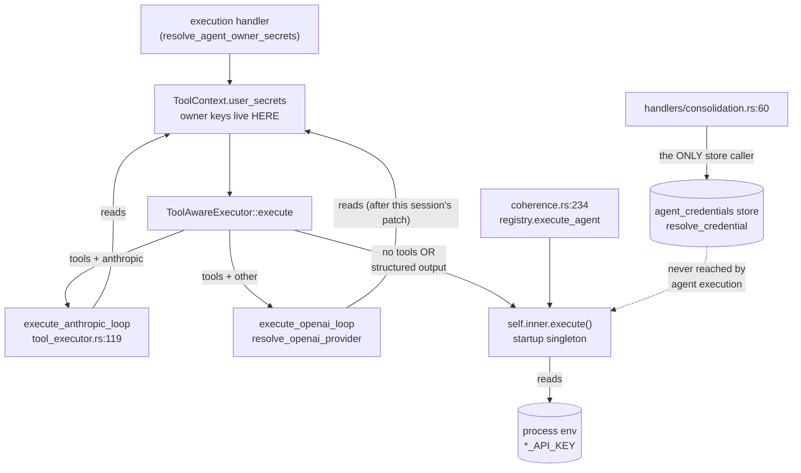

# 28 — Unified credential path: every agent, every provider, every execution path

**Status:** proposed · implements **P5** of `AGENT_CREDENTIAL_MODEL_ROLLOUT.md`
§7 ("retire the executor's Anthropic-env fallback")
**Depends on:** `docs/specs/AGENT_CREDENTIAL_MODEL.md` (accepted 2026-08-03) —
this spec does not re-litigate that model, it finishes applying it
**Severity:** high. Two distinct failure modes, one of which is a **silent
cross-tenant billing leak**, not an error.

---

## 1. The invariant being violated

`AGENT_CREDENTIAL_MODEL.md` §5 states the resolution algorithm and then, in
bold: *"**No env branch for agent keys.** Env holds only (a) the store's master
encryption key and (b) an optional break-glass bootstrap."*

P0–P3 shipped `resolve_credential` (`src/api_server.rs:4716`) — a correct,
provider-parameterised, store-backed single path that deliberately never reads
env. **It has exactly one production caller:** `handlers/consolidation.rs:60`.

The agent execution path never adopted it. Instead it uses
`resolve_agent_owner_secrets` → `ToolContext.user_secrets`, and **only one of
the four executor code paths consults even that.**

The operational statement of the violated invariant, in the form the platform
owner articulated it:

> An agent's funding must not depend on the *shape of its output*.

Today it does.

---

## 2. Blast radius (measured, not estimated)

`ToolAwareExecutor::execute` (`src/agent_backend/tool_executor.rs:790`) has two
branches that `return self.inner.execute(...)`, abandoning the tool loop:

| Branch | Line | Condition |
|---|---|---|
| No tools registered | 798–800 | `to_claude_tools().is_empty()` |
| Structured-output contract | 821–823 | `prompt_demands_structured_output(prompt)` or `metadata.tags` contains `meta-agent` |

`self.inner` is `state.registry.executor_arc()` — the **process-wide singleton
built at startup from env** (`api_server.rs:1616`). It holds:

- `LLMExecutor { api_key }` — one Anthropic key captured at boot
  (`llm_executor.rs:32-39`)
- `MultiModelExecutor { providers: HashMap<String, ProviderConfig> }` — one key
  per provider captured at boot (`multi_model_executor.rs:42-155`)

There is **no API** on either type to supply a per-execution credential. Owner
keys are not merely ignored on this path; they are structurally unreachable.

Scanning all 96 curated cards for the bypass predicate:

```
curated agent cards scanned : 96
BYPASS the tool loop        : 17  (17%)

marker frequency:                     provider split among bypassing agents:
    8  'return a valid JSON'            16  anthropic
    4  'ONLY'                            1  ollama
    4  'Return a valid JSON'
    4  'no prose outside'
    1  'raw JSON'
```

Affected: `supply_chain_oracle`, `sidestream_miner`, `regulatory_scanner`,
`adc_pk_oracle`, `product_scout`, `energy_advisor`, `marketing_composer`,
`simops_narrator`, `simops_advisor`, `simops_dynamics_runner`,
`sensor_advisor`, `flight_coordinator`, `naturalist`, `fermi`, … — i.e. exactly
the structured-contract agents the platform's value proposition rests on.

### 2.1 Two failure modes, and the dangerous one is the quiet one

| Card provider | Bypass path behaviour | Class |
|---|---|---|
| `anthropic` (16/17) | `MultiModelExecutor` → `self.anthropic` → **platform `ANTHROPIC_API_KEY`**. Runs successfully. Owner's key never consulted. | **Silent cross-tenant billing leak.** Owner's usage bills the platform account. |
| non-anthropic, platform has env key | Runs on the **platform's** key for that provider. | Same leak. |
| non-anthropic, no platform env key | `"Provider 'deepseek' not configured. Set DEEPSEEK_API_KEY env var."` | Loud, but **misdirects** — instructs the *agent owner* to set a *server env var* they have no access to. |

The `v0.9.2` hard-fail doctrine (documented at length in
`tool_executor.rs:101-117` and `api_server.rs:4691-4697`) was written
specifically to eliminate the "owner-owned agent silently runs on the shared
platform account" outage class. **The bypass path re-opens it for 17% of
agents**, and the doctrine's own comment block sits 700 lines away from the
branch that defeats it.

### 2.2 A third class: paths with no `ToolContext` at all

`ToolContext` is a **tool** abstraction. Execution paths that don't need tools
don't build one — and therefore carry no credentials by construction:

- `handlers/workspace/coherence.rs:234` → `state.registry.execute_agent(...)`
  → startup singleton. Always platform-funded, silently.
- `agent_backend/registry.rs:247` → same.

So `user_secrets` was never a credential *path*; it was a payload smuggled
through a tool struct, honoured by one of four executor branches.

---

## 3. Root cause

**Credentials are bound at executor construction time (process start, from
env) instead of at execution time (per agent, from the store).**

Everything else follows. A startup-built singleton *cannot* be per-agent
funded, so any path reaching it directly is unfunded-by-construction. The
`ToolContext.user_secrets` workaround papered over the single busiest branch
(Anthropic + tools) and left the other three.



---

## 4. The fix: bind credentials to the execution, not the executor

`ExecutionContext` is the one struct **every** execution path already
constructs and **every** executor already receives. That is where resolved
credentials belong.

### 4.1 New type

```rust
// src/agent_backend/credentials.rs (new)

/// Provider credentials resolved for ONE execution, from the
/// agent_credentials store via resolve_credential. Never from env.
#[derive(Clone, Debug)]
pub struct ResolvedCredentials {
    /// Principal whose budget bears the raw LLM cost. Recorded on the
    /// episode so funding is observable per execution, per the model's
    /// "funding principal" axis (AGENT_CREDENTIAL_MODEL.md §2).
    funding_principal: Option<String>,
    /// provider name -> plaintext key. Pre-resolved for the card's
    /// declared provider AND every model_ladder rung's provider, so
    /// ladder degradation (P4) needs no async work mid-execution.
    keys: HashMap<String, String>,
    /// Where each key came from, for honest error messages + telemetry.
    source: CredentialSource,
    /// Agent handle, for naming the agent in unfunded errors.
    agent_id: String,
}

#[derive(Clone, Copy, Debug, PartialEq)]
pub enum CredentialSource {
    /// (principal, provider, scope=agent_name) — per-agent funding.
    AgentScoped,
    /// (principal, provider, scope='*') — principal default.
    PrincipalDefault,
    /// Legacy user_secrets `<PROVIDER>_API_KEY`. Remove after P5.4.
    LegacyUserSecrets,
    /// Nothing resolved. Any key_for() call fails loudly.
    Unfunded,
}

impl ResolvedCredentials {
    /// The ONLY way an executor obtains a key.
    pub fn key_for(&self, provider: &str) -> Result<&str, ExecutionError> {
        // Providers that legitimately need no credential.
        if provider == "ollama" { return Ok(""); }
        self.keys.get(provider).map(String::as_str).ok_or_else(|| {
            ExecutionError::Unfunded {
                agent_id: self.agent_id.clone(),
                provider: provider.to_string(),
                // Owner-facing remediation, not operator-facing.
                remediation: format!(
                    "Set {}_API_KEY at {}/profile",
                    provider.to_uppercase(), abw_base_url()
                ),
            }
        })
    }

    /// Explicitly unfunded. Used by tests and by dev paths that run on
    /// MockExecutor. Fails loudly if anything tries to call an LLM.
    pub fn unfunded(agent_id: impl Into<String>) -> Self { /* … */ }
}
```

`ExecutionError` gains a structured `Unfunded` variant so the funding failure
is machine-distinguishable from a provider 5xx — today both are
`ExecutionFailed(String)`, which is why the workspace UI could only echo
`"Execution failed: Execution failed: Execution failed: DEEPSEEK_API_KEY not
set"`.

### 4.2 `ExecutionContext` gains one field

```rust
pub struct ExecutionContext {
    pub program: Program,
    pub agent_card: AgentCard,
    pub creature_id: Option<Uuid>,
    pub cognition_tier: Option<CognitionTier>,
    /// Credentials for this execution. `Unfunded` is a valid, loud value.
    pub credentials: Arc<ResolvedCredentials>,
}
```

### 4.3 One resolver, called once per execution

```rust
// src/api_server.rs — beside resolve_credential
pub(crate) async fn build_execution_credentials(
    state: &AppState,
    agent: &Agent,
    card: &AgentCard,
) -> Arc<ResolvedCredentials>
```

Collects the distinct provider set = `card.capabilities.provider` ∪
`{rung.provider for rung in card.capabilities.model_ladder}`, calls the
existing `resolve_credential(state, agent, provider)` for each, and records the
funding principal (`abw-system` for system-tier, else `agent.owner_id`).

**System-tier agents are funded the same way** — from `abw-system`'s store
entries, which the boot bootstrap already seeds from env (rollout guide §1).
There is no second code path for platform agents; that is the point of the
`abw-system` principal existing as a real `users` row.

### 4.4 Executors become credential-stateless

| Site | Now | After |
|---|---|---|
| `LLMExecutor.api_key` field | boot env | **deleted**; `execute` uses `ctx.credentials.key_for("anthropic")?` |
| `MultiModelExecutor.providers` keys | boot env | **deleted**; keeps only `base_url` per provider (operator config, legitimately env) |
| `tool_executor.rs:119-144` anthropic loop | `ToolContext.user_secrets` | `ctx.credentials.key_for("anthropic")?` |
| `resolve_openai_provider` | env (patched this session to read `user_secrets`) | split: `resolve_provider_base_url(provider)` (env) + `ctx.credentials.key_for(provider)?` |

Because credentials now arrive with the *call*, the startup singleton is
correct to share and no executor needs rebuilding per request.

`ToolContext.user_secrets` **stays** — but strictly for third-party MCP/tool
credentials (`mcp_client.rs`), which are a genuinely different concern (they
authenticate the agent to an external service, not to an LLM provider). This
spec removes only its LLM-provider role. That separation should be enforced by
naming: rename to `tool_secrets`.

---

## 5. Phasing

Ordered so nothing regresses mid-flight; each phase is independently
deployable.

- **P5.1 — Substrate, no behaviour change.** Add `ResolvedCredentials`,
  `ExecutionError::Unfunded`, `ExecutionContext.credentials` (defaulting to
  `Unfunded`), and `build_execution_credentials`. Mechanically update the **21
  `ExecutionContext { … }` literals across 18 files** (`api/handlers.rs`,
  `agent_backend/executor.rs`, `agent_backend/tools_legacy.rs`,
  `bin/agent-mcp-server.rs`, `bin/legacy/agent-web-ui.rs`,
  `handlers/{rabble_workspace,xaman,mcp,consolidation,execution,execution_stream,
  observations,swarm_telemetry,eval}.rs`, `handlers/creatures/mod.rs`,
  `handlers/workspace/{messages,coherence}.rs`,
  `crates/fermi-console/src/cockpit.rs`); introduce
  `ExecutionContext::for_agent(program, card)` so future sites can't forget the
  field. Executors still prefer their old path, falling back to `credentials`
  only if the old one yields nothing. **Ship and verify no diff in behaviour.**
- **P5.2 — Populate.** The 5 real execution entry points
  (`execution.rs`, `execution_stream.rs`, `workspace/messages.rs`, `mcp.rs`,
  `rabble_workspace.rs`, plus `eval.rs`, `creatures/mod.rs`) call
  `build_execution_credentials`. `coherence.rs:234` and any other direct
  `registry.execute_agent` caller must now build a context with real
  credentials — this is where the third bypass class is closed.
- **P5.3 — Invert.** Executors read `credentials` **only**. Delete
  `LLMExecutor.api_key`, the provider-key half of `MultiModelExecutor`, and
  every `std::env::var("*_API_KEY")` in executor code. Rename
  `ToolContext.user_secrets` → `tool_secrets`.
- **P5.4 — Retire legacy.** Drop `CredentialSource::LegacyUserSecrets` and the
  `user_secrets` fallback inside `resolve_credential` once
  `SELECT count(*) FROM agent_credentials` covers all funded owners. Delete
  `resolve_agent_owner_secrets`.
- **P5.5 — Telemetry.** Emit `funding_resolved { agent, provider, source,
  funding_principal }` per execution; surface `source` on the agent Manage page
  so an owner can see *which* key powered a run.

---

## 6. Acceptance criteria

These are the tests that must exist; #1 is the one the whole spec is for.

1. **Output shape must not affect funding.** Two agents, identical owner and
   identical `capabilities.provider`, differing *only* in whether the system
   prompt trips `prompt_demands_structured_output`, resolve the **same key from
   the same source**. Assert on `CredentialSource` + funding principal, not just
   on success.
2. **No silent platform fallback.** An owner-owned agent with no stored key for
   its provider returns `ExecutionError::Unfunded` on **every** path: tools +
   anthropic, tools + openai-compatible, no-tools bypass, structured-output
   bypass, and direct `registry.execute_agent`. Parameterise one test over all
   five.
3. **System agents are store-funded.** A `tier=system` agent resolves from
   `abw-system`, and resolution still succeeds with `ANTHROPIC_API_KEY` **unset**
   in the process env (proving the env branch is gone, not just unused).
4. **Provider parity.** Parameterise over `{anthropic, deepseek, glm, kimi,
   mistral, qwen, openrouter}`: owner-stored key is honoured for each. `ollama`
   resolves to an empty key without error.
5. **Lint: no env credentials in executor code.** A CI script in the style of
   the existing `scripts/lint-owner-columns.sh` / `lint-migrations.sh`:

   ```sh
   # scripts/lint-no-env-credentials.sh
   # Fails if executor/handler code reads a provider key from env.
   # Only the boot bootstrap (api_server.rs) may do so.
   grep -rn 'env::var("[A-Z_]*API_KEY")' src/agent_backend/ src/handlers/ \
     && { echo "FAIL: provider key read from env — see docs/specs/SPEC_28"; exit 1; }
   ```

   This is the durable guard. Every regression in this class has been "a new
   code path forgot the store"; a grep-level invariant catches it in review
   instead of in production billing.

---

## 7. Interaction with the already-landed hotfix

This session patched `resolve_openai_provider` to read
`ToolContext.user_secrets`, which unblocks `@valuation_agent` and every other
non-Anthropic **tool-loop** agent today. That patch is deliberately shaped to
be *deleted* by P5.3 — it moves the openai-compatible branch to parity with
the anthropic branch so both can be converted in one step. It does **not**
address the bypass paths (§2), which need `ExecutionContext`.

---

## 8. Related defect, deliberately out of scope

`prompt_demands_structured_output` (`tool_executor.rs:40`) matches bare
`"ONLY"` anywhere in a prompt. Four of the 17 bypassing cards trip on that
alone — including prompts using "ONLY" for ordinary emphasis. It is
simultaneously over-broad (silently removes tools from agents that wanted them)
and load-bearing (issue #3 / spec 10 depends on the bypass existing).

Narrowing it changes *which agents get tools*, a behavioural question with its
own evidence requirements. Once §4 lands, the credential consequence of getting
this heuristic wrong drops to zero, which is the right order to fix them in:
**make the funding correct regardless of the heuristic, then tune the
heuristic.**
