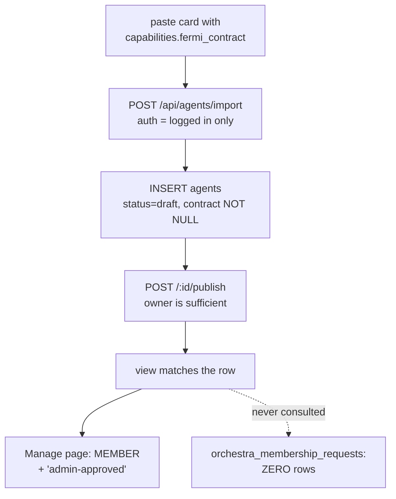

# 29 — Orchestra membership as governed state (not a derived column condition)

**Status:** proposed · completes the governance loop mig-172 (v0.11.2) began
**Severity:** medium-high. Admin approval was bypassable end-to-end by any
authenticated user, and the UI asserted "admin-approved" for agents no admin
had ever seen.

---

## 1. What mig-172 got right, and the one thing it didn't

`migrations/172_orchestra_membership.sql` opens with an accurate critique of the
state it replaced:

> *"Prior to this release, an agent was 'in Fermi' iff `agents.fermi_contract IS
> NOT NULL` — a hidden column condition, opaque to Mario, with no governance
> loop and no visible list."*

It then added the governance loop (`orchestra_membership_requests`, a
request/approve/reject flow, `require_orchestra_admin`) and a visible roster
(`orchestra_fermi_members`, `GET /api/orchestras/:name/members`). All good.

But it kept the predicate:

```sql
CREATE VIEW public.orchestra_fermi_members AS
    SELECT … FROM public.agents a
     WHERE a.status = 'published'
       AND a.fermi_contract IS NOT NULL;   -- ← membership
```

and stated the intent explicitly (L136-143): *"No membership table because the
contract IS the membership. Approval flow: admin sets `agents.fermi_contract`
from the request → agent appears here automatically."*

**So approval was modelled as a side effect that *produces* membership, rather
than as the state membership is *derived from*.** Consequence: any other writer
of that column is indistinguishable from an approval, and
`orchestra_membership_requests` — the entire governance record — is
**write-only**. Grep confirms it is read at `orchestras.rs:231` (pending only),
`335` (dup check), `475` (admin inbox), `569`/`792` (by id), and **nowhere in
any membership decision**.

---

## 2. Every writer of `agents.fermi_contract`

| Writer | Location | Gate | Owner-reachable? |
|---|---|---|---|
| Orchestra approval | `handlers/orchestras.rs:612` | `require_orchestra_admin` | No |
| **Agent import** | **`handlers/agents.rs:1053`** | **any authenticated user** | **YES — the bypass** |
| Curated boot seed | `api_server.rs:4359` → `store.rs:420` | filesystem registry, boot only | No |
| `update_agent` (PUT) | `store.rs:612` | — | No (absent from `AgentUpdate`) |
| `fork_agent` | `workflows/fork.rs:136` | — | No (not in INSERT) |
| `create_agent_handler` | `agents.rs:746` | — | No (hardcoded `None`) |

`POST /api/agents/import` copied `capabilities.fermi_contract` verbatim from a
user-supplied card, with no admin check and — unlike the request handler — no
`validate_fermi_contract`, so even `{}` satisfied `IS NOT NULL`. Exposed in the
UI at `templates/agent_create.html:1001` (paste-your-card importer), not just
the API. `publish_agent_handler` then requires only agent-level admin (the
owner qualifies) and asserts nothing about contracts.



A secondary cruelty: once self-minted, `submit_orchestra_request_handler` 409s
with *"already a fermi member"* (`orchestras.rs:363`), locking the owner out of
the legitimate review flow by the very state they created.

### 2.1 The UI half

`membership_rule` is a compile-time constant describing the **orchestra's
policy** (`orchestras.rs:74`: `"explicit: fermi_contract declared,
admin-approved"`). It was rendered in the per-agent **status** slot
(`agent_detail.html:4781`), so it read as a claim about *that agent*. It printed
identically for every agent, reviewed or not. That string is what caused this
defect to be reported as "seemed to bypass admin approval" — the UI asserted an
approval that had never happened.

Also: `agent_orchestras_handler` surfaced only `status='pending'` requests, so an
agent could render **MEMBER** while its only request row said `rejected`.

---

## 3. Already fixed (landed with this diagnosis)

| Fix | Location |
|---|---|
| Import strips `fermi_contract` for non-admins; response carries an explicit `note` | `handlers/agents.rs:1053` |
| Real per-agent `provenance` / `reviewed_by` / `reviewed_at` returned | `handlers/orchestras.rs` `agent_orchestras_handler` |
| UI renders provenance (`approved by X on Y` / `contract set directly — no approval on record`) instead of the policy blurb | `templates/agent_detail.html` |
| Drift audit + remediation runbook | `scripts/audit_orchestra_membership.sql` |

The bypass is closed and the UI is honest. **The model is still wrong**, which
is what this spec addresses: membership remains derived from a column that
approval merely happens to write.

---

## 4. Why the obvious fix is wrong

The tempting one-liner:

```sql
AND EXISTS (SELECT 1 FROM orchestra_membership_requests r
             WHERE r.agent_id = a.agent_id
               AND r.orchestra_name = 'fermi' AND r.status = 'approved')
```

**Do not ship this alone.** The curated Fermi specialists (`macro_forecaster`,
`equity_analyst`, …) receive their contracts from the filesystem registry at
boot (`store.rs:420`) and have no request row. Tightening the view silently
empties the roster — which also empties Fermi's own injected system-prompt
roster block (`orchestras.rs:932`), degrading the strategist itself.

And the "fix" of backfilling synthetic `status='approved'` rows for them
**launders the bypass**: it makes unreviewed memberships permanently
indistinguishable from reviewed ones, destroying the audit trail this spec
exists to establish.

---

## 5. Design: separate capability from membership

The conflation is the root cause. `fermi_contract` is doing two unrelated jobs:

1. **A capability declaration** — "this agent can emit finding labels and
   multipliers in Fermi's aggregation format". A property of the agent.
2. **A governance grant** — "this agent is admitted to the Fermi orchestra". A
   decision about the agent, made by someone else, at a point in time.

Split them. `agents.fermi_contract` keeps job 1 (and stays freely
owner-editable — declaring a contract shape is not a privilege). Job 2 moves to
an explicit table whose rows record *who admitted this agent and on what basis*.

### 5.1 New table

```sql
CREATE TABLE public.orchestra_members (
    orchestra_name TEXT NOT NULL,
    agent_id       UUID NOT NULL REFERENCES public.agents(agent_id) ON DELETE CASCADE,
    -- How this membership came to exist. Never 'approved' unless an
    -- approval transaction actually ran.
    source         TEXT NOT NULL
                   CHECK (source IN ('approved', 'curated_seed', 'admin_grant')),
    -- Set for source='approved'; the request that authorised it.
    request_id     UUID REFERENCES public.orchestra_membership_requests(request_id)
                   ON DELETE SET NULL,
    granted_by     TEXT REFERENCES public.users(user_id) ON DELETE SET NULL,
    granted_at     TIMESTAMPTZ NOT NULL DEFAULT NOW(),
    PRIMARY KEY (orchestra_name, agent_id)
);

-- Enforce the invariant at the schema level, not in review.
ALTER TABLE public.orchestra_members ADD CONSTRAINT approved_has_request
    CHECK (source <> 'approved' OR request_id IS NOT NULL);
```

`source` is the honesty mechanism. The curated seed gets `'curated_seed'` — a
real, auditable, *non*-approval provenance — rather than being disguised as
review output. `§3`'s `provenance` field maps directly onto it, so the UI needs
no further change.

### 5.2 Redefined view

```sql
CREATE OR REPLACE VIEW public.orchestra_fermi_members AS
    SELECT a.agent_id, a.agent_name, …, a.fermi_contract, m.source, m.granted_at
      FROM public.agents a
      JOIN public.orchestra_members m
        ON m.agent_id = a.agent_id AND m.orchestra_name = 'fermi'
     WHERE a.status = 'published';
```

Membership is now *stated*, not inferred. Publishing still gates visibility
(an unpublished member isn't in the roster), which preserves current behaviour.

`orchestra_xaman_ek_members` stays derived from `status='published'` —
membership there is genuinely implicit and correctly modelled today.

### 5.3 Write paths

| Actor | Writes |
|---|---|
| `approve_orchestra_request_handler` | `INSERT orchestra_members (source='approved', request_id, granted_by)` — inside the existing transaction, alongside the `status='approved'` update and the `admin_bypass_events` row |
| Curated boot seeder | `INSERT … ON CONFLICT DO NOTHING (source='curated_seed')` for cards shipping a `fermi_contract` |
| Admin override | `source='admin_grant'`, audited to `admin_bypass_events` |
| Leaving | `DELETE FROM orchestra_members` (or add `revoked_at` if history is wanted — recommended, since revocation is itself a governance decision) |
| Anyone else | nothing. `fermi_contract` becomes inert w.r.t. membership, so §2's writer table stops being a security surface. |

Note the structural win: after this change the import path could safely carry a
`fermi_contract` again, because the column no longer grants anything. The §3
admin gate becomes defence-in-depth rather than the only thing standing between
a pasted JSON blob and orchestra membership.

---

## 6. Migration (mig-173)

Additive and reversible; no destructive change.

1. `CREATE TABLE orchestra_members` (+ index on `agent_id`).
2. **Backfill with honest provenance** — every current member is classified, not
   blanket-approved:
   ```sql
   INSERT INTO public.orchestra_members (orchestra_name, agent_id, source, request_id, granted_by, granted_at)
   SELECT 'fermi', a.agent_id,
          CASE WHEN r.request_id IS NOT NULL THEN 'approved' ELSE 'curated_seed' END,
          r.request_id, r.reviewed_by, COALESCE(r.reviewed_at, a.created_at)
     FROM public.agents a
     LEFT JOIN LATERAL (
          SELECT request_id, reviewed_by, reviewed_at
            FROM public.orchestra_membership_requests
           WHERE agent_id = a.agent_id AND orchestra_name = 'fermi' AND status = 'approved'
           ORDER BY reviewed_at DESC LIMIT 1
     ) r ON TRUE
    WHERE a.fermi_contract IS NOT NULL AND a.status = 'published'
   ON CONFLICT DO NOTHING;
   ```
   **Pre-flight required:** run `scripts/audit_orchestra_membership.sql` first.
   Any *third-party* (non-system, non-curated) agent appearing in the
   `curated_seed` bucket is a self-minted membership from §2 and must be
   triaged by a Fermi maintainer — approve it properly or omit it from the
   backfill — **before** mig-173 runs. Do not let the backfill grandfather in a
   bypass.
3. `CREATE OR REPLACE VIEW orchestra_fermi_members` per §5.2.
4. Post-migration `RAISE NOTICE` comparing pre/post member counts, per the
   mig-166..172 house pattern. **Counts must match**, modulo deliberate
   triage removals from step 2.

Rollback: restore the previous view definition; `orchestra_members` becomes
inert. No data loss.

---

## 7. Acceptance criteria

1. Declaring a `fermi_contract` by any owner-reachable route (import, fork,
   update, create) grants **no** membership. Parameterise over all four.
2. `approve_orchestra_request_handler` is the only non-admin-gated route that
   produces a `source='approved'` row, and it always writes `request_id`.
3. The `approved_has_request` constraint makes an approval-without-a-request
   row **impossible to insert**, not merely absent.
4. Post-backfill, `orchestra_fermi_members` returns exactly the pre-migration
   membership set minus deliberate triage removals.
5. Manage-page `provenance` equals `orchestra_members.source` for every member
   — one source of truth, surfaced verbatim.
6. Fermi's injected roster block (`orchestras.rs:932`) and
   `/api/agents?orchestra=fermi` (SPEC_28-era unification) both read the view,
   so strategist, console, and Manage page cannot diverge again.

---

## 8. Note on the console divergence

The related defect — the Fermi console showing none of these members — was a
*third* predicate: `?tag=fermi-orchestra`, a hand-authored `metadata.tags`
convention from v0.8.8 that no approval path writes. Fixed already by adding
`?orchestra=` to `/api/agents`, resolved through
`orchestras::orchestra_view_name` against the same view.

The lesson generalises and is the reason §5 exists: **three surfaces
independently re-derived "is this agent in Fermi?" and all three disagreed.**
Membership must have exactly one stated representation that every surface
reads. Tags and column-presence are not membership; they are, at best,
correlates of it.
