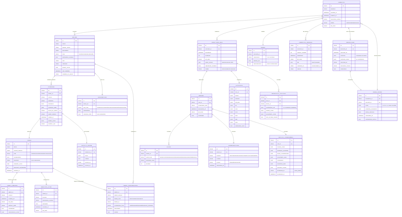
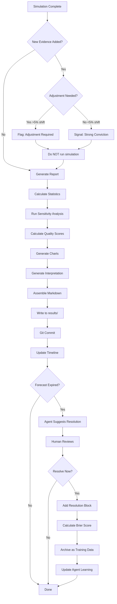
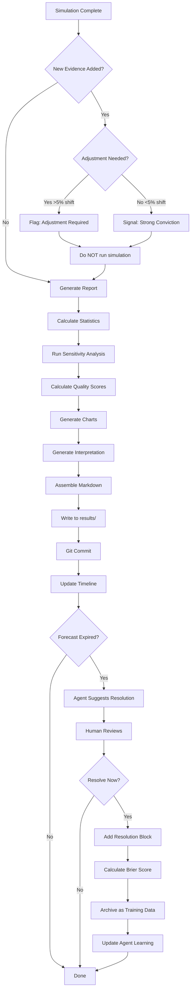

# Fermi Report System - Comprehensive Design

**Version:** 1.0  
**Date:** 2026-02-05  
**Status:** Design Phase

---

## Table of Contents
1. [Overview](#overview)
2. [Data Model (ER Diagram)](#data-model)
3. [Module Architecture](#module-architecture)
4. [FPL Syntax Extensions](#fpl-syntax-extensions)
5. [Report Generation Flow](#report-generation-flow)
6. [Agent System Integration](#agent-system-integration)
7. [Quality Scoring System](#quality-scoring-system)
8. [Time Travel & Versioning](#time-travel--versioning)
9. [Implementation Phases](#implementation-phases)

---

## Overview

The Fermi Report System transforms simulation results into rich, versioned Markdown reports with:
- Statistical visualizations (Mermaid charts)
- Evidence linking and scoring
- Agent attribution and history
- Quality assessment and confidence scoring
- Time travel capabilities
- Brier score tracking for closed forecasts

**Key Principles:**
- **Monorepo with modules** - Clean separation, easy refactoring
- **Eventual consistency** - Handle agent/human merge conflicts gracefully
- **Evidence inside drivers** - All probabilistic reasoning flows through driver construct
- **Human-in-loop** - Agents suggest, humans decide (especially for expiration)
- **Learning system** - Brier scores feed back into quality heuristics

---

## Data Model

```mermaid
%%{
  init: {
    'theme': 'base',
    'themeVariables': {
      'primaryColor': '#5CCFE6',
      'primaryTextColor': '#CBCCC6',
      'primaryBorderColor': '#5C6773',
      'lineColor': '#FFCC66',
      'secondaryColor': '#BAE67E',
      'tertiaryColor': '#FFAE57',
      'background': '#1F2430',
      'mainBkg': '#1F2430',
      'secondBkg': '#1F2430',
      'tertiaryBkg': '#1F2430',
      'textColor': '#CBCCC6',
      'border1': '#5C6773',
      'border2': '#5C6773',
      'arrowheadColor': '#FFCC66',
      'fontFamily': 'ui-monospace, "Cascadia Code", "Source Code Pro", Menlo, Consolas, "DejaVu Sans Mono", monospace',
      'fontSize': '14px'
    }
  }
}%%erDiagram
    FORECAST ||--o{ DRIVER : contains
    FORECAST ||--o{ SIMULATION_RUN : produces
    FORECAST ||--|| MODEL : defines
    FORECAST ||--o{ FORECAST_VERSION : "has history"
    FORECAST ||--o| RESOLUTION : "may be resolved"
    
    DRIVER ||--o{ EVIDENCE : "contains (nested)"
    DRIVER ||--|| DISTRIBUTION : "has type"
    DRIVER ||--o{ AGENT_CONTRIBUTION : "updated by"
    
    EVIDENCE ||--|| AGENT : "found by"
    EVIDENCE ||--|| QUALITY_SCORE : "has quality"
    
    AGENT ||--o{ AGENT_VERSION : "evolves over time"
    AGENT ||--|| BESTIARY_CARD : "described in"
    AGENT ||--o{ AGENT_CONTRIBUTION : "makes contributions"
    
    SIMULATION_RUN ||--|| REPORT : "generates"
    SIMULATION_RUN ||--|| STATISTICS : "produces"
    SIMULATION_RUN ||--o{ SENSITIVITY_ANALYSIS : "includes"
    
    REPORT ||--o{ CHART : "contains"
    REPORT ||--|| INTERPRETATION : "includes"
    REPORT ||--|| QUALITY_ASSESSMENT : "provides"
    
    RESOLUTION ||--|| BRIER_SCORE : "calculates"
    BRIER_SCORE ||--o{ FORECAST : "informs future"
    
    FORECAST {
        string id PK
        string question
        datetime created_at
        datetime expires_at
        string resolution_criteria
        enum status "active|expired|resolved"
        string git_hash
    }
    
    DRIVER {
        string id PK
        string name
        string display_name
        string description
        enum type "continuous|binary|discrete"
        json distribution_params
        string unit
        string rationale
        float quality_score
        datetime last_updated
        string updated_by_agent
    }
    
    EVIDENCE {
        string id PK
        string driver_id FK
        string source
        string summary
        float relevance
        date evidence_date
        string found_by_agent FK
        string agent_version
        datetime added_at
        float quality_score
        string bestiary_link
    }
    
    AGENT {
        string id PK
        string name
        string current_version
        enum type "research|monitoring|analysis|scoring"
        json configuration
        string schedule "cron expression"
        float reliability_score
        int forecasts_contributed
        datetime created_at
    }
    
    AGENT_VERSION {
        string id PK
        string agent_id FK
        string version
        datetime created_at
        string git_hash
        string bestiary_path
        json capabilities
        float performance_score
    }
    
    BESTIARY_CARD {
        string id PK
        string agent_id FK
        string version
        string markdown_content
        json metadata
        datetime created_at
        string git_path
    }
    
    AGENT_CONTRIBUTION {
        string id PK
        string agent_id FK
        string agent_version
        string target_type "driver|evidence|forecast"
        string target_id
        enum contribution_type "created|updated|validated|found_evidence"
        datetime timestamp
        json details
    }
    
    SIMULATION_RUN {
        string id PK
        string forecast_id FK
        datetime timestamp
        int iterations
        string git_hash
        json driver_values "sampled driver stats"
        bool adjustment_needed
        string trigger "manual|agent|scheduled"
    }
    
    STATISTICS {
        string id PK
        string run_id FK
        float mean
        float median
        float std_dev
        float p5
        float p25
        float p75
        float p95
        float min
        float max
        json distribution_bins
    }
    
    SENSITIVITY_ANALYSIS {
        string id PK
        string run_id FK
        string driver_id FK
        float contribution_pct "% of variance explained"
        float impact_score
        float uncertainty_score
        json one_at_time_results
    }
    
    REPORT {
        string id PK
        string run_id FK
        string markdown_path
        datetime generated_at
        string git_hash
        json metadata
    }
    
    CHART {
        string id PK
        string report_id FK
        enum chart_type "sankey|histogram|flowchart|mindmap|timeline|quadrant|gitgraph|er"
        string mermaid_code
        int position
    }
    
    INTERPRETATION {
        string id PK
        string report_id FK
        enum section "overview|drivers|evidence|quality|recommendation"
        string content
        enum source "template|llm|human"
        datetime generated_at
    }
    
    QUALITY_ASSESSMENT {
        string id PK
        string run_id FK
        float overall_score
        float evidence_coverage
        float driver_completeness
        float uncertainty_level
        float confidence
        float predicted_brier
        json heuristic_scores
        string assessed_by "fermi_agent"
        datetime assessed_at
    }
    
    QUALITY_SCORE {
        string id PK
        string evidence_id FK
        float score
        json criteria
        string scored_by
        datetime scored_at
    }
    
    FORECAST_VERSION {
        string id PK
        string forecast_id FK
        int version_number
        datetime timestamp
        string git_hash
        json diff "what changed"
        string changed_by "human|agent_id"
        string reason
    }
    
    RESOLUTION {
        string id PK
        string forecast_id FK
        datetime resolved_at
        bool outcome "true|false for binary"
        float outcome_value "for continuous"
        string resolved_by
        string resolution_source
        json verification
    }
    
    BRIER_SCORE {
        string id PK
        string resolution_id FK
        string forecast_id FK
        float score "0.0 to 1.0, lower is better"
        float predicted_probability
        bool actual_outcome
        datetime calculated_at
        json contributing_factors
    }
    
    MODEL {
        string id PK
        string forecast_id FK
        string expression "AST as string"
        json parsed_ast
        json dependencies "driver relationships"
    }
    
    DISTRIBUTION {
        string id PK
        string driver_id FK
        enum dist_type "triangular|normal|lognormal|uniform|beta|exponential"
        json parameters
        json sampled_stats "from simulation"
    }

```



<details>
<summary>📝 View Mermaid Source</summary>



</details>

---

## Module Architecture

### Directory Structure

```
fermi/
├── Cargo.toml
├── src/
│   ├── lib.rs
│   ├── core/
│   │   ├── mod.rs
│   │   ├── lexer.rs          (existing)
│   │   ├── parser.rs         (existing)
│   │   ├── ast.rs            (existing)
│   │   ├── semantic.rs       (existing)
│   │   └── executor.rs       (existing)
│   ├── report/
│   │   ├── mod.rs
│   │   ├── generator.rs      // Main orchestration
│   │   ├── markdown.rs       // MD file generation
│   │   ├── charts/
│   │   │   ├── mod.rs
│   │   │   ├── sankey.rs
│   │   │   ├── histogram.rs
│   │   │   ├── flowchart.rs
│   │   │   ├── mindmap.rs
│   │   │   ├── timeline.rs
│   │   │   ├── quadrant.rs
│   │   │   └── er_diagram.rs
│   │   ├── statistics/
│   │   │   ├── mod.rs
│   │   │   ├── sensitivity.rs
│   │   │   └── contribution.rs
│   │   └── interpretation/
│   │       ├── mod.rs
│   │       ├── templates.rs
│   │       └── explainers.rs
│   ├── agents/
│   │   ├── mod.rs
│   │   ├── scheduler.rs      // Cron-style scheduling
│   │   ├── executor.rs       // Run agents
│   │   ├── bestiary.rs       // Bestiary card management
│   │   ├── attribution.rs    // Track contributions
│   │   └── types/
│   │       ├── mod.rs
│   │       ├── research.rs
│   │       ├── monitor.rs
│   │       ├── analysis.rs
│   │       └── scoring.rs
│   ├── evidence/
│   │   ├── mod.rs
│   │   ├── linker.rs         // Link evidence to drivers
│   │   ├── scorer.rs         // Quality scoring
│   │   └── merger.rs         // Eventual consistency
│   ├── quality/
│   │   ├── mod.rs
│   │   ├── heuristics.rs     // Current rule-based system
│   │   ├── confidence.rs     // Confidence calculation
│   │   ├── brier.rs          // Brier score tracking
│   │   └── learning.rs       // Learn from historical Brier scores
│   ├── versioning/
│   │   ├── mod.rs
│   │   ├── git_ops.rs        // Git integration
│   │   ├── diff.rs           // Calculate diffs
│   │   └── time_travel.rs    // Navigate history
│   └── resolution/
│       ├── mod.rs
│       ├── expiration.rs     // Track forecast expiration
│       ├── resolver.rs       // Human-driven resolution
│       └── verifier.rs       // Agent-assisted verification
├── fermi-lsp/                 (existing)
├── agents/
│   └── bestiary/              // Agent bestiary cards (versioned)
│       ├── market_monitor-v1.0.0.md
│       ├── market_monitor-v1.2.3.md
│       └── research_agent-v1.0.0.md
└── results/                   // Generated reports
    ├── amd-stock-forecast/
    │   ├── 2026-02-05T10-30-00Z-a3f9c2d.md
    │   └── 2026-02-05T14-20-15Z-b4e8f3c.md
    └── market-analysis/
        └── 2026-02-04T09-15-30Z-c6d9a4e.md
```

### Module Responsibilities

#### `report/`
- Generate Markdown reports post-simulation
- Create Mermaid charts
- Calculate sensitivity analysis
- Provide interpretation text
- **Input:** `SimulationResults`, `Forecast`, `Evidence`, `AgentContributions`
- **Output:** Markdown file in `results/`

#### `agents/`
- Schedule agent execution (minute/hour/day/week/month/on-demand)
- Manage agent lifecycle and versioning
- Generate bestiary cards
- Track agent contributions
- Handle agent-to-agent (a2a) communication
- **Storage:** Agent configs in DB, bestiary cards in git

#### `evidence/`
- Link evidence to drivers (inside driver blocks in FPL)
- Score evidence quality
- Handle eventual consistency when agents/humans edit concurrently
- Determine if evidence requires forecast adjustment (>5% threshold)
- **Storage:** Evidence nested in driver blocks in FPL file

#### `quality/`
- Calculate forecast quality scores using heuristics
- Assess confidence levels
- Track Brier scores for resolved forecasts
- Learn from historical accuracy to refine heuristics
- Fermi agent provides quality assessments
- **Storage:** Scores in simulation run metadata, Brier in resolved FPL files

#### `versioning/`
- Git integration for auto-commit
- Calculate diffs between forecast versions
- Enable time travel navigation
- Track what changed and why
- **Storage:** Git repository

#### `resolution/`
- Track forecast expiration dates
- Agent-identified candidates for expiration
- Human-driven resolution process
- Calculate Brier scores on resolution
- Archive resolved forecasts as training data
- **Storage:** Resolution data in FPL file, archive in knowledge base

---

## FPL Syntax Extensions

### Current Syntax (Existing)
```fpl
question "Will AMD reach $200 by 2026-12-31?"

driver market_size continuous {
    display_name: "Market Size"
    description: "Total addressable market"
    distribution: triangular(100, 200, 500)
    unit: "millions"
    rationale: "Based on industry reports"
}

model: market_size * growth_rate

simulate 10000 iterations
```

### Extended Syntax (New)

#### 1. Evidence Blocks (Inside Drivers)

```fpl
driver market_size continuous {
    display_name: "Market Size"
    description: "Total addressable market"
    distribution: triangular(100, 200, 500)
    unit: "millions"
    rationale: "Based on industry reports"
    
    // ===== EVIDENCE BLOCK (AUTO-GENERATED) =====
    // Last updated: 2026-02-05T10:30:00Z by market_monitor v1.2.3
    evidence {
        analyst_report_q4 {
            source: "Morgan Stanley Q4 2025 Report"
            summary: "TAM estimated at $450M with 25% growth"
            relevance: 0.85p
            date: 2026-01-15
            found_by: market_monitor
            agent_version: v1.2.3
            quality_score: 8.5
            bestiary_link: "agents/bestiary/market_monitor-v1.2.3.md"
        }
        
        market_research_2026 {
            source: "Gartner Market Analysis 2026"
            summary: "Conservative estimate of $380M"
            relevance: 0.72p
            date: 2026-01-20
            found_by: research_agent
            agent_version: v1.0.5
            quality_score: 7.8
            bestiary_link: "agents/bestiary/research_agent-v1.0.5.md"
        }
    }
    // ===== END EVIDENCE BLOCK =====
}
```

#### 2. Forecast Metadata (Top-level)

```fpl
// Forecast metadata
forecast_id: "amd-stock-forecast-001"
created: 2026-01-01T12:00:00Z
updated: 2026-02-05T10:30:00Z

// Expiration
expires: 2026-12-31T23:59:59Z
resolution_criteria: "Check AMD (NASDAQ) closing price on 2026-12-31"
resolution_method: "API check against NASDAQ historical data"

// Status
status: active  // active | expired | resolved

question "Will AMD reach $200 by 2026-12-31?"

// ... drivers, model, simulate ...
```

#### 3. Resolution Block (After Expiration)

```fpl
// FORECAST RESOLVED
// This forecast is now part of the knowledge archive and training data
// Do not edit - historical record only

forecast_id: "amd-stock-forecast-001"
status: resolved

resolution {
    resolved_at: 2026-12-31T16:05:00Z
    resolved_by: "user_ilabra"
    agent_assisted_by: "market_monitor v1.5.2"
    
    outcome: false  // AMD did not reach $200
    actual_value: 187.50
    
    verification {
        source: "NASDAQ Historical Data API"
        url: "https://api.nasdaq.com/historical/AMD/2026-12-31"
        verified_by: "market_monitor"
        confidence: 1.0
    }
}

brier_score {
    score: 0.23  // Lower is better (0.0 = perfect)
    predicted_probability: 0.75  // Our forecast mean/median
    actual_outcome: 0.0  // Did not happen
    calculated_at: 2026-12-31T16:10:00Z
    
    contributing_factors {
        driver_accuracy: 0.82
        evidence_quality: 0.88
        model_complexity: 0.65
        update_frequency: 0.91
    }
}

// Original forecast below (read-only)
question "Will AMD reach $200 by 2026-12-31?"
// ...
```

#### 4. Agent Attribution Timeline

```fpl
// Agent activity log (auto-generated, collapsible)
agent_timeline {
    2026-01-01T12:00:00Z {
        agent: market_monitor
        version: v1.2.3
        action: "Initial evidence gathering"
        contributions: 3
        trigger: "forecast_creation"
    }
    
    2026-02-03T08:30:00Z {
        agent: market_monitor
        version: v1.2.3
        action: "Routine update"
        contributions: 2
        new_evidence: true
        adjustment_needed: false
        reason: "New evidence within existing bounds (+2% shift)"
    }
    
    2026-02-05T10:30:00Z {
        agent: research_agent
        version: v1.0.5
        action: "Validation check"
        contributions: 1
        adjustment_needed: false
    }
}
```

### Parser Changes Needed

1. **New tokens:**
   - `forecast_id`, `created`, `updated`, `expires`
   - `resolution_criteria`, `resolution_method`, `status`
   - `resolution`, `resolved_at`, `resolved_by`, `outcome`
   - `brier_score`, `predicted_probability`, `actual_outcome`
   - `agent_timeline`, `action`, `trigger`, `contributions`

2. **New AST nodes:**
   ```rust
   pub struct ForecastMetadata {
       pub id: String,
       pub created: DateTime<Utc>,
       pub updated: Option<DateTime<Utc>>,
       pub expires: Option<DateTime<Utc>>,
       pub resolution_criteria: Option<String>,
       pub status: ForecastStatus,
   }
   
   pub enum ForecastStatus {
       Active,
       Expired,
       Resolved,
   }
   
   pub struct EvidenceBlock {
       pub last_updated: DateTime<Utc>,
       pub updated_by: Option<String>,
       pub updated_by_version: Option<String>,
       pub evidence_items: Vec<Evidence>,
   }
   
   pub struct Evidence {
       pub id: String,
       pub source: String,
       pub summary: String,
       pub relevance: f64,
       pub date: NaiveDate,
       pub found_by: Option<String>,
       pub agent_version: Option<String>,
       pub quality_score: Option<f64>,
       pub bestiary_link: Option<PathBuf>,
   }
   
   pub struct Resolution {
       pub resolved_at: DateTime<Utc>,
       pub resolved_by: String,
       pub agent_assisted_by: Option<String>,
       pub outcome: ResolutionOutcome,
       pub verification: Option<Verification>,
   }
   
   pub enum ResolutionOutcome {
       Boolean(bool),
       Numeric(f64),
   }
   
   pub struct BrierScore {
       pub score: f64,
       pub predicted_probability: f64,
       pub actual_outcome: f64,
       pub calculated_at: DateTime<Utc>,
       pub contributing_factors: HashMap<String, f64>,
   }
   ```

3. **Modified DriverStmt:**
   ```rust
   pub struct DriverStmt {
       // ... existing fields ...
       pub evidence: Option<EvidenceBlock>,  // NEW
   }
   ```

---

## Report Generation Flow



<details>
<summary>📝 View Mermaid Source</summary>



</details>

### Post-Processing Steps

1. **Statistics Calculation** (existing)
   - Mean, median, std dev, percentiles
   - Distribution binning for histogram

2. **Sensitivity Analysis** ✅ (implemented 2026-02-05)
   
   **Status:** Rigorous implementation complete with Sobol indices and bootstrap confidence intervals
   
   ```rust
   /// Computes rigorous variance decomposition using conditional Monte Carlo
   /// and Saltelli sampling for exact Sobol sensitivity indices
   pub fn full_sensitivity_analysis(
       program: &Program,
       iterations: usize,
   ) -> Result<SensitivityAnalysis, ExecutionError> {
       // 1. Baseline simulation → V(Y)
       // 2. For each driver: Conditional Monte Carlo → V(E[Y|X_i]) → S_i
       // 3. Saltelli sampling → S_Ti (total-order indices)
       // 4. Bootstrap resampling → confidence intervals
   }
   ```
   
   **Methodology:**
   - **First-Order Sobol (S_i):** Conditional Monte Carlo
     - Measures direct effect of each driver alone
     - Algorithm: Sample m values of driver X_i, run n simulations per value
     - Compute V(E[Y|X_i]) / V(Y)
   
   - **Total-Order Sobol (S_Ti):** Saltelli Sampling
     - Measures total effect including all interactions
     - Generate two independent sample matrices A and B
     - Compute S_Ti = Σ(f(A) - f(AB_i))^2 / (2n * V(Y))
   
   - **Confidence Intervals:** Bootstrap Resampling
     - 5 bootstrap iterations (configurable)
     - Estimates standard error of Sobol indices
     - Provides 95% CI for uncertainty quantification
   
   **Output:**
   ```rust
   pub struct DriverSensitivity {
       driver_name: String,
       variance_contribution: f64,  // First-order Sobol S_i
       first_order_index: f64,      // Direct effect only
       total_order_index: f64,      // Total effect with interactions
       standard_error: f64,         // Bootstrap SE
   }
   ```
   
   **Report Integration:**
   - Sankey diagram uses variance contributions (S_i)
   - Tornado chart uses total-order indices (S_Ti)
   - Table shows both indices with 95% confidence intervals
   - Interpretation guide explains direct vs. interaction effects

3. **Quality Assessment** (new)
   ```rust
   pub fn assess_quality(
       forecast: &Forecast,
       results: &SimulationResults,
       evidence: &[Evidence],
       agents: &[AgentContribution],
   ) -> QualityAssessment {
       // Heuristics:
       // - Evidence coverage: # of evidence items per driver
       // - Driver completeness: all drivers have rationale
       // - Uncertainty level: width of CI
       // - Evidence freshness: age of evidence
       // - Agent reliability: historical performance
       // - Predicted Brier: based on similar forecasts
   }
   ```

4. **Chart Generation**
   - Each chart type has its own generator
   - Mermaid syntax strings
   - Fallback to ASCII/tables if Mermaid fails

5. **Interpretation**
   ```rust
   pub fn generate_interpretation(
       section: InterpretationSection,
       data: &ReportData,
   ) -> String {
       match section {
           InterpretationSection::Overview => {
               // Forecast-specific summary
               template::fill("overview", data)
           }
           InterpretationSection::Drivers => {
               // Explain driver impacts
               template::fill("drivers", data)
           }
           // ... other sections
       }
   }
   ```

---

## Agent System Integration

### Agent Configuration

```toml
# agents/config/market_monitor.toml
[agent]
id = "market_monitor"
name = "Market Monitor Agent"
type = "monitoring"
version = "1.2.3"
schedule = "0 9 * * *"  # Daily at 9am UTC

[capabilities]
data_sources = ["newsapi", "yahoo_finance", "sec_edgar"]
search_keywords = ["market", "TAM", "growth", "industry"]
update_frequency = "daily"

[performance]
reliability_score = 0.87
forecasts_contributed = 145
average_brier_improvement = 0.12
evidence_quality_score = 8.2

[llm]
model = "claude-sonnet-4"
system_prompt = """
You are a market research agent focused on tracking market size and growth trends.
Your goal is to find credible evidence about total addressable markets (TAM).
"""
```

### Agent Scheduling

```rust
pub struct AgentScheduler {
    agents: HashMap<String, Agent>,
    cron: Cron,
}

impl AgentScheduler {
    pub fn schedule(&mut self, agent: Agent) {
        // Parse cron expression
        // Register for execution
    }
    
    pub async fn run_due_agents(&mut self) {
        // Check which agents are due
        // Execute them concurrently
        // Handle eventual consistency
    }
    
    pub async fn run_on_demand(&mut self, agent_id: &str) {
        // Manual trigger
    }
}
```

### Eventual Consistency Strategy

When agent updates FPL file while human is editing:

1. **Lock-free approach:**
   - Agent writes to temporary file
   - On save, detect conflicts
   - Show diff to user
   - User accepts/rejects/merges

2. **Git-based resolution:**
   ```bash
   # Agent commit
   git add forecast.fpl
   git commit -m "Agent: market_monitor added 2 evidence items"
   
   # Human commit (conflict!)
   git add forecast.fpl
   git commit -m "Human: adjusted market_size distribution"
   
   # Merge
   git merge --strategy=ours  # Human wins by default
   # OR interactive merge with Fermi assistance
   ```

3. **Evidence block markers:**
   ```fpl
   // ===== EVIDENCE BLOCK (AUTO-GENERATED) =====
   // CONFLICT: Human edited line 15, agent added evidence
   // Resolution required
   evidence {
       // ... show both versions ...
   }
   // ===== END EVIDENCE BLOCK =====
   ```

### Bestiary Card Generation

```rust
pub async fn generate_bestiary_card(agent: &Agent) -> BestiaryCard {
    let template = r#"
# Agent: {name} ({version})

**Type:** {type}
**Specialization:** {specialization}
**Data Sources:** {sources}
**Update Frequency:** {frequency}
**Reliability Score:** {reliability} (based on {forecast_count} forecasts)
**Created:** {created}
**Last Updated:** {updated}

## Capabilities
{capabilities}

## Historical Performance
- Forecasts contributed to: {forecast_count}
- Average Brier improvement: {brier_improvement}
- Evidence quality score: {evidence_quality}

## Configuration
```toml
{config}
```

## Evolution
{changelog}

## Self-Description (a2a)
{self_description}
"#;
    
    // Agent self-describes via LLM
    let self_description = agent.describe_self().await;
    
    // Fill template
    BestiaryCard {
        content: fill_template(template, &agent, &self_description),
        version: agent.version.clone(),
        git_path: format!("agents/bestiary/{}-{}.md", agent.id, agent.version),
    }
}
```

---

## Quality Scoring System

### Initial Heuristics (Fermi Agent Rules)

```rust
pub struct QualityHeuristics {
    pub evidence_coverage: HeuristicRule,
    pub driver_completeness: HeuristicRule,
    pub uncertainty_level: HeuristicRule,
    pub evidence_freshness: HeuristicRule,
    pub agent_reliability: HeuristicRule,
}

impl QualityHeuristics {
    pub fn score_evidence_coverage(&self, forecast: &Forecast) -> f64 {
        let total_drivers = forecast.drivers.len();
        let drivers_with_evidence = forecast.drivers.iter()
            .filter(|d| d.evidence.is_some())
            .count();
        
        let coverage_ratio = drivers_with_evidence as f64 / total_drivers as f64;
        
        // Score: 0-10 scale
        match coverage_ratio {
            r if r >= 0.9 => 10.0,
            r if r >= 0.7 => 8.0,
            r if r >= 0.5 => 6.0,
            r if r >= 0.3 => 4.0,
            _ => 2.0,
        }
    }
    
    pub fn score_driver_completeness(&self, driver: &Driver) -> f64 {
        let mut score = 0.0;
        
        // Has display name?
        if driver.display_name.is_some() { score += 1.0; }
        
        // Has description?
        if driver.description.is_some() { score += 1.5; }
        
        // Has rationale?
        if driver.rationale.is_some() { score += 2.0; }
        
        // Has unit?
        if driver.unit.is_some() { score += 0.5; }
        
        // Has evidence?
        if let Some(evidence) = &driver.evidence {
            score += evidence.evidence_items.len() as f64 * 1.0;
        }
        
        // Normalize to 0-10
        (score / 10.0) * 10.0
    }
    
    pub fn score_uncertainty(&self, stats: &Statistics) -> f64 {
        // Coefficient of variation
        let cv = stats.std_dev / stats.mean;
        
        // Lower CV = higher score (less uncertainty)
        match cv {
            v if v < 0.1 => 10.0,
            v if v < 0.2 => 8.0,
            v if v < 0.3 => 6.0,
            v if v < 0.5 => 4.0,
            _ => 2.0,
        }
    }
    
    pub fn predict_brier_score(&self, quality: &QualityAssessment) -> f64 {
        // Initially: simple formula based on quality components
        // Later: learned from historical data
        
        let base_brier = 0.25; // Baseline (random guessing ~0.25)
        
        let improvement = 
            quality.evidence_coverage * 0.03 +
            quality.driver_completeness * 0.02 +
            quality.uncertainty_level * 0.01;
        
        (base_brier - improvement).max(0.0)
    }
}
```

### Learning from Brier Scores

```rust
pub struct BrierLearning {
    historical_scores: Vec<BrierScore>,
}

impl BrierLearning {
    pub fn update_heuristics(&mut self, new_score: BrierScore) {
        self.historical_scores.push(new_score);
        
        // Analyze correlations
        let correlations = self.analyze_correlations();
        
        // Adjust heuristic weights
        // e.g., if evidence_coverage correlates strongly with good Brier scores,
        // increase its weight in overall quality calculation
        
        // Eventually: Train ML model
        // Features: evidence coverage, driver completeness, etc.
        // Target: actual Brier score
        // Predict Brier for future forecasts
    }
    
    fn analyze_correlations(&self) -> HashMap<String, f64> {
        // Statistical analysis of which factors predict good Brier scores
        // Return correlation coefficients
        todo!()
    }
}
```

---

## Time Travel & Versioning

### Git Integration

```rust
pub struct GitOps {
    repo: Repository,
}

impl GitOps {
    pub fn commit_report(&self, report_path: &Path, run: &SimulationRun) -> Result<String> {
        // Stage file
        let mut index = self.repo.index()?;
        index.add_path(report_path)?;
        index.write()?;
        
        // Commit
        let sig = self.repo.signature()?;
        let tree_id = index.write_tree()?;
        let tree = self.repo.find_tree(tree_id)?;
        let parent = self.repo.head()?.peel_to_commit()?;
        
        let message = format!(
            "Forecast run: {}\nMean: {:.2}, Median: {:.2}\nAdjustment needed: {}",
            run.forecast.question,
            run.statistics.mean,
            run.statistics.median,
            run.adjustment_needed
        );
        
        let commit_id = self.repo.commit(
            Some("HEAD"),
            &sig,
            &sig,
            &message,
            &tree,
            &[&parent],
        )?;
        
        Ok(commit_id.to_string())
    }
    
    pub fn calculate_diff(&self, from: &str, to: &str) -> Result<ForecastDiff> {
        // Git diff between two commits
        // Parse diff to understand what changed
        todo!()
    }
    
    pub fn time_travel(&self, commit_hash: &str) -> Result<Forecast> {
        // Checkout specific commit (read-only)
        // Parse FPL file at that point in time
        // Return historical forecast
        todo!()
    }
}
```

### Version Navigation

```rust
pub struct TimeTravelNavigator {
    git: GitOps,
    index: HashMap<String, Vec<ForecastVersion>>,
}

impl TimeTravelNavigator {
    pub fn get_history(&self, forecast_id: &str) -> Vec<ForecastVersion> {
        // List all commits for this forecast
        // Parse commit messages
        // Build timeline
        todo!()
    }
    
    pub fn compare(&self, v1: &str, v2: &str) -> ForecastComparison {
        // Show side-by-side comparison
        // Highlight changes in drivers, evidence, results
        todo!()
    }
    
    pub fn get_at_time(&self, forecast_id: &str, timestamp: DateTime<Utc>) -> Forecast {
        // Find commit closest to timestamp
        // Return forecast as it was at that moment
        todo!()
    }
}
```

---

## Implementation Phases

### Phase 0: Design & Interfaces ✅ (Current)
- [x] Data model (ER diagram)
- [x] Module architecture
- [x] FPL syntax extensions
- [ ] Rust interface definitions (next)

### Phase 1: Foundation (Week 1)
**Goal:** Basic reports with existing data

**Tasks:**
1. Create `report/` module structure
2. Implement W3C-compliant filename generation
3. Basic markdown generation with tables
4. Integrate with executor (post-process hook)
5. Test in Zed markdown preview

**Deliverable:** Simple reports with statistics tables

### Phase 2: Core Visualizations (Week 1-2)
**Goal:** Stable Mermaid charts

**Tasks:**
1. Implement chart generators:
   - Mindmap (forecast structure from AST)
   - Flowchart (model expression from AST)
   - Histogram (XY chart from distribution bins)
2. Integrate into report template
3. Test rendering in Zed

**Deliverable:** Reports with 3 chart types

### Phase 3: Statistical Analysis (Week 2)
**Goal:** Driver impact understanding

**Tasks:**
1. Implement sensitivity analysis
2. Calculate driver contributions
3. Sankey diagram generator
4. Quadrant chart (impact vs uncertainty)
5. Table-based tornado chart

**Deliverable:** Understand which drivers matter

### Phase 4: Parser Extensions (Week 2-3)
**Goal:** Support evidence, metadata, resolution

**Tasks:**
1. Extend lexer with new tokens
2. Add AST nodes for evidence, metadata, resolution
3. Update parser for new syntax
4. Semantic analysis for new constructs
5. Update executor to use new data

**Deliverable:** Can parse extended FPL syntax

### Phase 5: Git Integration (Week 3)
**Goal:** Version control and time travel

**Tasks:**
1. Implement `versioning/` module
2. Auto-commit after each run
3. Timeline diagram generation
4. GitGraph for branching scenarios
5. Diff calculation
6. Time travel navigation UI

**Deliverable:** Full forecast history tracking

### Phase 6: Evidence System (Week 3-4)
**Goal:** Evidence linking and quality scoring

**Tasks:**
1. Implement `evidence/` module
2. Evidence linking to drivers
3. Quality scoring algorithms
4. Eventual consistency handling
5. UI for evidence management

**Deliverable:** Evidence-backed forecasts

### Phase 7: Agent Infrastructure (Week 4-5)
**Goal:** Agent scheduling and attribution

**Tasks:**
1. Implement `agents/` module
2. Agent scheduler (cron-style)
3. Agent configuration system
4. Bestiary card generation
5. Contribution tracking
6. a2a communication foundation

**Deliverable:** Scheduled agents can update forecasts

### Phase 8: Quality & Confidence (Week 5-6)
**Goal:** Automated quality assessment

**Tasks:**
1. Implement `quality/` module
2. Heuristic scoring system
3. Confidence calculation
4. Fermi scoring agent
5. Quality dashboard in reports

**Deliverable:** Know forecast quality automatically

### Phase 9: Resolution & Brier Scores (Week 6-7)
**Goal:** Close forecasts and learn

**Tasks:**
1. Implement `resolution/` module
2. Expiration tracking
3. Agent-assisted resolution workflow
4. Brier score calculation
5. Learning system (adjust heuristics)
6. Knowledge archive

**Deliverable:** Complete forecast lifecycle

### Phase 10: Interpretation & Polish (Week 7-8)
**Goal:** Production-ready reports

**Tasks:**
1. Implement `report/interpretation/` module
2. Template system for explainers
3. Forecast-specific interpretation
4. ER diagram generation
5. Export options (HTML, PDF)
6. Comparison views
7. Search/filter historical results

**Deliverable:** Professional, interpretable reports

---

## Success Criteria

### Technical
- ✅ All modules compile and tests pass
- ✅ Reports render correctly in Zed
- ✅ Mermaid charts display properly
- ✅ Git integration works smoothly
- ✅ Parser handles extended syntax
- ✅ Agents run on schedule
- ✅ Eventual consistency handles conflicts
- ✅ Brier scores calculate correctly

### User Experience
- ✅ Reports are readable and insightful
- ✅ Charts aid understanding
- ✅ Evidence is traceable
- ✅ Quality assessment is helpful
- ✅ Time travel is intuitive
- ✅ Agents feel trustworthy

### Learning System
- ✅ Brier scores improve over time
- ✅ Heuristics adapt to data
- ✅ Agent performance tracked
- ✅ Forecast quality increases

---

## Open Questions

1. **LLM Integration:**
   - Which LLM for interpretation? (Claude, GPT-4, local Llama?)
   - Cost/latency trade-offs?
   - Caching strategy?

2. **Agent Database:**
   - SQLite, Postgres, or file-based?
   - Schema for agent configs?
   - How to version agent data?

3. **Eventual Consistency:**
   - How aggressive should auto-merge be?
   - Always prompt user or auto-resolve simple conflicts?

4. **Performance:**
   - Sensitivity analysis is O(n*drivers) - acceptable?
   - Cache intermediate results?
   - Parallel chart generation?

5. **Report Format:**
   - Should we also generate HTML for sharing?
   - PDF export needed?
   - Interactive features possible?

---

## Next Steps

1. Review this design document
2. Refine data model based on feedback
3. Define Rust interfaces and traits
4. Begin Phase 1 implementation
5. Iterate based on real usage

---

**Ready to proceed?** 

Let me know if you want me to:
- Refine any section
- Add missing details
- Start writing Rust interface code
- Create a Phase 1 implementation plan
- Something else?
