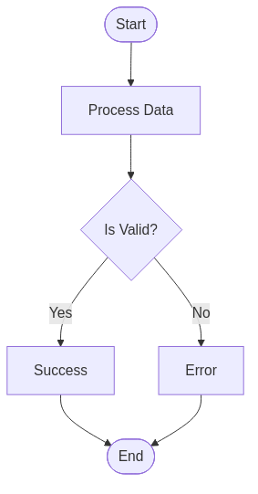
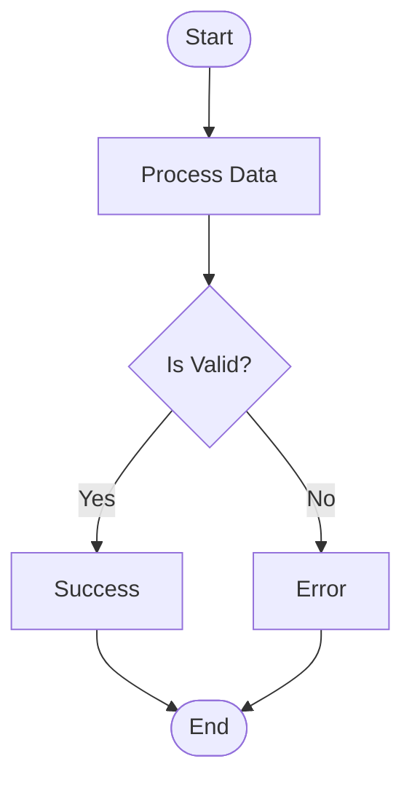
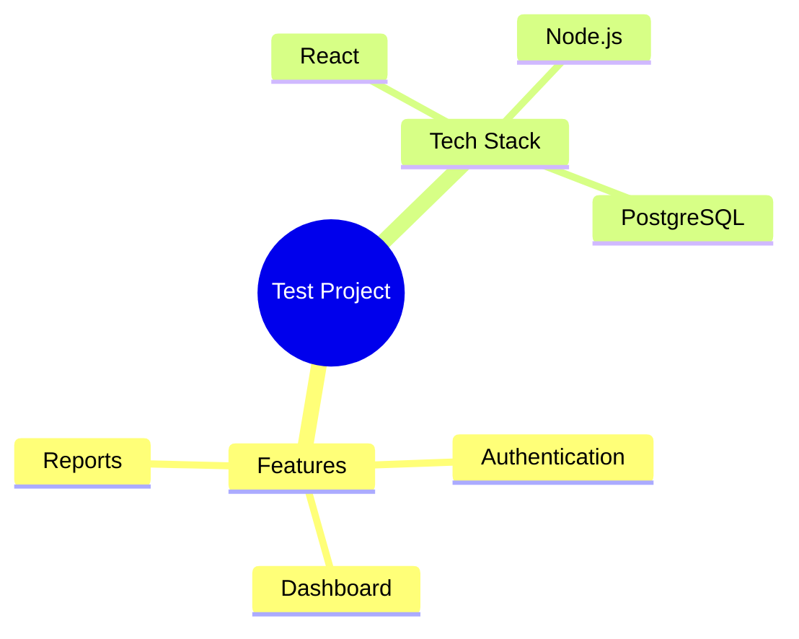
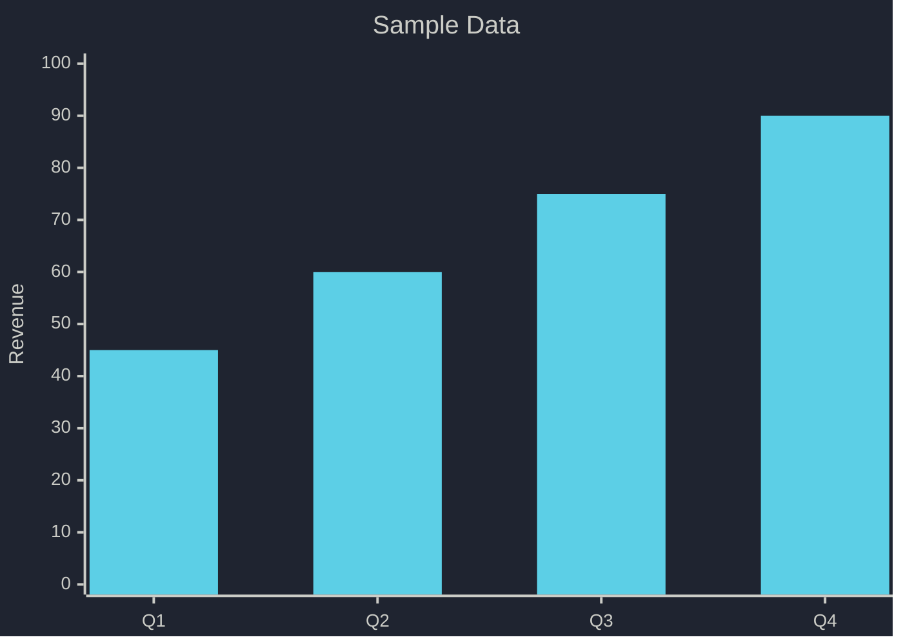

# Test Document

This is a test markdown file with Mermaid diagrams.

## Flowchart Example

📝 View Mermaid Source

## Mind Map Example

📝 View Mermaid Source

## Chart Example

📝 View Mermaid Source

## Conclusion

All diagrams should be rendered!
