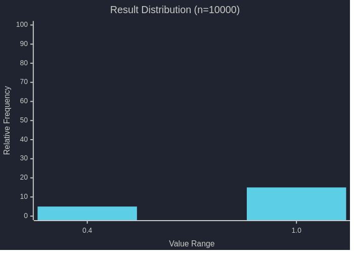
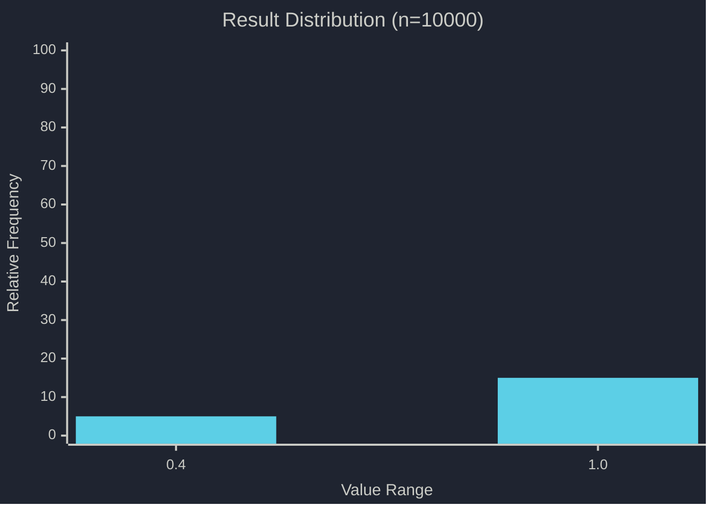
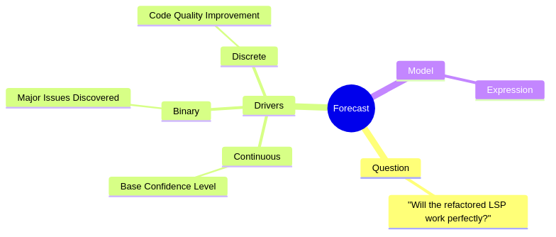
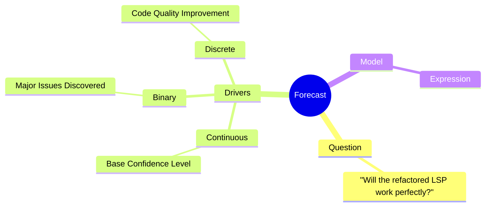
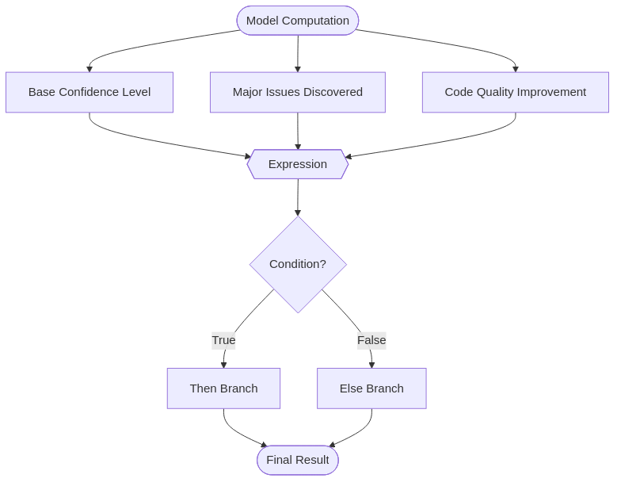
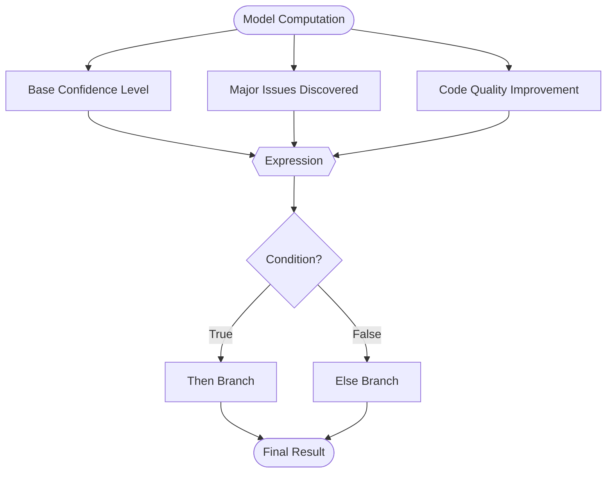
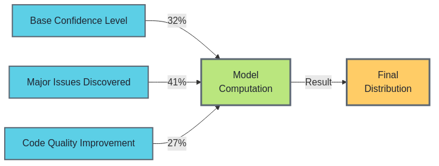
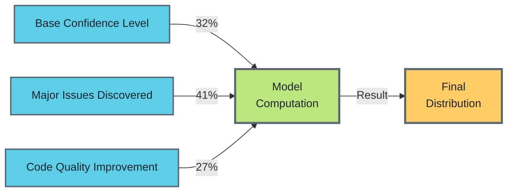
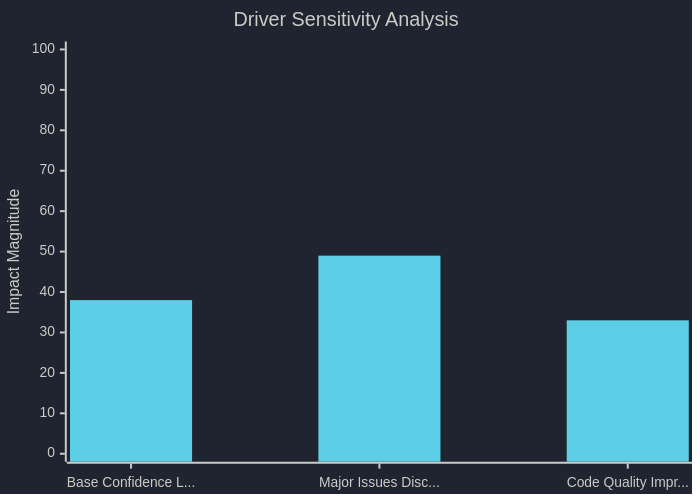
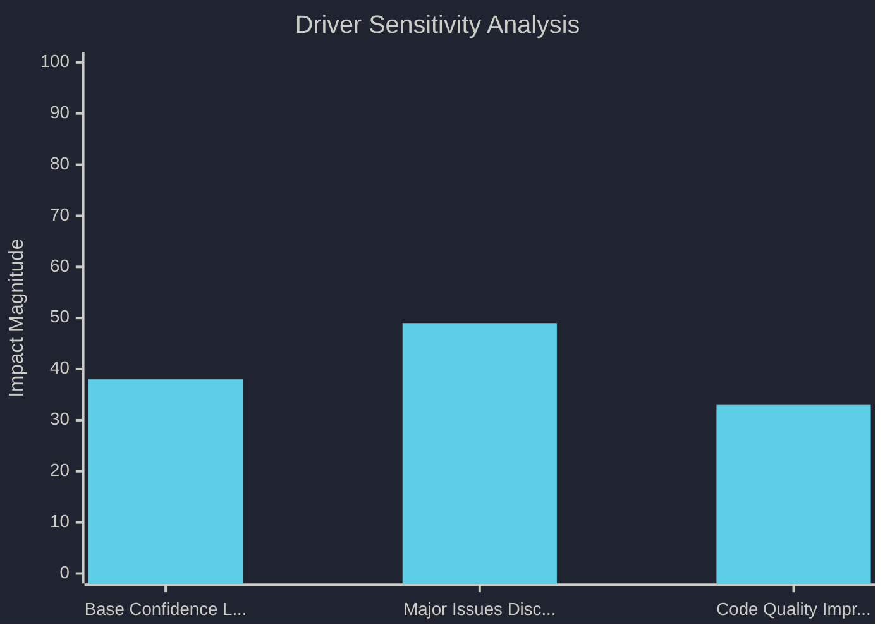

# Forecast Results: Will the refactored LSP work perfectly?

**Generated:** 2026-02-05T06:49:12.629365363+00:00  
**Mean:** 0.97 | **Median:** 0.99 | **90% CI:** [0.95, 0.99]  
**Distribution:** ▁████ Slightly left-skewed ←  

---

## 📊 Distribution

📝 View Mermaid Source

### Statistics

| Metric | Value | Visualization |
|--------|-------|---------------|
| Mean | 0.97 | |
| Median | 0.99 | |
| Std Dev | 0.07 | |
| Distribution | | ▁▁▁▁▁▁▁▁▁▁▁▁▁▁▁▁▁▁▁█ |
| P5 | 0.95 | ├ |
| P25 | 0.99 | ├ |
| P50 (Median) | 0.99 | █ |
| P75 | 0.99 | ┤ |
| P95 | 0.99 | ┤ |
| Range | [0.43, 0.99] |                    ┤├ |

---

## 🧠 Forecast Structure

📝 View Mermaid Source

---

## 🔄 Model Flow

📝 View Mermaid Source

---

## 🌊 Driver Impact Flow

📝 View Mermaid Source

---

## 🌪️ Sensitivity Analysis

📝 View Mermaid Source

---

## 📋 Drivers

### base_confidence (Continuous)

**Display Name:** Base Confidence Level

**Description:** Our initial confidence that the refactor worked

**Distribution:** Triangular { p5: Number(0.7), p50: Number(0.9), p95: Number(0.99) }

**Unit:** probability

**Rationale:** We tested thoroughly and all 53 tests passed

---

### major_issues_found (Binary)

**Display Name:** Major Issues Discovered

**Description:** Probability that we find breaking bugs

**Probability:** 5.00% [█░░░░░░░░░] 5%

**Impact Multiplier:** 0.50x ❄️ Strong Negative

**Rationale:** Very low chance - build succeeded and tests passed

---

### code_quality (Discrete)

**Display Name:** Code Quality Improvement

**Description:** How much better the code is after refactoring

**Values:** 1.20, 1.50, 2.00

**Weights:** 20.0% [█░░░░] 20%, 50.0% [███░░] 50%, 30.0% [██░░░] 30%

**Distribution:** ▁█▃

**Rationale:** 54% reduction in main.rs size, much better organization

---

