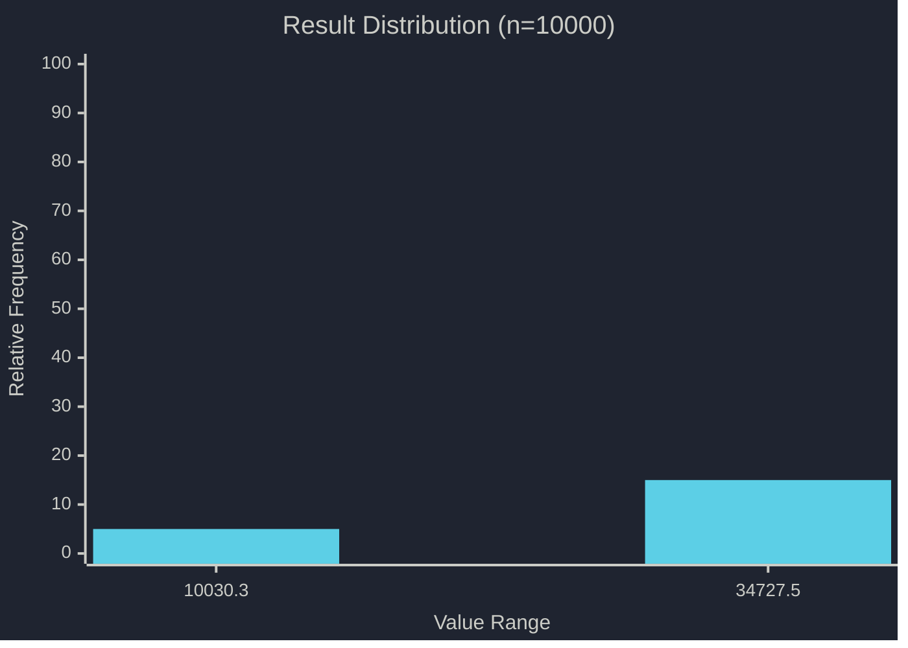
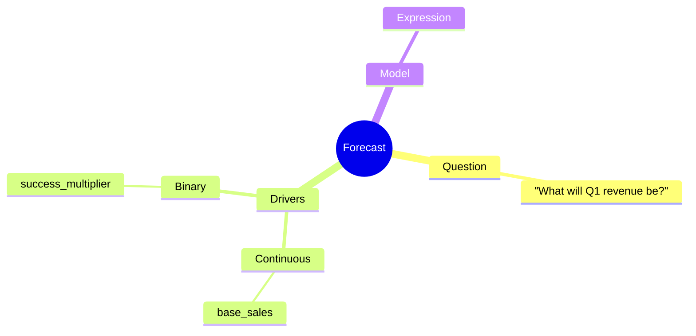
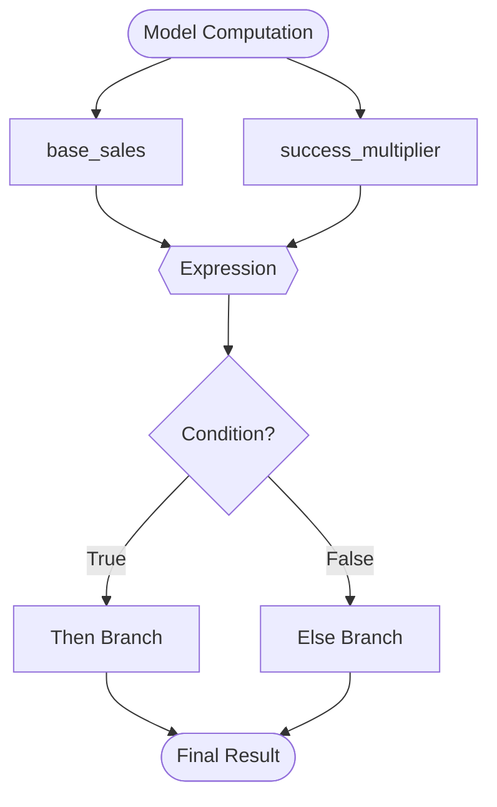
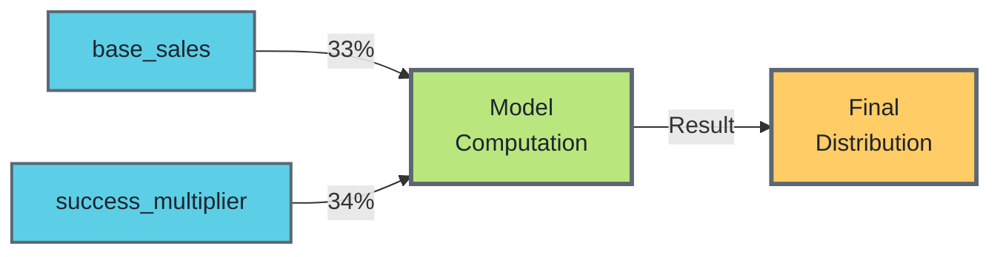
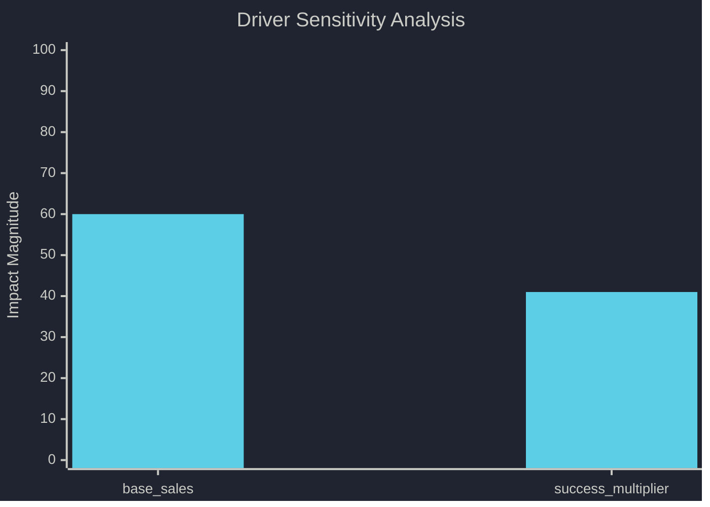

# Forecast Results: What will Q1 revenue be?

**Generated:** 2026-02-05T07:04:44.766223465+00:00  
**Mean:** 21032.38 | **Median:** 20651.12 | **90% CI:** [13205.98, 30283.62]  
**Distribution:** ▁▃▄▆█ Symmetric ⬌  

---

## 📊 Distribution

📝 View Mermaid Source

### Statistics

| Metric | Value | Visualization |
|--------|-------|---------------|
| Mean | 21032.38 | |
| Median | 20651.12 | |
| Std Dev | 5091.09 | |
| Distribution | | ▁▂▃▄▆▆▇██▇▆▆▅▄▄▃▃▂▁▁ |
| P5 | 13205.98 | ├ |
| P25 | 17239.99 | ├ |
| P50 (Median) | 20651.12 | █ |
| P75 | 24410.27 | ┤ |
| P95 | 30283.62 | ┤ |
| Range | [10030.32, 34727.47] |    ┤  ├──█──┤   ├     |

---

## 🧠 Forecast Structure

📝 View Mermaid Source

---

## 🔄 Model Flow

📝 View Mermaid Source

---

## 🌊 Driver Impact Flow

📝 View Mermaid Source

---

## 🌪️ Sensitivity Analysis

📝 View Mermaid Source

### Sobol Sensitivity Indices

| Driver | First-Order S_i | Total-Order S_Ti | 95% CI | Std Error |
|--------|-----------------|------------------|--------|----------|
| base_sales | 0.329 | 0.602 | [0.545, 0.659] | 0.029 |
| success_multiplier | 0.336 | 0.413 | [0.355, 0.471] | 0.030 |

**Interpretation:**
- **First-Order (S_i):** Direct effect of the driver alone
- **Total-Order (S_Ti):** Total effect including interactions with other drivers
- **95% CI:** 95% confidence interval from bootstrap resampling
- Higher values indicate greater influence on the forecast outcome

---

## 📋 Drivers

### base_sales (Continuous)

**Distribution:** Triangular { p5: Number(10000.0), p50: Number(15000.0), p95: Number(25000.0) }

**Unit:** USD

**Rationale:** Based on historical Q4 data

---

### success_multiplier (Binary)

**Probability:** 65.00% [███████░░░] 65%

**Impact Multiplier:** 1.40x ↗ Positive

**Rationale:** Major client renewal pending

---

