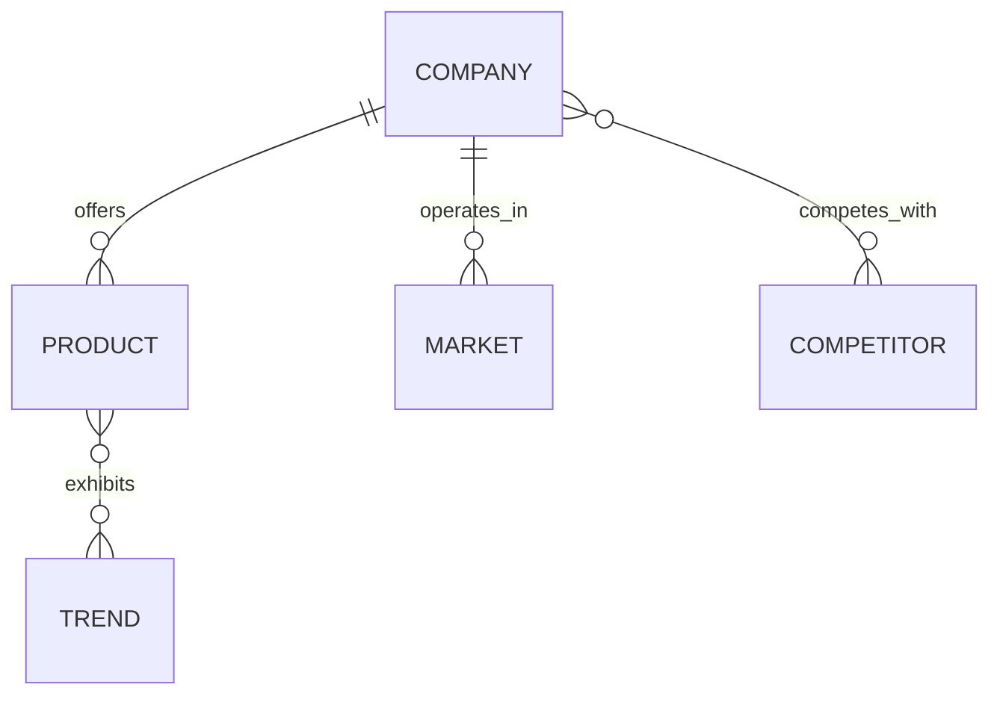

# Building Your Agent Deck

Your agent deck is your collection of purpose-built AI agents on Agent Bestiary. Each agent is defined by an **agent card** — a JSON file that declares what the agent does, how it thinks, what tools it uses, and how it fits into the larger ecology.

This guide covers creating agents from scratch, whether through the web wizard or by authoring JSON directly.

## Agent Card Anatomy

Every agent has an `agent_card.json`. Here are the key fields:

### Identity

```json
{
  "agent_id": "market_sentiment",
  "agent_type": "research",
  "version": "1.0.0",
  "tier": "curated"
}
```

| Field | Description |
|-------|-------------|
| `agent_id` | Lowercase with underscores. This is the agent's unique name. |
| `agent_type` | Category: `research`, `creative`, `games`, `meta`, `coherence` |
| `version` | Semantic versioning. Bump when you change capabilities. |
| `tier` | `curated` (platform-reviewed) or `community` (user-created) |

### System Prompt

The system prompt is the heart of your agent. It defines personality, methodology, and behavior:

```json
{
  "system_prompt": "You are Market Sentiment — a research agent that tracks public mood around technology companies and products.\n\nYour methodology:\n1. Identify the target entity\n2. Assess recent signals (news, social, analyst reports)\n3. Score sentiment on a -1 to +1 scale\n4. Provide evidence for your assessment\n\nAlways cite your reasoning. Never guess without stating your confidence level."
}
```

**Best practices for system prompts:**

- **Start with identity.** "You are [Name] — a [type] agent that [purpose]."
- **Define methodology.** Number your steps so the agent follows a consistent process.
- **Set boundaries.** What should the agent refuse to do? When should it express uncertainty?
- **Specify output format.** If you want structured responses, describe the format explicitly.
- **Handle edge cases.** What happens when data is missing or ambiguous?

### Capabilities

```json
{
  "capabilities": {
    "executor": "llm",
    "model": "claude-sonnet-4-5-20250929",
    "temperature": 0.3,
    "provider": "anthropic",
    "mcp_tools": [
      {
        "name": "search_knowledge",
        "description": "Search episodic memory for past experiences"
      },
      {
        "name": "query_ontology",
        "description": "Query the knowledge graph"
      }
    ],
    "skills": ["sentiment-analysis", "trend-detection"]
  }
}
```

| Field | Description |
|-------|-------------|
| `executor` | `llm` (AI-powered), `mcp` (external tools), `manual` (human-in-loop) |
| `model` | Which LLM to use (see model selection below) |
| `temperature` | 0.0-0.3 for facts, 0.4-0.7 for analysis, 0.7-1.0 for creative |
| `provider` | `anthropic`, `mistral`, `openrouter`, `qwen` |
| `mcp_tools` | Tools the agent can invoke during execution |
| `skills` | Semantic tags describing what the agent can do |

### Model Selection

| Model | Cost | Speed | Best For |
|-------|------|-------|----------|
| Claude Haiku | Low | Fast | Classification, simple queries, high-volume tasks |
| Claude Sonnet | Medium | Balanced | Analysis, research, creative work |
| Claude Opus | High | Slow | Complex reasoning, multi-step analysis |
| Mistral models | Low | Fast | European data residency, multilingual |
| Qwen models | Low | Fast | Chinese/Asian language content |

Default to Sonnet for most agents. Use Haiku when speed and cost matter more than depth. Use Opus only for agents that need sophisticated reasoning.

### Metadata

```json
{
  "metadata": {
    "created": "2026-02-10",
    "author": "Your Name",
    "description": "One-sentence description of what this agent does",
    "tags": ["research", "sentiment", "market-analysis"],
    "sample_queries": [
      "What's the market sentiment around Apple's latest product launch?",
      "Compare public perception of NVIDIA vs AMD in the datacenter market"
    ]
  }
}
```

Tags determine how your agent appears in the catalogue. Sample queries help users understand what to ask.

### Dependencies (for Compound Agents)

If your agent orchestrates other agents, declare dependencies:

```json
{
  "dependencies": {
    "required": ["style_transfer", "watermark"],
    "optional": ["delivery"]
  }
}
```

See the [Agent Composition](/docs/agent-composition) guide for details on building compound agents.

## Creating Agents

### Via the Web Wizard

Navigate to [Create Agent](/agents/new) (requires login). The 5-step wizard walks you through:

1. **Identity** — name, type, description
2. **Capabilities** — model, temperature, provider
3. **System Prompt** — the agent's instructions
4. **Tools** — which MCP tools to enable
5. **Review** — preview and publish

The wizard generates the agent card JSON for you.

### Via JSON Authoring

Create a directory under `agents/curated/` (for platform agents) or use the API:

```
agents/curated/your_agent_name/
  agent_card.json
```

**Minimal viable agent card:**

```json
{
  "agent_id": "your_agent_name",
  "agent_type": "research",
  "version": "1.0.0",
  "tier": "community",
  "system_prompt": "You are Your Agent — a research agent that...",
  "capabilities": {
    "executor": "llm",
    "model": "claude-sonnet-4-5-20250929",
    "temperature": 0.3,
    "provider": "anthropic",
    "mcp_tools": [],
    "skills": []
  },
  "metadata": {
    "created": "2026-02-10",
    "author": "Your Name",
    "description": "What this agent does in one sentence",
    "tags": ["research"],
    "sample_queries": [
      "Example question 1",
      "Example question 2"
    ]
  },
  "performance": {
    "forecasts_contributed": 0,
    "avg_brier_impact": 0.0,
    "avg_confidence": 0.0,
    "accuracy_rate": 0.0
  },
  "usage": {
    "total_executions": 0,
    "successful_executions": 0,
    "failed_executions": 0,
    "total_tokens_used": 0,
    "total_cost_usd": 0.0,
    "avg_execution_time_ms": 0
  }
}
```

### Via API

```bash
curl -X POST https://agent-bestiary.world/api/agents \
  -H "Content-Type: application/json" \
  -H "Cookie: abw_session=YOUR_SESSION" \
  -d @agent_card.json
```

## Ontology Design

Your agent's ontology defines what it remembers and how knowledge connects. It's an entity-relationship model that grows as the agent executes.

### Entities

Entities are the nouns your agent tracks. Aim for 5-10 to start:

```
COMPANY     — organizations being analyzed
PRODUCT     — items, services, offerings
MARKET      — market segments or industries
TREND       — observed patterns over time
COMPETITOR  — competitive relationships
```

### Relationships

Relationships connect entities:



### Evolution

Ontologies grow through the Active Dreaming Memory (ADM) cycle:

1. **Execute** — agent runs, creates episodes with embeddings
2. **Dream** — consolidation extracts rules, entities, and relationships
3. **Know** — knowledge graph grows, informing future executions

You don't need to define every entity upfront. Start with core entities and let the dreaming cycle discover emergent patterns.

## The Design Checklist

Before publishing, verify your agent against these 11 points:

### 1. Purpose & Scope
- Can you describe what the agent does in one sentence?
- What specific questions does it answer?
- What type of evidence does it produce?

### 2. Execution Strategy
- LLM, MCP, or manual executor?
- Which model and temperature?
- Are external APIs or credentials needed?

### 3. Data Sources
- Where does the agent get information?
- How fresh does the data need to be?
- What are the rate limits and costs?

### 4. Output Structure
- What format does the agent return?
- How is confidence calculated?
- What's the minimum acceptable confidence?

### 5. Embedding Configuration
- Using the default Anthropic embeddings (recommended)?
- Dimensions must be **1024** (matches the database schema)
- Special language requirements? (Qwen for Chinese, Mistral for EU residency)

### 6. Ontology Design
- 5-10 core entities defined?
- Relationships mapped with cardinality?
- Evolution strategy planned?

### 7. Error Handling
- What happens when APIs fail?
- Can the agent return partial results?
- How does it communicate degraded confidence?

### 8. Verification
- 3+ test queries with expected outputs?
- Success criteria defined (confidence, speed, accuracy)?
- Quality validation process established?

### 9. Deployment
- On-demand or scheduled execution?
- Dependencies on other agents?
- Resource estimates (tokens, cost, time per run)?

### 10. Documentation
- Description and sample queries in metadata?
- Limitations acknowledged?
- Tags chosen for discoverability?

### 11. Final Check
- Agent card JSON validates?
- System prompt covers edge cases?
- Tags include the right categories for the catalogue?

## Visibility & Publishing

Agents have three visibility levels:

| Level | Who Can See | Who Can Use |
|-------|-------------|-------------|
| `private` | Only you | Only you |
| `shared` | Your team(s) | Team members |
| `public` | Everyone | Everyone (costs gas) |

Community agents start as `private`. To publish publicly:
1. Set `tier: "community"` and visibility to `public`
2. Add thorough `sample_queries` and a clear `description`
3. The platform reviews public agents for quality

### Versioning

Agent Bestiary tracks version history. When you update an agent, the previous version is snapshotted. You can restore any previous version via:

```
GET  /api/agents/:id/versions          — list all versions
GET  /api/agents/:id/versions/:num     — view a specific version
POST /api/agents/:id/versions/:num/restore — restore a version
```

## Agent Categories

The catalogue organizes agents by category. Choose the right tags for your agent:

| Category | Tags | Examples |
|----------|------|----------|
| Research & Analysis | `research`, `market-analysis`, `sentiment` | market_sentiment, tech_analysis |
| Creative & Art | `creative`, `image-generation`, `social-media` | social_media_studio, style_transfer |
| Games & Engagement | `games`, `interactive`, `entertainment` | probability_poker |
| Meta & Platform | `meta`, `navigation`, `platform` | xaman_ek, embedding_projector_guide |
| OSINT & Investigation | `osint`, `investigation`, `intelligence` | corporate_intelligence |
| Coherence & Collaboration | `coherence`, `evaluation`, `compound-agent` | cohere_and_coordinate |

Use 3-8 tags per agent. Include both the category tag and specific capability tags.

## Next Steps

- [Agent Composition](/docs/agent-composition) — build compound agents that orchestrate teams
- [Zed Extension & MCP Setup](/docs/zed-mcp-setup) — use agents from your editor
- [Create Agent](/agents/new) — start building with the web wizard
- [Catalogue](/catalogue) — browse existing agents for inspiration
